# RunStateMachine Implementation Guide

## Overview

This guide documents the implementation of the new unified execution architecture that integrates the RunStateMachine with the UnifiedExecutionEngine. Since Vrooli is still in active development without production routines to preserve, we can implement the new architecture directly without complex migration strategies.

## Current Architecture Analysis

### Current RunStateMachine Structure

Based on the analysis of `packages/shared/src/run/stateMachine.ts`, here's the current architecture:

```mermaid
graph TB
    subgraph "Current RunStateMachine Architecture"
        direction TB
        
        subgraph "Main State Machine"
            RSM[RunStateMachine<br/>📊 Main Loop Controller<br/>⏱️ Timeout & Limit Management<br/>🔄 Branch Coordination]
        end
        
        subgraph "Service Dependencies (Constructor Injected)"
            RunLoader[RunLoader<br/>📁 Routine & location loading<br/>🔍 Metadata resolution]
            RunPersistence[RunPersistence<br/>💾 Database persistence<br/>📄 Progress storage]
            RunNotifier[RunNotifier<br/>📢 Progress notifications<br/>🌐 WebSocket events]
            PathSelectionHandler[PathSelectionHandler<br/>🤔 Decision making<br/>🎯 Path selection]
            SubroutineExecutor[SubroutineExecutor<br/>🤖 Direct execution<br/>📊 Simple tool calls]
            NavigatorFactory[NavigatorFactory<br/>🧭 Graph traversal<br/>📊 BPMN navigation]
        end
        
        subgraph "Internal Managers"
            RunLimitsManager[RunLimitsManager<br/>⏱️ Time tracking<br/>💰 Credit monitoring<br/>🔢 Step counting]
            BranchManager[BranchManager<br/>🌿 Parallel branches<br/>📍 Location management<br/>🔀 Fork/merge logic]
            SubroutineContextManager[SubroutineContextManager<br/>📋 Variable storage<br/>🔗 Context inheritance<br/>📊 Data management]
        end
        
        subgraph "Core Data Structures"
            RunProgress[RunProgress<br/>📈 Current state<br/>🌿 Active branches<br/>📊 Metrics & stats]
            BranchLocationDataMap[BranchLocationDataMap<br/>📍 Branch positions<br/>🗺️ Graph locations<br/>📊 Step metadata]
            SubroutineContext[SubroutineContext<br/>📋 Variables & data<br/>🔗 Parent references<br/>📊 Task information]
        end
    end

    %% Main connections
    RSM --> RunLoader
    RSM --> RunPersistence
    RSM --> RunNotifier
    RSM --> PathSelectionHandler
    RSM --> SubroutineExecutor
    RSM --> NavigatorFactory
    RSM --> RunLimitsManager
    RSM --> BranchManager
    RSM --> SubroutineContextManager
    
    %% Data flow
    RSM --> RunProgress
    BranchManager --> BranchLocationDataMap
    SubroutineContextManager --> SubroutineContext
    
    %% Internal flow
    RunProgress -.->|"branch states"| BranchManager
    BranchLocationDataMap -.->|"execution context"| SubroutineExecutor
    SubroutineContext -.->|"variables"| SubroutineExecutor

    %% Styling
    classDef mainComponent fill:#ffebee,stroke:#c62828,stroke-width:3px
    classDef serviceComponent fill:#e8eaf6,stroke:#3f51b5,stroke-width:2px
    classDef managerComponent fill:#f3e5f5,stroke:#4a148c,stroke-width:2px
    classDef dataComponent fill:#e8f5e8,stroke:#1b5e20,stroke-width:2px
    
    class RSM mainComponent
    class RunLoader,RunPersistence,RunNotifier,PathSelectionHandler,SubroutineExecutor,NavigatorFactory serviceComponent
    class RunLimitsManager,BranchManager,SubroutineContextManager managerComponent
    class RunProgress,BranchLocationDataMap,SubroutineContext dataComponent
```



### Current Execution Flow


## Architectural Issues & Limitations

### 1. **Isolation from Swarm Context**
**Current Issue**: RunStateMachine operates in complete isolation from swarm goals, blackboard data, and team context.

```typescript
// Current: No awareness of swarm context
const subcontext: SubroutineContext = {
    ...SubroutineContextManager.initializeContext(),
    currentTask: {
        description: description ?? "",
        instructions: instructions ?? "",
        name: name ?? "",
    },
};
```

**Problem**: 
- Routines can't access swarm goals or shared data
- No way to update swarm state with routine results
- Context switching between swarm reasoning and routine execution is jarring

### 2. **Limited SubroutineExecutor Interface**
**Current Issue**: The `SubroutineExecutor` interface is designed for simple, direct execution.

```typescript
// Current interface (simplified)
interface SubroutineExecutor {
    executeStep(run: RunProgress, branch: Branch, 
               branchLocationDataMap: BranchLocationDataMap, 
               services: RunStateMachineServices, 
               state: RunStateMachineState): Promise<StepResult>;
    
    updateRunAfterStep(run: RunProgress, branch: Branch, 
                      stepResult: StepResult, 
                      services: RunStateMachineServices, 
                      state: RunStateMachineState): void;
                      
    estimateCost(subroutineInstanceId: string, 
                currentObject: any, 
                config: RunConfig): Promise<number>;
}
```

**Problems**:
- No strategy selection (reasoning vs deterministic vs conversational)
- No access to unified execution context
- No AI-aware execution capabilities
- Credit management is routine-local only

### 3. **Deterministic-Only Assumption**
**Current Issue**: The architecture assumes all routines are deterministic workflows.

```typescript
// Current: Simple step execution with basic validation
const stepResult = await this.services.subroutineExecutor.executeStep(
    run, branch, branchLocationDataMap, this.services, this.state,
);
```

**Problems**:
- No support for AI reasoning within routine steps
- No conversational or iterative execution modes
- Can't handle routines that need meta-cognitive processing

### 4. **Fragmented Context Management**
**Current Issue**: Context is managed through separate, incompatible systems.

```typescript
// Current: Isolated context managers
class SubroutineContextManager {
    static initializeContext(): SubroutineContext { /* ... */ }
    static mergeContexts(parent: SubroutineContext, child: SubroutineContext): SubroutineContext { /* ... */ }
}
```

**Problems**:
- No unified context interface across execution tiers
- Context inheritance is limited and routine-specific
- No bidirectional context flow with swarms

### 5. **Direct Tool Execution**
**Current Issue**: Tools are called directly without AI reasoning or strategy selection.

**Problems**:
- No adaptive execution based on context
- No learning from execution patterns
- Limited error handling and recovery
- No execution strategy optimization

## Target Architecture

The target architecture integrates the RunStateMachine with the new unified execution system. See the [AI Execution Architecture](./ai-execution-architecture.md#runstatemachine-target-architecture) for the complete target design.

### Key Improvements

1. **Unified Context Inheritance**: Swarm context flows seamlessly into routine execution
2. **Strategy-Aware Execution**: Routines can use reasoning, deterministic, or conversational strategies
3. **Bidirectional State Sync**: Routine results update swarm blackboard and resources
4. **AI-Integrated Processing**: Full AI reasoning capabilities within routine steps
5. **Cross-Tier Credit Management**: Unified resource tracking across swarms and routines

## Implementation Plan

### Phase 1: Foundation & Interface Updates

#### Step 1.1: Update SubroutineExecutor Interface
**Goal**: Enhance the interface to work with UnifiedExecutionEngine

```typescript
// NEW: Enhanced SubroutineExecutor interface
interface SubroutineExecutor {
    executeStep(
        executionContext: ExecutionContext,
        currentLocation: Location,
        dependencies: ExecutionDependencies
    ): Promise<ExecutionResult>;
    
    estimateCost(
        context: ExecutionContext,
        location: Location
    ): Promise<bigint>;
}
```

**Files to modify**:
- `packages/shared/src/run/executor.ts`
- `packages/shared/src/run/types.ts`

#### Step 1.2: Create Context Integration
**Goal**: Create seamless integration between routine and execution contexts

```typescript
// NEW: Context integration utilities
class ExecutionContextManager {
    static createRoutineContext(
        run: RunProgress, 
        branch: Branch, 
        subroutineContext: SubroutineContext,
        swarmContext?: SwarmContext
    ): RoutineContext;
    
    static updateSubroutineContext(
        context: RoutineContext,
        result: ExecutionResult
    ): SubroutineContext;
}
```

**Files to create**:
- `packages/shared/src/run/executionContextManager.ts`

#### Step 1.3: Add Execution Strategy Configuration
**Goal**: Allow routines to specify their execution strategy

```typescript
// NEW: Strategy configuration in routine metadata
interface RoutineVersionConfig {
    // ... existing fields
    executionStrategy?: 'reasoning' | 'deterministic' | 'conversational' | 'auto';
    allowStrategyOverride?: boolean;
    subroutineStrategies?: Record<string, 'reasoning' | 'deterministic' | 'conversational'>;
}
```

**Files to modify**:
- `packages/shared/src/shape/configs/routine.ts`

### Phase 2: Enhanced SubroutineExecutor Implementation

#### Step 2.1: Create UnifiedSubroutineExecutor
**Goal**: Implement the enhanced interface using UnifiedExecutionEngine

```typescript
// NEW: Bridge between RunStateMachine and UnifiedExecutionEngine
export class UnifiedSubroutineExecutor implements SubroutineExecutor {
    constructor(
        private unifiedEngine: UnifiedExecutionEngine,
        private contextManager: ExecutionContextManager
    ) {}
    
    async executeStep(
        executionContext: ExecutionContext,
        currentLocation: Location,
        dependencies: ExecutionDependencies
    ): Promise<ExecutionResult> {
        return this.unifiedEngine.execute(executionContext, currentLocation, dependencies);
    }
    
    async estimateCost(
        context: ExecutionContext,
        location: Location
    ): Promise<bigint> {
        return this.unifiedEngine.estimateCost(context, location);
    }
}
```

**Files to create**:
- `packages/server/src/services/execution/unifiedSubroutineExecutor.ts`

#### Step 2.2: Update RunStateMachine Integration
**Goal**: Integrate UnifiedSubroutineExecutor with streamlined interface

```typescript
// UPDATED: RunStateMachine constructor
export class RunStateMachine {
    constructor({
        loader,
        logger,
        navigatorFactory,
        notifier,
        pathSelectionHandler,
        persistence,
        unifiedExecutionEngine, // Required for new architecture
        stateSynchronizer?, // Optional for swarm integration
    }: RunStateMachineProps) {
        this.services = {
            // ... existing services
            subroutineExecutor: new UnifiedSubroutineExecutor(
                unifiedExecutionEngine, 
                new ExecutionContextManager()
            ),
            stateSynchronizer,
        };
    }
}
```

**Files to modify**:
- `packages/shared/src/run/stateMachine.ts`
- `packages/shared/src/run/types.ts`

### Phase 3: Context Integration & State Synchronization

#### Step 3.1: Implement RoutineContext
**Goal**: Create ExecutionContext extension for routine-specific data

```typescript
// NEW: RoutineContext implementation
export class RoutineContextImpl extends ExecutionContextImpl implements RoutineContext {
    constructor(
        baseContext: ExecutionContext,
        public readonly runId: string,
        public readonly runProgress: RunProgress,
        public readonly currentBranch: Branch,
        public readonly subroutineInstanceId: string
    ) {
        super(baseContext.parentContext, baseContext.limits, baseContext.status, baseContext.result);
    }
    
    // Routine-specific methods
    getBranchProgress(): BranchProgress { /* ... */ }
    updateBranchStatus(status: BranchStatus): void { /* ... */ }
    addStepResult(stepId: string, result: StepResult): void { /* ... */ }
}
```

**Files to create**:
- `packages/server/src/services/execution/routineContext.ts`

#### Step 3.2: Add State Synchronization
**Goal**: Enable bidirectional state flow between swarms and routines

```typescript
// NEW: State synchronization in RunStateMachine
export class RunStateMachine {
    private async syncWithSwarmContext(routineContext: RoutineContext): Promise<void> {
        if (this.services.stateSynchronizer) {
            await this.services.stateSynchronizer.syncRoutineResultsToSwarm(routineContext);
        }
    }
    
    private async buildExecutionContext(
        run: RunProgress, 
        branch: Branch
    ): Promise<ExecutionContext> {
        const subroutineContext = run.subcontexts[branch.subroutineInstanceId];
        let swarmContext: SwarmContext | undefined;
        
        if (this.services.stateSynchronizer) {
            swarmContext = await this.services.stateSynchronizer.getSwarmContext(run.runId);
        }
        
        return ExecutionContextManager.createRoutineContext(
            run, branch, subroutineContext, swarmContext
        );
    }
}
```

**Files to modify**:
- `packages/shared/src/run/stateMachine.ts`

#### Step 3.3: Update Execution Flow
**Goal**: Streamline the main execution loop with new context system

```typescript
// UPDATED: Main execution loop in RunStateMachine
private async runIteration(run: RunProgress, startTimeMs: number): Promise<RunStatusChangeReason | undefined> {
    // ... existing limit checks and setup
    
    for (const branch of activeBranches) {
        // NEW: Create enhanced execution context
        const executionContext = await this.buildExecutionContext(run, branch);
        
        // NEW: Enhanced step execution with strategy awareness
        const executionResult = await this.services.subroutineExecutor.executeStep(
            executionContext,
            branch.currentLocation,
            this.createExecutionDependencies()
        );
        
        // NEW: Update both routine and swarm state
        this.updateRunAfterExecution(run, branch, executionResult);
        
        if (executionContext instanceof RoutineContextImpl) {
            await this.syncWithSwarmContext(executionContext);
        }
    }
    
    // ... rest of existing logic
}
```

### Phase 4: Strategy Integration & Polish

#### Step 4.1: Add Strategy Detection
**Goal**: Automatically detect appropriate execution strategies

```typescript
// NEW: Strategy detection in StrategyFactory
export class RoutineStrategyDetector {
    static detectStrategy(
        routine: any,
        context: ExecutionContext,
        currentStep: Location
    ): ExecutionStrategyType {
        // Check explicit configuration
        if (routine.config?.executionStrategy) {
            return routine.config.executionStrategy;
        }
        
        // Analyze routine type and content
        if (this.isMetaCognitiveStep(currentStep)) return 'reasoning';
        if (this.isStrictProcessStep(currentStep)) return 'deterministic';
        if (this.isIterativeStep(currentStep)) return 'conversational';
        
        // Default based on routine complexity
        return this.analyzeComplexity(routine) > 0.7 ? 'reasoning' : 'deterministic';
    }
}
```

**Files to create**:
- `packages/server/src/services/execution/routineStrategyDetector.ts`

#### Step 4.2: Implement Strategy Override System
**Goal**: Allow subroutines to override parent routine strategies

```typescript
// NEW: Strategy override in execution flow
private async executeWithStrategyOverride(
    context: ExecutionContext,
    location: Location,
    parentStrategy: ExecutionStrategyType
): Promise<ExecutionResult> {
    // Check for subroutine-specific strategy override
    const overrideStrategy = this.getSubroutineStrategyOverride(location);
    const effectiveStrategy = overrideStrategy || parentStrategy;
    
    const strategy = this.strategyFactory.createStrategy(effectiveStrategy, this.dependencies);
    return strategy.execute(context, this.dependencies);
}
```

### Phase 5: Testing & Validation

#### Step 5.1: Core Functionality Testing
**Goal**: Ensure the new architecture works correctly

**Test Cases**:
1. **Basic Routine Execution**: Simple routines execute successfully
2. **Context Flow**: Variables and state flow correctly through new context system
3. **Strategy Selection**: Different execution strategies work correctly
4. **Parallel Execution**: Branch coordination works with new execution engine

#### Step 5.2: Integration Testing
**Goal**: Validate integration with unified execution system

**Test Cases**:
1. **Swarm Context Integration**: Swarm context flows into routine execution
2. **State Synchronization**: Routine results update swarm blackboard
3. **Credit Tracking**: Credits are properly tracked across execution tiers
4. **Error Handling**: Failures are handled gracefully

#### Step 5.3: Performance Testing
**Goal**: Ensure performance meets requirements

**Test Cases**:
1. **Execution Speed**: New architecture performs acceptably
2. **Memory Usage**: Context management doesn't cause memory leaks
3. **Scalability**: System handles multiple concurrent routine executions

## Timeline & Resource Estimation

### Simplified Timeline
- **Phase 1**: 1-2 weeks (Foundation & Interface Updates)
- **Phase 2**: 2-3 weeks (Enhanced SubroutineExecutor Implementation)
- **Phase 3**: 3-4 weeks (Context Integration & State Synchronization)
- **Phase 4**: 2-3 weeks (Strategy Integration & Polish)
- **Phase 5**: 1-2 weeks (Testing & Validation)

**Total Estimated Duration**: 9-14 weeks

### Resource Requirements
- **Lead Developer**: Full-time for architecture design and implementation
- **Backend Developer**: Full-time for execution engine integration
- **Test Engineer**: Part-time for validation testing

## Risk Mitigation

### Moderate-Risk Areas
1. **Context Integration Complexity**: Managing state across execution tiers
2. **Performance Impact**: New context system introducing overhead
3. **Strategy Selection Accuracy**: Choosing appropriate execution strategies

### Mitigation Strategies
1. **Iterative Development**: Build and test context integration incrementally
2. **Performance Monitoring**: Track execution times and optimize bottlenecks
3. **Strategy Override System**: Allow manual strategy selection as fallback
4. **Comprehensive Testing**: Thorough testing of all execution paths

## Success Criteria

### Technical Success
- [ ] RunStateMachine integrates seamlessly with UnifiedExecutionEngine
- [ ] Swarm context flows into routine execution
- [ ] Multiple execution strategies work correctly
- [ ] State synchronization works bidirectionally
- [ ] Performance is acceptable for production use

### Business Success
- [ ] AI reasoning capabilities are available within routine steps
- [ ] Swarm-routine integration enables new automation use cases
- [ ] System supports complex multi-step workflows
- [ ] Architecture enables future platform evolution

This implementation represents a significant enhancement of Vrooli's execution capabilities, enabling the seamless integration of AI reasoning with structured workflow execution while building the foundation for sophisticated automation workflows. 