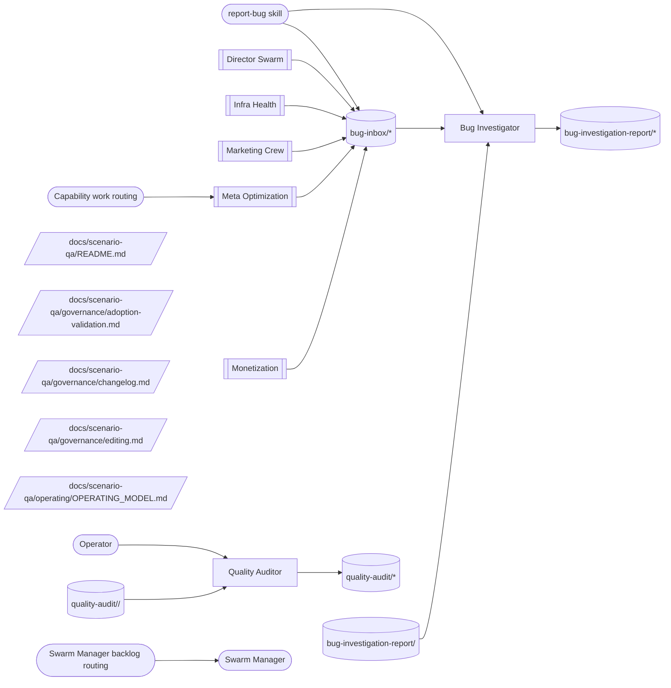

# Scenario QA Operating Model

**Status:** initial contract canon. This document defines how `scenario-qa` works as a coherent system: readiness review, structural audit, universal bug intake, contrarian review, downstream backlog routing, and learning loops.

The current document adopts the generic team operating-model shape from `path:docs/agent-system/OPERATING_GRAPHS.md`. It is intentionally paired with `path:docs/marketing/operating/OPERATING_MODEL.md` as a second, structurally different proving ground for operating-model validation.

Durable corpus belongs to the Source Ledger scope team:scenario-qa. Members file each actionable finding once through the unified Swarm Manager work feed; operator disposition is read from that same work item.
## Mission

Scenario QA turns observed quality signals into evidence-rich findings, investigation reports, challenge records, and downstream backlog work items. The team protects scenario quality without editing target scenarios directly.

Scenario QA does not own product prioritization, monetization strategy, marketing voice, infrastructure strategy, or direct implementation work. It investigates and routes; downstream execution happens through accepted work items, swarm-manager backlog, or explicit capability gaps.

**Objective served.** `I1` — capability compounding: a scenario only becomes a permanent capability if it is actually sound, and this team is what makes "permanent" true rather than asserted (`path:docs/director-swarm/strategy/OBJECTIVES.md`).

**Outcome contribution.** Primary: **The Hive** (scenario ecosystem) — structural audits and readiness reviews set which scenarios are headliner-ready. Supporting: **The Forge**, by reducing the defect rework that slows goal throughput. The swarm-tier map of which team moves which outcome lives in `path:docs/director-swarm/evidence/OUTCOMES_CHARTER.md` §"Team contribution map"; this paragraph is this team's own statement of it.

## Scope

Scenario QA owns:

- programmatic readiness-review evidence for existing scenarios;
- judgment-based structural audits using registered audit techniques;
- universal bug intake through `report-bug` and `bug-inbox/*`;
- root-cause investigation records for drained bugs;
- QA-specific challenge reports and challenge-resolution records;
- QA backlog work items routed to downstream execution;
- capability-work work items when quality work is blocked by missing tools, access, or scenario support.

Scenario QA does not directly patch target scenario code. It may create evidence-rich backlog items or work items that cause another team, swarm-manager execution, or a future capability to do the work.

## Operating Loops

Scenario QA has four loops:

1. **Audit loop** — apply judgment-based audit techniques, record `quality-audit/*`, and raise backlog work items when the finding warrants execution.
2. **Bug loop** — drain universal `bug-inbox/*`, investigate root cause, write `bug-investigation-report/*`, and route cross-cutting fixes through work items.
4. **Learning loop** — turn repeated investigation/audit lessons into technique updates, capability gaps, or meta-optimization improvements.

The loops may run independently. An audit can raise no work item; the contrarian can stay quiet when outputs are clean.

> **Pre-emptive readiness is no longer a QA loop.** A former *readiness loop* swept idle scenarios with programmatic checks and filed fix items before feature work. That ordering moved into swarm-manager as a deterministic gate (`fix_before_feature`) plus optional policy-governed maintenance intake through the backlog auto-filer (`auto_filer`); regressions on scheduled scenarios are caught by execution finalization's before/after baseline diff.

## Operating Graph

This graph is the team-level contract. It shows how scenario-quality signal enters, which members drain or produce each topic, which work items gate downstream work, and how challenge and capability-work paths keep the system honest.

<!-- prompt-manager-graph:
id: scenario-qa-operating-model
scope: team
team: scenario-qa
mode: contract
actor_alias.report-bug: external:report-bug
actor_alias.operator: external:operator
actor_alias.any team: external:report-bug
actor_alias.work owners: none
-->

## Topic Catalog

| Topic family | Status | Owner / primary writer | Primary readers | Purpose |
|---|---|---|---|---|
| `topic:bug-inbox/*` | live |  | member:bug-investigator | Universal-source bug intake written by any team through the report-bug skill and drained by bug-investigator. |
| `topic:bug-investigation-report/*` | live | member:bug-investigator | member:bug-investigator | Closed bug-investigation audit log with root cause, evidence, action taken, and remaining gaps. |
| `topic:bug-investigation-report/<slug>` | live | member:bug-investigator | member:bug-investigator | Closed bug-investigation audit log with root cause, evidence, action taken, and remaining gaps. |
| `topic:quality-audit/*` | live | member:quality-auditor | member:quality-auditor | Judgment-based structural audit finding produced with a registered audit technique. |
| `topic:quality-audit/<scenario-id>/<skill-id>` | live | member:quality-auditor | member:quality-auditor | Judgment-based structural audit finding produced with a registered audit technique. |

## External Inputs / Triggers

| Producer / trigger | Entry surface | Drainer | Routing rule |
|---|---|---|---|
| Operator | direct member context for audit work | quality-auditor | Existing scenarios can be audited on operator request; planned scenarios without directories are out of scope. |
| Any team via `report-bug` | `topic:bug-inbox/<signal-type>/<slug>` | bug-investigator | Bug-investigator validates signal type, investigates root cause, records a report, and routes action. |
| Review evidence | `topic:bug-investigation-report/*` | bug-investigator | Members read review evidence before filing or defending unified swarm work. |
| Repeated investigation or audit technique gaps | `topic:bug-inbox/*` | bug-investigator | Missing methods, stale registries, or repeated ambiguity route to executable work rather than ad hoc prose. |

## Outputs / Downstream Consumers

| Output | Surface | Consumer | Purpose |
|---|---|---|---|
| Structural audit evidence | `quality-audit/*` | quality-auditor, swarm-manager | Evidence base for quality-audit work. |
| Bug investigation report | `bug-investigation-report/*` | bug-investigator, qa-contrarian, downstream fix owners | Durable root-cause record for a drained bug. |
| Backlog work | `topic:bug-investigation-report/*` | bug-investigator | Route findings into executable work without direct edits by scenario-qa. |
| Capability work | `topic:bug-inbox/*` | bug-investigator | Route missing quality infrastructure or investigation capability. |
| Review evidence | `topic:bug-investigation-report/*` | bug-investigator | Prevent weak findings from becoming unexamined work. |

## Feedback / Capability Improvement Loop

Scenario QA improves itself through four exits:

1. **Bug reporting** — any team reports broken behavior through `report-bug`; bug-investigator drains and closes each entry with a report.
2. **Review evidence** — the quality lane records evidence in `topic:bug-investigation-report/*` and files one unified Swarm Manager work item when a registered failure mode applies.
3. **Technique promotion** — repeated investigation or audit lessons from `topic:quality-audit/*` become team-scope evidence and unified Swarm Manager work items.
4. **Capability gaps** — missing source access, scenario affordances, tooling, or QA infrastructure become `topic:bug-inbox/*` and unified swarm work instead of hidden blockers.

System-level friction that is not broken behavior should use meta-optimization's `report-friction` flow. Scenario QA should not absorb general process friction into bug reports.

## Roles

> Pre-emptive readiness review is no longer a QA member role. The ordering ("fix before feature") is enforced programmatically by swarm-manager's `fix_before_feature` gate, and latent issues can be surfaced by the optional `auto_filer` maintenance intake loop consuming GCT directly, not a QA member's knowledge topics.

### Quality Auditor

Owns judgment-based structural audits. It uses registered audit techniques, writes `quality-audit/*`, and raises `quality-audit-backlog` for material findings.

### Bug Investigator

Owns universal bug intake. It drains `bug-inbox/*`, applies an investigation technique, writes `bug-investigation-report/*`, and raises `bug-resolution-proposal` or `capability-work` when needed.

### QA Contrarian

Owns challenge discipline. It reads QA outputs and work items, writes challenge reports and resolution records only for concrete failure-mode hits, and does not generate positive-action proposals.

## Current Implementation Gaps

1. `quality-audit/*` should remain a terminal evidence output in the graph. Its downstream execution path is through work items, not direct topic consumption.
2. `capability-work` is now declared in the scenario-qa team contract so the operating graph can model missing QA capability explicitly. Other teams using `capability-work` should follow the same explicit-contract pattern.
3. The `methods/readiness/` registry is still a stub. Readiness-dimension techniques should graduate into paired docs and skills as GCT dimensions stabilize; pre-emptive ordering itself is handled by swarm-manager's fix-before-feature gate, not a QA member.
4. Future operator-fed `qa-inbox/*` and `audit-inbox/*` topics remain out of the contract until a producer exists.
5. `bug-resolution-proposal` and `quality-backlog-proposal` accepted effects should eventually resolve against concrete downstream backlog implementation contracts, not only prose surfaces.

## Adoption / Validation

Use this document as the second operating-model proving ground after marketing:

1. Keep this document and `path:docs/scenario-qa/README.md` as scenario-qa's team-level plan-of-record.
2. Keep `path:scenarios/prompt-manager/store/teams/scenario-qa/team.json` registered against this model.
3. Keep member `topics.json` files aligned with the operating graph relationships.
4. Run `prompt-manager graph operating-model validate --team scenario-qa --id scenario-qa-operating-model`.
5. Run `prompt-manager graph operating-model diff --team scenario-qa --id scenario-qa-operating-model`.
6. Run `prompt-manager graph operating-model coverage --team scenario-qa --id scenario-qa-operating-model`.

Do not make scenario-qa a marketing-shaped team. This model exists to prove the operating-model shape works for defect, audit, readiness, challenge, and downstream backlog flows.
