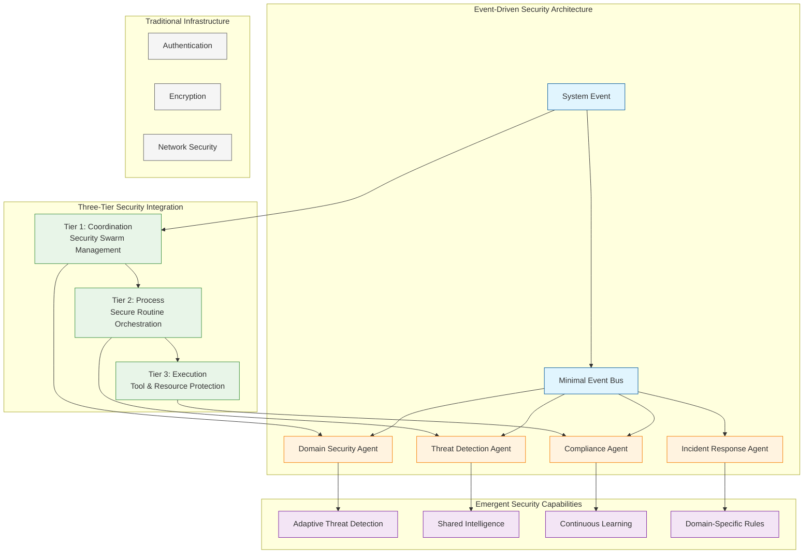

# Security Documentation

This directory contains comprehensive security documentation for the Vrooli platform, covering threat models, best practices, incident response procedures, and security architecture.

## Table of Contents

- [Security Overview](#security-overview)
- [Security Architecture](#security-architecture)
- [Documentation Index](#documentation-index)
- [Security Principles](#security-principles)
- [Reporting Security Issues](#reporting-security-issues)
- [Security Roadmap](#security-roadmap)

## Security Overview

Vrooli implements a revolutionary **emergent security** approach where protection arises from intelligent agent swarms rather than hard-coded infrastructure. This is one of our platform's main selling points—teams can build and adopt security agents as-needed for their specific domains.

### **Core Security Philosophy**

**Traditional security systems** use fixed rules, static policies, and hard-coded infrastructure that can't adapt to new threats or domain-specific requirements.

**Vrooli's emergent security** uses intelligent security agents that:

1. **🎯 Event-Driven Intelligence**: Specialized AI agents subscribe to system events and provide adaptive threat detection
2. **🧠 Domain-Specific Protection**: Teams deploy security agents tailored to their specific threat landscape (healthcare, finance, etc.)
3. **🔄 Continuous Learning**: Security agents evolve and improve through pattern recognition and shared intelligence  
4. **🤖 Agent Swarm Coordination**: Multiple specialized agents work together to provide comprehensive protection
5. **⚡ Real-Time Response**: Immediate reaction to security events as they occur

### **Traditional vs Emergent Security**

| Traditional Infrastructure Security | Vrooli's Emergent Security |
|------------------------------|---------------------------|
| ❌ Fixed threat detection rules | ✅ Intelligent threat analysis that adapts |
| ❌ Static compliance policies | ✅ Domain-specific compliance monitoring |
| ❌ Rigid policy enforcement | ✅ Adaptive defense strategies |
| ❌ Manual security updates | ✅ Continuous agent evolution |
| ❌ One-size-fits-all approach | ✅ Team-customizable protection |

## Security Architecture

## How Emergent Security Works

Vrooli's security model is fundamentally different from traditional approaches. Instead of hard-coded rules and static defenses, security **emerges** from intelligent security agent swarms deployed by teams.

> 📖 **For complete details on how this works**, see [Core Security Concepts](core-concepts.md)

### Quick Overview

1. **🎯 Teams Deploy Security Agents**: Deploy specialized security agents for your domain (healthcare, finance, etc.)
2. **📊 Events Trigger Analysis**: Every system action generates events that security agents analyze
3. **🧠 Security Agents Provide Intelligence**: AI-powered security agents analyze events with domain-specific context
4. **🤖 Security Emerges**: Protection arises from security agent collaboration and learning
5. **🔄 Continuous Evolution**: Security agents adapt and improve through pattern recognition

### Key Benefits of Emergent Security

- **🎯 Domain-Specific**: Security agents understand your industry's specific threats
- **🔄 Adaptive Protection**: Evolves with new threats without code changes
- **📊 Context-Aware**: Reduces false positives through intelligent analysis
- **🤖 Self-Improving**: Security agents learn from patterns and propose improvements
- **⚡ Real-Time Response**: Immediate response to threats as they occur

## Documentation Index

> **🎆 Reorganized Structure**: This documentation has been consolidated to eliminate redundancies and standardize terminology. The structure below reflects the new unified approach.

### 🎯 Start Here - Core Documents

- **[Core Security Concepts](core-concepts.md)** - **START HERE** - Foundational emergent security principles (authoritative guide)
- **[Security Architecture & Implementation](../architecture/execution/security/README.md)** - Technical infrastructure implementation
- **[Agent Examples & Templates](../architecture/execution/emergent-capabilities/agent-examples/README.md)** - Comprehensive agent library including security agents

### 🛠️ Implementation Guides

- **[Security Best Practices](best-practices.md)** - How to implement emergent security through intelligent agents
- **[Migration Guide](migration-from-traditional-security.md)** - Moving from traditional to emergent security
- **[Agent-Infrastructure Bridge](agent-infrastructure-bridge.md)** - How security agents integrate with infrastructure
- **[General Implementation Guide](../architecture/execution/implementation/implementation-guide.md)** - Building the three-tier architecture

### 🤖 Security Agents

- **[Agent Examples & Templates](../architecture/execution/emergent-capabilities/agent-examples/README.md)** - Comprehensive agent library including security agents (HIPAA, AML, API security, etc.)
- **[Resilience Agents](../architecture/execution/emergent-capabilities/agent-examples/resilience-agents.md)** - AI-driven adaptive error handling and security recovery

### 🚨 Operations & Response

- **[Incident Response](incident-response.md)** - Agent-driven incident handling
- **[Security Monitoring](operations/monitoring.md)** - Real-time threat detection and alerting
- **[Compliance & Auditing](operations/compliance.md)** - Regulatory requirements and audit trails

### 🏢 Architecture & Infrastructure

- **[Execution Security Architecture](../architecture/execution/security/README.md)** - Technical infrastructure that supports emergent security
- **[Threat Model](threat-model.md)** - Threat analysis and agent-based mitigation
- **[Documentation Scope Guide](scope.md)** - Clear boundaries between security documentation areas

### 📚 Legacy & Reference

- **[Emergent Security Guide](emergent-security-guide.md)** - Legacy guide (content consolidated into core concepts)
- **[Security Architecture Layers](security-architecture-layers.md)** - Reference document

## Security Principles

### 1. **Emergent Security Through Agent Intelligence**
- Security capabilities arise from intelligent security agent swarms, not hard-coded infrastructure
- Teams deploy domain-specific security agents tailored to their unique threat landscape
- Security agents learn and adapt to new threats autonomously through pattern recognition
- Collaborative defense through shared intelligence across security agent swarms

### 2. **Event-Driven Security Agent Coordination**
- Every system action generates events that security agents analyze in real-time
- Multiple specialized security agents provide overlapping, redundant protection
- Safety-critical operations use barrier synchronization where security agents must approve actions
- Security agent responses are coordinated through the event bus for comprehensive coverage

### 3. **Adaptive Domain-Specific Protection**
- Security agents evolve with emerging threats specific to your industry
- Context-aware analysis replaces static rules with intelligent threat assessment
- Security agents learn from your team's specific patterns and improve over time
- Pattern recognition identifies novel attacks before they succeed

### 4. **Privacy and Compliance Through Specialized Security Agents**
- Deploy privacy security agents that understand domain-specific regulations (HIPAA, GDPR, SOX)
- Compliance security agents ensure regulatory adherence for your specific industry
- Audit security agents maintain transparent, auditable records of all security decisions
- Data handling policies enforced through intelligent security agent monitoring

### 5. **Continuous Security Evolution**
- Security agents learn from every security event and improve their threat models
- Security capabilities improve without code changes through security agent learning
- Successful security agent patterns can be shared across teams and organizations
- Metrics and insights emerge from security agent observations and analysis

## Reporting Security Issues

### Responsible Disclosure

We appreciate responsible disclosure of security vulnerabilities. Please:

1. **DO NOT** create public GitHub issues for security vulnerabilities
2. **Email**: security@vrooli.com with details
3. **Include**:
   - Description of the vulnerability
   - Steps to reproduce
   - Potential impact
   - Suggested fixes (if any)

### Security Response SLA

- **Critical**: Response within 4 hours
- **High**: Response within 24 hours
- **Medium**: Response within 72 hours
- **Low**: Response within 1 week

### Bug Bounty Program

We maintain a bug bounty program for security researchers. Contact security@vrooli.com for current bounty details and submission guidelines.

## Related Documentation

- [Architecture Overview](../architecture/execution/README.md) - Complete execution architecture
- [Event-Driven Architecture](../architecture/execution/event-driven/README.md) - Event system powering security intelligence
- [Contributing Security](../CONTRIBUTING.md#security-guidelines) - Security guidelines for contributors
- [Data Model Security](../data-model/entities/security.md) - Database-level security entities

## Security Contact

For security-related questions or concerns:
- **Email**: security@vrooli.com

---

**Remember**: Security is everyone's responsibility. When in doubt, ask the security team!