# Security Agent Infrastructure Bridge

This document bridges the gap between emergent security concepts and the technical infrastructure that supports them.

## How Security Agents Work with Infrastructure

### **Agent-Infrastructure Relationship**

```mermaid
graph TB
    subgraph "🤖 Security Agent Layer (Team-Deployed)"
        SA1[HIPAA Compliance Agent<br/>🏥 Healthcare-specific rules<br/>📊 PHI detection patterns<br/>🚨 Medical audit trails]
        SA2[Financial Security Agent<br/>💰 Trading fraud detection<br/>📊 SOX compliance<br/>🚨 Regulatory reporting]
        SA3[Threat Detection Agent<br/>🔒 Adaptive threat analysis<br/>📊 Pattern learning<br/>🚨 Real-time response]
    end
    
    subgraph "📊 Event Infrastructure"
        EventBus[Event Bus<br/>⚡ Real-time delivery<br/>🔄 Agent coordination<br/>📊 Audit trails]
        EventTypes[Security Events<br/>🚨 security/threat_detected<br/>📋 security/compliance_check<br/>🔒 security/tier_transition]
    end
    
    subgraph "🏗️ Security Infrastructure"
        TierValidator[Tier Validators<br/>🔒 Boundary enforcement<br/>📊 Event generation<br/>🛡️ Basic validation]
        AuthLayer[Auth Layer<br/>🔐 Identity verification<br/>🎫 Token management<br/>📋 Permission framework]
        AuditSystem[Audit System<br/>📝 Comprehensive logging<br/>🔍 Event persistence<br/>📊 Compliance trails]
    end
    
    SA1 --> EventBus
    SA2 --> EventBus  
    SA3 --> EventBus
    
    EventBus --> EventTypes
    
    TierValidator --> EventBus
    AuthLayer --> EventBus
    AuditSystem --> EventBus
    
    SA1 -.->|"Agent insights"| SA2
    SA2 -.->|"Compliance patterns"| SA3
    SA3 -.->|"Threat intelligence"| SA1
    
    classDef agents fill:#fff3e0,stroke:#f57c00,stroke-width:2px
    classDef events fill:#e8f5e8,stroke:#2e7d32,stroke-width:2px
    classDef infra fill:#e3f2fd,stroke:#1565c0,stroke-width:2px
    
    class SA1,SA2,SA3 agents
    class EventBus,EventTypes events
    class TierValidator,AuthLayer,AuditSystem infra
```



## Agent Deployment on Infrastructure

### **1. Agent Registration and Event Subscription**

```typescript
// Infrastructure provides agent registration framework
interface SecurityAgentRegistration {
    agentId: string;
    domain: string;  // "healthcare", "finance", "general"
    subscriptions: string[];  // Event patterns to monitor
    capabilities: AgentCapability[];
    responsePatterns: ResponseConfig[];
}

// Example: Deploying a HIPAA compliance agent
const hipaaAgent = await infrastructureRegistry.registerAgent({
    agentId: "hipaa-compliance-monitor",
    domain: "healthcare",
    subscriptions: [
        "security/data_access/medical/*",
        "ai/output/medical/*", 
        "audit/medical/*"
    ],
    capabilities: [
        { type: "phi_detection", confidence: 0.95 },
        { type: "audit_generation", format: "hipaa_compliant" },
        { type: "violation_response", severity: "immediate" }
    ],
    responsePatterns: [
        { 
            trigger: "phi_detected", 
            action: "quarantine_and_alert",
            escalation: "immediate"
        }
    ]
});
```

### **2. Infrastructure Event Generation for Agents**

```typescript
// Infrastructure automatically generates events that agents can monitor
class TierSecurityValidator {
    async validateTierTransition(request: TierTransitionRequest): Promise<void> {
        // Infrastructure validation
        const basicValidation = await this.performBasicValidation(request);
        
        // Generate event for security agents to analyze
        await this.eventBus.publish({
            type: "security/tier_transition",
            payload: {
                fromTier: request.sourceTier,
                toTier: request.targetTier,
                userId: request.userId,
                permissions: request.permissions,
                securityContext: request.securityContext,
                riskLevel: this.assessRiskLevel(request),
                timestamp: Date.now()
            }
        });
        
        // Wait for critical security agent responses if required
        if (request.requiresAgentApproval) {
            await this.awaitSecurityAgentResponses(request);
        }
    }
}
```

### **3. Agent Response Integration**

```typescript
// Security agents respond through standardized event interface
class HIPAAComplianceAgent {
    async onSecurityEvent(event: SecurityEvent): Promise<void> {
        if (event.type === "security/tier_transition") {
            const analysis = await this.analyzeForHIPAACompliance(event.payload);
            
            // Respond with security assessment
            await this.eventBus.publish({
                type: "security/agent_response",
                payload: {
                    agentId: this.agentId,
                    originalEventId: event.id,
                    riskAssessment: analysis.riskLevel,
                    complianceStatus: analysis.complianceStatus,
                    requiredActions: analysis.requiredActions,
                    confidence: analysis.confidence
                }
            });
            
            // Take immediate action if critical violation detected
            if (analysis.riskLevel === "critical") {
                await this.triggerImmediateResponse(analysis);
            }
        }
    }
}
```

## Infrastructure Support for Agent Learning

### **4. Learning Data Collection**

```typescript
// Infrastructure provides learning data for agent improvement
class AgentLearningDataCollector {
    async collectLearningData(agentId: string): Promise<LearningDataset> {
        return {
            historicalEvents: await this.getHistoricalEvents(agentId),
            responseOutcomes: await this.getResponseOutcomes(agentId),
            falsePositives: await this.getFalsePositives(agentId),
            missedThreats: await this.getMissedThreats(agentId),
            domainContext: await this.getDomainContext(agentId)
        };
    }
}
```

### **5. Agent Evolution Support**

```typescript
// Infrastructure supports agent improvement proposals
class AgentEvolutionFramework {
    async proposeAgentImprovement(agentId: string, improvement: AgentImprovement): Promise<void> {
        // Validate improvement proposal
        await this.validateImprovement(improvement);
        
        // Create improvement PR for team review
        await this.createImprovementPR({
            agentId: agentId,
            improvement: improvement,
            confidence: improvement.confidence,
            expectedBenefits: improvement.expectedBenefits,
            riskAssessment: improvement.riskAssessment
        });
        
        // Generate event for other agents to learn from
        await this.eventBus.publish({
            type: "agent/improvement_proposed",
            payload: {
                agentId: agentId,
                improvementType: improvement.type,
                domain: improvement.domain,
                learningPattern: improvement.pattern
            }
        });
    }
}
```

## Domain-Specific Agent Infrastructure

### **Healthcare Security Infrastructure**

```typescript
// Specialized infrastructure for healthcare security agents
class HealthcareSecurityInfrastructure {
    constructor(private eventBus: EventBus) {
        // Healthcare-specific event types
        this.registerEventTypes([
            "security/phi_access",
            "security/medical_ai_output", 
            "security/hipaa_audit",
            "security/medical_device_interaction"
        ]);
    }
    
    async deployHIPAAAgent(): Promise<SecurityAgent> {
        return await this.agentRegistry.deploy({
            template: "hipaa_compliance_agent",
            configuration: {
                phiDetectionPatterns: await this.loadPHIPatterns(),
                auditRequirements: await this.loadHIPAAAuditReqs(),
                escalationProcedures: await this.loadMedicalEscalation()
            }
        });
    }
}
```

### **Financial Security Infrastructure**

```typescript
// Specialized infrastructure for financial security agents
class FinancialSecurityInfrastructure {
    constructor(private eventBus: EventBus) {
        // Financial-specific event types
        this.registerEventTypes([
            "security/trading_activity",
            "security/market_data_access",
            "security/sox_compliance",
            "security/fraud_detection"
        ]);
    }
    
    async deploySOXAgent(): Promise<SecurityAgent> {
        return await this.agentRegistry.deploy({
            template: "sox_compliance_agent",
            configuration: {
                regulatoryRules: await this.loadSOXRules(),
                tradingPatterns: await this.loadFraudPatterns(),
                reportingRequirements: await this.loadFinancialReporting()
            }
        });
    }
}
```

## Event-Driven Security Coordination

### **Multi-Agent Coordination**

```typescript
// Infrastructure coordinates multiple security agents
class SecurityAgentCoordinator {
    async coordinateSecurityResponse(event: SecurityEvent): Promise<void> {
        // Get all agents interested in this event type
        const relevantAgents = await this.getAgentsForEvent(event);
        
        // Distribute event to all relevant agents
        const agentResponses = await Promise.all(
            relevantAgents.map(agent => agent.analyzeEvent(event))
        );
        
        // Aggregate agent responses
        const aggregatedAssessment = await this.aggregateResponses(agentResponses);
        
        // Take coordinated action based on consensus
        if (aggregatedAssessment.requiresAction) {
            await this.executeCoordinatedResponse(aggregatedAssessment);
        }
        
        // Share insights across agents for learning
        await this.shareInsightsAcrossAgents(agentResponses);
    }
}
```

## Performance and Scalability

### **Agent Performance Monitoring**

```typescript
// Infrastructure monitors agent performance for optimization
class AgentPerformanceMonitor {
    async monitorAgentPerformance(agentId: string): Promise<PerformanceMetrics> {
        return {
            responseLatency: await this.measureResponseTime(agentId),
            accuracy: await this.calculateAccuracy(agentId),
            falsePositiveRate: await this.calculateFalsePositives(agentId),
            threatDetectionRate: await this.calculateDetectionRate(agentId),
            resourceUtilization: await this.measureResourceUsage(agentId)
        };
    }
    
    async optimizeAgentPerformance(agentId: string): Promise<void> {
        const metrics = await this.monitorAgentPerformance(agentId);
        
        if (metrics.responseLatency > this.latencyThreshold) {
            await this.optimizeAgentLatency(agentId);
        }
        
        if (metrics.falsePositiveRate > this.falsePositiveThreshold) {
            await this.tuneAgentSensitivity(agentId);
        }
    }
}
```

## Summary: Complete Agent-Infrastructure Integration

This bridge demonstrates how:

1. **🏗️ Infrastructure provides the foundation**: Event systems, validation frameworks, and agent registration
2. **🤖 Agents provide the intelligence**: Domain-specific analysis, threat detection, and adaptive learning
3. **📊 Events enable coordination**: Real-time communication between infrastructure and agents
4. **🔄 Learning drives evolution**: Agents improve through infrastructure-provided data and feedback
5. **🎯 Domain-specific deployment**: Specialized infrastructure supports industry-specific security needs

The result is a complete security ecosystem where infrastructure enables agent intelligence, and agents provide adaptive, domain-specific protection that evolves with threats and organizational needs.