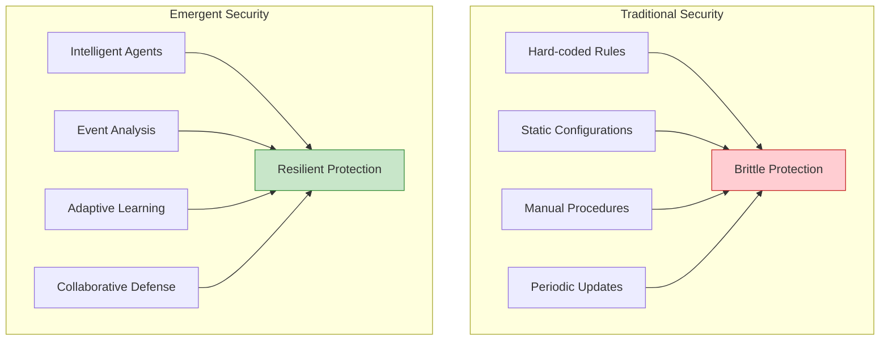
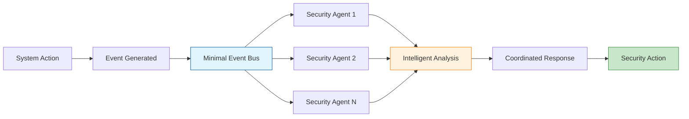
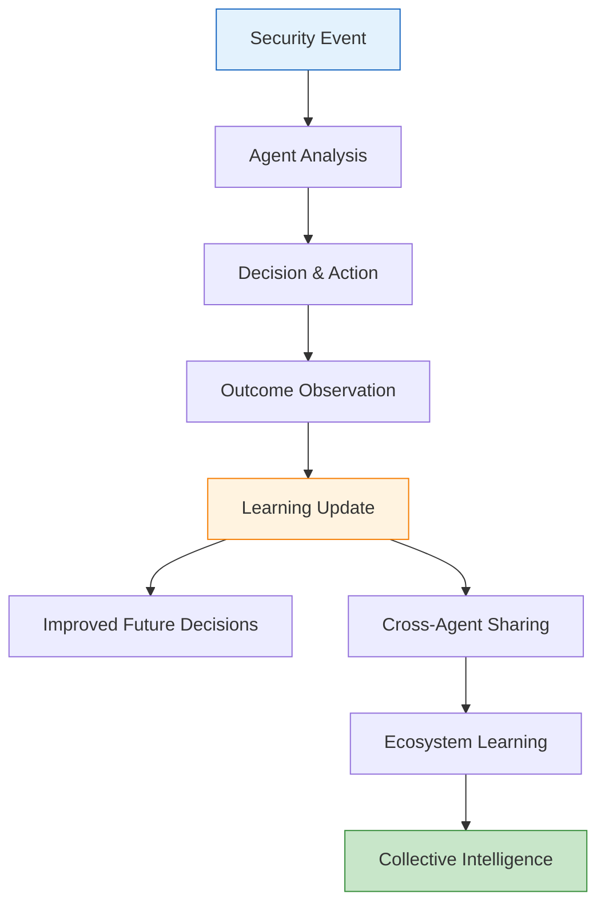
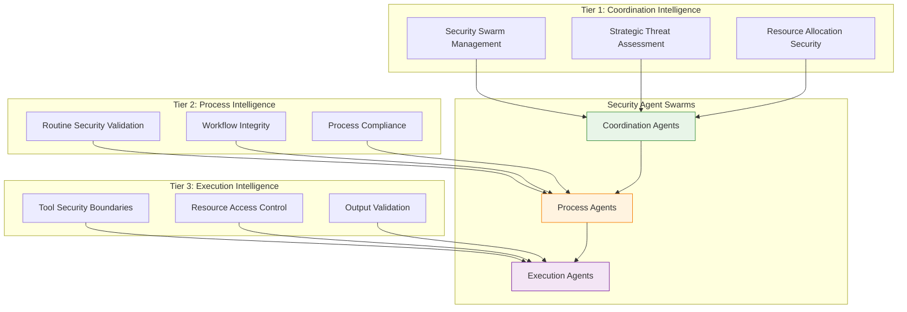
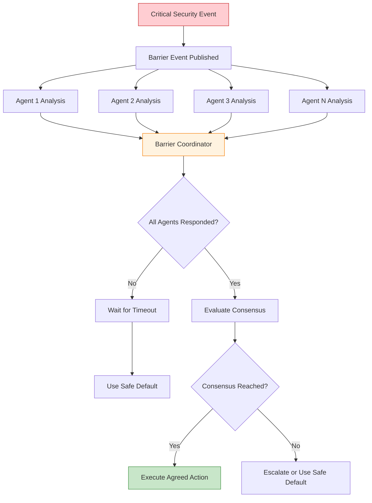

# Core Security Concepts: Emergent Intelligence

> **🎯 Authoritative Guide**: This is the definitive reference for Vrooli's emergent security model. All other security documentation builds upon these core concepts.

This document provides the foundational concepts for understanding Vrooli's revolutionary security model where protection emerges from intelligent agent swarms rather than hard-coded infrastructure.

## Table of Contents

- [The Paradigm Shift](#the-paradigm-shift)
- [Event-Driven Architecture](#event-driven-architecture)
- [Agent Intelligence Model](#agent-intelligence-model)
- [Three-Tier Security Integration](#three-tier-security-integration)
- [Barrier Synchronization](#barrier-synchronization)
- [Security Through Emergence](#security-through-emergence)

## The Paradigm Shift

### From Infrastructure to Intelligence

Traditional security systems are **built** into infrastructure through hard-coded rules, static configurations, and manual procedures. Vrooli's security **emerges** from intelligent agent swarms that learn, adapt, and collaborate.



### Key Differences

| Traditional Security | Emergent Security |
|---------------------|-------------------|
| **Static Rules** | **Dynamic Intelligence** |
| Rules written by humans | Intelligence emerges from AI |
| Updated manually | Learns continuously |
| One-size-fits-all | Context-aware decisions |
| **Reactive** | **Proactive & Predictive** |
| Responds to known threats | Predicts and prevents novel threats |
| Pattern matching | Pattern learning |
| Fixed responses | Adaptive responses |
| **Centralized** | **Distributed** |
| Single security system | Swarm intelligence |
| Single point of failure | Resilient mesh |
| Limited scalability | Infinite scalability |

## Event-Driven Architecture

### The Minimal Event Bus

Security decisions flow through a minimal event bus that provides **only** reliable message delivery. All security intelligence comes from the agents, not the infrastructure.



### Event-Driven Security Pattern

```typescript
// Core pattern for event-driven security
interface SecurityEvent {
  type: string;           // 'user/login', 'data/access', etc.
  payload: any;           // Event-specific data
  context: EventContext;  // Environmental context
  timestamp: number;      // When it occurred
  metadata: EventMetadata; // Additional information
}

interface SecurityAgent {
  // What events this agent monitors
  subscriptions: string[];
  
  // How it analyzes events
  onEvent: (event: SecurityEvent) => Promise<SecurityResponse>;
  
  // How it learns from outcomes
  learn: (outcome: SecurityOutcome) => Promise<void>;
}
```

### Event Types and Security Subscriptions

```typescript
// Common security event patterns
const securityEventTypes = {
  // Authentication events
  'auth/login/*': ['auth-security-agent', 'behavior-analysis-agent'],
  'auth/failed/*': ['threat-detection-agent', 'brute-force-agent'],
  
  // Data access events
  'data/read/*': ['data-protection-agent', 'access-control-agent'],
  'data/write/*': ['data-integrity-agent', 'audit-agent'],
  'data/export/*': ['data-leak-prevention-agent', 'compliance-agent'],
  
  // System events
  'system/error/*': ['incident-detection-agent', 'anomaly-agent'],
  'system/performance/*': ['resource-protection-agent'],
  
  // User behavior events
  'user/activity/*': ['behavior-analysis-agent', 'fraud-detection-agent']
};
```

## Agent Intelligence Model

### How Security Agents Think

Security agents use AI reasoning, not rule-based logic. They understand context, learn from experience, and make nuanced decisions.

```typescript
// Example: Intelligent authentication agent
const authSecurityAgent = {
  subscriptions: ['auth/login/*'],
  
  onEvent: async (event) => {
    // Multi-dimensional analysis
    const assessment = await analyzeLoginAttempt(event, {
      // User's historical behavior
      userPattern: await getUserBehaviorProfile(event.userId),
      
      // Device and location analysis
      deviceContext: await analyzeDeviceFingerprint(event.device),
      locationContext: await analyzeLocationRisk(event.location),
      
      // Temporal analysis
      timingAnalysis: await analyzeLoginTiming(event.timestamp),
      
      // Threat intelligence
      threatContext: await consultThreatIntelligence(event),
      
      // Cross-agent insights
      peerInsights: await consultOtherAgents(event)
    });
    
    // Context-aware decision making
    if (assessment.riskScore > HIGH_RISK_THRESHOLD) {
      return {
        action: 'CHALLENGE',
        method: assessment.recommendedChallenge,
        reasoning: assessment.riskFactors,
        confidence: assessment.confidence
      };
    }
    
    return { action: 'ALLOW' };
  }
};
```

### Agent Learning Process



### Types of Security Agents

1. **Domain-Specific Agents**
   - Healthcare HIPAA compliance
   - Financial AML/KYC
   - E-commerce fraud prevention
   - Legal data protection

2. **Capability-Specific Agents**
   - Threat detection
   - Behavioral analysis
   - Incident response
   - Audit and compliance

3. **System-Specific Agents**
   - Authentication security
   - Data protection
   - Network security
   - Resource protection

## Three-Tier Security Integration

Security validation occurs at each tier of Vrooli's execution architecture, with agents providing protection at every level.



### Tier-Specific Security Responsibilities

#### Tier 1: Coordination Security
- **Agent Swarm Authentication**: Verify security agent identities
- **Resource Allocation Security**: Prevent resource monopolization
- **Strategic Threat Assessment**: High-level threat landscape analysis

#### Tier 2: Process Security
- **Routine Validation**: Ensure workflows maintain security constraints
- **Process Integrity**: Detect and prevent workflow manipulation
- **Compliance Orchestration**: Coordinate compliance across processes

#### Tier 3: Execution Security
- **Tool Boundary Enforcement**: Secure tool access and usage
- **Resource Access Control**: Granular permission management
- **Output Validation**: Analyze and filter execution outputs

## Barrier Synchronization

For critical security decisions, multiple agents must reach consensus using barrier synchronization.

### How Barrier Synchronization Works



### Barrier Event Example

```typescript
// High-risk data export requiring multi-agent approval
const dataExportBarrier = {
  eventType: 'data/export/sensitive',
  
  requiredAgents: [
    'data-classification-agent',
    'compliance-agent', 
    'audit-agent',
    'user-authorization-agent'
  ],
  
  consensusRule: 'ALL_APPROVE', // or 'MAJORITY', 'ANY_VETO'
  timeout: 5000, // milliseconds
  
  onTimeout: 'DENY', // Safe default
  
  onConsensus: async (responses) => {
    if (responses.every(r => r.decision === 'APPROVE')) {
      return { action: 'PROCEED' };
    } else {
      const concerns = responses
        .filter(r => r.decision !== 'APPROVE')
        .map(r => r.concerns);
      
      return { 
        action: 'DENY',
        reasons: concerns,
        remediation: await generateRemediationPlan(concerns)
      };
    }
  }
};
```

### When to Use Barrier Synchronization

- **High-risk operations**: Data exports, system modifications
- **Compliance-critical actions**: Regulatory reporting, audit events
- **Cross-domain decisions**: Actions affecting multiple business areas
- **Novel threats**: Unknown attack patterns requiring collective analysis

## Security Through Emergence

### How Security Emerges

Security capabilities **emerge** from the interaction of multiple intelligent agents rather than being programmed as fixed rules.

```typescript
// Security emerges from agent interactions
const emergentSecurityExample = {
  // Individual agents have specific capabilities
  agents: [
    { name: 'pattern-detector', capability: 'identify_attack_patterns' },
    { name: 'behavior-analyzer', capability: 'analyze_user_behavior' },
    { name: 'context-evaluator', capability: 'assess_environmental_context' },
    { name: 'threat-correlator', capability: 'correlate_threat_intelligence' }
  ],
  
  // But security emerges from their collaboration
  emergentCapabilities: [
    'adaptive_threat_detection',
    'context_aware_access_control', 
    'predictive_threat_prevention',
    'intelligent_incident_response'
  ],
  
  // These capabilities were never explicitly programmed
  howEmergenceWorks: [
    'agents_share_insights_through_events',
    'patterns_emerge_from_cross_agent_analysis',
    'collective_intelligence_exceeds_individual_capabilities',
    'continuous_learning_improves_collaborative_decisions'
  ]
};
```

### Properties of Emergent Security

1. **Adaptive**: Automatically adjusts to new threats without code changes
2. **Intelligent**: Makes context-aware decisions using AI reasoning
3. **Resilient**: No single point of failure; swarm continues if agents fail
4. **Scalable**: More agents provide more comprehensive protection
5. **Self-Improving**: Gets smarter over time through continuous learning

### Examples of Emergent Security Behaviors

```typescript
// These behaviors emerge without explicit programming:

const emergentBehaviors = {
  // Cross-domain threat correlation
  threatCorrelation: {
    individual: 'Agent A detects unusual login pattern',
    emergence: 'Agent B correlates with data access anomaly → coordinated attack detected'
  },
  
  // Adaptive access control
  adaptiveAccess: {
    individual: 'Agent A knows user permissions',
    emergence: 'Agents B+C+D consider context → dynamic permission adjustment'
  },
  
  // Predictive threat prevention
  predictivePrevention: {
    individual: 'Agent A learns attack patterns',
    emergence: 'Swarm predicts and prevents attack before it occurs'
  },
  
  // Intelligent incident response
  intelligentResponse: {
    individual: 'Agent A detects incident',
    emergence: 'Swarm coordinates complex multi-phase response automatically'
  }
};
```

## Implementation Principles

### Core Principle: Security Through Intelligence

In Vrooli, security **emerges** from intelligent agent swarms rather than being **built** into infrastructure. This fundamental shift means:

- **No hard-coded security rules** - Agents learn and adapt
- **Context-aware decisions** - Agents understand domain-specific threats
- **Continuous improvement** - Security gets smarter over time
- **Collaborative defense** - Agents work together for comprehensive protection

### What Remains as Infrastructure vs. What Emerges from Agents

#### ✅ Keep as Infrastructure (Minimal)
```typescript
// Secure event transport
const eventBusConfig = {
  tls: { enabled: true, minVersion: '1.3' },
  authentication: { type: 'mutual-tls', certificates: './certs/' }
};

// Container isolation
const securityConfig = {
  containerSecurity: {
    readOnlyRootFilesystem: true,
    allowPrivilegeEscalation: false,
    runAsNonRoot: true
  }
};

// Basic encryption at rest
const dataEncryption = {
  algorithm: 'AES-256-GCM',
  keyRotation: '90d',
  managed: true
};
```

#### 🤖 Emerge from Agents (Everything Else)
- Input validation - Agents analyze context intelligently
- Rate limiting - Resource agents adapt to usage patterns
- Access control - Permission agents make context-aware decisions
- Threat detection - Security agents learn attack patterns
- Incident response - Response agents coordinate automatically

## Security Agent Implementation

> **🔗 See Complete Examples**: For comprehensive security agent examples, templates, and implementation patterns, see the [Agent Examples Library](../architecture/execution/emergent-capabilities/agent-examples/README.md) which includes HIPAA compliance agents, financial AML agents, API security agents, and more.

Security agents implement the emergent security principles through:

- **Event subscription** to relevant security events
- **Intelligent analysis** with domain-specific knowledge
- **Adaptive responses** based on context and patterns
- **Continuous learning** from security outcomes
- **Collaboration** with other security agents

## Summary: Core Principles

1. **Security emerges from intelligence, not infrastructure**
2. **Events carry context, agents provide analysis**
3. **Multiple agents collaborate for comprehensive protection**
4. **Barrier synchronization ensures critical decision quality**
5. **Continuous learning improves security over time**
6. **Context-aware decisions replace static rules**
7. **Agent swarms provide resilient, scalable protection**
8. **Domain-specific agents understand industry threats**
9. **Infrastructure provides foundation, intelligence provides protection**
10. **Security gets smarter through continuous learning and adaptation**

Understanding these core concepts is essential for implementing, maintaining, and extending Vrooli's emergent security model.

## Related Documentation

- **[Agent Examples & Patterns](../architecture/execution/emergent-capabilities/agent-examples/README.md)** - Comprehensive agent library including security agents (HIPAA, AML, API security, etc.)
- **[Security Architecture & Implementation](../architecture/execution/security/README.md)** - Infrastructure that supports emergent security
- **[General Implementation Guide](../architecture/execution/implementation/implementation-guide.md)** - Building the three-tier architecture
- **[Migration Guide](migration-from-traditional-security.md)** - How to migrate from traditional security