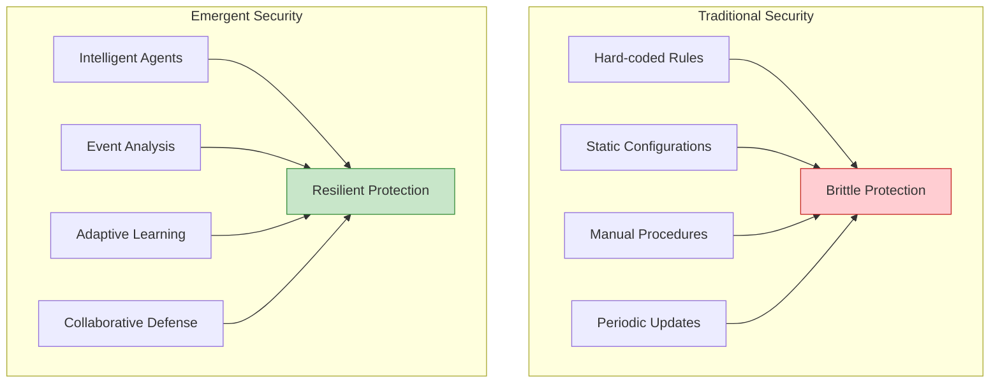
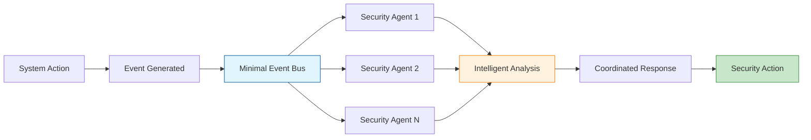
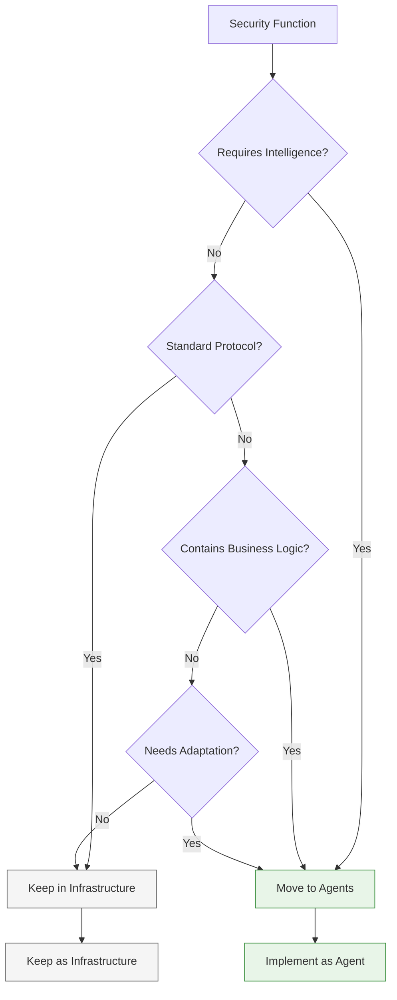

# Core Security Concepts: Emergent Intelligence

> **🎯 Authoritative Guide**: This is the definitive reference for Vrooli's emergent security model. All other security documentation builds upon these core concepts.

This document provides the foundational concepts for understanding Vrooli's revolutionary security model where protection emerges from intelligent agent swarms rather than hard-coded infrastructure.

## Table of Contents

- [The Paradigm Shift](#the-paradigm-shift)
- [Event-Driven Architecture](#event-driven-architecture)
- [Agent Intelligence Model](#agent-intelligence-model)
- [Infrastructure vs Intelligence Layers](#infrastructure-vs-intelligence-layers)
- [Three-Tier Security Integration](#three-tier-security-integration)
- [Barrier Synchronization](#barrier-synchronization)
- [Security Through Emergence](#security-through-emergence)
- [Practical Implementation Examples](#practical-implementation-examples)
- [Common Security Agent Patterns](#common-security-agent-patterns)
- [Continuous Learning and Adaptation](#continuous-learning-and-adaptation)
- [Implementation Guidelines](#implementation-guidelines)
- [Troubleshooting and Best Practices](#troubleshooting-and-best-practices)

## The Paradigm Shift

### From Infrastructure to Intelligence

Traditional security systems are **built** into infrastructure through hard-coded rules, static configurations, and manual procedures. Vrooli's security **emerges** from intelligent agent swarms that learn, adapt, and collaborate.



### Key Differences

| Traditional Security | Emergent Security |
|---------------------|-------------------|
| **Static Rules** | **Dynamic Intelligence** |
| Rules written by humans | Intelligence emerges from AI |
| Updated manually | Learns continuously |
| One-size-fits-all | Context-aware decisions |
| **Reactive** | **Proactive & Predictive** |
| Responds to known threats | Predicts and prevents novel threats |
| Pattern matching | Pattern learning |
| Fixed responses | Adaptive responses |
| **Centralized** | **Distributed** |
| Single security system | Swarm intelligence |
| Single point of failure | Resilient mesh |
| Limited scalability | Infinite scalability |

## Event-Driven Architecture

### The Minimal Event Bus

Security decisions flow through a minimal event bus that provides **only** reliable message delivery. All security intelligence comes from the agents, not the infrastructure.



### Event-Driven Security Pattern

```typescript
// Core pattern for event-driven security
interface SecurityEvent {
  type: string;           // 'user/login', 'data/access', etc.
  userId: string;         // Who triggered this
  resourceId: string;     // What resource is affected
  action: string;         // What action was attempted
  context: {              // Rich context for agent analysis
    ipAddress: string;
    location: GeoLocation;
    deviceInfo: DeviceInfo;
    timestamp: Date;
    sessionId: string;
    historicalRisk: number;
  };
  metadata: Record<string, any>;  // Domain-specific data
}

// Security agent interface
interface SecurityAgent {
  // Events this agent monitors
  subscriptions: string[];
  
  // Agent capabilities
  capabilities: {
    threatDetection: string;
    complianceCheck: string;
    incidentResponse: string;
  };
  
  // Event handler with AI reasoning
  onEvent: (event: SystemEvent) => Promise<SecurityResponse>;
  
  // Learning and adaptation
  learn: (outcome: SecurityOutcome) => Promise<void>;
}
```

### Security Event Flow

1. **System Action** → Generates event
2. **Event Bus** → Routes to subscribed agents
3. **Agent Analysis** → AI-powered threat assessment
4. **Coordination** → Agents collaborate on response
5. **Response** → Adaptive action taken
6. **Learning** → Agents update threat models

## Agent Intelligence Model

### Security Agent Structure

```typescript
class SecurityAgent {
  constructor(
    private tier: TierLevel,
    private capabilities: AgentCapabilities,
    private learningModel: LearningModel
  ) {}

  async analyzeEvent(event: SecurityEvent): Promise<SecurityAnalysis> {
    // Extract relevant features
    const features = await this.extractFeatures(event);
    
    // Apply domain knowledge
    const domainContext = await this.applyDomainKnowledge(features);
    
    // Perform risk assessment
    const riskAssessment = await this.assessRisk(domainContext);
    
    // Collaborate with other agents
    const collaborativeInsights = await this.collaborateWithAgents(riskAssessment);
    
    // Generate response
    return this.generateResponse(collaborativeInsights);
  }
  
  async learn(outcome: SecurityOutcome): Promise<void> {
    // Update local model
    await this.learningModel.update(outcome);
    
    // Share insights with swarm
    await this.publishLearnings(outcome);
  }
}
```

### Agent Capabilities

Security agents possess various capabilities:

- **Threat Detection**: Identify potential security threats
- **Compliance Monitoring**: Ensure regulatory compliance
- **Incident Response**: Coordinate response to security events
- **Behavioral Analysis**: Detect anomalous behavior patterns
- **Risk Assessment**: Calculate and predict risk levels

## Infrastructure vs Intelligence Layers

### Clear Separation of Responsibilities

Understanding what belongs in infrastructure versus what should be handled by intelligent agents is crucial for proper implementation.

#### Infrastructure Layer (Minimal Foundation)

The infrastructure layer provides **only** foundational security mechanisms that require no intelligence:

```typescript
const infrastructureSecurity = {
  // TLS/SSL encryption
  tlsConfig: {
    minVersion: 'TLSv1.3',
    cipherSuites: ['TLS_AES_256_GCM_SHA384'],
    certificates: loadCertificates()
  },
  
  // Container isolation
  containerSecurity: {
    readOnlyRootFilesystem: true,
    runAsNonRoot: true,
    capabilities: ['CAP_NET_BIND_SERVICE']
  },
  
  // Basic cryptography
  crypto: {
    hashPassword: (password: string) => bcrypt.hash(password, 12),
    verifyPassword: (password: string, hash: string) => bcrypt.compare(password, hash),
    generateToken: () => crypto.randomBytes(32).toString('hex')
  },
  
  // Network segmentation
  networkPolicy: {
    allowedCIDRs: ['10.0.0.0/8'],
    denyList: loadDenyList()
  },
  
  // Event bus - pure transport
  eventBus: {
    transport: 'redis',
    encryption: true,
    authentication: {
      enabled: true,
      mechanism: 'password' // or 'tls-client-cert'
    },
    
    // Basic event routing - no intelligence
    routeEvent: (event: Event) => {
      const channel = event.type.split('/')[0];
      return redis.publish(channel, encrypt(event));
    }
  }
};

// Why these stay as infrastructure:
// - Standard protocol implementations
// - No decision-making required
// - Cryptographic operations
// - Basic transport security
// - Container/OS-level isolation
```

#### What NOT to Keep as Infrastructure

```typescript
// ❌ Don't keep these as infrastructure - move to agents:

// Input validation - requires context and intelligence
const validateInput = (input: string) => { /* static rules */ };

// Rate limiting - needs adaptive thresholds
const rateLimit = { windowMs: 15000, max: 100 };

// Access control decisions - require business logic
const checkPermissions = (user: User, resource: string) => { /* static rules */ };

// Threat detection - needs pattern recognition
const detectThreat = (request: Request) => { /* pattern matching */ };

// Why these move to agents:
// - Require context and intelligence
// - Need to adapt and learn
// - Business logic embedded
// - Decision-making required
// - Domain-specific knowledge needed
```

### Decision Framework

Use this framework to determine where security functions belong:

```typescript
const securityDecisionFramework = {
  useInfrastructure: {
    criteria: [
      'no_intelligence_required',
      'standard_protocol_implementation',
      'cryptographic_operations',
      'network_transport_security',
      'container_isolation'
    ],
    examples: [
      'TLS encryption/decryption',
      'JWT signature validation',
      'Container security policies',
      'Network segmentation rules',
      'Event bus transport'
    ]
  },
  
  useAgents: {
    criteria: [
      'requires_context_analysis',
      'needs_learning_capability',
      'business_logic_embedded',
      'adaptive_behavior_needed',
      'decision_making_required'
    ],
    examples: [
      'Input validation decisions',
      'Access control decisions',
      'Rate limiting thresholds',
      'Threat detection and response',
      'Compliance checking'
    ]
  }
};
```

### Migration Decision Tree



## Three-Tier Security Integration

Security agents operate across all three tiers of Vrooli's architecture, each providing different levels of security intelligence:

### Tier 1: Coordination Intelligence
- **Strategic Security Planning**: Long-term threat assessment and security strategy
- **Resource Allocation**: Deploying security agents based on threat landscape
- **Cross-Swarm Coordination**: Coordinating security across multiple agent swarms

### Tier 2: Process Intelligence  
- **Routine Security Orchestration**: Managing security workflows and processes
- **Compliance Process Management**: Ensuring regulatory compliance workflows
- **Incident Response Coordination**: Orchestrating multi-step incident responses

### Tier 3: Execution Intelligence
- **Real-Time Threat Detection**: Immediate threat identification and response
- **Tool Security**: Securing individual tool executions
- **Data Protection**: Protecting data at the point of use

## Barrier Synchronization

For critical security decisions, multiple agents must reach consensus before allowing an action:

```typescript
interface BarrierSynchronization {
  eventType: string;
  requiredAgents: string[];
  consensusRule: 'ALL_APPROVE' | 'MAJORITY' | 'ANY_VETO';
  timeout: number;
  defaultAction: 'ALLOW' | 'DENY';
}

// Example: Sensitive data export requires multiple approvals
const sensitiveDataExportBarrier: BarrierSynchronization = {
  eventType: 'data/export/sensitive',
  requiredAgents: [
    'data-classification-agent',
    'compliance-agent', 
    'audit-agent',
    'risk-assessment-agent'
  ],
  consensusRule: 'ALL_APPROVE',
  timeout: 5000,
  defaultAction: 'DENY'  // Safe default
};

// Example: High-risk transaction
const highRiskTransactionBarrier: BarrierSynchronization = {
  eventType: 'transaction/high-value',
  requiredAgents: [
    'fraud-detection-agent',
    'aml-agent',
    'risk-scoring-agent'
  ],
  consensusRule: 'ANY_VETO',  // Any agent can block
  timeout: 3000,
  defaultAction: 'DENY'
};
```

### How Barrier Synchronization Works

1. **Event Triggers Barrier**: High-risk event activates barrier
2. **Agent Notification**: All required agents are notified
3. **Parallel Analysis**: Agents analyze independently
4. **Vote Collection**: Each agent submits its decision
5. **Consensus Evaluation**: System evaluates based on rule
6. **Action Taken**: Allow or deny based on consensus

## Security Through Emergence

Security capabilities emerge from the collective intelligence of agent swarms:

### Emergent Properties

1. **Adaptive Threat Detection**
   - Agents learn new attack patterns
   - Share knowledge across the swarm
   - Evolve defenses without code changes

2. **Context-Aware Protection**
   - Understand user behavior patterns
   - Recognize legitimate vs suspicious activity
   - Reduce false positives through learning

3. **Predictive Security**
   - Anticipate threats before they materialize
   - Identify vulnerability patterns
   - Proactive defense strategies

4. **Self-Healing Security**
   - Automatically respond to incidents
   - Adapt defenses based on attacks
   - Continuous improvement cycle

## Practical Implementation Examples

### Healthcare Security Implementation

```typescript
const hipaaComplianceAgent = {
  subscriptions: [
    "data/patient/*",
    "ai/medical/*",
    "export/healthcare/*",
    "access/ehr/*"
  ],
  
  capabilities: {
    phiDetection: "identify_protected_health_information",
    auditLogging: "generate_hipaa_audit_trail",
    accessControl: "enforce_minimum_necessary_standard",
    encryption: "ensure_phi_encryption"
  },
  
  onEvent: async (event) => {
    // Detect PHI in the event
    const phiAnalysis = await detectPHI(event);
    
    // Check user authorization
    const authCheck = await verifyHealthcareAuthorization(event.userId, event.resourceId);
    
    // Assess compliance risk
    const complianceRisk = await assessHIPAACompliance(event, phiAnalysis);
    
    // Generate detailed audit entry
    const auditEntry = await generateHIPAAAuditEntry(event, phiAnalysis, authCheck);
    
    if (phiAnalysis.containsPHI && !authCheck.authorized) {
      return {
        action: "BLOCK",
        reason: "Unauthorized PHI access attempt",
        violations: ["HIPAA Privacy Rule §164.502"],
        audit: auditEntry,
        notification: {
          securityTeam: true,
          complianceOfficer: true
        }
      };
    }
    
    if (complianceRisk.score > 0.7) {
      return {
        action: "REVIEW",
        reason: "High compliance risk detected",
        riskFactors: complianceRisk.factors,
        audit: auditEntry,
        additionalChecks: ["manual_review", "legal_consultation"]
      };
    }
    
    return { 
      action: "ALLOW", 
      monitoring: "enhanced",
      audit: auditEntry
    };
  },
  
  learn: async (outcome) => {
    // Learn from false positives/negatives
    if (outcome.falsePositive) {
      await adjustPHIDetectionSensitivity(outcome);
    }
    
    // Update compliance patterns
    if (outcome.complianceViolation) {
      await updateCompliancePatterns(outcome);
    }
    
    // Share learnings with other healthcare agents
    await publishHealthcareSecurityInsight(outcome);
  }
};
```

### Financial Security Implementation

```typescript
const antiMoneyLaunderingAgent = {
  subscriptions: [
    "transaction/*",
    "account/transfer/*",
    "customer/profile/*",
    "pattern/suspicious/*"
  ],
  
  capabilities: {
    patternAnalysis: "detect_money_laundering_patterns",
    riskScoring: "calculate_transaction_risk",
    reporting: "generate_sar_report",
    networkAnalysis: "analyze_transaction_networks"
  },
  
  onEvent: async (event) => {
    // Analyze transaction patterns
    const patternAnalysis = await analyzeTransactionPattern(event);
    
    // Check against known ML typologies
    const typologyMatch = await checkMLTypologies(event, patternAnalysis);
    
    // Analyze customer behavior
    const behaviorAnalysis = await analyzeCustomerBehavior(event.customerId);
    
    // Network analysis for related accounts
    const networkRisk = await analyzeTransactionNetwork(event);
    
    // Calculate composite risk score
    const riskScore = calculateCompositeRisk({
      pattern: patternAnalysis.score,
      typology: typologyMatch.score,
      behavior: behaviorAnalysis.deviation,
      network: networkRisk.score
    });
    
    if (riskScore > SUSPICIOUS_THRESHOLD) {
      // Generate Suspicious Activity Report
      const sarReport = await generateSAR({
        transaction: event,
        analysis: { patternAnalysis, typologyMatch, behaviorAnalysis, networkRisk },
        riskScore
      });
      
      return {
        action: "HOLD",
        investigation: "required",
        report: sarReport,
        notification: {
          complianceTeam: true,
          regulatoryFiling: true
        },
        nextSteps: ["freeze_related_accounts", "enhanced_due_diligence"]
      };
    }
    
    if (riskScore > MONITORING_THRESHOLD) {
      return {
        action: "PROCEED",
        monitoring: "enhanced",
        riskFactors: extractRiskFactors(patternAnalysis, behaviorAnalysis),
        followUp: "30_day_review"
      };
    }
    
    return { action: "PROCEED" };
  }
};
```

### API Security Implementation

```typescript
const apiSecurityAgent = {
  subscriptions: [
    "api/request/*",
    "api/authentication/*",
    "api/ratelimit/*"
  ],
  
  capabilities: {
    threatDetection: "detect_api_threats",
    rateAnalysis: "adaptive_rate_limiting",
    authValidation: "validate_api_authentication",
    injectionDetection: "detect_injection_attacks"
  },
  
  onEvent: async (event) => {
    // Validate API authentication
    const authValidation = await validateAPIAuth(event);
    
    // Check for injection attacks
    const injectionCheck = await detectInjectionAttempts(event);
    
    // Adaptive rate limiting based on behavior
    const rateAnalysis = await analyzeRequestRate(event);
    
    // API-specific threat detection
    const threatAnalysis = await detectAPIThreats(event);
    
    if (injectionCheck.detected) {
      return {
        action: "BLOCK",
        reason: "Injection attack detected",
        attackType: injectionCheck.type,
        evidence: injectionCheck.evidence,
        blacklist: { ip: event.ipAddress, duration: "24h" }
      };
    }
    
    if (rateAnalysis.exceedsLimit) {
      return {
        action: "THROTTLE",
        reason: "Rate limit exceeded",
        adaptive: {
          newLimit: rateAnalysis.suggestedLimit,
          windowSize: rateAnalysis.suggestedWindow
        },
        retry: rateAnalysis.retryAfter
      };
    }
    
    return { action: "ALLOW" };
  }
};
```

## Common Security Agent Patterns

### 1. Threshold-Based Detection

```typescript
const thresholdAgent = {
  onEvent: async (event) => {
    const metric = await calculateRiskMetric(event);
    
    // Adaptive threshold based on historical data
    const threshold = await getAdaptiveThreshold(event.context);
    
    if (metric > threshold) {
      return { 
        action: "INVESTIGATE",
        metric,
        threshold,
        confidence: calculateConfidence(metric, threshold)
      };
    }
    
    return { action: "ALLOW" };
  }
};
```

### 2. Behavioral Analysis

```typescript
const behaviorAgent = {
  onEvent: async (event) => {
    // Get user's normal behavior profile
    const normalProfile = await getUserBehaviorProfile(event.userId);
    
    // Calculate deviation from normal
    const deviation = await calculateBehaviorDeviation(event, normalProfile);
    
    // Check for known attack patterns
    const attackPattern = await matchAttackPatterns(deviation);
    
    if (deviation.score > ANOMALY_THRESHOLD || attackPattern.matched) {
      return { 
        action: "FLAG_SUSPICIOUS",
        anomalyScore: deviation.score,
        deviationFactors: deviation.factors,
        attackPattern: attackPattern.type
      };
    }
    
    // Update behavior profile with new data
    await updateBehaviorProfile(event.userId, event);
    
    return { action: "ALLOW" };
  }
};
```

### 3. Compliance Enforcement

```typescript
const complianceAgent = {
  onEvent: async (event) => {
    // Determine applicable regulations
    const regulations = await getApplicableRegulations(event);
    
    // Check compliance for each regulation
    const complianceChecks = await Promise.all(
      regulations.map(reg => checkCompliance(event, reg))
    );
    
    const violations = complianceChecks.filter(check => !check.compliant);
    
    if (violations.length > 0) {
      return { 
        action: "BLOCK",
        violations: violations.map(v => ({
          regulation: v.regulation,
          requirement: v.requirement,
          evidence: v.evidence
        })),
        remediation: generateRemediationPlan(violations),
        audit: generateComplianceAuditEntry(event, violations)
      };
    }
    
    return { action: "ALLOW" };
  }
};
```

### 4. Collaborative Threat Hunting

```typescript
const threatHuntingAgent = {
  onEvent: async (event) => {
    // Initial threat assessment
    const localAssessment = await performLocalThreatAssessment(event);
    
    // Request analysis from specialized agents
    const specializedAnalysis = await requestSpecializedAnalysis(event, [
      'malware-detection-agent',
      'network-anomaly-agent',
      'user-behavior-agent'
    ]);
    
    // Correlate findings
    const correlation = await correlateThreatFindings(
      localAssessment,
      specializedAnalysis
    );
    
    if (correlation.threatConfidence > HIGH_CONFIDENCE_THRESHOLD) {
      return {
        action: "ISOLATE",
        threat: correlation.identifiedThreat,
        evidence: correlation.evidence,
        containment: generateContainmentPlan(correlation),
        investigation: initiateForensicInvestigation(event, correlation)
      };
    }
    
    return { action: "MONITOR" };
  }
};
```

## Continuous Learning and Adaptation

### How Agents Learn and Improve

```typescript
class AdaptiveSecurityAgent {
  private learningModel: SecurityLearningModel;
  
  async learn(outcome: SecurityOutcome): Promise<void> {
    // 1. Analyze the outcome
    const analysis = await this.analyzeOutcome(outcome);
    
    // 2. Extract patterns and insights
    const patterns = await this.extractPatterns(analysis);
    
    // 3. Update local threat model
    await this.updateThreatModel(patterns);
    
    // 4. Adjust detection thresholds
    await this.adjustThresholds(analysis);
    
    // 5. Share learnings with other agents
    await this.shareLearnings({
      type: 'security/learning/update',
      patterns,
      effectiveness: analysis.effectiveness,
      falsePositiveRate: analysis.falsePositiveRate,
      recommendations: analysis.recommendations
    });
  }
  
  async collaborativeLearning(): Promise<void> {
    // Subscribe to learnings from other agents
    this.eventBus.subscribe('security/learning/*', async (learning) => {
      // Evaluate relevance to this agent's domain
      const relevance = await this.evaluateRelevance(learning);
      
      if (relevance > RELEVANCE_THRESHOLD) {
        // Incorporate learnings into local model
        await this.incorporateLearnings(learning);
        
        // Test effectiveness in local context
        const effectiveness = await this.testLearnings(learning);
        
        // Provide feedback to the swarm
        await this.provideFeedback(learning.agentId, effectiveness);
      }
    });
  }
}
```

### Learning Mechanisms

1. **Pattern Recognition**
   - Identify new attack patterns from incidents
   - Correlate seemingly unrelated events
   - Build predictive models

2. **False Positive Reduction**
   - Learn from analyst feedback
   - Refine detection algorithms
   - Improve context understanding

3. **Threat Intelligence Sharing**
   - Publish discovered threats to event bus
   - Subscribe to threat updates from other agents
   - Build collective defense knowledge

4. **Adaptive Thresholds**
   - Adjust detection sensitivity based on outcomes
   - Account for environmental changes
   - Personalize for user behavior

## Implementation Guidelines

### 1. Agent Development Best Practices

```typescript
// ✅ Good: Well-structured security agent
class WellStructuredSecurityAgent {
  constructor(
    private readonly config: AgentConfig,
    private readonly dependencies: AgentDependencies
  ) {
    this.validateConfig();
    this.initializeSubscriptions();
  }
  
  // Clear, focused event handling
  async onEvent(event: SecurityEvent): Promise<SecurityResponse> {
    try {
      // Input validation
      this.validateEvent(event);
      
      // Parallel analysis for efficiency
      const [
        threatAnalysis,
        complianceCheck,
        behaviorAnalysis
      ] = await Promise.all([
        this.analyzeThreat(event),
        this.checkCompliance(event),
        this.analyzeBehavior(event)
      ]);
      
      // Intelligent decision making
      const decision = await this.makeSecurityDecision({
        event,
        threatAnalysis,
        complianceCheck,
        behaviorAnalysis
      });
      
      // Audit trail
      await this.recordDecision(event, decision);
      
      return decision;
    } catch (error) {
      // Fail secure
      return this.failSecureResponse(event, error);
    }
  }
  
  // Fail secure by default
  private failSecureResponse(event: SecurityEvent, error: Error): SecurityResponse {
    this.logger.error('Security agent error', { event, error });
    return {
      action: 'DENY',
      reason: 'Security analysis failed - defaulting to secure',
      error: error.message
    };
  }
}
```

### 2. Event Subscription Strategy

```typescript
// Be specific with subscriptions to reduce noise
const efficientSubscriptions = {
  // ✅ Good: Specific subscriptions
  good: [
    'user/authentication/login',
    'user/authentication/logout',
    'user/authorization/elevated',
    'data/export/sensitive'
  ],
  
  // ❌ Bad: Too broad
  bad: [
    'user/*',      // Too much noise
    '*',           // Overwhelming
    'data/*'       // Not focused
  ]
};
```

### 3. Performance Optimization

```typescript
class OptimizedSecurityAgent {
  private cache: SecurityCache;
  
  async onEvent(event: SecurityEvent): Promise<SecurityResponse> {
    // Check cache for recent similar decisions
    const cachedDecision = await this.cache.get(event);
    if (cachedDecision && !this.requiresFreshAnalysis(event)) {
      return cachedDecision;
    }
    
    // Efficient analysis
    const decision = await this.analyzeEfficiently(event);
    
    // Cache for similar future events
    await this.cache.set(event, decision, this.getCacheDuration(event));
    
    return decision;
  }
  
  private async analyzeEfficiently(event: SecurityEvent): Promise<SecurityResponse> {
    // Use early returns for obvious cases
    if (this.isObviousThreat(event)) {
      return { action: 'BLOCK', reason: 'Known threat pattern' };
    }
    
    if (this.isTrustedSource(event)) {
      return { action: 'ALLOW', reason: 'Trusted source' };
    }
    
    // Only perform expensive analysis when necessary
    return this.performDeepAnalysis(event);
  }
}
```

### 4. Testing Security Agents

```typescript
describe('SecurityAgent Tests', () => {
  let agent: SecurityAgent;
  let mockEventBus: MockEventBus;
  
  beforeEach(() => {
    mockEventBus = new MockEventBus();
    agent = new SecurityAgent({ eventBus: mockEventBus });
  });
  
  describe('Threat Detection', () => {
    it('should detect SQL injection attempts', async () => {
      const event = createTestEvent({
        type: 'api/request',
        payload: { query: "'; DROP TABLE users; --" }
      });
      
      const response = await agent.onEvent(event);
      
      expect(response.action).toBe('BLOCK');
      expect(response.reason).toContain('SQL injection');
    });
    
    it('should allow legitimate queries', async () => {
      const event = createTestEvent({
        type: 'api/request',
        payload: { query: 'SELECT * FROM products WHERE id = 123' }
      });
      
      const response = await agent.onEvent(event);
      
      expect(response.action).toBe('ALLOW');
    });
  });
  
  describe('Learning Capabilities', () => {
    it('should reduce false positives through learning', async () => {
      // Initial false positive
      const event = createTestEvent({ 
        type: 'user/behavior',
        anomalyScore: 0.8 
      });
      
      let response = await agent.onEvent(event);
      expect(response.action).toBe('INVESTIGATE');
      
      // Learn from feedback
      await agent.learn({
        eventId: event.id,
        outcome: 'FALSE_POSITIVE',
        analystFeedback: 'Normal user behavior'
      });
      
      // Should not flag similar events
      const similarEvent = createTestEvent({ 
        type: 'user/behavior',
        anomalyScore: 0.8 
      });
      
      response = await agent.onEvent(similarEvent);
      expect(response.action).toBe('ALLOW');
    });
  });
});
```

### 5. Integration and Deployment

```typescript
// Deployment configuration for security agents
const securityAgentDeployment = {
  // Agent placement
  tier: 'TIER_1', // Strategic security decisions
  
  // Resource allocation
  resources: {
    cpu: '500m',
    memory: '1Gi',
    scaling: {
      min: 2,
      max: 10,
      metric: 'event_queue_size'
    }
  },
  
  // High availability
  availability: {
    replicas: 3,
    distribution: 'multi-zone',
    failover: 'automatic'
  },
  
  // Monitoring
  monitoring: {
    metrics: [
      'threat_detection_rate',
      'false_positive_rate',
      'response_time_p99',
      'learning_effectiveness'
    ],
    alerts: [
      {
        condition: 'false_positive_rate > 0.1',
        severity: 'warning',
        action: 'notify_security_team'
      },
      {
        condition: 'response_time_p99 > 1000',
        severity: 'critical',
        action: 'scale_up'
      }
    ]
  }
};
```

## Troubleshooting and Best Practices

### Common Issues and Solutions

#### 1. High False Positive Rate
**Problem**: Agent flags too many legitimate activities as threats

**Solutions**:
```typescript
// Implement contextual analysis
const improvedAgent = {
  async onEvent(event: SecurityEvent): Promise<SecurityResponse> {
    // Get more context
    const userHistory = await this.getUserHistory(event.userId);
    const environmentContext = await this.getEnvironmentContext(event);
    const businessContext = await this.getBusinessContext(event);
    
    // Make decision with full context
    return this.analyzeWithContext(event, {
      userHistory,
      environmentContext,
      businessContext
    });
  }
};

// Learn from analyst feedback
const learningLoop = {
  async processFeedback(feedback: AnalystFeedback): Promise<void> {
    if (feedback.type === 'FALSE_POSITIVE') {
      await this.adjustSensitivity(feedback);
      await this.updatePatternExceptions(feedback);
      await this.shareLearnedExceptions(feedback);
    }
  }
};
```

#### 2. Performance Impact
**Problem**: Security agents causing latency

**Solutions**:
```typescript
// Optimize processing pipeline
class OptimizedAgent {
  // Parallel processing
  async analyzeEvent(event: SecurityEvent): Promise<Analysis> {
    const tasks = this.createAnalysisTasks(event);
    return Promise.all(tasks.map(task => this.processTask(task)));
  }
  
  // Smart caching
  private cache = new LRUCache<string, SecurityDecision>({
    max: 10000,
    ttl: 1000 * 60 * 5 // 5 minutes
  });
  
  // Event filtering
  shouldProcess(event: SecurityEvent): boolean {
    // Skip low-risk events during high load
    if (this.systemLoad > HIGH_LOAD_THRESHOLD) {
      return event.riskScore > MINIMUM_RISK_THRESHOLD;
    }
    return true;
  }
}
```

#### 3. Agent Coordination Issues
**Problem**: Agents not working together effectively

**Solutions**:
```typescript
// Implement coordination protocols
const coordinationProtocol = {
  // Clear communication contracts
  async requestAnalysis(event: SecurityEvent, targetAgent: string): Promise<Analysis> {
    const request = {
      id: generateRequestId(),
      event,
      requester: this.agentId,
      timeout: 5000,
      priority: this.calculatePriority(event)
    };
    
    return this.sendRequest(targetAgent, request);
  },
  
  // Barrier synchronization monitoring
  async monitorBarrier(barrier: BarrierConfig): Promise<void> {
    const responses = await this.collectResponses(barrier);
    
    if (responses.length < barrier.requiredAgents.length) {
      await this.handleMissingAgents(barrier, responses);
    }
    
    if (responses.some(r => r.timeout)) {
      await this.handleTimeouts(barrier, responses);
    }
  }
};
```

### Security Best Practices

1. **Defense in Depth**
   - Deploy multiple specialized agents
   - Use barrier synchronization for critical operations
   - Implement fail-secure defaults

2. **Continuous Improvement**
   - Monitor agent effectiveness metrics
   - Regular security drills and testing
   - Incorporate threat intelligence feeds

3. **Domain Specialization**
   - Deploy industry-specific agents
   - Customize for organizational needs
   - Regular compliance validation

4. **Performance Optimization**
   - Efficient event subscriptions
   - Smart caching strategies
   - Parallel processing where possible

5. **Operational Excellence**
   - Comprehensive logging and auditing
   - Clear escalation procedures
   - Regular security reviews

## Summary: Core Principles

1. **Security emerges from intelligence, not infrastructure**
2. **Events carry context, agents provide analysis**
3. **Multiple agents collaborate for comprehensive protection**
4. **Barrier synchronization ensures critical decision quality**
5. **Continuous learning improves security over time**
6. **Context-aware decisions replace static rules**
7. **Agent swarms provide resilient, scalable protection**
8. **Domain-specific agents understand industry threats**
9. **Infrastructure provides foundation, intelligence provides protection**
10. **Security gets smarter through continuous learning and adaptation**

Understanding these core concepts is essential for implementing, maintaining, and extending Vrooli's emergent security model.

## Related Documentation

- **[Agent Examples & Patterns](../architecture/execution/emergent-capabilities/agent-examples/README.md)** - Comprehensive agent library including security agents (HIPAA, AML, API security, etc.)
- **[Security Architecture & Implementation](../architecture/execution/security/README.md)** - Infrastructure that supports emergent security
- **[Migration Guide](migration-from-traditional-security.md)** - Step-by-step migration from traditional to emergent security
- **[General Implementation Guide](../architecture/execution/implementation/implementation-guide.md)** - Building the three-tier architecture

---

**Last Updated**: 2024-12-17  
**Document Version**: 2.0 (Consolidated Edition)  
**Status**: Authoritative Reference