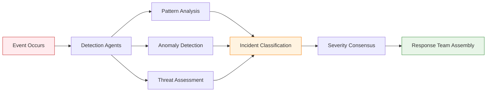

# Agent-Driven Incident Response

> ⚠️ **Revolutionary Approach**: Vrooli's incident response is orchestrated by intelligent agents, not manual procedures. This guide explains how security incidents are detected, analyzed, and resolved through agent swarms.

## Table of Contents

- [Overview](#overview)
- [How Incidents Are Detected](#how-incidents-are-detected)
- [Autonomous Response Coordination](#autonomous-response-coordination)
- [Agent Response Phases](#agent-response-phases)
- [Human Role in Agent-Driven Incidents](#human-role-in-agent-driven-incidents)
- [Agent Response Types](#agent-response-types)
- [Monitoring Agent Responses](#monitoring-agent-responses)
- [Agent Learning and Improvement](#agent-learning-and-improvement)
- [Emergency Escalation](#emergency-escalation)

## Overview

### Core Philosophy: Intelligent Incident Response

Vrooli's incident response system relies on intelligent agent swarms that:

1. **Detect incidents** through pattern analysis and anomaly detection
2. **Assess severity** through collaborative agent analysis
3. **Coordinate responses** autonomously without human bottlenecks
4. **Learn and adapt** from every incident to prevent future occurrences
5. **Escalate to humans** only when agent capabilities are exceeded

### Traditional vs. Agent-Driven Response

```typescript
// ❌ Traditional Approach (What We DON'T Do)
const manualIncidentResponse = {
  detection: "Human monitoring dashboard alerts",
  classification: "Manual severity assessment by analyst",
  response: "Follow predefined playbook steps",
  coordination: "Email chains and conference calls",
  learning: "Post-incident human review meeting"
};

// ✅ Agent-Driven Approach (What We DO)
const agentIncidentResponse = {
  detection: "Agents continuously analyze event patterns",
  classification: "Multi-agent collaborative assessment",
  response: "Autonomous coordinated agent actions",
  coordination: "Real-time agent communication through events",
  learning: "Continuous model updates from each incident"
};
```

## How Incidents Are Detected

### 1. Event Pattern Analysis

```typescript
const incidentDetectionAgent = {
  subscriptions: [
    'system/error/*',
    'security/anomaly/*',
    'performance/degradation/*',
    'user/complaint/*'
  ],
  
  onEvent: async (event) => {
    // Multi-dimensional incident analysis
    const incidentAssessment = await analyzeForIncident(event, {
      // Pattern recognition across time
      temporalPatterns: await analyzeTemporalPatterns(event),
      
      // Cross-system correlation
      systemCorrelation: await correlateCrossSystems(event),
      
      // User impact assessment
      userImpact: await assessUserImpact(event),
      
      // Historical incident similarity
      historicalMatching: await findSimilarIncidents(event)
    });
    
    if (incidentAssessment.isIncident) {
      await initiateIncidentResponse(incidentAssessment);
    }
    
    return incidentAssessment;
  }
};
```

### 2. Multi-Agent Threat Detection

```typescript
const threatCorrelationAgent = {
  subscriptions: ['security/*', 'auth/*', 'data/*'],
  
  onEvent: async (event) => {
    // Collaborate with domain-specific agents
    const threatAnalysis = await collaborateOnThreatAnalysis(event, [
      'network-security-agent',
      'data-protection-agent',
      'authentication-agent',
      'behavioral-analysis-agent'
    ]);
    
    // Multi-agent consensus on threat level
    const consensus = await calculateAgentConsensus(threatAnalysis);
    
    if (consensus.threatLevel > INCIDENT_THRESHOLD) {
      await publishEvent({
        type: 'incident/security/detected',
        severity: consensus.severity,
        evidence: threatAnalysis.evidence,
        recommendedActions: consensus.actions
      });
    }
  }
};
```

### 3. Anomaly Detection Through Intelligence

```typescript
const behaviorAnomalyAgent = {
  subscriptions: ['user/activity/*', 'system/behavior/*'],
  
  onEvent: async (event) => {
    // Intelligent baseline learning
    const normalBehavior = await learnNormalBehavior(event.context);
    
    // Multi-factor anomaly detection
    const anomalyAnalysis = await detectAnomalies(event, {
      baseline: normalBehavior,
      contextualFactors: await gatherContextualFactors(event),
      seasonalPatterns: await analyzeSeasonalPatterns(event),
      peerComparison: await compareToPeerBehavior(event)
    });
    
    if (anomalyAnalysis.isSignificantAnomaly) {
      await escalateAnomaly(anomalyAnalysis);
    }
    
    // Continuous learning
    await updateBehaviorModel(event, anomalyAnalysis);
  }
};
```

## Autonomous Response Coordination

### 1. Agent Swarm Coordination

```typescript
const incidentCoordinatorAgent = {
  onIncident: async (incident) => {
    // Assemble response team of agents
    const responseTeam = await assembleResponseAgents(incident, {
      severity: incident.severity,
      domain: incident.domain,
      affectedSystems: incident.affectedSystems,
      requiredCapabilities: incident.requiredCapabilities
    });
    
    // Coordinate parallel response actions
    const responseActions = await coordinateParallelResponse(responseTeam, {
      containment: await planContainmentActions(incident),
      investigation: await planInvestigationActions(incident),
      communication: await planCommunicationActions(incident),
      recovery: await planRecoveryActions(incident)
    });
    
    // Monitor and adapt response
    await monitorResponseEffectiveness(responseActions);
  }
};
```

### 2. Self-Healing Systems

```typescript
const selfHealingAgent = {
  capabilities: {
    autoRemediation: 'automatic_system_recovery',
    resourceScaling: 'dynamic_resource_allocation',
    serviceRecovery: 'intelligent_service_restart',
    dataRecovery: 'automated_backup_restoration'
  },
  
  onIncident: async (incident) => {
    // Attempt automatic remediation
    const healingActions = await planSelfHealing(incident, {
      // Safe actions that can be taken automatically
      safeActions: await identifySafeActions(incident),
      
      // Risk assessment of each action
      riskAssessment: await assessRemediationRisks(incident),
      
      // Rollback procedures
      rollbackPlan: await createRollbackPlan(incident)
    });
    
    // Execute healing with monitoring
    for (const action of healingActions) {
      const result = await executeHealingAction(action);
      
      if (!result.successful) {
        await executeRollback(action.rollbackPlan);
        break;
      }
      
      // Verify system health after each action
      const healthCheck = await performSystemHealthCheck();
      if (!healthCheck.healthy) {
        await escalateToHumanOperators(incident, result);
        break;
      }
    }
  }
};
```

## Agent Response Phases

### Phase 1: Detection and Assessment



### Phase 2: Autonomous Response

```typescript
const responsePhaseAgent = {
  onIncidentClassified: async (incident) => {
    // Parallel response execution
    const responses = await Promise.all([
      // Immediate containment
      containmentAgent.contain(incident),
      
      // Evidence preservation
      forensicsAgent.preserveEvidence(incident),
      
      // Impact assessment
      impactAgent.assessDamage(incident),
      
      // Communication coordination
      communicationAgent.notifyStakeholders(incident)
    ]);
    
    // Coordinate next phase based on results
    await coordinateInvestigationPhase(responses);
  }
};
```

### Phase 3: Investigation and Analysis

```typescript
const forensicsAgent = {
  onContainmentComplete: async (incident) => {
    // Intelligent evidence gathering
    const evidence = await gatherEvidence(incident, {
      // Automated log analysis
      logAnalysis: await analyzeRelevantLogs(incident),
      
      // Network traffic analysis
      networkAnalysis: await analyzeNetworkTraffic(incident),
      
      // System state analysis
      systemAnalysis: await analyzeSystemState(incident),
      
      // User behavior analysis
      behaviorAnalysis: await analyzeUserBehavior(incident)
    });
    
    // Root cause analysis through AI
    const rootCause = await performRootCauseAnalysis(evidence);
    
    // Generate incident report
    await generateIncidentReport({
      incident,
      evidence,
      rootCause,
      timeline: await reconstructTimeline(evidence),
      recommendations: await generateRecommendations(rootCause)
    });
  }
};
```

### Phase 4: Recovery and Learning

```typescript
const recoveryAgent = {
  onInvestigationComplete: async (incident) => {
    // Intelligent recovery planning
    const recoveryPlan = await createRecoveryPlan(incident, {
      minimumViableService: await defineMinimumService(incident),
      dependencyAnalysis: await analyzeDependencies(incident),
      riskAssessment: await assessRecoveryRisks(incident)
    });
    
    // Execute recovery with monitoring
    await executeRecoveryPlan(recoveryPlan);
    
    // Verify full recovery
    const recoveryVerification = await verifyRecovery(incident);
    
    // Update agent models with learnings
    await updateAgentLearnings(incident, recoveryVerification);
  }
};
```

## Human Role in Agent-Driven Incidents

### When Agents Escalate to Humans

```typescript
const humanEscalationAgent = {
  escalationCriteria: {
    // Agent capabilities exceeded
    capabilityLimits: [
      'unknown_attack_pattern',
      'cross_system_coordination_required',
      'legal_implications_detected'
    ],
    
    // High impact scenarios
    businessImpact: [
      'customer_data_confirmed_breached',
      'financial_loss_exceeding_threshold',
      'regulatory_reporting_required'
    ],
    
    // External coordination needed
    externalRequirements: [
      'law_enforcement_coordination',
      'vendor_coordination_required',
      'customer_communication_needed'
    ]
  },
  
  onEscalationNeeded: async (incident) => {
    // Prepare comprehensive brief for humans
    const humanBrief = await prepareHumanBrief(incident, {
      situationSummary: await generateSituationSummary(incident),
      actionsAlreadyTaken: await summarizeAgentActions(incident),
      recommendedActions: await generateHumanActionRecommendations(incident),
      contextualInformation: await gatherContextualInfo(incident)
    });
    
    // Notify appropriate humans
    await notifyHumanResponders(humanBrief);
    
    // Continue monitoring while humans coordinate
    await monitorForHumanDirectives(incident);
  }
};
```

### Human-Agent Collaboration Interface

```typescript
const humanAgentInterface = {
  // Humans can direct agent actions
  onHumanDirective: async (directive) => {
    // Validate directive safety
    const safetyCheck = await validateDirectiveSafety(directive);
    
    if (safetyCheck.safe) {
      await executeHumanDirective(directive);
    } else {
      await suggestAlternatives(directive, safetyCheck.concerns);
    }
  },
  
  // Humans can query agent status
  onHumanQuery: async (query) => {
    return await generateHumanReadableStatus({
      currentActions: await getCurrentAgentActions(),
      systemHealth: await getSystemHealthSummary(),
      incidentProgress: await getIncidentProgress(),
      recommendedNext: await getRecommendedNextSteps()
    });
  }
};
```

## Agent Response Types

### 1. Automatic Response (No Human Involvement)

```typescript
const autoResponseCriteria = {
  incidents: [
    'known_attack_patterns',
    'performance_degradation',
    'routine_security_violations',
    'system_health_issues'
  ],
  
  conditions: [
    'confidence_level > 0.9',
    'impact_level < HIGH',
    'established_remediation_exists'
  ]
};
```

### 2. Human-Supervised Response

```typescript
const supervisedResponseCriteria = {
  incidents: [
    'novel_attack_patterns',
    'cross_domain_security_issues',
    'moderate_business_impact'
  ],
  
  process: [
    'agents_recommend_actions',
    'human_approval_required',
    'agents_execute_approved_actions'
  ]
};
```

### 3. Human-Led Response

```typescript
const humanLedCriteria = {
  incidents: [
    'major_data_breaches',
    'legal_implications',
    'regulatory_reporting',
    'external_coordination_required'
  ],
  
  agentRole: [
    'provide_technical_analysis',
    'execute_technical_tasks',
    'monitor_and_report_status'
  ]
};
```

## Monitoring Agent Responses

### 1. Response Effectiveness Metrics

```typescript
const responseMonitoringAgent = {
  metrics: {
    // Response speed
    detectionToResponse: 'time_from_detection_to_first_action',
    containmentTime: 'time_to_successful_containment',
    recoveryTime: 'time_to_full_service_recovery',
    
    // Response quality
    accuracyRate: 'percentage_of_correct_classifications',
    falsePositiveRate: 'percentage_of_false_incident_declarations',
    escalationAppropriate: 'percentage_of_appropriate_escalations',
    
    // Learning effectiveness
    recurrenceRate: 'percentage_of_similar_incidents_prevented',
    adaptationSpeed: 'time_to_incorporate_new_learnings'
  },
  
  onIncidentComplete: async (incident) => {
    // Calculate response metrics
    const metrics = await calculateResponseMetrics(incident);
    
    // Identify improvement opportunities
    const improvements = await identifyImprovements(metrics);
    
    // Update agent capabilities
    await updateAgentCapabilities(improvements);
    
    // Generate performance report
    await generatePerformanceReport(metrics, improvements);
  }
};
```

### 2. Agent Performance Dashboard

```typescript
const performanceDashboard = {
  realTimeMetrics: {
    activeIncidents: 'current_incidents_being_handled',
    agentUtilization: 'percentage_of_agents_actively_responding',
    responseSpeed: 'average_response_time_last_24h',
    escalationRate: 'percentage_escalated_to_humans'
  },
  
  historicalTrends: {
    incidentVolume: 'incidents_per_day_last_30_days',
    resolutionRate: 'percentage_resolved_without_escalation',
    learningProgress: 'new_patterns_learned_per_week',
    customerImpact: 'customer_facing_incident_reduction'
  }
};
```

## Agent Learning and Improvement

### 1. Continuous Learning Process

```typescript
const learningAgent = {
  onIncidentResolved: async (incident) => {
    // Extract learnings from incident
    const learnings = await extractLearnings(incident, {
      // What worked well
      successfulActions: await identifySuccessfulActions(incident),
      
      // What could be improved
      improvementAreas: await identifyImprovementAreas(incident),
      
      // New patterns discovered
      newPatterns: await identifyNewPatterns(incident),
      
      // False positive/negative analysis
      accuracyAnalysis: await analyzeAccuracy(incident)
    });
    
    // Update all relevant agent models
    await distributelearnings(learnings);
    
    // Test updated models
    await validateUpdatedModels(learnings);
  }
};
```

### 2. Cross-Incident Pattern Recognition

```typescript
const patternRecognitionAgent = {
  onNewIncident: async (incident) => {
    // Analyze against historical incidents
    const patterns = await analyzePatterns(incident, {
      similarIncidents: await findSimilarIncidents(incident),
      attackVectors: await identifyAttackVectors(incident),
      systemVulnerabilities: await identifyVulnerabilities(incident),
      temporalPatterns: await analyzeTemporalPatterns(incident)
    });
    
    // Update threat intelligence
    await updateThreatIntelligence(patterns);
    
    // Share patterns with security community
    await shareAnonymizedPatterns(patterns);
  }
};
```

## Emergency Escalation

### 1. Agent System Failure

```typescript
const emergencyFallbackProcedures = {
  agentSystemDown: {
    // Immediate actions
    immediate: [
      'activate_traditional_security_fallbacks',
      'notify_human_security_team',
      'enable_enhanced_logging',
      'implement_safe_mode_operations'
    ],
    
    // Recovery actions
    recovery: [
      'diagnose_agent_system_failure',
      'restore_from_known_good_state',
      'gradually_re_enable_agent_responses',
      'verify_system_integrity'
    ]
  }
};
```

### 2. Human Override Capabilities

```typescript
const humanOverride = {
  // Emergency stop of all agent actions
  emergencyStop: async () => {
    await publishEvent({
      type: 'emergency/stop/all_agents',
      priority: 'CRITICAL',
      requiresConfirmation: false
    });
  },
  
  // Take manual control of specific incident
  manualTakeover: async (incidentId) => {
    await publishEvent({
      type: 'incident/manual_takeover',
      incidentId,
      humanOperator: getCurrentOperator()
    });
  }
};
```

## Summary

Vrooli's agent-driven incident response provides:

1. **Faster Detection**: Agents continuously monitor and analyze patterns
2. **Smarter Response**: Context-aware decisions based on domain knowledge
3. **Autonomous Coordination**: Agents work together without human bottlenecks
4. **Continuous Learning**: Every incident improves future response capabilities
5. **Appropriate Escalation**: Humans involved only when agent capabilities are exceeded

This approach results in:
- Reduced mean time to resolution (MTTR)
- Lower false positive rates
- Improved incident prevention
- More consistent response quality
- Enhanced system resilience

For implementation details, see:
- [Security Agent Development](best-practices.md#agent-development-best-practices)
- [Security Agent Examples](agents/examples.md)
- [Emergency Escalation](#emergency-escalation)