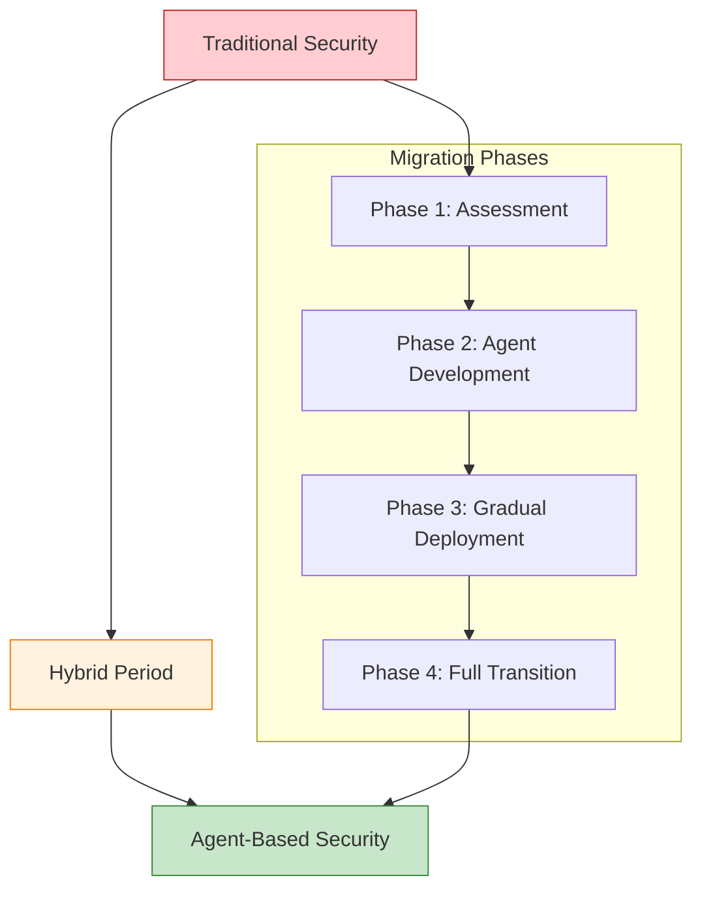

# Migration from Traditional to Emergent Security

This guide provides a step-by-step approach for migrating from traditional hard-coded security to Vrooli's emergent agent-based security model.

## Table of Contents

- [Migration Overview](#migration-overview)
- [Phase 1: Assessment and Planning](#phase-1-assessment-and-planning)
- [Phase 2: Agent Development](#phase-2-agent-development)
- [Phase 3: Gradual Deployment](#phase-3-gradual-deployment)
- [Phase 4: Full Transition](#phase-4-full-transition)
- [Testing During Migration](#testing-during-migration)
- [Common Migration Challenges](#common-migration-challenges)
- [Rollback Procedures](#rollback-procedures)

## Migration Overview

### Why Migrate?

Traditional security systems become increasingly inadequate due to:
- **Static rules** that can't adapt to new threats
- **High false positive rates** from context-unaware pattern matching
- **Manual maintenance overhead** for rule updates
- **Limited scalability** of centralized security systems

### Migration Benefits

Emergent security provides:
- **Adaptive protection** that learns and evolves
- **Context-aware decisions** with lower false positives
- **Self-maintaining** systems that require minimal human intervention
- **Domain-specific intelligence** tailored to your business

### Migration Strategy



## Phase 1: Assessment and Planning

### Step 1.1: Inventory Current Security Rules

Identify all hard-coded security implementations in your codebase:

```bash
# Find security-related code patterns
grep -r "validate\|sanitize\|rateLimit\|authenticate" packages/server/src/ > security_inventory.txt

# Look for specific patterns
grep -r "if.*password" packages/server/src/
grep -r "throw.*SecurityError" packages/server/src/
grep -r "req\.headers\[.*auth" packages/server/src/
```

### Step 1.2: Categorize Security Functions

```typescript
// Create an inventory of your current security functions
const securityInventory = {
  inputValidation: [
    'validateEmail',
    'sanitizeHtml', 
    'validatePassword',
    'checkSqlInjection'
  ],
  
  accessControl: [
    'checkUserPermissions',
    'validateJWT',
    'requireRole',
    'checkResourceAccess'
  ],
  
  rateLimiting: [
    'apiRateLimit',
    'loginRateLimit',
    'uploadRateLimit'
  ],
  
  threatDetection: [
    'detectBruteForce',
    'checkSuspiciousActivity',
    'validateIPWhitelist'
  ]
};
```

### Step 1.3: Assess Migration Complexity

```typescript
const migrationAssessment = {
  // Low complexity - direct agent replacement
  easyMigrations: [
    'simple_input_validation',
    'basic_rate_limiting',
    'standard_authentication'
  ],
  
  // Medium complexity - requires agent coordination  
  moderateMigrations: [
    'multi_factor_authentication',
    'cross_resource_access_control',
    'business_logic_validation'
  ],
  
  // High complexity - requires multiple specialized agents
  complexMigrations: [
    'fraud_detection_systems',
    'compliance_reporting',
    'incident_response_workflows'
  ]
};
```

### Step 1.4: Create Migration Plan

```typescript
const migrationPlan = {
  timeline: {
    assessment: '2 weeks',
    agentDevelopment: '4-6 weeks', 
    gradualDeployment: '6-8 weeks',
    fullTransition: '2-4 weeks'
  },
  
  resources: {
    developers: 2,
    securityExperts: 1,
    testingTime: '30% of development time'
  },
  
  riskMitigation: {
    parallelSystems: 'Run traditional and agent security in parallel',
    gradualRollout: 'Start with non-critical systems',
    fallbackPlan: 'Ability to revert to traditional security'
  }
};
```

## Phase 2: Agent Development

### Step 2.1: Convert Input Validation

```typescript
// Before: Traditional validation
function validateEmail(email: string): boolean {
  const emailRegex = /^[^\s@]+@[^\s@]+\.[^\s@]+$/;
  return emailRegex.test(email);
}

// After: Agent-based validation
const emailValidationAgent = {
  subscriptions: ['user/email/validation'],
  
  onEvent: async (event) => {
    const validation = await intelligentEmailValidation(event.email, {
      // Context-aware validation
      userContext: await getUserContext(event.userId),
      domainReputation: await checkDomainReputation(event.email),
      historicalPatterns: await getEmailPatterns(event.userId),
      businessRules: await getBusinessEmailRules()
    });
    
    return {
      valid: validation.isValid,
      confidence: validation.confidence,
      suggestions: validation.improvements,
      reasoning: validation.reasoning
    };
  }
};
```

### Step 2.2: Convert Rate Limiting

```typescript
// Before: Traditional rate limiting
const rateLimiter = rateLimit({
  windowMs: 15 * 60 * 1000, // 15 minutes
  max: 100 // limit each IP to 100 requests per windowMs
});

// After: Agent-based resource protection
const resourceProtectionAgent = {
  subscriptions: ['api/request/*'],
  
  onEvent: async (event) => {
    const limits = await calculateAdaptiveLimits(event, {
      userBehavior: await analyzeUserBehavior(event.userId),
      systemLoad: await getCurrentSystemLoad(),
      threatLevel: await assessThreatLevel(event),
      businessPriority: await getBusinessPriority(event.endpoint)
    });
    
    if (await exceedsAdaptiveLimit(event, limits)) {
      return {
        action: 'THROTTLE',
        delay: limits.suggestedDelay,
        reasoning: limits.reasoning
      };
    }
    
    return { action: 'PROCEED' };
  }
};
```

### Step 2.3: Convert Access Control

```typescript
// Before: Traditional access control
async function checkUserPermissions(userId: string, resource: string): Promise<boolean> {
  const user = await getUser(userId);
  const permissions = await getUserPermissions(user.roleId);
  return permissions.includes(resource);
}

// After: Agent-based access control
const accessControlAgent = {
  subscriptions: ['access/request/*'],
  
  onEvent: async (event) => {
    const decision = await intelligentAccessDecision(event, {
      // Multi-dimensional analysis
      userProfile: await getUserProfile(event.userId),
      resourceContext: await analyzeResourceSensitivity(event.resource),
      accessContext: await analyzeAccessContext(event),
      behaviorAnalysis: await analyzeBehaviorPatterns(event.userId),
      riskFactors: await assessRiskFactors(event),
      businessContext: await getBusinessContext(event)
    });
    
    return {
      decision: decision.allow ? 'GRANT' : 'DENY',
      conditions: decision.conditions, // time limits, monitoring, etc.
      confidence: decision.confidence,
      reasoning: decision.reasoning
    };
  }
};
```

### Step 2.4: Create Agent Configuration

```typescript
const agentMigrationConfig = {
  // Deploy agents gradually
  agents: [
    {
      name: 'email-validation-agent',
      replaces: ['validateEmail', 'checkEmailFormat'],
      phase: 1,
      riskLevel: 'low'
    },
    {
      name: 'resource-protection-agent', 
      replaces: ['rateLimiter', 'throttleMiddleware'],
      phase: 2,
      riskLevel: 'medium'
    },
    {
      name: 'access-control-agent',
      replaces: ['checkUserPermissions', 'requireRole'],
      phase: 3,
      riskLevel: 'high'
    }
  ]
};
```

## Phase 3: Gradual Deployment

### Step 3.1: Implement Hybrid Mode

```typescript
// Run traditional and agent security in parallel
const hybridSecurityMiddleware = async (req, res, next) => {
  try {
    // Traditional security (primary during migration)
    const traditionalResult = await traditionalSecurity(req);
    
    // Agent security (monitoring mode)
    const agentResult = await agentSecurity(req);
    
    // Compare results for validation
    await compareSecurityResults(traditionalResult, agentResult);
    
    // Use traditional result during migration
    if (traditionalResult.allow) {
      next();
    } else {
      res.status(403).json({ error: traditionalResult.reason });
    }
    
  } catch (error) {
    // Fall back to safe default
    res.status(500).json({ error: 'Security check failed' });
  }
};
```

### Step 3.2: Shadow Mode Testing

```typescript
const shadowModeAgent = {
  onEvent: async (event) => {
    // Agent makes decision but doesn't act on it
    const agentDecision = await makeSecurityDecision(event);
    
    // Log decision for comparison with traditional system
    await logAgentDecision(event, agentDecision);
    
    // Don't actually enforce the decision yet
    return { action: 'MONITOR_ONLY' };
  }
};
```

### Step 3.3: Gradual Feature Replacement

```typescript
const migrationController = {
  // Start with low-risk features
  phase1: {
    features: ['email_validation', 'basic_input_sanitization'],
    agentMode: 'SHADOW', // Monitor only
    rolloutPercentage: 10
  },
  
  // Increase scope and responsibility
  phase2: {
    features: ['rate_limiting', 'simple_access_control'],
    agentMode: 'HYBRID', // Agent and traditional both run
    rolloutPercentage: 25
  },
  
  // Full agent responsibility
  phase3: {
    features: ['complex_access_control', 'threat_detection'],
    agentMode: 'PRIMARY', // Agent makes decisions
    rolloutPercentage: 100
  }
};
```

### Step 3.4: Monitor and Compare

```typescript
const migrationMonitoring = {
  metrics: {
    decisionAccuracy: 'percentage_agent_traditional_agreement',
    falsePositiveRate: 'agent_vs_traditional_false_positives', 
    responseTime: 'agent_vs_traditional_latency',
    threatDetection: 'threats_detected_by_each_system'
  },
  
  onDiscrepancy: async (event, traditionalResult, agentResult) => {
    // Analyze why decisions differed
    const analysis = await analyzeDecisionDifference(
      event, 
      traditionalResult, 
      agentResult
    );
    
    // Update agent if traditional was correct
    if (analysis.traditionalWasCorrect) {
      await agent.learn({
        event,
        correctDecision: traditionalResult,
        feedback: analysis.reasoning
      });
    }
    
    // Log for security team review
    await logSecurityDiscrepancy(analysis);
  }
};
```

## Phase 4: Full Transition

### Step 4.1: Remove Traditional Security Code

```bash
# Safely remove traditional security functions
git checkout -b remove-traditional-security

# Remove old security files (after verifying agents work)
rm packages/server/src/middleware/rateLimiter.ts
rm packages/server/src/utils/validation.ts
rm packages/server/src/security/accessControl.ts

# Update imports and references
find packages/server/src -name "*.ts" -exec sed -i 's/import.*rateLimiter.*//g' {} \;
```

### Step 4.2: Update Configuration

```typescript
// Remove traditional security middleware
const app = express();

// Before
// app.use(rateLimiter);
// app.use(validateInput);
// app.use(checkPermissions);

// After - all security handled by agents
app.use(agentSecurityMiddleware);
```

### Step 4.3: Final Validation

```typescript
const postMigrationValidation = {
  securityTests: [
    'run_full_security_test_suite',
    'penetration_testing_with_agents',
    'load_testing_agent_performance',
    'chaos_engineering_agent_resilience'
  ],
  
  businessTests: [
    'validate_all_business_workflows',
    'test_user_experience_unchanged',
    'verify_compliance_requirements_met'
  ],
  
  operationalTests: [
    'monitor_agent_performance_metrics',
    'test_agent_learning_capabilities',
    'validate_incident_response_procedures'
  ]
};
```

## Testing During Migration

### Unit Testing Agents

```typescript
describe('EmailValidationAgent Migration', () => {
  let traditionalValidator: EmailValidator;
  let agentValidator: EmailValidationAgent;
  
  beforeEach(() => {
    traditionalValidator = new EmailValidator();
    agentValidator = new EmailValidationAgent();
  });
  
  it('should match traditional validation for standard cases', async () => {
    const testEmails = [
      'valid@example.com',
      'invalid.email',
      'test@domain.co.uk'
    ];
    
    for (const email of testEmails) {
      const traditionalResult = traditionalValidator.validate(email);
      const agentResult = await agentValidator.onEvent({
        type: 'user/email/validation',
        email
      });
      
      expect(agentResult.valid).toBe(traditionalResult);
    }
  });
  
  it('should provide additional context that traditional validation lacks', async () => {
    const result = await agentValidator.onEvent({
      type: 'user/email/validation',
      email: 'suspicious@tempmail.com'
    });
    
    expect(result).toHaveProperty('confidence');
    expect(result).toHaveProperty('reasoning');
    expect(result).toHaveProperty('suggestions');
  });
});
```

### Integration Testing

```typescript
describe('Security Migration Integration', () => {
  it('should handle authentication with both systems', async () => {
    const request = createMockRequest({
      headers: { authorization: 'Bearer test-token' }
    });
    
    // Test traditional system
    const traditionalAuth = await traditionalAuthMiddleware(request);
    
    // Test agent system  
    const agentAuth = await agentAuthMiddleware(request);
    
    // Results should match during migration
    expect(agentAuth.userId).toBe(traditionalAuth.userId);
    expect(agentAuth.permissions).toEqual(traditionalAuth.permissions);
  });
});
```

## Common Migration Challenges

### Challenge 1: Performance Differences

```typescript
// Problem: Agent analysis may be slower than simple rule checks
const performanceOptimization = {
  solutions: [
    'cache_frequent_decisions',
    'batch_similar_events', 
    'use_fast_path_for_obvious_cases',
    'async_processing_for_complex_analysis'
  ],
  
  implementation: {
    fastPath: async (event) => {
      // Quick decisions for obvious cases
      if (await isObviouslyValid(event)) {
        return { action: 'ALLOW', confidence: 'high' };
      }
      
      // Defer to full analysis for complex cases
      return await performFullAnalysis(event);
    }
  }
};
```

### Challenge 2: False Positive Differences

```typescript
// Problem: Agents may initially have different false positive rates
const falsePositiveManagement = {
  solutions: [
    'train_agents_on_historical_data',
    'implement_feedback_loops',
    'use_confidence_scores_for_decisions',
    'gradual_sensitivity_adjustment'
  ],
  
  implementation: {
    adaptiveSensitivity: async (agent, metrics) => {
      if (metrics.falsePositiveRate > ACCEPTABLE_RATE) {
        await agent.adjustSensitivity('decrease');
      } else if (metrics.missedThreats > ACCEPTABLE_RATE) {
        await agent.adjustSensitivity('increase');
      }
    }
  }
};
```

### Challenge 3: Complex Business Logic

```typescript
// Problem: Complex business rules may be hard to migrate
const complexLogicMigration = {
  approach: 'incremental_extraction',
  
  steps: [
    'identify_core_business_rules',
    'extract_to_separate_agents',
    'maintain_rule_engine_for_complex_cases',
    'gradually_train_agents_on_edge_cases'
  ],
  
  example: {
    // Keep complex rules in hybrid mode longer
    complexBusinessRuleAgent: {
      onEvent: async (event) => {
        // Use traditional rule engine for complex cases
        if (await isComplexBusinessCase(event)) {
          return await traditionalRuleEngine.evaluate(event);
        }
        
        // Use agent intelligence for standard cases
        return await intelligentAnalysis(event);
      }
    }
  }
};
```

## Rollback Procedures

### Emergency Rollback

```typescript
const emergencyRollback = {
  triggers: [
    'agent_system_failure',
    'unacceptable_false_positive_rate',
    'security_breach_attributed_to_agents',
    'business_critical_functionality_broken'
  ],
  
  procedure: async () => {
    // 1. Immediately disable all agents
    await disableAllSecurityAgents();
    
    // 2. Re-enable traditional security
    await enableTraditionalSecurity();
    
    // 3. Notify stakeholders
    await notifySecurityTeam('emergency_rollback_initiated');
    
    // 4. Preserve agent state for analysis
    await preserveAgentState();
    
    // 5. Begin incident analysis
    await initiateIncidentAnalysis();
  }
};
```

### Gradual Rollback

```typescript
const gradualRollback = {
  // Roll back one feature at a time
  rollbackByFeature: async (feature) => {
    await setFeatureSecurityMode(feature, 'TRADITIONAL');
    await monitorFeaturePerformance(feature);
  },
  
  // Roll back specific agents
  rollbackAgent: async (agentName) => {
    await disableAgent(agentName);
    await enableTraditionalEquivalent(agentName);
    await logRollbackReason(agentName);
  }
};
```

## Success Criteria

Your migration is successful when:

1. **All security functions migrated** to agent-based implementation
2. **Performance maintained** or improved over traditional system
3. **False positive rate** equal to or better than traditional system
4. **Zero security regressions** introduced during migration
5. **Agent learning demonstrated** through improved threat detection
6. **Team confidence** in agent-based security achieved

## Post-Migration

After successful migration:

1. **Monitor agent performance** continuously
2. **Provide feedback loops** for agent learning
3. **Regular agent capability reviews** and improvements
4. **Documentation updates** reflecting new security model
5. **Team training** on agent-based security management

For ongoing management of your agent-based security, see:
- [Security Best Practices](best-practices.md)
- [Agent Monitoring Guide](../architecture/execution/monitoring/)
- [Security Agent Cookbook](agents/examples.md)