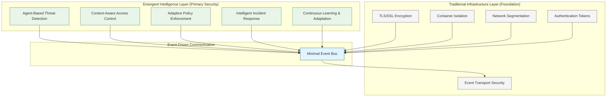
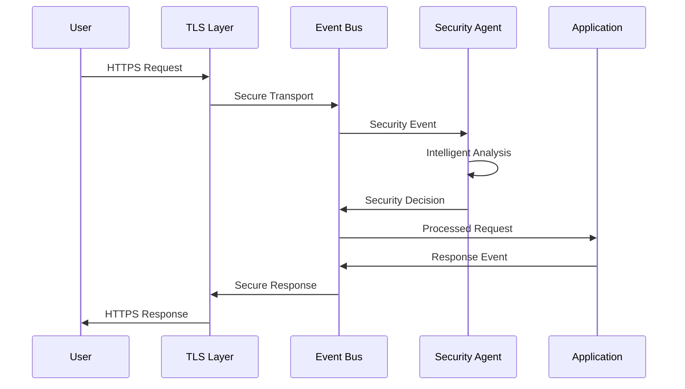
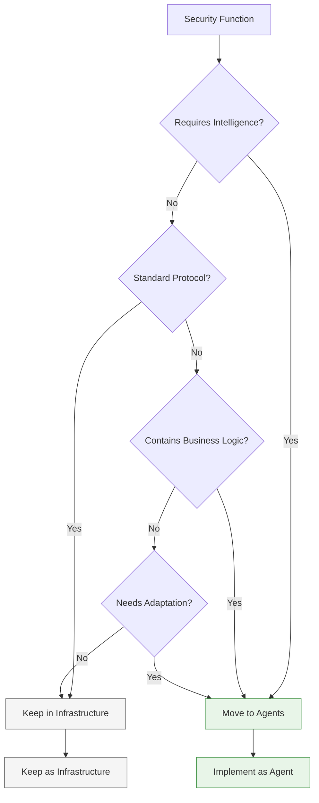

# Security Architecture Layers: Infrastructure vs Intelligence

This document clarifies the hybrid security model in Vrooli, explaining what remains as traditional infrastructure versus what emerges from intelligent agents.

## Table of Contents

- [Architecture Overview](#architecture-overview)
- [Traditional Infrastructure Layer](#traditional-infrastructure-layer)
- [Emergent Intelligence Layer](#emergent-intelligence-layer)
- [How Layers Interact](#how-layers-interact)
- [Decision Framework](#decision-framework)
- [Implementation Guidelines](#implementation-guidelines)
- [Examples and Patterns](#examples-and-patterns)

## Architecture Overview

Vrooli's security operates on two distinct but complementary layers:



## Traditional Infrastructure Layer

### Purpose: Secure Foundation

The infrastructure layer provides the **minimal secure foundation** required for the intelligent agents to operate. This layer is:
- **Static**: Configuration-based, not learning
- **Foundational**: Enables secure communication
- **Simple**: Basic, well-understood security primitives
- **Reliable**: Battle-tested, standard implementations

### What Remains as Infrastructure

#### 1. Transport Layer Security

```typescript
// ✅ Keep: TLS for secure communication
const tlsConfig = {
  enabled: true,
  minVersion: '1.3',
  cipherSuites: [
    'TLS_AES_256_GCM_SHA384',
    'TLS_CHACHA20_POLY1305_SHA256'
  ],
  certificates: {
    cert: './certs/server.crt',
    key: './certs/server.key',
    ca: './certs/ca.crt'
  }
};

// Why this stays infrastructure:
// - Standard protocol implementation
// - No intelligence required
// - Foundation for secure agent communication
```

#### 2. Container Isolation

```yaml
# ✅ Keep: Container security policies
apiVersion: v1
kind: Pod
spec:
  securityContext:
    runAsNonRoot: true
    runAsUser: 1000
    fsGroup: 2000
  containers:
  - name: agent
    securityContext:
      allowPrivilegeEscalation: false
      readOnlyRootFilesystem: true
      capabilities:
        drop:
        - ALL
        add:
        - NET_BIND_SERVICE

# Why this stays infrastructure:
# - OS-level isolation mechanism
# - No decision-making required
# - Hardware/kernel-level security
```

#### 3. Network Segmentation

```yaml
# ✅ Keep: Network policies
apiVersion: networking.k8s.io/v1
kind: NetworkPolicy
metadata:
  name: security-agent-policy
spec:
  podSelector:
    matchLabels:
      app: security-agent
  policyTypes:
  - Ingress
  - Egress
  ingress:
  - from:
    - podSelector:
        matchLabels:
          app: event-bus
  egress:
  - to:
    - podSelector:
        matchLabels:
          app: event-bus

# Why this stays infrastructure:
# - Network-level access control
# - No context awareness needed
# - Standard network security practice
```

#### 4. Basic Authentication Tokens

```typescript
// ✅ Keep: JWT token structure and validation
const jwtConfig = {
  issuer: 'vrooli-auth',
  audience: 'vrooli-api',
  algorithm: 'RS256',
  keyRotation: '90d',
  
  // Basic token validation (structure, signature, expiry)
  validateToken: (token: string) => {
    return jwt.verify(token, publicKey, {
      issuer: jwtConfig.issuer,
      audience: jwtConfig.audience,
      algorithms: [jwtConfig.algorithm]
    });
  }
};

// Why this stays infrastructure:
// - Standard token format
// - Cryptographic validation only
// - No business logic or context
```

#### 5. Event Bus Security

```typescript
// ✅ Keep: Event bus transport security
const eventBusConfig = {
  transport: 'redis',
  encryption: {
    enabled: true,
    algorithm: 'AES-256-GCM'
  },
  authentication: {
    enabled: true,
    mechanism: 'password' // or 'tls-client-cert'
  },
  
  // Basic event routing - no intelligence
  routeEvent: (event: Event) => {
    const channel = event.type.split('/')[0];
    return redis.publish(channel, encrypt(event));
  }
};

// Why this stays infrastructure:
// - Message transport only
// - No event analysis or filtering
// - Standard pub/sub implementation
```

### What NOT to Keep as Infrastructure

```typescript
// ❌ Don't keep these as infrastructure:

// Input validation - move to agents
const validateInput = (input: string) => { /* static rules */ };

// Rate limiting - move to agents  
const rateLimit = { windowMs: 15000, max: 100 };

// Access control decisions - move to agents
const checkPermissions = (user: User, resource: string) => { /* static rules */ };

// Threat detection - move to agents
const detectThreat = (request: Request) => { /* pattern matching */ };

// Why these move to agents:
// - Require context and intelligence
// - Need to adapt and learn
// - Business logic embedded
// - Decision-making required
```

## Emergent Intelligence Layer

### Purpose: Adaptive Security Decisions

The intelligence layer provides **all security decision-making** through intelligent agents. This layer is:
- **Adaptive**: Learns and evolves
- **Intelligent**: Makes context-aware decisions
- **Collaborative**: Agents work together
- **Domain-Specific**: Tailored to business needs

### What Emerges from Agents

#### 1. Input Validation and Sanitization

```typescript
// Agent-based input validation
const inputValidationAgent = {
  subscriptions: ['input/user/*'],
  
  onEvent: async (event) => {
    // Intelligent analysis with context
    const validation = await analyzeInput(event.content, {
      userContext: await getUserTrustLevel(event.userId),
      contentType: await detectContentType(event.content),
      businessRules: await getBusinessRules(event.context),
      threatIntelligence: await getThreatData(),
      historicalPatterns: await getAttackPatterns()
    });
    
    return {
      action: validation.safe ? 'ALLOW' : 'SANITIZE',
      sanitizedContent: validation.sanitizedVersion,
      confidence: validation.confidence,
      reasoning: validation.riskFactors
    };
  }
};

// Why this is agent-based:
// - Requires understanding of content intent
// - Context-dependent decisions
// - Learning from new attack patterns
// - Domain-specific knowledge needed
```

#### 2. Access Control and Authorization

```typescript
// Agent-based access control
const accessControlAgent = {
  subscriptions: ['access/request/*'],
  
  onEvent: async (event) => {
    const decision = await makeAccessDecision(event, {
      // Multi-dimensional analysis
      userContext: await analyzeUserContext(event.userId),
      resourceSensitivity: await classifyResource(event.resource),
      accessPattern: await analyzeAccessPattern(event),
      riskFactors: await assessRiskFactors(event),
      businessContext: await getBusinessContext(event),
      temporalFactors: await analyzeTimeContext(event)
    });
    
    return {
      decision: decision.allow ? 'GRANT' : 'DENY',
      conditions: decision.conditions,
      monitoring: decision.monitoringLevel,
      reasoning: decision.reasoning,
      expiry: decision.timeLimit
    };
  }
};

// Why this is agent-based:
// - Requires understanding of user intent
// - Context-sensitive permissions
// - Risk-based access decisions
// - Learning from access patterns
```

#### 3. Rate Limiting and Resource Protection

```typescript
// Agent-based resource protection
const resourceProtectionAgent = {
  subscriptions: ['api/request/*', 'resource/access/*'],
  
  onEvent: async (event) => {
    const limits = await calculateDynamicLimits(event, {
      userBehavior: await analyzeUserBehavior(event.userId),
      systemLoad: await getCurrentSystemLoad(),
      threatLevel: await assessCurrentThreatLevel(),
      businessPriority: await getBusinessPriority(event),
      temporalPatterns: await analyzeTimePatterns(event)
    });
    
    if (await exceedsAdaptiveLimit(event, limits)) {
      return {
        action: 'THROTTLE',
        delay: limits.suggestedDelay,
        reasoning: limits.reasoning,
        alternatives: limits.alternatives
      };
    }
    
    return { action: 'PROCEED' };
  }
};

// Why this is agent-based:
// - Requires understanding of usage patterns
// - Context-dependent limits
// - Adaptive to changing conditions
// - Learning from abuse patterns
```

#### 4. Threat Detection and Response

```typescript
// Agent-based threat detection
const threatDetectionAgent = {
  subscriptions: ['security/*', 'system/*'],
  
  onEvent: async (event) => {
    const threat = await analyzeThreat(event, {
      patternRecognition: await recognizeAttackPatterns(event),
      anomalyDetection: await detectAnomalies(event),
      contextualAnalysis: await analyzeContext(event),
      threatIntelligence: await correlateThreatIntel(event),
      behaviorAnalysis: await analyzeBehavior(event)
    });
    
    if (threat.level > THREAT_THRESHOLD) {
      // Coordinate response with other agents
      return await coordinateResponse(threat);
    }
    
    return { action: 'MONITOR', threat };
  }
};

// Why this is agent-based:
// - Requires pattern recognition and learning
// - Context-dependent threat assessment
// - Adaptive to new attack vectors
// - Collaborative response coordination
```

## How Layers Interact

### 1. Event Flow Through Layers



### 2. Authentication Flow

```typescript
const authenticationFlow = {
  // Infrastructure: Token validation
  validateTokenStructure: (token: string) => {
    // Basic JWT validation - stays in infrastructure
    return jwt.verify(token, publicKey);
  },
  
  // Agent: Authentication decision
  authenticationAgent: {
    onEvent: async (authEvent) => {
      const tokenPayload = authEvent.tokenPayload; // Already validated by infrastructure
      
      // Intelligent authentication analysis
      const authAnalysis = await analyzeAuthentication(authEvent, {
        userBehavior: await getUserBehaviorProfile(tokenPayload.userId),
        deviceContext: await analyzeDevice(authEvent.device),
        locationContext: await analyzeLocation(authEvent.location),
        riskFactors: await assessRiskFactors(authEvent)
      });
      
      return {
        decision: authAnalysis.allow ? 'ALLOW' : 'CHALLENGE',
        challengeType: authAnalysis.recommendedChallenge,
        confidence: authAnalysis.confidence
      };
    }
  }
};
```

### 3. Data Access Flow

```typescript
const dataAccessFlow = {
  // Infrastructure: Secure transport
  secureTransport: {
    encrypt: (data: any) => encrypt(data, AES_KEY),
    decrypt: (encryptedData: string) => decrypt(encryptedData, AES_KEY)
  },
  
  // Agent: Access decision
  dataAccessAgent: {
    onEvent: async (accessEvent) => {
      const accessDecision = await analyzeDataAccess(accessEvent, {
        dataClassification: await classifyData(accessEvent.dataId),
        userContext: await getUserDataPermissions(accessEvent.userId),
        accessContext: await analyzeAccessContext(accessEvent),
        complianceRules: await getComplianceRules(accessEvent)
      });
      
      return accessDecision;
    }
  }
};
```

## Decision Framework

### When to Use Infrastructure vs Agents

```typescript
const securityDecisionFramework = {
  useInfrastructure: {
    criteria: [
      'no_intelligence_required',
      'standard_protocol_implementation',
      'cryptographic_operations',
      'network_transport_security',
      'container_isolation'
    ],
    examples: [
      'TLS encryption/decryption',
      'JWT signature validation',
      'Container security policies',
      'Network segmentation rules',
      'Event bus transport'
    ]
  },
  
  useAgents: {
    criteria: [
      'requires_context_analysis',
      'needs_learning_capability',
      'business_logic_embedded',
      'adaptive_behavior_needed',
      'decision_making_required'
    ],
    examples: [
      'Input validation decisions',
      'Access control decisions',
      'Rate limiting thresholds',
      'Threat detection and response',
      'Compliance checking'
    ]
  }
};
```

### Migration Decision Tree



## Implementation Guidelines

### 1. Clear Separation of Concerns

```typescript
// ✅ Good: Clear layer separation
class SecuritySystem {
  // Infrastructure layer
  private tlsLayer = new TLSLayer();
  private eventBus = new SecureEventBus();
  
  // Agent layer
  private securityAgents = new AgentManager();
  
  async processRequest(request: Request): Promise<Response> {
    // Infrastructure: Secure transport
    const secureRequest = await this.tlsLayer.decrypt(request);
    
    // Agent: Security analysis
    const securityEvent = this.createSecurityEvent(secureRequest);
    const securityDecision = await this.securityAgents.analyze(securityEvent);
    
    if (securityDecision.allow) {
      const response = await this.processApplication(secureRequest);
      return await this.tlsLayer.encrypt(response);
    } else {
      return this.createSecurityResponse(securityDecision);
    }
  }
}
```

### 2. Interface Design

```typescript
// Clear interfaces between layers
interface InfrastructureLayer {
  // Only secure transport and basic validation
  validateTokenStructure(token: string): TokenPayload;
  encryptData(data: any): EncryptedData;
  decryptData(encrypted: EncryptedData): any;
  routeEvent(event: Event): void;
}

interface IntelligenceLayer {
  // All security decisions
  analyzeAuthentication(event: AuthEvent): Promise<AuthDecision>;
  analyzeAuthorization(event: AuthzEvent): Promise<AuthzDecision>;
  analyzeInput(event: InputEvent): Promise<InputDecision>;
  analyzeThreat(event: ThreatEvent): Promise<ThreatDecision>;
}
```

### 3. Configuration Management

```typescript
const securityConfig = {
  infrastructure: {
    tls: {
      minVersion: '1.3',
      cipherSuites: ['AES-256-GCM']
    },
    eventBus: {
      encryption: true,
      authentication: true
    }
  },
  
  intelligence: {
    agents: [
      {
        name: 'input-validation-agent',
        sensitivity: 'medium',
        learningRate: 0.01
      },
      {
        name: 'access-control-agent',
        riskThreshold: 0.7,
        contextWindow: '24h'
      }
    ]
  }
};
```

## Examples and Patterns

### Example 1: User Login

```typescript
const userLoginExample = {
  // Infrastructure responsibilities
  infrastructure: {
    validateJWTStructure: (token: string) => {
      // Cryptographic validation only
      return jwt.verify(token, publicKey);
    },
    
    secureTransport: (data: any) => {
      // TLS encryption/decryption
      return tls.encrypt(data);
    }
  },
  
  // Agent responsibilities  
  agents: {
    authenticationAgent: async (loginEvent) => {
      // Intelligent authentication decision
      const decision = await analyzeLogin(loginEvent, {
        userBehavior: await getUserPattern(loginEvent.userId),
        deviceFingerprint: await analyzeDevice(loginEvent),
        locationRisk: await assessLocation(loginEvent),
        timePatterns: await analyzeTime(loginEvent)
      });
      
      return decision;
    }
  }
};
```

### Example 2: Data Export

```typescript
const dataExportExample = {
  // Infrastructure responsibilities
  infrastructure: {
    fileEncryption: (data: Buffer) => {
      // Standard file encryption
      return encrypt(data, AES_KEY);
    },
    
    networkTransport: (encryptedData: Buffer) => {
      // Secure HTTPS transport
      return https.send(encryptedData);
    }
  },
  
  // Agent responsibilities
  agents: {
    dataClassificationAgent: async (exportEvent) => {
      // Classify data sensitivity
      return await classifyDataSensitivity(exportEvent.data);
    },
    
    complianceAgent: async (exportEvent) => {
      // Check regulatory compliance
      return await checkCompliance(exportEvent);
    },
    
    accessControlAgent: async (exportEvent) => {
      // Verify export permissions
      return await verifyExportPermissions(exportEvent);
    }
  }
};
```

## Summary

Vrooli's hybrid security model provides:

1. **Solid Foundation**: Infrastructure layer handles secure transport and basic validation
2. **Intelligent Decisions**: Agent layer makes all context-aware security decisions
3. **Clear Separation**: Each layer has distinct responsibilities
4. **Scalable Architecture**: Infrastructure scales for transport, agents scale for intelligence
5. **Maintainable System**: Standard infrastructure + adaptive intelligence

This architecture ensures both security and adaptability while maintaining clear boundaries between foundational security and intelligent decision-making.

For implementation details, see:
- [Core Security Concepts](core-concepts.md)
- [Security Best Practices](best-practices.md)
- [Security Agent Cookbook](agents/examples.md)