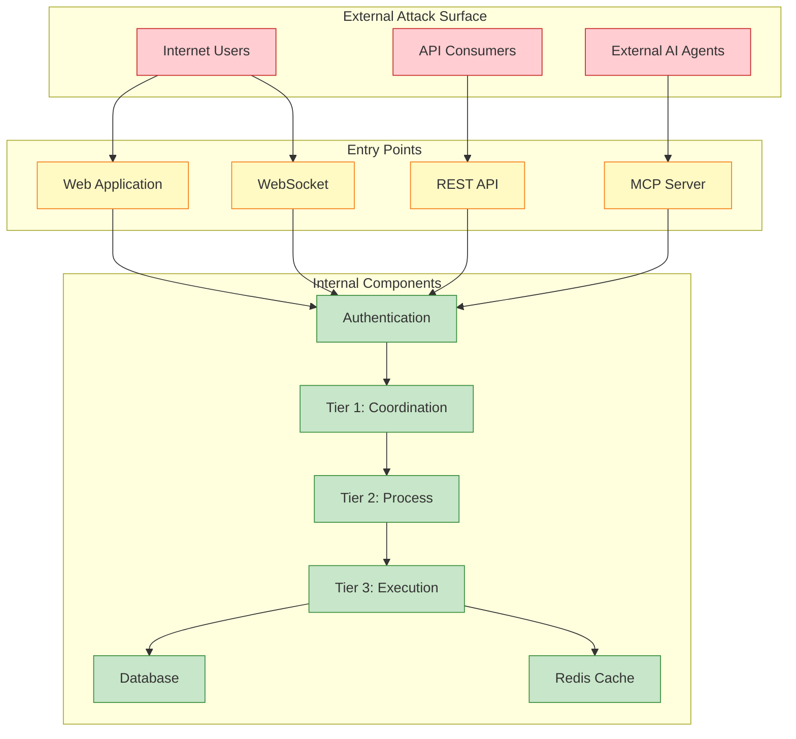
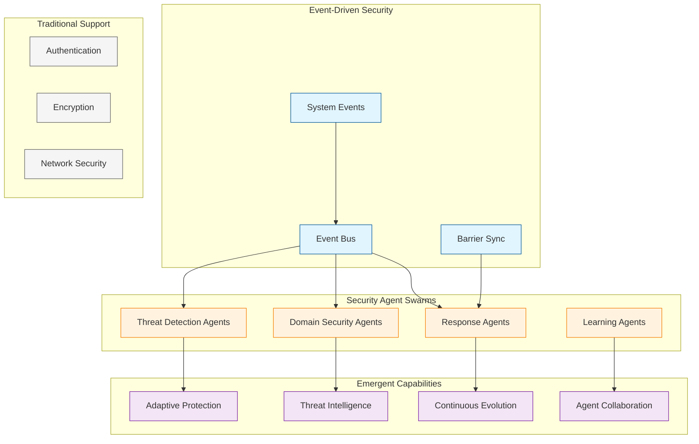

# Vrooli Threat Model

This document provides a comprehensive threat analysis for the Vrooli platform, identifying potential security risks and mitigation strategies across all system components.

## Table of Contents

- [Executive Summary](#executive-summary)
- [System Overview](#system-overview)
- [Threat Categories](#threat-categories)
- [Component-Level Threats](#component-level-threats)
- [AI-Specific Threats](#ai-specific-threats)
- [Attack Scenarios](#attack-scenarios)
- [Risk Matrix](#risk-matrix)
- [Mitigation Strategies](#mitigation-strategies)
- [Threat Monitoring](#threat-monitoring)

## Executive Summary

Vrooli's revolutionary security approach uses intelligent agent swarms to detect, adapt to, and mitigate threats through emergent intelligence rather than static rules:

- **Event-Driven Threat Detection**: Security agents subscribe to system events and identify threats through pattern analysis
- **Adaptive Protection**: Security evolves automatically as agents learn from new attack patterns
- **Domain-Specific Defense**: Teams deploy specialized agents for their unique threat landscape
- **Collaborative Intelligence**: Agents share threat intelligence to strengthen the entire ecosystem

## System Overview

### Attack Surface



## Threat Categories

### 1. Infrastructure Threats

| Threat | Description | Impact | Likelihood |
|--------|-------------|--------|------------|
| DDoS Attacks | Overwhelming system resources | High | Medium |
| Container Escape | Breaking out of Docker isolation | Critical | Low |
| Supply Chain | Compromised dependencies | High | Medium |
| Misconfiguration | Exposed services/credentials | High | Medium |

### 2. Application Threats

| Threat | Description | Impact | Likelihood |
|--------|-------------|--------|------------|
| SQL Injection | Database manipulation | Critical | Low |
| XSS | Client-side code execution | Medium | Medium |
| CSRF | Unauthorized actions | Medium | Low |
| Authentication Bypass | Unauthorized access | Critical | Low |
| Session Hijacking | Account takeover | High | Medium |

### 3. Emergent Security Threats

| Threat | Description | Agent Response | Adaptation |
|--------|-------------|----------------|------------|
| Novel Attack Patterns | Previously unknown threats | Agents detect anomalies through pattern analysis | Learn and share new threat signatures |
| Domain-Specific Exploits | Industry-targeted attacks | Specialized agents provide context-aware protection | Evolve domain-specific defenses |
| Adaptive Adversaries | Attackers that learn and change | Agents continuously update threat models | Counter-adaptation through swarm intelligence |
| Resource Manipulation | Abuse of AI compute/storage | Resource agents monitor and limit usage | Dynamic resource allocation policies |
| Behavioral Anomalies | Unusual system behavior | Behavior agents detect deviations | Learn normal patterns, flag outliers |

### 4. Data & Privacy Threats

| Threat | Description | Impact | Likelihood |
|--------|-------------|--------|------------|
| Data Breach | Unauthorized data access | Critical | Medium |
| Privacy Violation | PII exposure | High | Medium |
| Model Inversion | Extracting private data | Medium | Low |
| Compliance Violation | Regulatory breach | High | Low |

## Component-Level Threats

### Frontend (UI Package)

**Threats:**
- Cross-Site Scripting (XSS)
- Clickjacking
- Local storage manipulation
- API key exposure
- CORS misconfiguration

**Mitigations:**
- Content Security Policy (CSP)
- Input sanitization
- Secure cookie flags
- API key rotation
- Strict CORS policy

### Backend (Server Package)

**Threats:**
- API abuse
- Authentication vulnerabilities
- Authorization bypass
- Injection attacks
- Denial of service

**Mitigations:**
- Rate limiting
- JWT validation
- RBAC enforcement
- Parameterized queries
- Resource quotas

### AI Execution Tiers

#### Tier 1: Coordination Intelligence

**Threats:**
- Swarm manipulation
- Resource monopolization
- Coordination poisoning
- Goal misalignment

**Mitigations:**
- Swarm authentication
- Resource limits
- Behavior monitoring
- Goal validation

#### Tier 2: Process Intelligence

**Threats:**
- Routine manipulation
- Workflow injection
- State corruption
- Navigation exploit

**Mitigations:**
- Routine signing
- Workflow validation
- State checksums
- Navigation bounds

#### Tier 3: Execution Intelligence

**Threats:**
- Tool abuse
- Sandbox escape
- Resource exhaustion
- Output manipulation

**Mitigations:**
- Tool whitelisting
- Secure sandboxing
- Execution limits
- Output validation

## Agent-Based Threat Detection and Response

> 📖 **For details on how agents work**, see [Core Security Concepts](core-concepts.md) which explains the agent intelligence model and event-driven architecture.

This section focuses on how threats are **specifically detected and mitigated** through agent intelligence.

### Recursive Improvement Exploits

**Scenario:** Malicious agents attempting to modify their own capabilities

**Risks:**
- Capability escalation
- Safety bypass
- Resource monopolization
- Goal drift

**Mitigations:**
- Immutable core constraints
- Capability change approval
- Monitoring and rollback
- Goal alignment verification

## Attack Scenarios

### Scenario 1: Coordinated Swarm Attack

**Attack Flow:**
1. Attacker creates multiple agent accounts
2. Coordinates swarm to consume resources
3. Attempts to modify system behavior
4. Exfiltrates data or causes denial of service

**Detection:**
- Anomalous swarm creation patterns
- Resource usage spikes
- Behavioral anomalies
- Communication pattern analysis

### Scenario 2: Supply Chain Compromise

**Attack Flow:**
1. Compromise npm package dependency
2. Malicious code executes during build
3. Backdoor installed in production
4. Persistent access established

**Prevention:**
- Dependency scanning
- Lock file verification
- Build isolation
- Runtime monitoring

### Scenario 3: Adaptive Attack Detection

**Agent Response Flow:**
1. Attack attempt generates system events
2. Multiple security agents analyze the events
3. Agents collaborate to assess threat severity
4. Coordinated response initiated

**Agent-Based Prevention:**
- Real-time pattern analysis by specialized agents
- Barrier synchronization for critical decisions
- Continuous learning from attack attempts
- Automatic adaptation to new attack vectors

## Risk Matrix

| Risk Level | Impact | Likelihood | Examples |
|------------|--------|------------|----------|
| Critical | Catastrophic | Any | Data breach, system compromise |
| High | Severe | High | Prompt injection, DDoS |
| Medium | Moderate | Medium | XSS, session hijacking |
| Low | Minor | Low | Information disclosure |

### Risk Calculation

```
Risk Score = Impact (1-5) × Likelihood (1-5) × Exploitability (1-5)

Critical: 75-125
High: 40-74
Medium: 15-39
Low: 1-14
```

## Mitigation Strategies

### Emergent Defense Through Agent Swarms



### Security Controls Through Agent Intelligence

1. **Adaptive Prevention**
   - Agents learn attack patterns and prevent similar attempts
   - Context-aware validation based on domain knowledge
   - Dynamic access control adjusted by security agents
   - Proactive threat blocking through pattern prediction

2. **Intelligent Detection**
   - Event-driven monitoring by specialized agents
   - Behavioral analysis through AI reasoning
   - Anomaly detection that improves over time
   - Cross-agent correlation for comprehensive visibility

3. **Autonomous Response**
   - Agents coordinate incident response automatically
   - Self-healing through intelligent remediation
   - Adaptive containment based on threat severity
   - Continuous improvement from each incident

## Threat Monitoring

### Key Security Metrics (Emergent from Agents)

1. **Agent-Detected Threats**
   - Novel attack patterns identified
   - Domain-specific threat frequency
   - Cross-agent threat correlations
   - Adaptive response effectiveness

2. **Agent Learning Metrics**
   - New threat signatures learned
   - False positive reduction rate
   - Response time improvements
   - Intelligence sharing frequency

3. **System Protection Health**
   - Agent swarm coverage
   - Event processing latency
   - Barrier synchronization performance
   - Threat prevention success rate

### Alert Thresholds

| Metric | Agent Response | Escalation | Adaptation |
|--------|----------------|------------|------------|
| Novel Threat | Agents analyze pattern | Swarm collaboration | Learn new signature |
| Resource Spike | Resource agents investigate | Limit enforcement | Adjust thresholds |
| Anomaly Detected | Behavior agents assess | Barrier sync if critical | Update normal baseline |
| Attack Pattern | Detection agents correlate | Response agents act | Share intelligence |

## Continuous Improvement

### Threat Model Updates

- **Quarterly Reviews**: Full threat model assessment
- **Monthly Updates**: Emerging threat analysis
- **Incident-Driven**: Post-incident model updates
- **Community Input**: Security researcher feedback

### Security Posture Evolution

1. Regular penetration testing
2. Red team exercises
3. Security awareness training
4. Threat intelligence integration
5. Automated security testing

## Related Documentation

- [Security Best Practices](best-practices.md)
- [Incident Response](incident-response.md)
- [Security Agents](../architecture/execution/emergent-capabilities/agent-examples/security-agents.md)
- [Monitoring Agents](../architecture/execution/emergent-capabilities/routine-examples/monitoring-agents.md)

---

**Last Updated**: 2024-01-15  
**Next Review**: 2024-04-15  
**Classification**: Internal Use Only