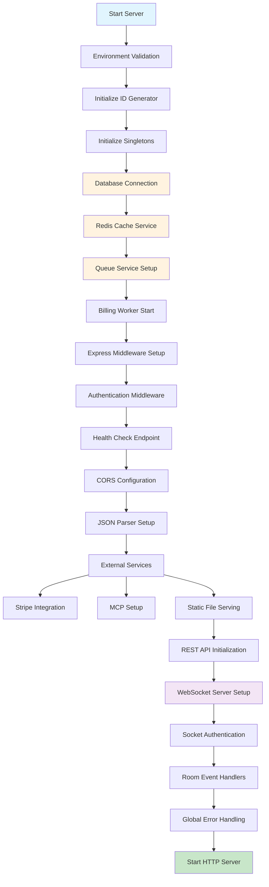
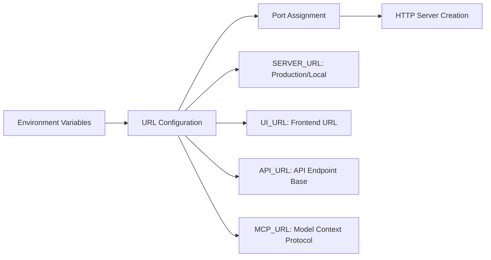
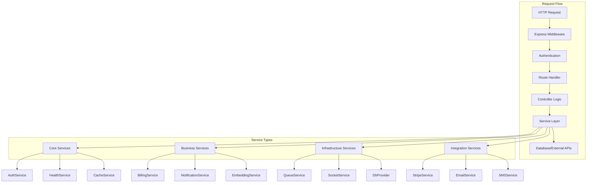
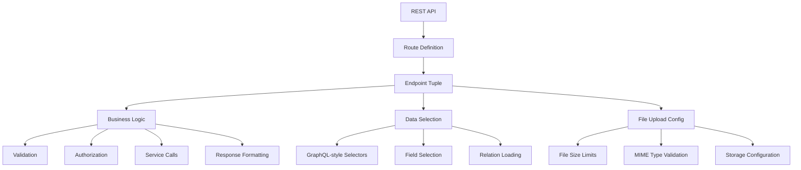
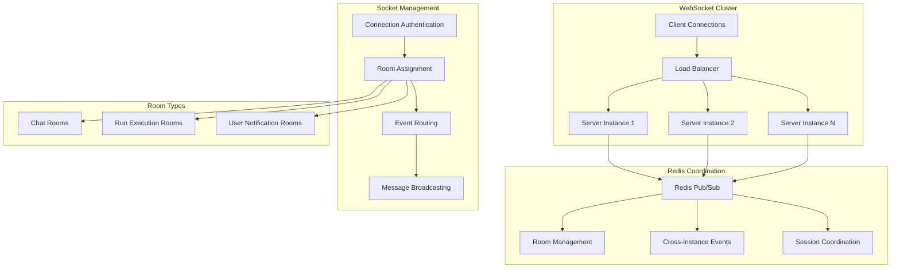
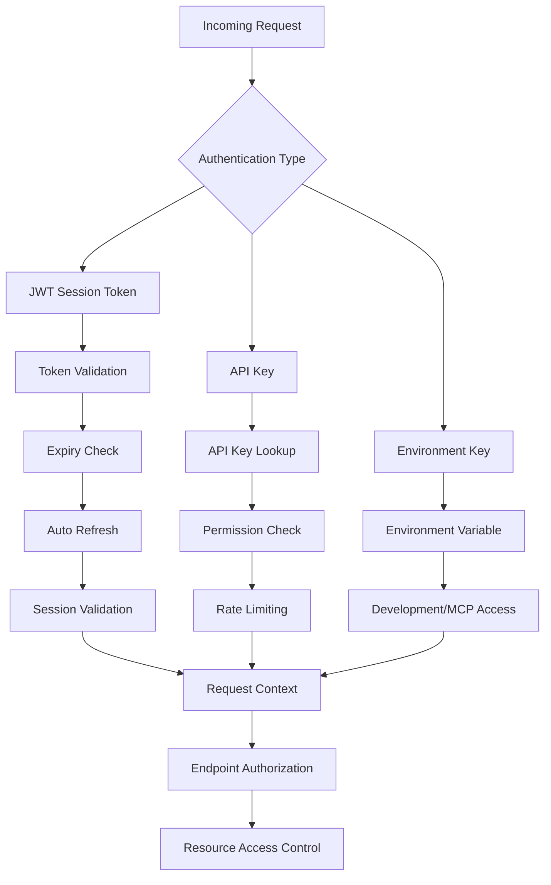
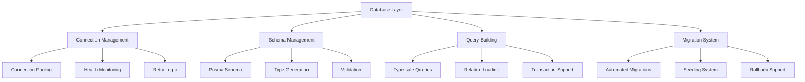
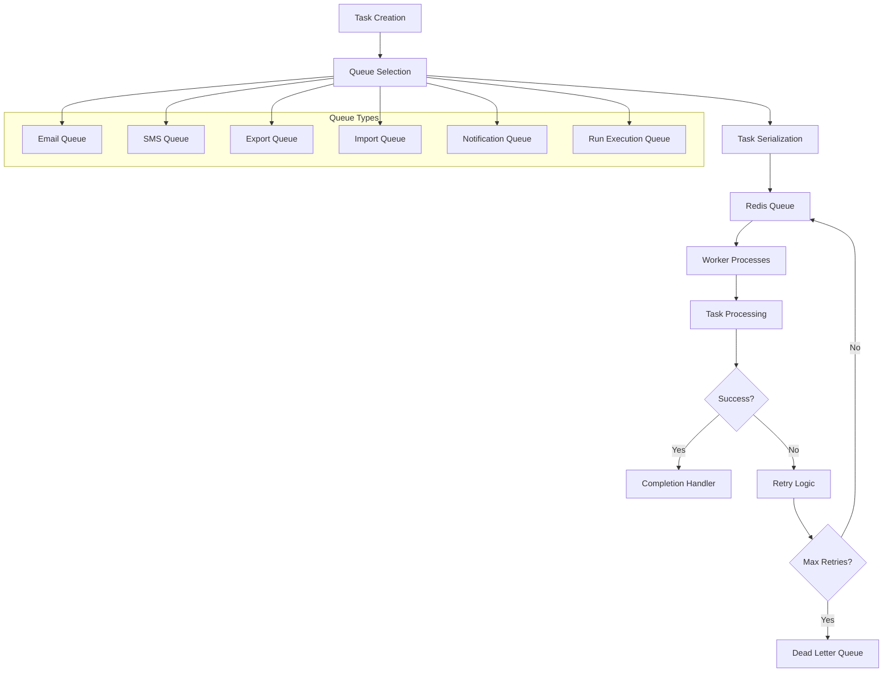
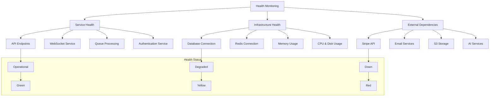

# Vrooli Server Architecture Documentation

This document provides a comprehensive overview of the Vrooli server architecture, including its design patterns, startup process, key components, and operational considerations.

## Table of Contents

- [Overview](#overview)
- [Architectural Principles](#architectural-principles)
- [Technology Stack](#technology-stack)
- [Project Structure](#project-structure)
- [Server Startup Process](#server-startup-process)
- [Core Components](#core-components)
- [Service Layer Architecture](#service-layer-architecture)
- [API & Route Organization](#api--route-organization)
- [WebSocket Architecture](#websocket-architecture)
- [Authentication & Authorization](#authentication--authorization)
- [Database Layer](#database-layer)
- [Background Processing](#background-processing)
- [Health Monitoring](#health-monitoring)
- [Security Considerations](#security-considerations)
- [Performance & Scalability](#performance--scalability)
- [Best Practices](#best-practices)

## Overview

The Vrooli server is a production-grade Node.js backend built with Express.js that orchestrates AI agents for complex task execution. It follows modern architectural patterns to ensure scalability, maintainability, and reliability.

### Key Features

- **RESTful API**: Comprehensive REST endpoints for all platform functionality
- **Real-time Communication**: WebSocket support with Socket.IO and Redis adapter for horizontal scaling
- **Background Processing**: Queue-based task processing with BullMQ and Redis
- **Multi-tenant Authentication**: JWT-based auth with API key support and multi-user sessions
- **Database Integration**: Prisma ORM with PostgreSQL for robust data management
- **Horizontal Scaling**: Redis-powered scaling across multiple server instances
- **Health Monitoring**: Comprehensive health checks for all services and dependencies

## Architectural Principles

Vrooli follows these core architectural principles:

1. **Separation of Concerns**: Clear boundaries between authentication, business logic, data access, and presentation layers
2. **Service-Oriented Design**: Modular services with well-defined interfaces and responsibilities
3. **Event-Driven Architecture**: Asynchronous processing through events and message queues
4. **Horizontal Scalability**: Redis-based clustering and stateless design
5. **Security by Design**: Multiple authentication methods, input validation, and secure defaults
6. **Observability**: Comprehensive logging, health monitoring, and error tracking

## Technology Stack

### Core Technologies
- **Runtime**: Node.js with TypeScript (ESM modules)
- **Web Framework**: Express.js with custom middleware architecture
- **Database**: PostgreSQL with Prisma ORM
- **Caching & Queues**: Redis with ioredis client
- **Real-time**: Socket.IO with Redis adapter
- **Authentication**: JWT tokens with custom session management

### External Services
- **File Storage**: AWS S3 compatible storage
- **Payments**: Stripe integration
- **Email/SMS**: Multiple provider support
- **AI Services**: Pluggable AI service registry
- **Message Queues**: BullMQ for background processing

## Project Structure

```
packages/server/src/
├── auth/                 # Authentication & authorization
│   ├── auth.ts          # Main auth service and middleware
│   ├── jwt.ts           # JWT token management
│   ├── session.ts       # Session management
│   └── ...
├── db/                  # Database layer
│   ├── provider.ts      # Database connection & provider
│   ├── schema.prisma    # Prisma schema
│   └── migrations/      # Database migrations
├── endpoints/           # REST API endpoints
│   ├── rest.ts         # Main REST API setup
│   ├── logic/          # Business logic for endpoints
│   ├── generated/      # Auto-generated GraphQL-style resolvers
│   └── helpers/        # Endpoint helper utilities
├── services/            # Business logic services
│   ├── health.ts       # Health monitoring service
│   ├── stripe.ts       # Payment processing
│   ├── billing.ts      # Billing operations
│   ├── embedding.ts    # AI embedding service
│   ├── bus.ts          # Event bus service
│   └── ...
├── sockets/             # WebSocket handling
│   ├── io.ts           # Socket.IO server with Redis clustering
│   └── rooms/          # WebSocket room handlers
├── tasks/               # Background job processing
│   ├── queues.ts       # Queue management
│   ├── queueFactory.ts # Queue factory and configuration
│   └── [task-types]/   # Individual task processors
├── middleware/          # Express middleware
├── utils/               # Utility functions
├── validators/          # Input validation
├── models/              # Data models and types
├── events/              # Logging and error handling
├── app.ts              # Express application setup
├── server.ts           # HTTP server configuration
└── index.ts            # Main entry point
```

## Server Startup Process

The server initialization follows a carefully orchestrated sequence to ensure all dependencies are properly initialized:



### Startup Sequence Details

1. **Environment Validation**: Checks for required environment variables (JWT keys, database URLs, etc.)
2. **ID Generator**: Initializes Snowflake ID generator with worker ID for distributed systems
3. **Database Connection**: Connects to PostgreSQL via Prisma and handles seeding/migrations
4. **Redis Services**: Initializes cache and queue services with connection pooling
5. **Middleware Chain**: Sets up authentication, CORS, health checks, and request parsing
6. **External Services**: Configures Stripe webhooks and MCP (Model Context Protocol)
7. **API Routes**: Dynamically loads and registers all REST endpoints
8. **WebSocket Server**: Initializes Socket.IO with Redis adapter for clustering
9. **Error Handling**: Sets up global error handlers and unhandled rejection catchers

## Core Components

### Express Application (`app.ts`)

The minimal Express application instance that gets enhanced by the main server setup:

```typescript
import express from "express";
export const app = express();
```

### HTTP Server (`server.ts`)

Configures the HTTP server, URLs, and ports:



### Main Entry Point (`index.ts`)

The orchestration layer that initializes all services and middleware in the correct order.

## Service Layer Architecture

Vrooli implements a robust service layer pattern that separates business logic from controllers:



### Service Patterns

**Singleton Pattern**: Most services use the singleton pattern for resource management:

```typescript
export class AuthService {
    private static instance: AuthService;
    
    static get(): AuthService {
        if (!AuthService.instance) {
            AuthService.instance = new AuthService();
        }
        return AuthService.instance;
    }
}
```

**Service Registration**: Services are registered in a central registry for dependency injection and lifecycle management.

## API & Route Organization

The REST API follows a modular, resource-based organization:



### Endpoint Definition Pattern

Each endpoint is defined as a tuple containing:

1. **Route Definition**: HTTP method and path pattern
2. **Business Logic Handler**: Core processing function
3. **Data Selection Schema**: Fields to return (GraphQL-style)
4. **Upload Configuration**: File handling rules (optional)

```typescript
type EndpointTuple = readonly [
    EndpointDef,                    // Route and method
    ApiEndpoint<never, unknown>,    // Handler function
    PartialApiInfo,                 // Data selection
    UploadConfig?                   // File upload config
];
```

### File Upload Handling

The server includes sophisticated file upload handling with:

- **Multi-field Support**: Different file types per field
- **Size Limits**: Per-field and total limits
- **MIME Type Validation**: Allowlisted file extensions
- **Image Processing**: Automatic resizing and optimization
- **S3 Integration**: Direct upload to cloud storage

## WebSocket Architecture

The WebSocket implementation is designed for horizontal scaling and real-time communication:



### Key Features

- **Redis Adapter**: Enables horizontal scaling across multiple server instances
- **Connection Management**: Tracks user and session connections locally
- **Room-based Communication**: Organized by chat, run, and user rooms
- **Authentication**: JWT-based authentication for WebSocket connections
- **Graceful Disconnection**: Handles expired tokens and session revocation

### Socket Service Architecture

```typescript
export class SocketService {
    public userSockets: Map<string, Set<string>>;      // User ID -> Socket IDs
    public sessionSockets: Map<string, Set<string>>;   // Session ID -> Socket IDs
    public io: Server;                                 // Socket.IO server instance
}
```

## Authentication & Authorization

Vrooli implements a sophisticated multi-layered authentication system:



### Authentication Methods

1. **JWT Session Tokens**: For user sessions with automatic refresh
2. **API Keys**: For programmatic access with configurable permissions
3. **Environment Keys**: For development and system-to-system communication

### Token Management

- **Access Tokens**: Short-lived (15 minutes) for API access
- **Refresh Tokens**: Long-lived (30 days) for token renewal
- **Multi-user Sessions**: Support for switching between accounts
- **Token Size Optimization**: Automatic user data truncation for token limits

### Security Features

- **Safe Origin Validation**: CORS protection and origin checking
- **Rate Limiting**: Per-IP and per-user rate limiting
- **Session Revocation**: Immediate session invalidation across all devices
- **Permission Caching**: Redis-cached API key permissions for performance

## Database Layer

The database layer uses Prisma ORM with PostgreSQL and includes:



### Key Features

- **Connection Pooling**: Efficient database connection management
- **Type Safety**: Full TypeScript integration with generated types
- **Migration System**: Automated schema versioning and deployment
- **Seeding**: Consistent data initialization with retry logic
- **Health Monitoring**: Database connection and query performance tracking

## Background Processing

Background tasks are handled through a sophisticated queue system:



### Queue Features

- **Multiple Queue Types**: Specialized queues for different task types
- **Priority Support**: High, normal, and low priority processing
- **Retry Logic**: Exponential backoff with configurable max retries
- **Dead Letter Queues**: Failed job collection and analysis
- **Health Monitoring**: Queue depth and processing metrics
- **Concurrency Control**: Configurable worker concurrency per queue

## Health Monitoring

Comprehensive health monitoring covers all system components:



### Monitoring Features

- **Service-level Health**: Individual service status tracking
- **Dependency Monitoring**: External service availability checking
- **Performance Metrics**: Response times, throughput, and error rates
- **Alerting**: Automatic notifications for service degradation
- **Caching**: Intelligent health check caching to reduce overhead

## Security Considerations

Security is implemented at multiple layers:

### Input Validation & Sanitization
- Schema-based validation for all inputs
- SQL injection prevention through parameterized queries
- XSS protection through output encoding
- File upload restrictions and malware scanning

### Access Control
- Role-based access control (RBAC)
- Resource-level permissions
- API rate limiting
- CORS policy enforcement

### Data Protection
- Encryption at rest and in transit
- PII data handling compliance
- Secure session management
- Regular security audits

## Performance & Scalability

### Horizontal Scaling
- Stateless server design
- Redis-based session sharing
- Load balancer compatibility
- WebSocket clustering support

### Caching Strategy
- Multi-level caching (Redis, application, CDN)
- Smart cache invalidation
- Performance-critical path optimization
- Database query optimization

### Resource Management
- Connection pooling for all services
- Memory usage monitoring
- CPU utilization tracking
- Automatic resource cleanup

## Best Practices

### Code Organization
- Clear separation of concerns
- Consistent naming conventions
- Comprehensive TypeScript typing
- Modular architecture with clear interfaces

### Error Handling
- Centralized error handling
- Structured error responses
- Comprehensive logging
- Graceful degradation

### Testing Strategy
- Unit tests for business logic
- Integration tests for API endpoints
- End-to-end tests for critical flows
- Performance testing for scalability

### Deployment & Operations
- Health check endpoints
- Graceful shutdown handling
- Rolling deployment support
- Monitoring and alerting

### Documentation
- API documentation (OpenAPI/Swagger)
- Architecture decision records
- Runbook documentation
- Code comments and inline documentation

---

This documentation provides a comprehensive overview of the Vrooli server architecture. For specific implementation details, refer to the individual component documentation and source code comments. 