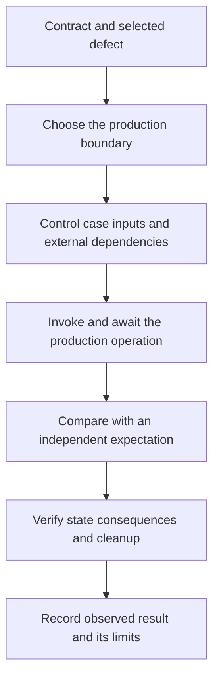

# Authoring tests that protect behavior

Use this guide to choose a test boundary, arrange data, and specify an observable
outcome. [Testing](../TESTING.md) owns execution and validation scope. The
[shared harness cookbook](/scenarios/template-manager/docs/internal/TESTING-RECIPES.md)
owns harness recipes. A passing test supports its stated claim for the inputs it
exercises; it does not prove the feature correct for all inputs.

## Construction rules and review judgment

A behavioral test must invoke the production operation it names, control the
inputs that select the case, and assert an independently justified outcome.
Await the operation and asynchronous assertions. Release resources and restore
mutable state even when an assertion fails. Declare external prerequisites and
test kind when the test needs a live dependency.

These are authoring requirements. They do not claim that every rule is enforced
automatically. Reviewers choose relevant input partitions and assess whether the
oracle would detect a plausible defect. Static tools can establish narrower
construction facts only within their declared support profiles.

Write the case as: **given** specific inputs and dependency behavior, **when** the
real operation runs, **then** an observable result or state change occurs.
Keep the case readable in one place; extract setup only when it obscures that
claim or repeats across callers.

## Start with the defect the test should detect

A success assertion that accepts HTTP 200 or 500 passes when the service breaks.
Configure a successful service response and assert the exact success status plus
meaningful fields. In a separate case, configure a dependency error and assert the
specified error mapping. Merely checking JSON content type does not distinguish
those behaviors.

For example, the template service test
`TestService_Create_RejectsEmptyTitle` invokes the real service, checks the typed
invalid-title error, and checks that the repository received no create call.
`TestService_Create_PropagatesRepoError` configures an error separately.
[CODE: templates/scenarios/react-vite/api/internal/notes/service_test.go]

Limitation: a service test does not establish HTTP status mapping. That claim
needs a handler test. Conversely, a handler with a fake service does not prove
the service's business policy.

## Choose the boundary

| Claim | Keep real | Substitute outside the claim |
|---|---|---|
| Pure value or policy | Function and relevant policy | Nothing unless it consumes an external input |
| Service orchestration | Service and its domain rules | Repository or external service boundary |
| Repository behavior | Repository, production schema, relevant database engine | Unrelated external services |
| Handler mapping | Decoder, response mapping, relevant middleware | Service boundary |
| Streaming or connection behavior | Handler and real socket transport | External business dependencies |
| UI feature | Component and relevant providers | API boundary |
| Cross-layer contract | Every layer named by the claim | Dependencies outside that contract |



An in-memory repository fake is appropriate for a service test. It cannot prove
SQL constraints, query behavior, or transactions. The template's SQLite tests
apply the production schemas through `EnsureSchemas` and exercise the real
repository. Use the actual PostgreSQL substrate for a PostgreSQL-specific claim;
SQLite is not a substitute for its constraint or transaction semantics.
[CODE: templates/scenarios/react-vite/api/internal/notes/sqlite_test.go]

Use an HTTP recorder when only decoding and response mapping matter. Use a real
test server for flushing, streaming, hijacking, connection closure, and middleware
behavior that depends on transport capabilities. A recorder's convenience does
not establish socket behavior, and a socket is unnecessary for pure mapping.

Do not wait for a scenario-wide architecture score before testing a pure function.
Introduce a narrow seam when the selected behavior needs control of a real
external dependency. Avoid interfaces and harness packages without a consumer.

## Independent expectations, literals, and constants

An oracle is independent when the contract justifies the expected result without
reusing the behavior under test. A literal can be the clearest specification:

```ts
// Illustrative arithmetic contract, not an exported project helper.
expect(add(2, 3)).toBe(5);
```

Import enums, schema types, selector identities, and constants when they are
incidental setup. Pin expected wire values independently when compatibility is the
claim. Do not export a private production constant merely to make a test use it.
Importing the constant under test as the expected value makes a policy test
insensitive to a wrong default.

Separate configurable enforcement from the promised default:

```ts
// Illustrative injectable capacity policy.
const service = createService({ limit: 3 });
expect(service.accept(makeItems(3))).toBe(true);
expect(service.accept(makeItems(4))).toBe(false);

// A separate test pins the product's default promise.
expect(defaultPolicy.maxItems).toBe(3);
```

The template independently pins its default list limit and checks that a supplied
positive limit passes through. Those are different contracts, not duplicated
assertions. [CODE: templates/scenarios/react-vite/api/internal/notes/service_test.go]

Limitation: a literal that merely freezes today's incidental output is a brittle
change detector. Explain the contract when the reason for the value is not clear.

## Factories and malformed input

Use typed factories for valid common data. Return fresh objects, including fresh
nested mutable values. Keep defaults deterministic. Put case-defining IDs,
statuses, quantities, and timestamps at the call site. Do not use current time or
unseeded randomness as defaults, or silently turn an invalid override into a valid
one. Keep feature factories beside their feature; share only cross-feature shapes.
[CODE: templates/scenarios/react-vite/ui/src/test-utils/factories.ts]

```ts
// Illustrative membership contract; status is case-defining, other fields are setup.
const active = makeAccount({ id: "active-account", status: "active" });
const disabled = makeAccount({ id: "disabled-account", status: "disabled" });
const result = selectActiveAccounts([disabled, active]);
expect(result.map(account => account.id)).toEqual(["active-account"]);
```

Use canonical schema constructors for valid wire messages when that improves
fidelity. Use explicit raw payloads for missing fields, wrong types, invalid JSON,
unknown enum values, and compatibility fixtures. For example, a decoder test can
send `{"title":` and assert its specified malformed-body response and zero service
calls. A typed factory cannot honestly express that byte sequence.

Limitation: schema-valid data does not imply domain-valid input. A schema can
allow an empty title that the service must reject. Test those boundaries separately.

## Counts, membership, ordering, and pagination

A length assertion is correct when cardinality is the claim. For a filter, equal
length can hide the wrong members; assert identities as in the example above.
For an ordered result, assert the ordered identities. For an unordered contract,
compare membership without imposing order. Assert duplicates or their removal
only when the contract specifies that behavior.

For pagination, check the selected IDs and contractual total/page metadata. A
request returning fewer rows does not by itself prove that the requested limit or
cursor was honored. The template distinguishes descending order from list limits.
[CODE: templates/scenarios/react-vite/api/internal/notes/sqlite_test.go]

Limitation: renaming `3` to `EXPECTED_LENGTH` changes neither the oracle nor the
protection. Name a value when its role needs explanation, not to satisfy a style
heuristic.

## UI, i18n, and accessibility

Prefer semantic role and accessible-name queries when they express what the user
can perceive or do. In cimode, use the typed string-key registry for
copy-independent wiring. Use shared selector identities when semantic queries
cannot express the target; do not require test IDs categorically.

For example, a refresh interaction should find the refresh button by role/name,
await the click, then observe the refreshed state. A cimode key proves that the
component asks for the expected message; it does not prove translated copy.

Use real locales to test interpolation, zero/one/other plural forms, fallback,
and missing-key behavior. Choose inputs or locales whose outputs differ so a
broken branch cannot pass accidentally. Catalog imports can verify display wiring.
Pin copy independently only when that exact copy is a product requirement.
[CODE: templates/scenarios/react-vite/ui/src/features/health/HealthCard.test.tsx]
[CODE: templates/scenarios/react-vite/ui/src/i18n/format.test.ts]

Render through the shared provider helper with a fresh query client. Restore
locale, mocks, and DOM state. Test the helper's retry, error-reporting, and cache
configuration because it can mask a feature failure. Keep feature-specific waits
inside feature tests.
[CODE: templates/scenarios/react-vite/ui/src/test-utils/renderWithProviders.test.tsx]

An awaited axe helper is an assertion boundary. Its imported name alone does not
prove its implementation, and an analyzer that cannot resolve it must retain that
uncertainty. DOM axe checks provide partial accessibility evidence; jsdom cannot
prove visual contrast or the complete keyboard/screen-reader experience.
[CODE: templates/scenarios/react-vite/ui/src/layout/AppShell.a11y.test.tsx]

## Negative cases and state consequences

Select relevant equivalence classes at the external-input boundary. Consider
empty and malformed input, missing identity, threshold pairs, duplicates, invalid
state transitions, dependency errors, cancellation, and retries. Include Unicode,
overflow, non-finite numbers, dates, or concurrency where the contract admits them.
Explain omitted high-impact classes; do not duplicate an exhaustive matrix at
every layer or construct impossible typed inputs solely to add case names.

For invalid input, check both the specified error and prohibited effects. The
template empty-title case asserts `CreateCalls == 0`; this detects a write before
validation. A rejected request that returns the right error after persisting data
is still broken. For retry, assert bounded attempts and idempotent effects where
promised. For cancellation, assert the terminal result and which state changes
are allowed. A log saying “handled safely” proves none of these properties.
[CODE: templates/scenarios/react-vite/api/internal/notes/service_test.go]
[CODE: templates/scenarios/react-vite/api/internal/notes/attachments_service_test.go]

## Async work and isolation

Await returned promises, async assertions, and user interactions. Synchronize on
an observable event or completion signal; a sleep is not evidence that background
work finished. For deadline or retry policy, inject a clock and advance it across
the boundary. Ensure callback assertions run before the test ends and propagate
failures to the owning test. Use each runner's supported concurrent assertion
context; do not share mutable counters among concurrent tests.

Use temporary directories and cleanup hooks for files. Inject environment values,
time, randomness, and external clients when they determine behavior. Declare live
integrations and their prerequisites separately from hermetic unit tests. A
policy requesting network denial or filesystem isolation needs actual host/runner
enforcement; unsupported capability must remain explicit rather than silently
downgrading to ambient access.

Limitation: an isolated directory alone does not deny network access. Restoring an
environment variable does not make parallel mutations of process-global state safe.

## Helpers, fakes, and special test kinds

Share repeated setup when it makes the behavioral claim easier to read. Keep
domain-local builders and fakes local. Use shared harnesses for transport and
other cross-domain mechanics. Preserve argument visibility when forwarding is
the claim. A helper should not calculate the expected result by copying the
production algorithm, hide a failure, or wait for unrelated feature behavior.

Some test kinds have different oracles. A compile-time interface check proves
type compatibility; a smoke test can prove startup or absence of panic; a race
test uses the race detector; a property test uses an independent invariant and
reproducible generated inputs. State these limited claims explicitly. A
compile-only test does not need a cosmetic runtime assertion. A property that
compares an implementation with itself proves no independent behavior.

TestMain and registered subprocess helpers are lifecycle machinery, not ordinary
behavioral cases. A real integration may skip for a declared missing prerequisite;
record that as skipped coverage. An empty skip-only placeholder is debt, not an
implemented integration.

## Read assessment evidence accurately

Distinguish violation, checked_clean, unknown, and not_applicable. Status is
independent of severity and enforcement. Checked_clean means only that the named
supported check completed without finding its defect. Missing input, unsupported
versions, unresolved helpers, and incomplete traversal remain unknown. Static
Skip syntax is not an observed runtime skip. A planned command is not execution.

Native assertion activity also has limits. The preserved Vitest probe observed
that bare expect calls and assertions in hooks can satisfy its assertion-activity
setting. That does not prove meaningful, completed assertions in the case body.
Run conformance probes for each declared support profile; do not extrapolate a
runner observation to another version or alternate assertion library.

Report discovered and assessed denominators, unknown cases, input identities, and
limitations. Neither coverage percentage nor construction compliance measures
universal behavioral adequacy. Apply documented exceptions through the policy
owner; show their scope, reason, owner, evidence, and revisit trigger. An exception
changes enforcement, not the underlying observation.

## Review protection and extend the reference suite

Before claiming a repair, run its unmodified control. Apply a selected plausible
fault only in disposable source. Confirm that the intended behavioral assertion
fails, then retain the control, fault identity, and failure explanation. Build
errors, timeouts, and unrelated failures are not detected behavioral faults.
Equivalent or out-of-contract mutations need an explicit exclusion rationale.

The source links above identify existing examples to review and extend. They are
not claims that all examples already pass this guide. The reference work is:

| Rule family | Executable reference location | Extension and proof |
|---|---|---|
| Independent defaults, service errors, no writes | Template notes/service_test.go and notes/attachments_service_test.go | Injected list policy, independent default, zero/one-byte boundary and rejected-write assertions; selected fault proof remains separate |
| Real schema, ordering, limits | Template notes/sqlite_test.go | Prove constraint/query behavior against the production schema |
| Fresh typed data | Template UI test-utils/factories.test.ts | Nested mutation isolation and invalid-override preservation |
| Fresh protobuf fixtures | Template internal/testutil/fixtures/health_test.go | Reused options copy nested messages and preserve deliberately invalid overrides |
| Malformed wire and mapping | Template handlers/notes/connect_handler_test.go | Raw malformed/missing fields, exact errors and no service mutation |
| Malformed multipart wire | Template handlers/notes/attachments_handler_test.go | Raw invalid MIME headers bypass the valid-body helper and never call the domain service |
| i18n and semantic interaction | Template HealthCard.test.tsx and i18n/format.test.ts | Role/name interactions, real plural/fallback/missing-key cases |
| Async/provider isolation | Template test-utils/renderWithProviders.test.tsx | Cancellation, completion and fresh cache/locale state |
| Scoped console diagnostics | Template test-utils/console.test.ts and components/ErrorBoundary.test.tsx | Unmatched errors fail, expected errors are scoped to the throwing render, and methods restore on failure |
| Static/runtime limits | `unit-health calibrate run --partition development` and the committed adapter-conformance corpus; reviewed comparison at `api/internal/testquality/testdata/holdouts/assertion-observation-go-v1/` | Unknown helpers, hooks, bare expect and supported test-kind exceptions remain explicit; `unit-health calibrate corpus` reports implemented, retired, and specified counts |

The health fixture example stays executable in the template source but is
excluded from generated scenarios. Add a response factory only when tests
need reusable response inputs; handler tests can decode the actual response.

Reference generation and adoption belong to Template Manager. Template examples
teach construction; remove starter product vocabulary when building a real
scenario. Keep the cookbook linked to executable source, and update the examples
and their evidence when a rule changes.

[CODE: templates/scenarios/react-vite/api/internal/testutil/fixtures/health_test.go]
[CODE: templates/scenarios/react-vite/api/handlers/notes/attachments_handler_test.go]
