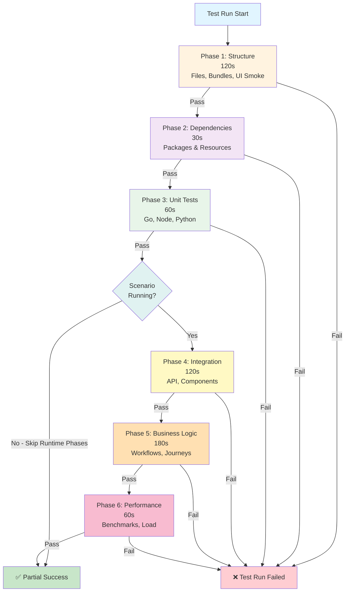

# Phased Testing Architecture

## Overview

Vrooli uses a comprehensive phased testing approach to ensure scenario quality, reliability, and consistency across all implementations. This modern, extensible framework supports multiple programming languages and testing methodologies.

## Recommended Directory Structure

```bash
scenario/
├── test/
│   ├── run-tests.sh           # Phase orchestrator with test type support
│   ├── phases/                # Phased testing approach
│   │   ├── test-structure.sh    # <15s - Files, config validation
│   │   ├── test-dependencies.sh # <30s - Resource health checks
│   │   ├── test-unit.sh        # <60s - Unit test orchestrator
│   │   ├── test-integration.sh # <120s - Integration test orchestrator
│   │   ├── test-business.sh    # <180s - Business logic validation
│   │   └── test-performance.sh  # <60s - Performance baselines
│   ├── unit/                  # Unit test specifications per language
│   │   ├── go.sh              # Runs Go unit tests (*_test.go)
│   │   ├── node.sh            # Runs Node.js/Jest tests
│   │   └── python.sh          # Runs Python tests (if applicable)
│   ├── cli/                   # CLI-specific testing
│   │   ├── *.bats             # BATS tests for CLI functionality
│   │   └── run-cli-tests.sh   # CLI test orchestrator
│   └── fixtures/              # Shared test data and mocks
├── api/
│   ├── main.go
│   ├── main_test.go           # Go unit tests (standard Go convention)
│   └── services/
│       └── *_test.go          # Service unit tests
├── cli/
│   ├── my-cli
│   └── my-cli.bats            # CLI BATS tests
└── .vrooli/
    └── service.json           # Modern configuration
```

### Shared Orchestrator Wrapper

Each phased scenario now sources the shared runner in `scripts/scenarios/testing/shell/runner.sh` from a thin `test/run-tests.sh` wrapper. The wrapper is responsible for initialising the runner, registering phases/test types, and defining presets. Example:

```bash
#!/bin/bash
set -euo pipefail

TEST_DIR="$(cd "$(dirname "${BASH_SOURCE[0]}")" && pwd)"
SCENARIO_DIR="$(cd "$TEST_DIR/.." && pwd)"
APP_ROOT="${APP_ROOT:-$(builtin cd "${SCENARIO_DIR}/../.." && builtin pwd)}"

source "${APP_ROOT}/scripts/lib/utils/log.sh"
source "${APP_ROOT}/scripts/scenarios/testing/shell/runner.sh"

testing::runner::init \
  --scenario-name "my-scenario" \
  --scenario-dir "$SCENARIO_DIR" \
  --test-dir "$TEST_DIR" \
  --log-dir "$TEST_DIR/artifacts"

testing::runner::register_phase --name structure --script "$TEST_DIR/phases/test-structure.sh" --timeout 120 --requires-runtime true
testing::runner::register_phase --name integration --script "$TEST_DIR/phases/test-integration.sh" --timeout 120 --requires-runtime true
testing::runner::register_test_type --name go --handler "$TEST_DIR/unit/run-unit-tests.sh --skip-node --skip-python" --kind command

testing::runner::define_preset quick "structure integration"

testing::runner::execute "$@"
```

By keeping scenario-specific wiring in this wrapper and delegating orchestration to the shared runner, future scenarios can adopt the phased architecture without duplicating the CLI parsing and lifecycle logic.

## Testing Phases

### Phase 1: Structure (120 seconds)
**Purpose**: Validate project structure and required files
**Location**: `test/phases/test-structure.sh`

- Verifies presence of essential files:
  - `.vrooli/service.json` (service configuration)
  - `README.md` (documentation)
  - `PRD.md` (requirements)
- Validates directory structure
- Runs the Browserless UI smoke harness: rebuilds if bundles are stale, opens the production UI via Browserless, waits for `@vrooli/iframe-bridge` to signal readiness, captures screenshots/console/network traces, and fails fast when Browserless is offline
- Smoke results are stored under `coverage/<scenario>/ui-smoke/` and available via `vrooli scenario ui-smoke <name>` when debugging locally
- Override the harness only when needed via `.vrooli/testing.json → structure.ui_smoke` (defaults enable it automatically and suit most scenarios)
- Detailed usage + troubleshooting live in [docs/testing/guides/ui-smoke.md](../guides/ui-smoke.md)
- Because Browserless needs to load the running scenario, the structure phase now requests runtime auto-start before validations begin.

### Phase 2: Dependencies (30 seconds)
**Purpose**: Verify all dependencies are available and compatible
**Location**: `test/phases/test-dependencies.sh`

- Language-specific dependency checks (Go, Node.js, Python)
- Resource availability validation
- Version compatibility verification
- Security vulnerability scanning

## Phase Dependency Graph



**Key Points**:
- Phases run **sequentially** - each depends on previous phase success
- **Runtime-dependent phases** (integration, business, performance) can be skipped if scenario not running
- **Fail-fast mode** stops at first failure
- Each phase has **strict timeout** enforcement

### Phase 3: Unit (60 seconds)
**Purpose**: Execute unit tests for all code components
**Location**: `test/phases/test-unit.sh`

**⚠️ Important**: Phase scripts are **orchestrators** that run tests, NOT test sources themselves. For requirement validation:
- ❌ **Don't reference**: `test/phases/test-unit.sh` (orchestration script)
- ✅ **Do reference**: Actual test files (`api/**/*_test.go`, `ui/src/**/*.test.tsx`)

See [Validation Best Practices](../guides/validation-best-practices.md#valid-vs-invalid-validation-sources) for details.

- **Go**: Uses `testing` package with coverage analysis
  - Coverage thresholds: 80% warning, 70% error
  - Comprehensive handler testing with `httptest`
  - Gorilla Mux router testing for URL variables
- **Node.js**: Jest/Vitest framework support
- **Python**: pytest integration
- **Coverage tracking** with configurable thresholds

#### Automatic Requirement Tracking

The unit phase automatically correlates test results with requirements using the `@vrooli/vitest-requirement-reporter` for Vitest tests and built-in parsing for Go tests.

**How it works**:

1. **Developer tags tests** with `[REQ:ID]` in test names:
   ```typescript
   // Vitest example
   describe('projectStore [REQ:BAS-WORKFLOW-PERSIST-CRUD]', () => {
     it('fetches projects', async () => { ... });
   });
   ```

   ```go
   // Go example
   func TestWorkflowCRUD(t *testing.T) {
       t.Run("creates workflow [REQ:BAS-WORKFLOW-PERSIST-CRUD]", func(t *testing.T) {
           // test implementation
       })
   }
   ```

2. **Test frameworks extract tags** during test execution:
   - Vitest: Custom reporter extracts tags and generates `coverage/vitest-requirements.json`
   - Go: Test output parser extracts tags from test names

3. **Phase orchestrator parses output** and reports to phase helpers via `testing::phase::add_requirement()`

4. **Phase results include per-requirement evidence** in `coverage/phase-results/unit.json`:
   ```json
   {
     "id": "BAS-WORKFLOW-PERSIST-CRUD",
     "status": "passed",
     "evidence": "Node test ✓ PASS REQ:BAS-WORKFLOW-PERSIST-CRUD (7 tests, 9ms); Go: api/services/workflow_service_test.go:TestWorkflowCRUD"
   }
   ```

5. **Requirements registry auto-syncs** after test run via `scripts/requirements/report.js --mode sync`

**Benefits**:
- No manual requirement tracking in test scripts
- Precise test-to-requirement traceability
- Automatic validation entry management
- Consolidated evidence from multiple test frameworks

**Configuration**:

For Vitest tests, add the reporter to `vite.config.ts`:
```typescript
import RequirementReporter from '@vrooli/vitest-requirement-reporter';

export default defineConfig({
  test: {
    reporters: [
      'default',
      new RequirementReporter({
        outputFile: 'coverage/vitest-requirements.json',
        emitStdout: true,  // Required for phase integration
        verbose: true,
      }),
    ],
  },
});
```

For Go tests, no configuration needed - the parser automatically extracts `[REQ:ID]` tags from test output.

See [@vrooli/vitest-requirement-reporter](../../../packages/vitest-requirement-reporter/README.md) for complete details.

### Phase 4: Integration (120 seconds)
**Purpose**: Test component interactions and external integrations
**Location**: `test/phases/test-integration.sh`

**⚠️ Important**: This phase script orchestrates integration tests but should NOT be used as a requirement validation ref. For integration requirement validation:
- ❌ **Don't reference**: `test/phases/test-integration.sh` (orchestration script)
- ❌ **Don't reference**: `test/cli/*.bats` (CLI wrapper tests, not business logic validation)
- ✅ **Do reference**: E2E automation workflows (`test/playbooks/**/*.json`)
- ✅ **Do reference**: API integration tests if they exist (`api/**/*_test.go` with integration tags)

- **Dynamic port discovery** using `vrooli scenario port` command
- API endpoint testing (health, core endpoints)
- UI accessibility validation
- CLI integration testing with BATS (for CLI validation, not requirement validation)
- Database connectivity verification
- Resource integration testing
- **Browser Automation Studio workflows** - Declarative UI testing (see [UI Automation with BAS](../guides/ui-automation-with-bas.md))

### Phase 5: Business (180 seconds)
**Purpose**: Validate end-to-end business workflows
**Location**: `test/phases/test-business.sh`

- **Complete business workflow testing**
- CRUD operations validation
- Data persistence verification
- Error handling and edge cases
- Inter-scenario integration testing
- CLI business workflow validation

### Phase 6: Performance (60 seconds)
**Purpose**: Benchmark performance and resource usage
**Location**: `test/phases/test-performance.sh`

- Load testing
- Memory usage analysis
- Response time benchmarks
- Resource utilization monitoring

## Key Implementation Learnings

### 1. Port Discovery System
**Problem**: Hardcoded ports in tests broke when scenarios used dynamic allocation
**Solution**: Use the `vrooli scenario port` command for dynamic discovery

```bash
# Get dynamic ports using vrooli command
API_PORT=$(vrooli scenario port "$scenario_name" API_PORT)
UI_PORT=$(vrooli scenario port "$scenario_name" UI_PORT)

# Build URLs
API_BASE_URL="http://localhost:$API_PORT"
UI_BASE_URL="http://localhost:$UI_PORT"
```

**Benefits**:
- Tests work across all environments
- No hardcoded port dependencies
- Leverages existing vrooli infrastructure
- Consistent with CLI patterns

### 2. Centralized Testing Library
**Location**: `/scripts/scenarios/testing/`
**Structure**:
```
lib/testing/
├── shell/                   # Sourceable shell libraries
│   ├── core.sh             # Scenario detection, configuration
│   ├── connectivity.sh     # API/UI connectivity testing
│   ├── dependencies.sh     # Unified dependency validation
│   └── phase-helpers.sh    # Phase lifecycle management
├── unit/                    # Language-specific test runners
│   ├── run-all.sh          # Universal test runner
│   ├── go.sh               # Go-specific testing
│   ├── node.sh             # Node.js testing
│   └── python.sh           # Python testing
└── templates/               # Copy-and-customize templates
    └── go/                  # Go testing templates
        ├── test_helpers.go.template
        └── error_patterns.go.template
```

**Key Features**:
- Language-agnostic interface
- Consistent coverage reporting
- Configurable thresholds
- Verbose mode support

### 3. Requirement Traceability
- `testing::phase::init` reads the scenario requirement registry under `requirements/` to determine which requirement IDs each phase is responsible for. Missing coverage triggers warnings by default and can be promoted to hard failures by exporting `TESTING_REQUIREMENTS_ENFORCE=1` (or `VROOLI_REQUIREMENTS_ENFORCE=1`).
- Unit and integration phases write per-phase summaries to `coverage/phase-results/<phase>.json`, enabling downstream tooling (like `scripts/requirements/report.js`) to surface live requirement coverage.
- `testing::phase::run_workflow_yaml` executes YAML-defined automations (documents stored under `automation/`) and automatically updates requirement state. Workflows declare CLI commands, optional timeouts, and success patterns in a human-readable manifest.
- The Go and Node.js unit runners now recognize `REQ:<ID>` markers in test names/output (`t.Run("... [REQ:ABC-123]", ...)`, `it('...', { /* ... */ })`) and record pass/fail/skipped statuses for each tagged requirement.
- Validate the registry schema with `node scripts/requirements/validate.js --scenario <name>` (invoked automatically by `vrooli scenario status <name>`). This command ensures every requirement/validation entry matches the JSON schema before phases attempt to load coverage expectations.
- Bootstrap modular registries with `vrooli scenario requirements init <scenario>`, which copies the shared `requirements/` scaffold (parents, child modules, BAS workflow hooks) so PRD-level requirements are traceable from day one.

### 3. Service Configuration

All scenarios configure testing via `.vrooli/service.json`:

```json
{
  "test": {
    "description": "Comprehensive phased testing using modern testing architecture",
    "steps": [{
      "name": "run-comprehensive-tests",
      "run": "test/run-tests.sh",
      "description": "Execute comprehensive phased testing"
    }]
  }
}
```

### 4. Template System Integration  
**Location**: `/scripts/scenarios/templates/react-vite/`
**Approach**: Single comprehensive template rather than parallel templates
**Benefits**:
- Consistent testing patterns
- Easy scenario bootstrapping
- Standardized directory structure

## Testing Best Practices

### 1. Test Structure
- **Atomic phases**: Each phase should be independently executable
- **Time constraints**: Respect phase time limits for CI/CD efficiency
- **Error isolation**: Failures in one phase shouldn't affect others
- **Cleanup**: Always implement proper test data cleanup

### 2. Coverage Standards
- **Go**: Minimum 70% coverage (80% warning threshold)
- **Node.js**: Framework-specific standards
- **Python**: pytest coverage integration
- **Tracking**: Use `// AI_CHECK: TASK_ID=count | LAST: YYYY-MM-DD` for maintenance

### 3. Port Management
- **Never hardcode ports** in test files
- **Always use** `vrooli scenario port` command
- **Implement fallbacks** for port discovery failures
- **Test connectivity** before running business logic tests

### 4. Test Data Management
- **Use unique identifiers** (timestamps, UUIDs) for test data
- **Implement cleanup functions** with trap handlers
- **Pre-cleanup** existing test data before creating new
- **Isolate test environments** to prevent conflicts

## File Organization

### Required Files per Scenario
```
scenario/
├── .vrooli/
│   └── service.json          # Modern service configuration
├── test/
│   ├── run-tests.sh         # Main test orchestrator
│   └── phases/
│       ├── test-structure.sh
│       ├── test-dependencies.sh  
│       ├── test-unit.sh
│       ├── test-integration.sh
│       ├── test-business.sh
│       └── test-performance.sh
├── README.md                # Comprehensive documentation
└── PRD.md                   # Product requirements
```

### Template Usage
```bash
# Create new scenario from template
vrooli scenario generate react-vite --id new-scenario --display-name "New Scenario" --description "One sentence summary"
cd scenarios/new-scenario

# Customize for specific scenario
# - Update .vrooli/service.json
# - Modify test phases for scenario-specific logic
# - Update README.md and PRD.md
```

## Common Patterns

### 1. Test Phase Header
```bash
#!/bin/bash
# Phase description - <time_limit seconds>
set -euo pipefail

APP_ROOT="${APP_ROOT:-$(builtin cd "${BASH_SOURCE[0]%/*}/../../../.." && builtin pwd)}"
source "${APP_ROOT}/scripts/lib/utils/log.sh"

echo "=== Phase Name ===" 
start_time=$(date +%s)
error_count=0
test_count=0
```

### 2. Unit Test Orchestration

#### Go Unit Tests
```bash
#!/bin/bash
# Run Go unit tests with coverage analysis
set -euo pipefail

echo "Running Go unit tests..."
cd api/
go test -v -timeout=60s -coverprofile=coverage.out ./...
coverage_percent=$(go tool cover -func=coverage.out | grep total | awk '{print $3}' | sed 's/%//')

if (( $(echo "$coverage_percent < 70" | bc -l) )); then
    echo "❌ Coverage below 70%: ${coverage_percent}%"
    exit 1
fi
echo "✅ Go tests passed with ${coverage_percent}% coverage"
```

#### Node.js Unit Tests
```bash
#!/bin/bash
# Run Node.js/Jest tests if UI has them
set -euo pipefail

echo "Running Node.js unit tests..."
if [ -f "ui/package.json" ] && grep -q '"test":' ui/package.json; then
    cd ui/ && npm test --passWithNoTests --coverage
    echo "✅ Node.js unit tests completed"
else
    echo "ℹ️  No Node.js tests configured, skipping"
fi
```

#### CLI BATS Tests
```bash
#!/bin/bash
# Orchestrate all CLI BATS tests
set -euo pipefail

echo "Running CLI BATS tests..."
test_count=0
failed_count=0

for bats_file in test/cli/*.bats; do
    if [ -f "$bats_file" ]; then
        echo "Running $(basename "$bats_file")..."
        if bats "$bats_file" --tap; then
            ((test_count++))
        else
            ((failed_count++))
            ((test_count++))
        fi
    fi
done

if [ $failed_count -eq 0 ]; then
    echo "✅ All $test_count CLI test suites passed"
else
    echo "❌ $failed_count of $test_count CLI test suites failed"
    exit 1
fi
```

### 3. Using Testing Libraries
```bash
# Source the modules you need
source "$APP_ROOT/scripts/scenarios/testing/shell/connectivity.sh"
source "$APP_ROOT/scripts/scenarios/testing/shell/dependencies.sh"

# Get dynamic URLs using the testing library
scenario_name=$(basename "$(cd "$(dirname "${BASH_SOURCE[0]}")/../.." && pwd)")
API_BASE_URL=$(testing::connectivity::get_api_url "$scenario_name")

# Test connectivity
testing::connectivity::test_api "$scenario_name"

# Validate all dependencies
testing::dependencies::validate_all --scenario "$scenario_name"
```

### 4. Test Result Reporting
```bash
# Performance check and summary
end_time=$(date +%s)
duration=$((end_time - start_time))

if [ $error_count -eq 0 ]; then
    log::success "✅ Phase completed successfully in ${duration}s"
    log::success "   Tests run: $test_count, Errors: $error_count"
else
    log::error "❌ Phase failed with $error_count errors in ${duration}s"
    exit 1
fi
```

## Advanced Features

### 1. Multi-Language Support
The architecture automatically detects and tests multiple languages within a single scenario:
- **Go**: API services with comprehensive handler testing
- **Node.js**: UI components and services
- **Python**: Data processing and utilities

### 2. Resource Integration Testing
Automatic testing of configured resources:
```bash
# Parse .vrooli/service.json for enabled resources
enabled_resources=$(jq -r '.dependencies.resources | to_entries[] | select(.value.required == true or .value.enabled == true) | .key' .vrooli/service.json)
```

### 3. CLI Testing Integration  
Built-in BATS (Bash Automated Testing System) support:
- Automatic CLI binary detection
- Help/version command validation
- Comprehensive CLI workflow testing
- **CRITICAL**: Safe teardown patterns to prevent data loss
  - Always validate variables before rm operations
  - Set critical variables before skip conditions
  - Use the safe BATS template from `scripts/scenarios/testing/templates/bats/`

### 4. Connectivity Testing
Robust connectivity verification:
- Health endpoint testing
- Timeout handling
- Retry mechanisms
- Service dependency validation

## Safety Guidelines

### Preventing Data Loss in Test Scripts

**CRITICAL**: Test scripts can accidentally delete important files if not properly written. Follow these safety measures:

1. **Use the Safety Linter**:
   ```bash
   scripts/scenarios/testing/lint-tests.sh test/
   ```

2. **BATS Teardown Safety**:
   ```bash
   # ✅ SAFE - Always validate variables
   teardown() {
       if [ -n "${TEST_FILE_PREFIX:-}" ]; then
           rm -f "${TEST_FILE_PREFIX}"* 2>/dev/null || true
       fi
   }
   
   # ❌ DANGEROUS - Can delete everything if variable is empty
   teardown() {
       rm -f "${TEST_FILE_PREFIX}"*
   }
   ```

3. **Setup Function Order**:
   ```bash
   setup() {
       # ✅ Set variables BEFORE skip conditions
       export TEST_FILE_PREFIX="/tmp/test-$$"
       
       if ! command -v my-cli >/dev/null 2>&1; then
           skip "CLI not installed"
       fi
   }
   ```

4. **Use Safe Templates**:
   ```bash
   cp scripts/scenarios/testing/templates/bats/cli-test.bats.template \
      test/cli/my-cli.bats
   ```

For comprehensive safety guidelines, see [Safety Guidelines](../safety/GUIDELINES.md).

## Troubleshooting

### Common Issues

1. **Test Scripts Deleting Files**:
   - **Symptom**: Running tests deletes Makefile, README.md, or other important files
   - **Cause**: BATS teardown with uninitialized variables causing `rm -f *`
   - **Solution**: 
     - Always set critical variables before skip conditions
     - Validate variables in teardown: `if [ -n "${VAR:-}" ]; then`
     - Use the safety linter: `scripts/scenarios/testing/lint-tests.sh`
   - **Prevention**: Use safe BATS template from `scripts/scenarios/testing/templates/bats/`

2. **Port Discovery Failures**:
   - Ensure scenario is running: `vrooli scenario start <name>`
   - Check service configuration: `.vrooli/service.json`
   - Verify port variables are properly defined

3. **Coverage Threshold Violations**:
   - Review untested code paths
   - Add comprehensive test cases
   - Consider adjusting thresholds for specific scenarios

4. **Integration Test Failures**:
   - Verify all resources are healthy: `vrooli resource status`
   - Check scenario logs: `vrooli scenario logs <name>`
   - Validate service dependencies

5. **Business Test Customization**:
   - Each scenario must implement specific business logic tests
   - Use provided templates as starting points
   - Follow established patterns for consistency

## Requirement Reporting

- Maintain a requirements registry (`requirements/`) within each scenario to map PRD items to validation assets (phases, unit tests, workflows, automations).
- `testing::phase::init` automatically inspects this file and warns when a phase omits expected requirement updates; export `TESTING_REQUIREMENTS_ENFORCE=1` (or `VROOLI_REQUIREMENTS_ENFORCE=1`) to treat missing coverage as a failure.
- Use `REQ:<ID>` markers in Go/Vitest test names to have the unit runners automatically register requirement outcomes.
- Execute YAML-defined automations through `testing::phase::run_workflow_yaml --file automation/...` to keep requirement evidence aligned with phase results.
- Run `vrooli scenario requirements report <name> --fail-on-critical-gap` to generate Markdown/JSON/trace reports and enforce critical requirement completion in CI pipelines.

## Test Directory Structure & Validation Sources

**Critical Distinction**: Phase orchestration scripts vs. test source files.

### Directory Roles

```
test/
├── phases/           ❌ ORCHESTRATION - Run tests, don't contain them
│   ├── test-unit.sh         # Runs Go tests, Vitest tests
│   ├── test-integration.sh  # Runs API tests, BAS workflows
│   └── test-business.sh     # Runs business logic tests
│
├── cli/              ❌ CLI WRAPPER TESTS - Test CLI, not business logic
│   └── *.bats               # BATS tests for CLI commands
│
├── unit/             ❌ TEST INFRASTRUCTURE - Language-specific runners
│   └── run-unit-tests.sh    # Orchestrates language-specific test suites
│
└── playbooks/        ✅ E2E TEST SOURCES - Actual test content
    └── **/*.json            # BAS automation workflows
```

### For Requirement Validation

When referencing tests in `requirements/**/*.json`, use **actual test sources**, not orchestration:

**❌ Don't reference**:
- `test/phases/test-unit.sh` - Orchestration script with zero traceability
- `test/phases/test-integration.sh` - Orchestration script with zero traceability
- `test/cli/*.bats` - CLI wrapper tests (tests CLI layer, not business logic)
- `test/unit/run-unit-tests.sh` - Test runner infrastructure

**✅ Do reference**:
- `api/**/*_test.go` - Go unit tests (actual test sources)
- `ui/src/**/*.test.tsx` - Vitest/Jest tests (actual test sources)
- `test/playbooks/**/*.json` - BAS e2e workflows (actual test sources)

### Why test/phases/ is Rejected

Phase scripts **orchestrate** test execution but don't contain test logic:

```bash
# test/phases/test-unit.sh
go test ./api/...  # ← Runs tests, doesn't contain them
npm test           # ← Runs tests, doesn't contain them

# Referencing this provides ZERO traceability to:
# - Which specific test validates the requirement?
# - What does the test actually verify?
# - How can I find/fix the test if it fails?
```

**Solution**: Reference the actual test files being executed:
- `api/handlers/projects_test.go:TestProjectCreate`
- `ui/src/components/ProjectModal.test.tsx`

### Why test/cli/ is Rejected

CLI tests validate the **CLI wrapper**, not underlying business logic:

```bash
# test/cli/profile-operations.bats
@test "vrooli profile create accepts --name flag" {
  run vrooli profile create --name test
  [ "$status" -eq 0 ]
}

# Problem: Tests CLI interface, not:
# - API validation logic
# - Database persistence
# - Error handling
```

**The CLI should be a thin wrapper** over the API. Use:
- API tests for business logic validation
- E2E automation for full workflow validation
- CLI tests only for CLI-specific concerns (flag parsing, help text)

### Validation Diversity Requirements

Critical requirements (P0/P1) must have **≥2 AUTOMATED layers**:
- Full-stack: API + UI OR API + E2E OR UI + E2E
- API-only: API + E2E
- UI-only: UI + E2E

**Manual validations don't count** toward diversity (they're temporary measures).

See [Validation Best Practices](../guides/validation-best-practices.md) for complete guidelines.

## Future Enhancements

1. **Parallel Execution**: Support for running phases in parallel where safe
2. **Test Reporting**: Enhanced reporting with metrics and trends
3. **Load Testing**: Advanced performance testing capabilities
4. **Security Testing**: Automated security vulnerability assessment
5. **Cross-Scenario Testing**: Integration testing between multiple scenarios

## Conclusion

The phased testing architecture provides a robust, scalable foundation for ensuring scenario quality across the Vrooli ecosystem. By following these patterns and practices, teams can deliver reliable, well-tested scenarios that integrate seamlessly with the broader platform.

The key to success is consistency in implementation and continuous refinement based on real-world usage patterns and requirements.
