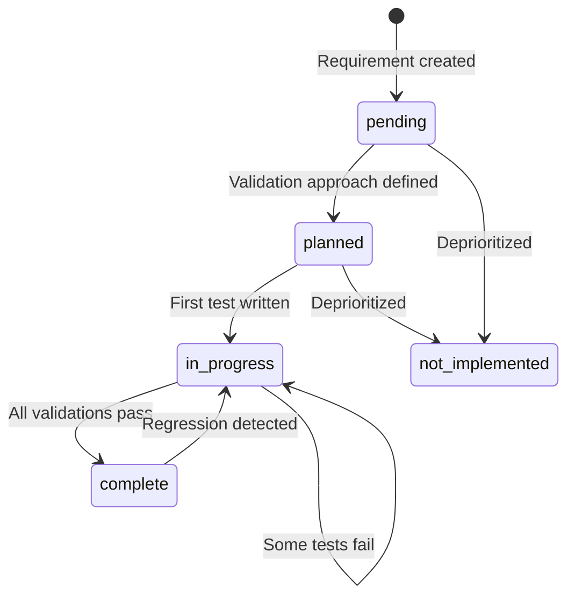

# Requirement Flow Architecture

## Overview

This document describes the **end-to-end flow** of requirements through Vrooli's testing system, from PRD definition to automated validation status updates. Understanding this flow is essential for AI agents working on scenario completion, as it shows how product requirements connect to technical implementation and test validation.

## The Complete Flow

```mermaid
graph TB
    subgraph "1. Requirement Definition"
        PRD[PRD.md<br/>Product Requirements]
        REQ_DEF[requirements/*.json<br/>Requirement Registry]
        PRD -->|defines| REQ_DEF
    end

    subgraph "2. Test Implementation"
        DEV[Developer writes tests]
        TAG[Tags tests with [REQ:ID]]
        VITEST[Vitest tests<br/>ui/src/**/*.test.ts]
        GO_TEST[Go tests<br/>api/*_test.go]
        BAS_WF[BAS workflows<br/>test/playbooks/*.json]

        DEV --> TAG
        TAG --> VITEST
        TAG --> GO_TEST
        TAG --> BAS_WF
    end

    subgraph "3. Test Execution"
        PHASE_RUN[Phase test execution<br/>test/phases/test-*.sh]
        VITEST_RPT[vitest-requirement-reporter<br/>Extracts [REQ:ID] tags]
        GO_PARSE[Go test parser<br/>Extracts [REQ:ID] from output]
        BAS_EXEC[BAS workflow executor<br/>testing::playbooks::bas::run_workflow]

        VITEST --> VITEST_RPT
        GO_TEST --> GO_PARSE
        BAS_WF --> BAS_EXEC
        VITEST_RPT --> PHASE_RUN
        GO_PARSE --> PHASE_RUN
        BAS_EXEC --> PHASE_RUN
    end

    subgraph "4. Result Collection"
        PHASE_HELPER[testing::phase::add_requirement<br/>Records requirement status]
        PHASE_RESULT[coverage/phase-results/*.json<br/>Phase-specific results]

        PHASE_RUN --> PHASE_HELPER
        PHASE_HELPER --> PHASE_RESULT
    end

    subgraph "5. Auto-Sync"
        SYNC[scripts/requirements/report.js --mode sync]
        UPDATE[Updates requirement registry]

        PHASE_RESULT --> SYNC
        SYNC --> UPDATE
        UPDATE --> REQ_DEF
    end

    subgraph "6. Reporting"
        REPORT[scripts/requirements/report.js]
        OUTPUT[JSON/Markdown reports<br/>Coverage metrics]

        REQ_DEF --> REPORT
        PHASE_RESULT --> REPORT
        REPORT --> OUTPUT
    end

    style PRD fill:#e1f5ff
    style REQ_DEF fill:#fff3e0
    style TAG fill:#f3e5f5
    style PHASE_RESULT fill:#e8f5e9
    style UPDATE fill:#fff9c4
```

## Detailed Stage Breakdown

### Stage 1: Requirement Definition

**Input**: Product requirements from PRD.md
**Output**: Structured requirement registry

**Process**:
1. Product manager/developer identifies requirements from PRD
2. Creates requirement definition in registry with:
   - Unique ID (e.g., `BAS-WORKFLOW-PERSIST-CRUD`)
   - PRD reference (`prd_ref` field pointing to PRD section)
   - Criticality (P0/P1/P2)
   - Initial status (usually `pending` or `planned`)
   - Empty validation array (to be filled by tests)

**Files**:
- `PRD.md` - Product requirements document
- `requirements/index.json` - Parent requirements (modular approach)
- `requirements/**/*.json` - Child requirement modules by feature

**Key Insight**: Requirements are **declarative** - they describe *what* needs to be validated, not *how*.

### Stage 2: Test Implementation

**Input**: Requirement IDs from registry
**Output**: Tests tagged with requirement IDs

**Process**:
1. Developer writes tests (unit, integration, or UI automation)
2. Tags tests with `[REQ:ID]` in test names or descriptions
3. Test frameworks automatically associate tests with requirements

**Tag Placement**:

**Vitest (TypeScript/React)**:
```typescript
// Suite-level tagging (all tests inherit)
describe('projectStore [REQ:BAS-WORKFLOW-PERSIST-CRUD]', () => {
  it('fetches projects', async () => { ... });  // Inherits tag
  it('creates project', async () => { ... });   // Inherits tag
});

// Test-level tagging (specific requirement)
it('validates input [REQ:BAS-PROJECT-VALIDATION]', async () => { ... });
```

**Go Tests**:
```go
func TestWorkflowCRUD(t *testing.T) {
    t.Run("creates workflow [REQ:BAS-WORKFLOW-PERSIST-CRUD]", func(t *testing.T) {
        // Test implementation
    })
}
```

**BAS Workflows**:
```json
{
  "id": "BAS-PROJECT-CREATE-SUCCESS",
  "validation": [
    {
      "type": "automation",
      "ref": "test/playbooks/ui/projects/new-project-create.json",
      "phase": "integration",
      "status": "implemented"
    }
  ]
}
```

**Key Insight**: Tagging happens **once** during test authoring. No manual tracking required after that.

### Stage 3: Test Execution

**Input**: Tagged tests
**Output**: Test results with requirement associations

**Process**:

1. **Phase test runs** via `test/run-tests.sh` → `test/phases/test-unit.sh`

2. **Test frameworks execute**:
   - Vitest runs UI tests with `vitest-requirement-reporter`
   - Go runs API tests with verbose output
   - BAS workflows execute via `testing::playbooks::bas::run_workflow`

3. **Tag extraction**:
   - **Vitest**: Custom reporter extracts `[REQ:ID]` from test names, generates `ui/coverage/vitest-requirements.json`
   - **Go**: Phase script parses test output for `[REQ:ID]` patterns, populates `TESTING_GO_REQUIREMENT_STATUS` array
   - **BAS**: Workflow execution results mapped to requirements via `testing::phase::add_requirement()`

4. **Universal runner consolidates** via `scripts/scenarios/testing/unit/run-all.sh`:
   - Merges results from all languages
   - Calls `testing::phase::add_requirement()` for each requirement
   - Highest-priority status wins (failed > skipped > passed)

**Example vitest-requirements.json**:
```json
{
  "generated_at": "2025-11-05T15:30:00.000Z",
  "scenario": "browser-automation-studio",
  "phase": "unit",
  "total_tests": 24,
  "passed_tests": 22,
  "requirements": [
    {
      "id": "BAS-WORKFLOW-PERSIST-CRUD",
      "status": "passed",
      "evidence": "ui/src/stores/__tests__/projectStore.test.ts",
      "test_count": 7
    }
  ]
}
```

**Key Insight**: Multiple test frameworks feed into **one unified requirement tracking system**.

### Stage 4: Result Collection

**Input**: Requirement statuses from test execution
**Output**: Phase result files with per-requirement evidence

**Process**:

1. Phase script calls `testing::phase::add_requirement()` for each tracked requirement:
   ```bash
   testing::phase::add_requirement \
     --id "BAS-WORKFLOW-PERSIST-CRUD" \
     --status passed \
     --evidence "Node test ✓ PASS REQ:BAS-WORKFLOW-PERSIST-CRUD (7 tests)"
   ```

2. Phase helper accumulates requirements and writes results to `coverage/phase-results/<phase>.json`:
   ```json
   {
     "phase": "unit",
     "scenario": "browser-automation-studio",
     "status": "passed",
     "timestamp": "2025-11-05T15:30:45.000Z",
     "tests": 24,
     "errors": 0,
     "requirements": [
       {
         "id": "BAS-WORKFLOW-PERSIST-CRUD",
         "status": "passed",
         "criticality": "P0",
         "evidence": "Node test ✓ PASS REQ:BAS-WORKFLOW-PERSIST-CRUD (7 tests, 9ms); Go: api/services/workflow_service_test.go:TestWorkflowCRUD"
       }
     ]
   }
   ```

**Key Insight**: Phase results provide **live evidence** of which requirements are validated and how.

### Stage 5: Auto-Sync

**Input**: Phase result files + vitest requirements JSON
**Output**: Updated requirement registry

**Process**:

1. After test run completes, `test/run-tests.sh` invokes:
   ```bash
   node scripts/requirements/report.js \
     --scenario browser-automation-studio \
     --mode sync
   ```

2. Report script:
   - Reads all `coverage/phase-results/*.json` files
   - Reads `ui/coverage/vitest-requirements.json` (if exists)
   - For each requirement mentioned in results:
     - **Adds missing validation entries** if test file exists but not in registry
     - **Updates validation status** based on test results (passed → `implemented`, failed → `failing`)
     - **Updates requirement status** based on validation roll-up
   - Writes updated registry back to disk

3. Auto-sync behavior controlled by `_metadata.auto_sync_enabled`:
   ```json
   {
     "_metadata": {
       "auto_sync_enabled": true,  // Allow auto-sync
       "last_synced_at": "2025-11-05T15:31:00.000Z"
     }
   }
   ```

**Example transformation**:

**Before sync**:
```json
{
  "id": "BAS-WORKFLOW-PERSIST-CRUD",
  "status": "planned",
  "validation": []
}
```

**After sync** (test passed):
```json
{
  "id": "BAS-WORKFLOW-PERSIST-CRUD",
  "status": "in_progress",
  "validation": [
    {
      "type": "test",
      "ref": "ui/src/stores/__tests__/projectStore.test.ts",
      "phase": "unit",
      "status": "implemented",
      "notes": "Auto-added from vitest evidence"
    },
    {
      "type": "test",
      "ref": "api/services/workflow_service_test.go",
      "phase": "unit",
      "status": "implemented",
      "notes": "Auto-added from Go test evidence"
    }
  ]
}
```

**Key Insight**: Requirement files **automatically stay in sync** with test reality. No manual updates needed.

### Stage 6: Reporting

**Input**: Requirement registry + phase results
**Output**: Human/machine-readable reports

**Process**:

1. Generate reports on-demand:
   ```bash
   # JSON report for CI/CD
   node scripts/requirements/report.js \
     --scenario browser-automation-studio \
     --format json \
     --output coverage/requirements-report.json

   # Markdown report for humans
   node scripts/requirements/report.js \
     --scenario browser-automation-studio \
     --format markdown
   ```

2. Report includes:
   - **Summary**: Total requirements, status breakdown, criticality gap
   - **Per-requirement details**: Status, validations, evidence
   - **Metrics**: Coverage ratio, P0/P1 completion rate

**Example JSON output**:
```json
{
  "generatedAt": "2025-11-05T15:35:00.000Z",
  "scenario": "browser-automation-studio",
  "summary": {
    "total": 21,
    "byStatus": {
      "complete": 18,
      "in_progress": 3,
      "pending": 0
    },
    "criticalityGap": 3,
    "coverageRatio": 0.857
  },
  "requirements": [
    {
      "id": "BAS-WORKFLOW-PERSIST-CRUD",
      "status": "complete",
      "criticality": "P0",
      "liveStatus": "passed",
      "validationCount": 3,
      "evidence": ["unit phase passed", "integration phase passed"]
    }
  ]
}
```

**Key Insight**: Reports provide **point-in-time snapshots** and **metrics** for CI/CD gates.

## Data Flow Summary

| Stage | Input | Output | Automation Level |
|-------|-------|--------|------------------|
| Definition | PRD requirements | `requirements/*.json` | Manual |
| Implementation | Requirement IDs | Tagged tests | Manual (one-time) |
| Execution | Tagged tests | Test results + requirement status | **Automatic** |
| Collection | Test results | `coverage/phase-results/*.json` | **Automatic** |
| Auto-Sync | Phase results | Updated registry | **Automatic** |
| Reporting | Registry + results | JSON/Markdown reports | On-demand |

**80% of the flow is automated** after initial tagging.

## Integration Points

### Vitest Integration

**Package**: `@vrooli/vitest-requirement-reporter` (workspace package)

**Configuration** (`vite.config.ts`):
```typescript
import RequirementReporter from '@vrooli/vitest-requirement-reporter';

export default defineConfig({
  test: {
    reporters: [
      'default',
      new RequirementReporter({
        outputFile: 'coverage/vitest-requirements.json',
        emitStdout: true,  // CRITICAL: Phase script parses stdout
        verbose: true,
      }),
    ],
  },
});
```

**How it works**:
1. Vitest runs tests
2. Reporter intercepts test events (start, pass, fail)
3. Extracts `[REQ:ID]` tags from test names (with inheritance from describe blocks)
4. Generates JSON file + emits parseable stdout
5. Phase script reads JSON and/or parses stdout
6. Calls `testing::phase::add_requirement()` for each requirement

**See**: [vitest-requirement-reporter README](../../../packages/vitest-requirement-reporter/README.md)

### Go Test Integration

**Mechanism**: Text parsing of `go test -v` output

**How it works**:
1. Phase script runs `go test -v ./...`
2. Parser scans output for lines containing `[REQ:ID]`
3. Associates status (PASS/FAIL) with requirement ID
4. Populates `TESTING_GO_REQUIREMENT_STATUS` associative array
5. Universal runner reads array and calls `testing::phase::add_requirement()`

**Implementation**: `scripts/scenarios/testing/unit/go.sh`

### BAS Workflow Integration

**Mechanism**: Declarative `type: automation` validation in requirements

**How it works**:
1. Requirement declares automation validation:
   ```json
   {
     "type": "automation",
     "ref": "test/playbooks/ui/projects/create.json",
     "phase": "integration"
   }
   ```
2. Phase script loads expected validations via `testing::phase::init()`
3. Calls `testing::phase::run_bas_automation_validations()`
4. Helper executes each workflow via BAS API
5. Results feed into `testing::phase::add_requirement()`

**See**: [UI Automation with BAS](../guides/ui-automation-with-bas.md)

## Requirement Status State Machine



**Status Definitions**:
- `pending`: Requirement identified but not yet planned
- `planned`: Validation approach defined, tests not written
- `in_progress`: At least one test exists (auto-detected by sync)
- `complete`: All validations passing (auto-updated by sync)
- `not_implemented`: Requirement deprioritized or deferred

**Key**: Status transitions happen **automatically** during sync based on test results.

## Criticality System

Requirements use **P0/P1/P2** criticality levels:

- **P0** (Critical): Must have for MVP, blocks release
- **P1** (Important): Should have, significant UX impact
- **P2** (Nice-to-have): Could have, polish/convenience

**Criticality Gap**: Count of P0/P1 requirements with `status != complete`

**CI/CD Gate**:
```bash
# Fail build if critical requirements incomplete
node scripts/requirements/report.js \
  --scenario my-scenario \
  --fail-on-critical-gap
```

## File Locations Reference

| Purpose | Path | Format | When Updated |
|---------|------|--------|--------------|
| PRD | `PRD.md` | Markdown | Manual |
| Requirements (modular) | `requirements/index.json` | JSON | Manual + auto-sync |
| Child requirements | `requirements/**/*.json` | JSON | Manual + auto-sync |
| Vitest config | `ui/vite.config.ts` | TypeScript | Manual |
| Vitest results | `ui/coverage/vitest-requirements.json` | JSON | Every test run |
| Go tests | `api/*_test.go` | Go | Manual |
| BAS workflows | `test/playbooks/**/*.json` | JSON | Export from BAS UI |
| Phase scripts | `test/phases/test-*.sh` | Bash | Manual |
| Phase results | `coverage/phase-results/*.json` | JSON | Every phase run |
| Requirement schema | `scripts/requirements/schema.json` | JSON Schema | Manual |
| Sync script | `scripts/requirements/report.js` | Node.js | Manual |

## Troubleshooting the Flow

### Requirements not updating after test run

**Symptom**: Tests pass but requirement status stays `planned`

**Possible causes**:
1. Auto-sync not running (check `test/run-tests.sh` has sync call)
2. `auto_sync_enabled: false` in requirement metadata
3. No phase results generated (check `coverage/phase-results/`)
4. Requirement ID mismatch (test tag doesn't match registry)

**Solution**:
```bash
# Manually trigger sync
node scripts/requirements/report.js --scenario <name> --mode sync

# Verify phase results exist
ls -la coverage/phase-results/

# Check for tag mismatches
grep -r "REQ:" ui/src api/ test/
```

### Vitest tags not detected

**Symptom**: Tagged tests run but don't appear in phase results

**Possible causes**:
1. Reporter not configured in `vite.config.ts`
2. `emitStdout: false` in reporter config
3. Test file not in coverage include path
4. Tag format incorrect (needs `[REQ:ID]` pattern)

**Solution**: See [vitest-requirement-reporter troubleshooting](../../../packages/vitest-requirement-reporter/README.md#troubleshooting)

### BAS workflows not executing

**Symptom**: Automation validations skipped during integration phase

**Possible causes**:
1. Workflow JSON file missing/not exported
2. BAS scenario not running
3. Phase script missing `--requires-runtime true`
4. Validation `ref` path incorrect

**Solution**: See [UI Automation troubleshooting](../guides/ui-automation-with-bas.md)

## Best Practices

### 1. Tag tests as you write them

Don't wait until the end to add requirement tags. Tag tests immediately so auto-sync works from day one.

### 2. Use suite-level tags when possible

```typescript
// ✅ Good - One tag covers all related tests
describe('projectStore [REQ:BAS-WORKFLOW-PERSIST-CRUD]', () => {
  it('fetches', () => { ... });
  it('creates', () => { ... });
  it('updates', () => { ... });
});

// ❌ Tedious - Repeated tags
describe('projectStore', () => {
  it('fetches [REQ:BAS-WORKFLOW-PERSIST-CRUD]', () => { ... });
  it('creates [REQ:BAS-WORKFLOW-PERSIST-CRUD]', () => { ... });
  it('updates [REQ:BAS-WORKFLOW-PERSIST-CRUD]', () => { ... });
});
```

### 3. Keep requirement IDs descriptive

```
✅ BAS-WORKFLOW-PERSIST-CRUD
✅ BAS-PROJECT-CREATE-VALIDATION
✅ BAS-EXEC-TELEMETRY-STREAM

❌ BAS-001
❌ REQUIREMENT-1
❌ TEST-WORKFLOW
```

### 4. Link PRD sections in requirements

```json
{
  "id": "BAS-WORKFLOW-PERSIST-CRUD",
  "prd_ref": "Functional Requirements > Must Have > Visual workflow builder",
  "title": "Workflows persist nodes, edges, and metadata"
}
```

Creates bidirectional traceability: PRD → requirement → tests → results.

### 5. Let auto-sync manage validation entries

Don't manually add `validation` entries unless:
- Test hasn't run yet (status: `planned`)
- Test is manual verification (type: `manual`)
- Test is external tool/service

For normal unit/integration/automation tests, let auto-sync create entries.

### 6. Review sync results after refactoring

After large refactors (file renames, test restructuring):
```bash
# Check for orphaned validations
node scripts/requirements/report.js --scenario <name> --mode sync

# Remove dead validations
node scripts/requirements/report.js --scenario <name> --mode sync --prune-stale
```

## See Also

### Related Documentation
- [Requirement Tracking Guide](../guides/requirement-tracking.md) - Complete usage guide
- [Phased Testing Architecture](PHASED_TESTING.md) - How phases work
- [UI Automation with BAS](../guides/ui-automation-with-bas.md) - BAS workflow testing
- [Requirement Schema Reference](../reference/requirement-schema.md) - JSON schema details

### Implementation
- [vitest-requirement-reporter](../../../packages/vitest-requirement-reporter/README.md) - Vitest integration package
- [phase-helpers.sh](/scripts/scenarios/testing/shell/phase-helpers.sh) - Phase lifecycle helpers
- [report.js](/scripts/requirements/report.js) - Sync and reporting tool
- [browser-automation-studio.sh](/scripts/scenarios/testing/playbooks/browser-automation-studio.sh) - BAS workflow executor

### Examples
- [browser-automation-studio requirements](/scenarios/browser-automation-studio/requirements/) - Complete modular registry
- [browser-automation-studio tests](/scenarios/browser-automation-studio/test/) - Reference test implementation
