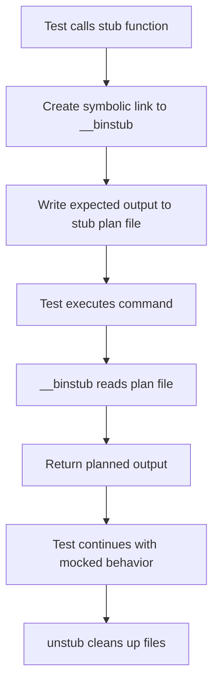

# Testing Infrastructure

> **Prerequisites**: See [Prerequisites Guide](../../devops/getting-started/prerequisites.md) for required tools installation.

This guide covers Vrooli's comprehensive testing infrastructure, including shell script testing with BATS, stubbing mechanisms, and testing workflows across different environments.

> **Note**: For broader development setup, see [Development Environment](../../devops/development-environment.md).

## Overview

Vrooli's testing infrastructure provides:

- 🧪 **Shell Script Testing**: BATS (Bash Automated Testing System) for testing shell scripts
- 🎭 **Advanced Stubbing**: Custom stubbing system for mocking external commands
- 🔄 **Test Automation**: Integrated testing workflows in CI/CD
- 📊 **Test Coverage**: Comprehensive coverage across utility functions
- 🛡️ **Quality Assurance**: Automated linting and validation

## Testing Architecture

### Test Directory Structure

```
__test/
├── __binstub             # Binary stub executable for mocking commands
├── __runTests.sh         # Test runner script
├── __stub.bash           # Stubbing framework
├── __stub.bats           # Tests for the stubbing system itself
├── __testHelper.bash     # Common test utilities and setup
└── helpers/              # BATS helper libraries
    ├── bats-support/     # Test assertion helpers
    ├── bats-assert/      # Advanced assertions
    └── bats-mock/        # Additional mocking utilities
```

## BATS Testing Framework

### What is BATS?

BATS (Bash Automated Testing System) enables testing of shell scripts using a familiar syntax:

```bash
#!/usr/bin/env bats
bats_require_minimum_version 1.5.0

@test "addition using bc" {
  result="$(echo 2+2 | bc)"
  [ "$result" -eq 4 ]
}

@test "addition using arithmetic expansion" {
  result=$((2 + 2))
  [ "$result" -eq 4 ]
}
```

### Installation and Setup

> **Note**: For complete setup instructions, see [Development Environment](../../devops/development-environment.md).

BATS is automatically installed by the setup scripts:

```bash
# Manual installation (if needed)
bash scripts/helpers/setup/bats.sh

# Or as part of full setup
./scripts/manage.sh setup
```

The installation includes:
- ✅ **BATS Core**: Main testing framework
- ✅ **BATS Support**: Extended assertion helpers  
- ✅ **BATS Assert**: Advanced assertion library
- ✅ **BATS Mock**: Command mocking utilities

## Stubbing System

### Overview

The custom stubbing system allows mocking external commands during tests:

```bash
# Example: Mock a command to return specific output
stub "curl" "HTTP/1.1 200 OK"
curl http://example.com  # Returns mocked response
unstub "curl"
```

### Stubbing Architecture



### Key Components

#### 1. __binstub
The universal binary stub that intercepts command calls:

```bash
#!/usr/bin/env bash
program_name=$(basename "$0")
plan_file="${BATS_MOCK_TMPDIR}/${program_name}-stub-plan"

if [ -f "$plan_file" ]; then
    cat "$plan_file"
    exit 0
else
    echo "No stub plan found for $program_name" >&2
    exit 74
fi
```

#### 2. Stub Functions

**Regular Stub**: For single-use commands
```bash
stub "git" "Already up to date."
git pull  # Returns mocked output
unstub "git"
```

**Repeated Stub**: For commands called multiple times
```bash
stub_repeated "docker" "Container started"
docker start container1  # Returns mocked output
docker start container2  # Returns same mocked output
unstub "docker"
```

### Exit Codes

The stubbing system uses specific exit codes:

```bash
ERROR_NO_PLAN=74        # No stub plan file found
ERROR_MISSING_TMPDIR=75 # BATS_MOCK_TMPDIR not set
ERROR_OUTPUT_FAIL=76    # Failed to output stub plan
ERROR_LOGGING_FAIL=77   # Failed to log the stub call
```

## Writing Tests

### Basic Test Structure

```bash
#!/usr/bin/env bats
bats_require_minimum_version 1.5.0

# Import test helpers
load "helpers/bats-support/load"
load "helpers/bats-assert/load"
load "__testHelper"

@test "function does what it should" {
    # Arrange
    stub "external_command" "expected output"
    
    # Act
    run your_function_under_test
    
    # Assert
    assert_success
    assert_output "expected result"
    
    # Cleanup
    unstub "external_command"
}
```

### Test Helper Usage

The `__testHelper.bash` provides common setup:

```bash
# Automatic stubbing cleanup
teardown() {
    for cmd in dig curl tput; do
        if [ -x "${BATS_MOCK_BINDIR}/$cmd" ]; then
            unstub "$cmd"
        fi
    done
    rm -rf "$BATS_TMPDIR"
}
```

### Example Test: Testing log functions

```bash
@test "log::get_color_code returns correct codes" {
    source "scripts/helpers/utils/log.sh"
    
    [ "$(log::get_color_code RED)" = "1" ]
    [ "$(log::get_color_code GREEN)" = "2" ]
    [ "$(log::get_color_code YELLOW)" = "3" ]
    [ "$(log::get_color_code INVALID)" = "0" ]
}
```

### Example Test: Testing with external commands

```bash
@test "internet::check_connection prints success when ping succeeds" {
    source "scripts/helpers/setup/internet.sh"
    
    # Mock ping to succeed
    stub "ping" ""  # Empty output, but exit code 0
    
    run internet::check_connection
    
    assert_success
    assert_output --partial "[SUCCESS]"
    
    unstub "ping"
}
```

## Advanced Testing Patterns

### Testing Error Conditions

```bash
@test "function handles errors gracefully" {
    source "your_script.sh"
    
    # Mock command to fail
    stub "failing_command" ""
    # Make the stub return error code
    echo 'exit 1' >> "${BATS_MOCK_TMPDIR}/failing_command-stub-plan"
    
    run your_function
    
    assert_failure
    assert_output --partial "Error message"
    
    unstub "failing_command"
}
```

### Testing with Environment Variables

```bash
@test "function respects environment variables" {
    source "your_script.sh"
    
    # Set environment for test
    export TEST_VAR="test_value"
    
    run your_function
    
    assert_success
    assert_output --partial "test_value"
    
    # Cleanup
    unset TEST_VAR
}
```

### Testing File Operations

```bash
@test "function creates correct files" {
    source "your_script.sh"
    
    # Create temporary directory
    temp_dir=$(mktemp -d)
    
    run your_function "$temp_dir"
    
    assert_success
    assert [ -f "$temp_dir/expected_file" ]
    
    # Cleanup
    rm -rf "$temp_dir"
}
```

## Running Tests

### Individual Test Files

```bash
# Run a specific test file
bats scripts/helpers/utils/log.bats

# Run with TAP output
bats --tap scripts/helpers/utils/log.bats

# Run with verbose output
bats --verbose-run scripts/helpers/utils/log.bats
```

### All Tests

```bash
# Run all tests using the test runner
bash __test/__runTests.sh

# Or find and run all .bats files
find scripts/ -name "*.bats" -exec bats {} \;
```

### Test Output

```
✓ log::get_color_code returns correct codes
✓ log::echo_color works with valid colors
✓ log::header prints with correct format
✓ flow::is_yes returns 0 for 'y' input
✓ flow::confirm auto-confirms when YES is 'y'

5 tests, 0 failures
```

## Integration with CI/CD

> **Note**: For detailed CI/CD configuration, see [CI/CD Pipeline](../../devops/ci-cd.md).

### GitHub Actions Integration

Tests are automatically run in CI/CD:

```yaml
# .github/workflows/test.yml
name: Test Scripts
on: [push, pull_request]

jobs:
  test-scripts:
    runs-on: ubuntu-latest
    steps:
      - uses: actions/checkout@v3
      - name: Setup BATS
        run: bash scripts/helpers/setup/bats.sh
      - name: Run Shell Script Tests
        run: bash __test/__runTests.sh
```

### Test Dependencies

> **Troubleshooting**: For testing framework issues and setup problems, see [Troubleshooting Guide](../../devops/troubleshooting.md#testing-framework-issues).

Tests require certain tools to be installed:

```bash
# Automatically installed during setup
./scripts/manage.sh setup

# Manual installation of test dependencies
bash scripts/helpers/setup/bats.sh
bash scripts/helpers/setup/shellcheck.sh
```

## Testing Best Practices

### 1. Test Organization

```bash
# Group related tests
describe "Environment Functions" {
    @test "env::in_production detects production correctly" { ... }
    @test "env::in_development detects development correctly" { ... }
}
```

### 2. Descriptive Test Names

```bash
# Good: Describes what is being tested
@test "docker::build_images fails when docker is not available"

# Bad: Too generic
@test "test docker function"
```

### 3. Arrange-Act-Assert Pattern

```bash
@test "function processes input correctly" {
    # Arrange
    local input="test input"
    stub "external_tool" "processed output"
    
    # Act
    run process_function "$input"
    
    # Assert
    assert_success
    assert_output "expected result"
    
    # Cleanup
    unstub "external_tool"
}
```

### 4. Test Independence

```bash
# Each test should be independent
setup() {
    # Reset state before each test
    export TEST_VAR=""
    rm -f /tmp/test_files
}

teardown() {
    # Clean up after each test
    unset TEST_VAR
    rm -f /tmp/test_files
}
```

### 5. Error Testing

```bash
@test "function handles missing dependencies" {
    source "your_script.sh"
    
    # Simulate missing command
    stub "missing_command" ""
    echo 'exit 127' >> "${BATS_MOCK_TMPDIR}/missing_command-stub-plan"
    
    run your_function
    
    assert_failure
    assert_output --partial "Command not found"
    
    unstub "missing_command"
}
```

## Debugging Tests

### Test Debugging Techniques

1. **Add debug output**:
```bash
@test "debugging example" {
    echo "Debug: Testing with value=$test_value" >&3
    run your_function
    echo "Debug: Function output=$output" >&3
    assert_success
}
```

2. **Check stub execution**:
```bash
# Enable stub logging
export BATS_STUB_DEBUG=1

# Check stub log
cat /tmp/bats_stub.log
```

3. **Test individual functions**:
```bash
# Test function directly in shell
source scripts/helpers/utils/log.sh
log::info "test message"
```

### Common Test Issues

1. **Path Issues**: Ensure scripts can find dependencies
2. **Environment Pollution**: Clean up environment variables
3. **Stub Conflicts**: Properly unstub commands
4. **Temp File Cleanup**: Remove temporary files in teardown

## Test Coverage

### Current Test Coverage

The testing infrastructure covers:

- ✅ **Utility Functions**: Logging, flow control, argument parsing
- ✅ **Setup Functions**: Environment detection, dependency installation
- ✅ **Stubbing System**: Self-testing stub framework
- 🔄 **Build Functions**: In development
- 🔄 **Deploy Functions**: In development

### Coverage Goals

```bash
# Aim for comprehensive coverage of:
- All utility functions in scripts/helpers/utils/
- Critical path functions in setup, build, and deploy
- Error handling and edge cases
- Integration points between components
```

## Performance Testing

### Test Execution Speed

```bash
# Time test execution
time bash __test/__runTests.sh

# Profile individual tests
bats --timing scripts/helpers/utils/log.bats
```

### Optimizing Tests

1. **Minimize external calls**: Use stubs instead of real commands
2. **Efficient setup/teardown**: Only do necessary cleanup
3. **Parallel execution**: Run independent tests in parallel

## Quality Assurance

### Linting Integration

```bash
# ShellCheck integration
shellcheck scripts/**/*.sh scripts/**/*.bats

# Automated during development
vrooli develop --target local-services
```

### Test Quality Metrics

- 📊 **Test Count**: Number of tests per component
- ⏱️ **Execution Time**: Time to run full test suite  
- 🎯 **Coverage**: Percentage of functions tested
- 🐛 **Failure Rate**: Percentage of tests failing

This comprehensive testing infrastructure ensures the reliability and maintainability of Vrooli's complex shell script automation system. 