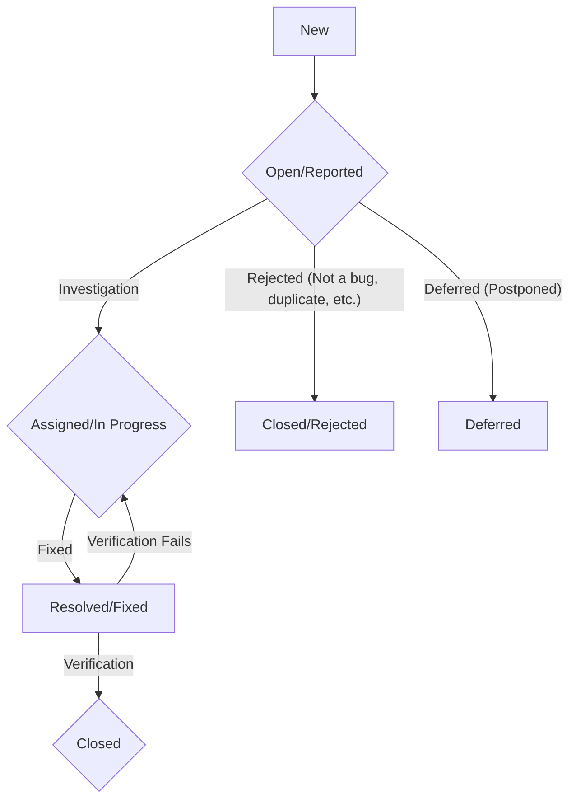

# Defect Reporting

This document outlines the process for reporting defects (bugs or issues) found within the Vrooli platform. Clear and consistent defect reporting is essential for effective tracking, prioritization, and resolution.

## 1. What Constitutes a Defect?

A defect is any variance between the actual behavior of the application and the expected behavior, requirements, or specifications. This can include:

-   Functional errors (e.g., a feature not working as intended).
-   UI/UX issues (e.g., confusing layout, broken elements, typos).
-   Performance problems (e.g., slow response times, excessive resource consumption).
-   Security vulnerabilities.
-   Documentation errors or omissions that lead to incorrect usage.
-   Failures to meet specified non-functional requirements.

## 2. Before Reporting a Defect

-   **Reproduce the Defect:** Try to reproduce the issue multiple times to ensure it's a consistent problem.
-   **Search for Duplicates:** Check the existing issue tracker (e.g., GitHub Issues, Jira, or other project management tool being used) to see if the defect has already been reported.
-   **Gather Information:** Collect all relevant details that will help developers understand and fix the issue.

## 3. How to Report a Defect

Defects should be reported using the project's designated issue tracking system. (Note: Specify the actual tool used, e.g., GitHub Issues for the Vrooli project, if applicable).

When creating a new defect report, include the following information:

-   **Title:** A clear, concise summary of the defect. Good example: "User cannot save profile changes after editing email." Bad example: "Profile broken."
-   **Description:** A detailed explanation of the defect.
    -   **Steps to Reproduce:** Provide a numbered list of clear, step-by-step instructions that reliably reproduce the issue.
    -   **Actual Results:** Describe what actually happened when the steps were followed.
    -   **Expected Results:** Describe what should have happened according to requirements or intuition.
-   **Environment:** Specify the environment where the defect was observed:
    -   Browser (name and version, e.g., Chrome 105.0.5195.125).
    -   Operating System (name and version, e.g., Windows 11, macOS Monterey 12.6).
    -   Device (if mobile or specific hardware, e.g., iPhone 13, Pixel 6).
    -   Application Version/Build (if known).
    -   Test environment (e.g., Local, Staging, Production).
-   **Severity/Priority:** (If the issue tracker supports these fields or if it's team practice)
    -   **Severity:** Indicates the impact of the defect on the application.
        -   *Critical:* Blocks core functionality, data loss, security breach.
        -   *High:* Major functionality impacted, no workaround.
        -   *Medium:* Minor functionality impacted, or a workaround exists.
        -   *Low:* Cosmetic issue, typo, minimal impact.
    -   **Priority:** Indicates the urgency of fixing the defect.
        -   *Urgent/Highest:* Must be fixed immediately.
        -   *High:* Must be fixed in the current or next release/sprint.
        -   *Medium:* Can be fixed in a future release/sprint.
        -   *Low:* Fix when time permits.
-   **Attachments:** Include screenshots, videos, log files, or any other relevant files that can help illustrate the defect.

## 4. Defect Lifecycle (Example)

Defects typically go through a lifecycle in the issue tracker:

-   **New/Open:** The defect has been reported and is awaiting review.
-   **Assigned/In Progress:** The defect has been assigned to a developer and is being worked on.
-   **Resolved/Fixed:** The developer has implemented a fix.
-   **Verification/Testing:** The fix is deployed to a test environment and needs to be verified by the reporter or QA.
-   **Closed:** The fix is verified, and the defect is considered resolved.
-   **Reopened:** If verification fails, the defect is reopened and assigned back to the developer.
-   **Rejected/Deferred:** The defect might be rejected (e.g., not a bug, works as intended, duplicate) or deferred (postponed for a later release).

## 5. Best Practices for Defect Reporting

-   **Be Specific:** Avoid vague language. Provide concrete details.
-   **Be Objective:** Report facts, not assumptions or emotions.
-   **One Defect per Report:** Report only one issue in each defect report to make tracking easier.
-   **Use Clear Language:** Write in a way that is easy for everyone to understand.
-   **Review Before Submitting:** Check for clarity, completeness, and typos before submitting the report.

Effective defect reporting is a collaborative effort that significantly contributes to the quality of the Vrooli platform. 