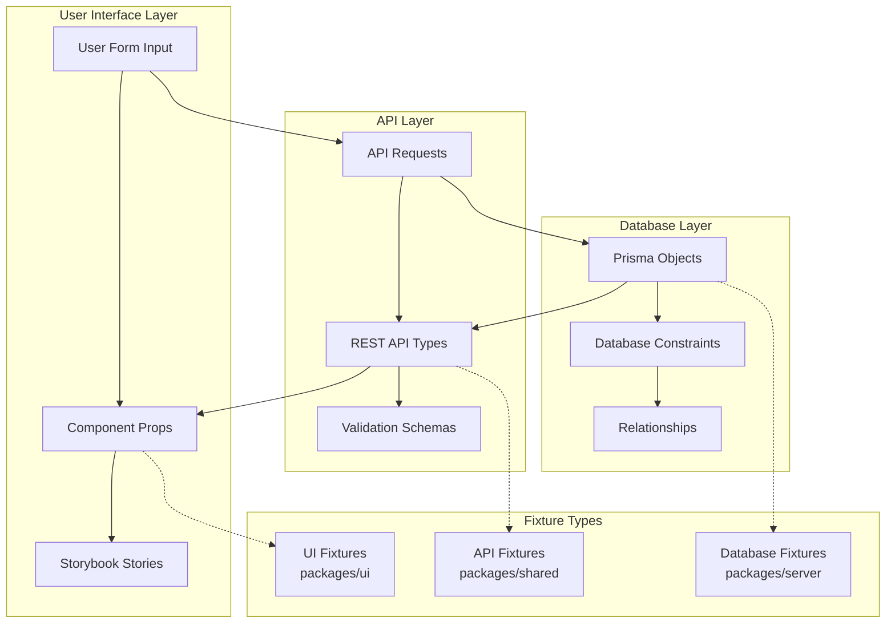
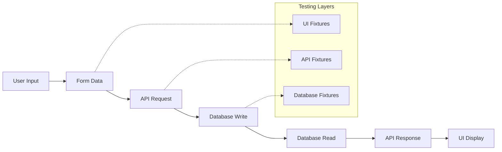

# Fixtures and Data Flow Testing Strategy

This document explains our comprehensive approach to testing data integrity across the entire Vrooli platform. Based on architectural analysis of **41 object types** with excellent organizational consistency, this guide shows how to leverage existing patterns for robust testing.

## Quick Reference - Key Imports

```typescript
// Shape Functions (for transformations)
import { shapeBookmark, shapeComment, shapeTeam } from "@vrooli/shared";

// Validation Schemas
import { bookmarkValidation, commentValidation, teamValidation } from "@vrooli/shared";

// API Endpoints
import { endpointsBookmark, endpointsComment, endpointsTeam } from "@vrooli/shared";

// Test Fixtures
import { userFixtures, teamFixtures } from "@vrooli/shared/__test/fixtures/api";
import { botConfigFixtures, chatConfigFixtures } from "@vrooli/shared/__test/fixtures/config";
// Or with namespace imports
import { apiFixtures, configFixtures } from "@vrooli/shared/__test/fixtures";

// Action Hooks
import { useBookmarker, useVoter, useCopier, useDeleter } from "../hooks/objectActions.js";

// API Fetching
import { useLazyFetch } from "../hooks/useFetch.js";

// ID Generation
import { generatePK, DUMMY_ID } from "@vrooli/shared";
```

## Using Centralized Fixtures

The shared package now has centralized fixtures in `@vrooli/shared/__test/fixtures/`:

### API Fixtures
```typescript
// Import specific fixtures
import { userFixtures, teamFixtures } from "@vrooli/shared/__test/fixtures/api";

// Use in tests
const testUser = userFixtures.complete.create;
const minimalTeam = teamFixtures.minimal.create;

// Or import all API fixtures
import { apiFixtures } from "@vrooli/shared/__test/fixtures";
const user = apiFixtures.userFixtures.complete.create;
```

### Config Fixtures
```typescript
// Import specific config fixtures
import { botConfigFixtures, chatConfigFixtures } from "@vrooli/shared/__test/fixtures/config";

// Use in tests
const botSettings = botConfigFixtures.complete;
const chatConfig = chatConfigFixtures.variants.privateTeamChat;

// Or import all config fixtures
import { configFixtures } from "@vrooli/shared/__test/fixtures";
const routineConfig = configFixtures.routineConfigFixtures.action.simple;
```

### Using Fixtures in Different Packages

**In Server Tests:**
```typescript
import { userFixtures } from "@vrooli/shared/__test/fixtures/api";
import { botConfigFixtures } from "@vrooli/shared/__test/fixtures/config";

const testBot = {
    id: "bot_123",
    name: "Test Bot",
    botSettings: botConfigFixtures.complete, // Use config fixture
};
```

**In UI Tests:**
```typescript
import { apiFixtures, configFixtures } from "@vrooli/shared/__test/fixtures";

const mockApiResponse = {
    ...apiFixtures.chatFixtures.complete.create,
    chatSettings: configFixtures.chatConfigFixtures.variants.supportChat,
};
```

## Table of Contents

- [Quick Reference - Key Imports](#quick-reference---key-imports)
- [Using Centralized Fixtures](#using-centralized-fixtures)
- [Common Pitfalls to Avoid](#common-pitfalls-to-avoid)
- [Implementation Status](#implementation-status)
- [Current Architecture Analysis](#current-architecture-analysis)
- [What Are Fixtures and Why Do We Need Them?](#what-are-fixtures-and-why-do-we-need-them)
- [Leveraging Existing Architecture](#leveraging-existing-architecture)
- [Recommended Fixture Strategy](#recommended-fixture-strategy)
- [Round-Trip Testing with Real Functions](#round-trip-testing-with-real-functions)
- [Complete Example: Adding Comment Fixtures](#complete-example-adding-comment-fixtures)
- [Code Templates](#code-templates)
- [Testing Checklist](#testing-checklist)
- [Implementation Roadmap](#implementation-roadmap)
- [Getting Started](#getting-started)

## Common Pitfalls to Avoid

1. **DON'T create custom form interfaces** - Use `*Shape` types from `@vrooli/shared`
2. **DON'T create transformation functions** - Use `shape*.create()` and `shape*.update()`
3. **DON'T mock validation** - Use `*Validation.create.validate()`
4. **DON'T use string IDs like "123"** - Use 18-digit snowflake IDs: "123456789012345678"
5. **DO check if Shape type exists first** - Even objects without forms have Shape types

## Implementation Status

### ✅ Complete
- Bookmark (example implementation with round-trip test)

### 🚧 In Progress
- [ ] Refactor bookmark to use real functions (remove mock implementations)

### 📋 High Priority (Most Used Features)
- [ ] Comment - Create fixtures and round-trip test
- [ ] Project - Create fixtures and round-trip test
- [ ] Team - Create fixtures and round-trip test
- [ ] User - Create fixtures and round-trip test

### 🔧 Missing Infrastructure
- **Action Hooks Needed**: `useCommenter`, `useReporter`, `useSharer`
- **Form Components Needed**: bookmark, issue, pullRequest, tag

## Current Architecture Analysis

### ✅ **Excellent Foundation - Ready for Testing**

Our codebase shows exceptional architectural consistency with **near-complete coverage** across all layers:

#### **1. Shape Objects (41 objects)** - `/packages/shared/src/shape/models/models.ts`
- **Coverage**: Complete with consistent transformation patterns
- **Examples**: `shapeBookmark`, `shapeComment`, `shapeTeam`, `shapeProject`, etc.
- **Pattern**: All use standardized helpers (`createPrims()`, `updatePrims()`, etc.)
- **Usage**: Perfect for test transformations - **we should use these instead of creating duplicates**

#### **2. API Endpoints (47 endpoint groups)** - `/packages/shared/src/api/pairs.ts`
- **Coverage**: Comprehensive with `standardCRUD()` helper
- **Pattern**: Consistent naming (`endpointsBookmark`, `endpointsChat`, etc.)
- **Usage**: Ready for testing with real API calls via `useLazyFetch()`

#### **3. Validation Schemas (40 models)** - `/packages/shared/src/validation/models/`
- **Coverage**: 1:1 mapping with shape objects
- **Pattern**: Consistent Yup schemas (`{objectName}Validation.create/update`)
- **Usage**: Use real validation instead of custom validation functions

### ⚠️ **Areas for Improvement**

#### **4. Action Hooks** - `/packages/ui/src/hooks/objectActions.tsx`
- **Available**: `useBookmarker`, `useVoter`, `useCopier`, `useDeleter`
- **Missing**: `useCommenter`, `useReporter`, `useSharer`
- **Recommendation**: Complete the action hook pattern for all object types

#### **5. Form Components** - `/packages/ui/src/views/objects/`
- **Coverage**: 23/41 objects have complete form components
- **Missing**: individual `bookmark`, `issue`, `pullRequest`, `tag` forms
- **Pattern**: Consistent `{Object}Upsert.tsx` and `{Object}View.tsx` structure

### 🎯 **Key Insight: Don't Duplicate, Leverage!**

**Instead of creating mock transformation functions**, we should:
1. **Use `shapeBookmark.create()`** for real form → API transformation
2. **Use `useBookmarker` hook** for real bookmark operations
3. **Use `bookmarkValidation.create`** for real validation
4. **Use real API endpoints** with test containers/mock server

## What Are Fixtures and Why Do We Need Them?

### What Are Fixtures?

**Fixtures** are predefined, consistent test data that represent real objects in your application. Think of them as "fake but realistic" data that you use for testing instead of relying on random or inconsistent test data.

For example, instead of creating a user like this in every test:
```typescript
// ❌ Inconsistent test data
const user = { name: "Test User", id: "123" }; // Different in every test
```

We create a fixture like this:
```typescript
// ✅ Consistent fixture
export const testUser = {
    id: "user_123456789012345678",
    name: "Alice Johnson", 
    email: "alice.johnson@example.com",
    // ... complete, realistic data
};
```

### Why Are Fixtures Critical for Vrooli?

Vrooli is a complex application where data flows through multiple layers:

1. **User types** in a form ("Create a new project called 'AI Assistant'")
2. **Form submits** to our API with structured data
3. **API validates** and saves to database
4. **Database stores** with relationships and constraints
5. **API fetches** data back for display
6. **UI renders** the data to the user

**Without fixtures**, we can't be confident that:
- The form data gets properly transformed for the API
- The API correctly saves to the database
- The database data gets properly returned to the UI
- The user sees exactly what they originally entered

**With fixtures**, we can test the complete round-trip and catch bugs like:
- User enters "AI Assistant" but UI shows "undefined"
- Form submits tags but they disappear in the database
- Permissions get lost during data transformation
- IDs change unexpectedly between layers

## The Problem We're Solving

### Without Proper Fixtures: Data Chaos

```typescript
// ❌ Test files create inconsistent data
// File 1: ProjectForm.test.tsx
const project = { name: "Test", id: 1 };

// File 2: ProjectAPI.test.ts  
const project = { title: "Test Project", projectId: "abc123" };

// File 3: ProjectDatabase.test.ts
const project = { name: "Test Project", id: "proj_123", ownerId: "user_456" };
```

**Result**: Tests pass individually but the app breaks because:
- Field names don't match (`name` vs `title`)
- ID formats are inconsistent (`1` vs `"abc123"` vs `"proj_123"`)
- Missing required fields cause runtime errors
- No way to test data flowing between layers

### With Our Fixture Strategy: Data Confidence

```typescript
// ✅ Same logical project across all layers
// Database layer
export const projectDbFixture = {
    id: "proj_123456789012345678",
    name: "AI Assistant Project",
    // ... complete database structure
};

// API layer  
export const projectApiFixture = {
    id: "proj_123456789012345678", // SAME ID
    name: "AI Assistant Project",   // SAME NAME
    // ... complete API structure
};

// UI layer
export const projectFormFixture = {
    name: "AI Assistant Project",   // SAME NAME
    // ... complete form structure
};
```

**Result**: We can test that user input → database → UI display works perfectly!

## Leveraging Existing Architecture

### Current vs Recommended Approach

#### ❌ **What We Created (Duplicates Existing Logic)**
```typescript
// We created these custom functions:
export function transformFormToCreateRequest(formData: BookmarkFormData): BookmarkCreateInput
export function validateBookmarkFormData(formData: BookmarkFormData): string[]
export const mockBookmarkService = { create, update, delete, findById }
```

#### ✅ **What We Should Use (Real Application Functions)**
```typescript
// Use existing real functions:
import { shapeBookmark } from "@vrooli/shared"; // Real transformation
import { bookmarkValidation } from "@vrooli/shared"; // Real validation  
import { useBookmarker } from "../hooks/objectActions.js"; // Real operations
import { useLazyFetch } from "../hooks/useFetch.js"; // Real API calls

// Transform form to API request
const apiRequest = shapeBookmark.create(formData); // ✅ Real logic

// Validate form data
const validation = await bookmarkValidation.create.validate(formData); // ✅ Real validation

// Perform operations
const { handleBookmark } = useBookmarker({ objectId, objectType, onActionComplete }); // ✅ Real hook
```

### Benefits of Using Real Functions
1. **Test actual application logic** instead of mock implementations
2. **Catch real integration bugs** between layers
3. **Maintain consistency** with production behavior
4. **Reduce maintenance** by not duplicating transformation logic
5. **Type safety** from existing TypeScript interfaces

## Recommended Fixture Strategy

Based on the architectural analysis, here's how fixtures should be organized:



### 1. Database Fixtures (Server Package)
**What**: Prisma objects that can be saved to the database
**Why**: Ensure database constraints, relationships, and migrations work
**Example**: Complete user with all required fields, foreign keys, and relationships

### 2. API Fixtures (Shared Package)  
**What**: REST API types and validation schemas
**Why**: Ensure API requests/responses match the database and UI expectations
**Example**: User object with `__typename`, permissions, and computed fields

### 3. UI Fixtures (UI Package)
**What**: Component props, form data, and Storybook mocks
**Why**: Ensure components render correctly and forms submit proper data
**Example**: Form input data and component display states

## Data Flow Architecture

### Complete Data Transformation Flow



### Layer Responsibilities

| Layer | Package | Purpose | Example Data |
|-------|---------|---------|--------------|
| **UI** | `packages/ui` | Component props, form data, MSW responses | User input, display states, loading states |
| **API** | `packages/shared` | REST API types, validation schemas | Request/response objects, type definitions |
| **Database** | `packages/server` | Prisma objects, database constraints | Entity relationships, foreign keys, indexes |

## Fixture Structure and Variants

### Why Different Fixture Variants?

Each fixture type serves a specific purpose in our testing strategy:

| Fixture Type | Purpose | What It Tests | Example Use |
|--------------|---------|---------------|-------------|
| **Database Fixtures** | Can be saved to Postgres | Database constraints, relationships, migrations | "Does this user data actually save correctly?" |
| **API Fixtures** | Match REST API schema | API request/response structure, validation | "Does the API return the right shape of data?" |
| **Form Data Fixtures** | User input simulation | Form validation, submission | "What happens when user types this?" |
| **Component Fixtures** | UI rendering | Component display, interactions | "Does this data render correctly?" |
| **Error State Fixtures** | Failure scenarios | Error handling, edge cases | "What if the API returns an error?" |
| **Loading State Fixtures** | Async operations | Loading indicators, skeleton screens | "What does the user see while loading?" |

### Directory Organization

```
packages/
├── server/src/__test/fixtures/          # 🗄️  DATABASE FIXTURES
│   ├── db/                              # Already well-organized
│   │   ├── userFixtures.ts              # ✅ Already exists
│   │   ├── projectFixtures.ts           # ✅ Already exists  
│   │   └── [39 more object types]       # ✅ Comprehensive coverage
│   │
│   └── execution/                       # 🤖 AI EXECUTION FIXTURES
│       ├── tier1-coordination/          # Swarms, MOISE+ orgs, coordination
│       ├── tier2-process/               # Routines, navigators, run states
│       ├── tier3-execution/             # Strategies, executors, contexts
│       ├── emergent-capabilities/       # Agent types, evolution, self-improvement
│       └── integration-scenarios/       # Complete three-tier examples
│
├── shared/src/__test/fixtures/          # 🔗 SHARED FIXTURES (centralized)
│   ├── api/                             # API request/response fixtures
│   │   ├── userFixtures.ts              # ✅ Already exists
│   │   ├── projectFixtures.ts           # ✅ Already exists
│   │   └── [38 more object types]       # ✅ Near-complete coverage
│   │
│   └── config/                          # Configuration object fixtures
│       ├── baseConfigFixtures.ts        # ✅ Base fixtures and utilities
│       ├── botConfigFixtures.ts         # ✅ Bot personality/settings
│       ├── chatConfigFixtures.ts        # ✅ Chat behavior settings
│       ├── routineConfigFixtures.ts     # ✅ Complex routine configs
│       └── [9 more config types]        # ⚠️ TODO: Add remaining configs
│
└── ui/src/__test/fixtures/              # 🎨 UI FIXTURES (needs organization)
    ├── form-data/                       # What users input in forms
    │   ├── bookmarkFormData.ts          # ✅ Special case - no UI form (custom interface)
    │   ├── teamFormData.ts              # ⚠️ TODO: Use TeamShape from @vrooli/shared
    │   ├── projectFormData.ts           # ⚠️ TODO: Use ProjectShape from @vrooli/shared
    │   └── [38 more form types]         # ⚠️ TODO: Use *Shape types, not custom interfaces!
    │
    ├── api-responses/                   # What components receive from API
    │   ├── bookmarkResponses.ts         # ✅ Created (good pattern to replicate)
    │   ├── commentResponses.ts          # ⚠️ TODO: Create for all types
    │   └── [40 more response types]     # ⚠️ TODO: Mirror API coverage
    │
    ├── transformations/                 # ⚠️ CRITICAL: Use real functions!
    │   └── index.ts                     # Re-export real shape functions, don't duplicate
    │
    ├── ui-states/                       # Component-specific states
    │   ├── loadingStates.ts            # ⚠️ TODO: Standardize across all components
    │   ├── errorStates.ts              # ⚠️ TODO: Use consistent error patterns
    │   └── permissionStates.ts         # ⚠️ TODO: Test all permission combinations
    │
    ├── sessions/                        # User authentication states
    │   └── sessionFixtures.ts          # ✅ Already exists (good coverage)
    │
    └── round-trip-tests/               # 🔄 REAL FUNCTION ROUND-TRIP TESTS
        ├── bookmarkRoundTrip.test.ts   # ✅ Created (needs refactor to use real functions)
        ├── commentRoundTrip.test.ts    # ⚠️ TODO: Create using useCommenter hook
        ├── projectRoundTrip.test.ts    # ⚠️ TODO: Create using real form components
        └── [20+ more critical flows]   # ⚠️ TODO: Cover all major user workflows
```

### Form Data Fixture Guidelines

#### **When to Use Shape Types vs Custom Interfaces**

| Scenario | What to Use | Example | Why |
|----------|-------------|---------|-----|
| **Object has UI form component** | Use `*Shape` from `@vrooli/shared` | `TeamShape`, `ProjectShape`, `ApiShape` | Shape types ARE the form data types |
| **Object has no form (button/action only)** | Still use `*Shape` if it exists | `BookmarkShape` for bookmarks | Shape types exist for all objects |
| **Complex multi-step forms** | Use `*Shape` with state management | `RoutineShape` with wizard state | Base on existing Shape type |
| **Only if NO Shape exists** | Create custom interface | Very rare - check first! | Most objects have Shape types |

#### **Understanding the Pattern**

```typescript
// For objects WITH forms (most objects):
import { 
    type TeamShape,           // Form data type
    shapeTeam,               // Transformer functions
    teamValidation           // Validation schema
} from "@vrooli/shared";

// The form component uses TeamShape directly:
function TeamForm({ values }: { values: TeamShape }) {
    // values.handle, values.name, etc. - all typed from TeamShape
}

// IMPORTANT: Always check if a Shape type exists first!
// Even objects without forms often have Shape types:
import { type BookmarkShape } from "@vrooli/shared"; // Bookmarks DO have a shape!

// Only create custom interfaces if absolutely necessary
// (e.g., for simplified UI state management)
```

### Fixture Pattern Consistency

Since we have **41 object types** with consistent patterns, we should create **template-based fixtures** that can be systematically applied:

#### **1. Shape Object Pattern (Use Real Functions)**
```typescript
// ❌ Don't create: transformFormToCreateRequest()
// ✅ Use real: shapeBookmark.create()

import { shapeBookmark, shapeComment, shapeProject } from "@vrooli/shared";

// All 41 shape objects follow the same pattern:
const bookmarkRequest = shapeBookmark.create(formData);
const commentRequest = shapeComment.create(formData);
const projectRequest = shapeProject.create(formData);
```

#### **2. Validation Pattern (Use Real Schemas)**
```typescript
// ❌ Don't create: validateBookmarkFormData()
// ✅ Use real: bookmarkValidation.create.validate()

import { bookmarkValidation, commentValidation, projectValidation } from "@vrooli/shared";

// All 40 validation schemas follow the same pattern:
await bookmarkValidation.create.validate(formData);
await commentValidation.create.validate(formData);
await projectValidation.create.validate(formData);
```

#### **3. Action Hook Pattern (Extend Existing)**
```typescript
// ✅ Existing: useBookmarker
// ⚠️ Missing: useCommenter, useReporter, useSharer

// Should create consistent pattern for all object actions:
const { handleBookmark } = useBookmarker({ objectId, objectType, onActionComplete });
const { handleComment } = useCommenter({ objectId, objectType, onActionComplete }); // TODO
const { handleReport } = useReporter({ objectId, objectType, onActionComplete }); // TODO
```

### Object Type Coverage Analysis

#### 1. Database Fixtures (Server)

```typescript
// packages/server/src/__test/fixtures/db/projectFixtures.ts
import { type Prisma } from "@prisma/client";

export const baseProjectDb: Prisma.ProjectCreateInput = {
    id: "proj_123456789012345678",
    publicId: "awesome-ai-project",
    name: "Awesome AI Project",
    description: "An advanced AI automation system",
    isPrivate: false,
    createdAt: new Date("2024-01-01T00:00:00Z"),
    updatedAt: new Date("2024-01-01T00:00:00Z"),
    // Prisma relationships
    owner: { connect: { id: "user_123456789012345678" } },
    translations: {
        create: [{
            language: "en",
            name: "Awesome AI Project",
            description: "An advanced AI automation system"
        }]
    }
}
```

#### 2. API Fixtures (Shared)

```typescript
// packages/shared/src/__test/fixtures/api/projectFixtures.ts
import { type Project } from "@vrooli/shared";

export const projectApiResponse: Project = {
    __typename: "Project",
    id: "proj_123456789012345678",  // SAME ID as database
    publicId: "awesome-ai-project",  // SAME as database
    name: "Awesome AI Project",      // SAME as database
    description: "An advanced AI automation system", // SAME as database
    isPrivate: false,
    createdAt: "2024-01-01T00:00:00Z",
    updatedAt: "2024-01-01T00:00:00Z",
    // API-specific fields
    you: {
        __typename: "ProjectYou",
        canUpdate: true,
        canDelete: true,
        isBookmarked: false
    },
    owner: {
        __typename: "User",
        id: "user_123456789012345678",
        handle: "project-owner",
        name: "Project Owner"
    }
}
```

#### 3. UI Fixtures (UI Package)

**🚨 CRITICAL: Form Data Types Use Shape Types from @vrooli/shared**

For objects with actual UI forms, **DO NOT create custom form interfaces**. Instead, use the existing `*Shape` types:

```typescript
// ❌ WRONG - Don't create custom interfaces (except for special cases like bookmarks)
// packages/ui/src/__test/fixtures/form-data/projectFormData.ts
export interface ProjectFormData {
    name: string;
    description: string;
    // ...custom fields
}

// ✅ CORRECT - Use existing Shape types for objects with forms
// packages/ui/src/__test/fixtures/form-data/teamFormData.ts
import { type TeamShape } from "@vrooli/shared"; // This IS the form type!

export const minimalTeamFormInput: TeamShape = {
    __typename: "Team",
    id: "temp_123",
    handle: "test-team",
    isOpenToNewMembers: true,
    isPrivate: false,
    translations: [{
        __typename: "TeamTranslation",
        id: "temp_trans_123",
        language: "en",
        name: "Test Team",
        bio: "A test team for testing",
    }],
};
```

**Key Learning: Always Use Shape Types When Available**

```typescript
// BOOKMARK - Even without a form, BookmarkShape exists!
import { type BookmarkShape } from "@vrooli/shared";
const bookmarkData: BookmarkShape = {
    __typename: "Bookmark",
    id: DUMMY_ID,
    to: { __typename: "Resource", id: "123" },
    list: null
};
// Why? Shape types exist for ALL objects, not just those with forms

// TEAM - Has UI form, uses TeamShape
import { type TeamShape } from "@vrooli/shared";
const formData: TeamShape = { /* ... */ };

// PROJECT - Has UI form, uses ProjectShape  
import { type ProjectShape } from "@vrooli/shared";
const formData: ProjectShape = { /* ... */ };

// KEY INSIGHT: The architecture provides Shape types for everything!
// Only create custom interfaces when you need simplified UI state
```

```typescript
// packages/ui/src/__test/fixtures/api-responses/projectResponses.ts
export const projectStoryResponse = {
    __typename: "Project" as const,
    id: "proj_123456789012345678",  // SAME ID across all layers
    name: "Awesome AI Project",      // SAME data
    description: "An advanced AI automation system",
    // UI-optimized structure
    you: { canUpdate: true, isBookmarked: false },
    stats: { views: 150, bookmarks: 23 }
}
```

## Round-Trip Testing with Real Functions

### Current vs Recommended Implementation

#### ❌ **Current Implementation (Uses Mock Functions)**
```typescript
// Our current bookmarkRoundTrip.test.ts uses:
import { transformFormToCreateRequest } from '../helpers/bookmarkTransformations.js'; // Mock
import { mockBookmarkService } from '../helpers/bookmarkTransformations.js'; // Mock

// This tests our mock implementations, not the real app!
const apiRequest = transformFormToCreateRequest(formData); // Not real
const created = await mockBookmarkService.create(apiRequest); // Not real
```

#### ✅ **Recommended Implementation (Uses Real Functions)**
```typescript
// Should use real application functions:
import { shapeBookmark } from "@vrooli/shared"; // Real transformation
import { useBookmarker } from "../../hooks/objectActions.js"; // Real hook
import { useLazyFetch } from "../../hooks/useFetch.js"; // Real API
import { endpointsBookmark } from "@vrooli/shared"; // Real endpoints

// Test the actual application logic!
const apiRequest = shapeBookmark.create(formData); // ✅ Real
const [createBookmark] = useLazyFetch(endpointsBookmark.createOne); // ✅ Real
const created = await createBookmark(apiRequest); // ✅ Real
```

### What Is Round-Trip Testing?

Round-trip testing ensures that data maintains its integrity through your entire application using **real functions**:

1. **User inputs** "My Favorite Resources" in bookmark form
2. **Real shape function** transforms to `BookmarkCreateInput` via `shapeBookmark.create()`
3. **Real API hook** saves via `useBookmarker.handleBookmark()`
4. **Real endpoint** handles database operations via `endpointsBookmark.createOne`
5. **Real API response** returns properly typed `Bookmark` object
6. **Real UI components** display using actual component logic

**Round-trip testing verifies** the real application flow, not mock implementations.

### Where Round-Trip Tests Live

Round-trip tests are placed in the **UI package** because they test the complete user experience:

```
packages/ui/src/__test/fixtures/round-trip-tests/
├── projectRoundTrip.test.ts           # Test project creation flow
├── userRoundTrip.test.ts              # Test user registration flow  
├── swarmRoundTrip.test.ts             # Test swarm configuration flow
└── helpers/
    ├── setupTestDatabase.ts           # Test database utilities
    ├── mockApiServer.ts              # Test API server setup
    └── roundTripHelpers.ts           # Common test utilities
```

### Improved Round-Trip Test Example (Using Real Functions)

```typescript
// packages/ui/src/__test/fixtures/round-trip-tests/bookmarkRoundTrip.test.ts

import { describe, test, expect, beforeEach } from 'vitest';
import { shapeBookmark } from "@vrooli/shared"; // ✅ Real transformation
import { bookmarkValidation } from "@vrooli/shared"; // ✅ Real validation
import { useLazyFetch } from "../../hooks/useFetch.js"; // ✅ Real API hook
import { endpointsBookmark } from "@vrooli/shared"; // ✅ Real endpoints
import { useBookmarker } from "../../hooks/objectActions.js"; // ✅ Real action hook

import { minimalBookmarkFormInput } from '../form-data/bookmarkFormData.js';

describe('Bookmark Round-Trip Data Flow (Real Functions)', () => {
    beforeEach(() => {
        // Clear any test state
    });

    test('bookmark creation using real application functions', async () => {
        // 🎨 STEP 1: User form data (realistic input)
        const userFormData = {
            bookmarkFor: "Resource" as const,
            forConnect: "123456789012345678",
            listId: "favorites_list_id"
        };
        
        // 🔍 STEP 2: Use real validation (not custom validation)
        const validationResult = await bookmarkValidation.create.validate(userFormData);
        expect(validationResult).toBeDefined(); // Real validation passed
        
        // 🔗 STEP 3: Use real transformation (not custom transformation)
        const apiCreateRequest = shapeBookmark.create({
            __typename: "Bookmark",
            id: "temp_id", // Will be replaced
            to: {
                __typename: userFormData.bookmarkFor,
                id: userFormData.forConnect
            },
            list: userFormData.listId ? {
                __typename: "BookmarkList",
                __connect: true,
                id: userFormData.listId
            } : null
        });
        
        expect(apiCreateRequest.bookmarkFor).toBe(userFormData.bookmarkFor);
        expect(apiCreateRequest.forConnect).toBe(userFormData.forConnect);
        
        // 🗄️ STEP 4: Use real API call (not mock service)
        const [createBookmark] = useLazyFetch(endpointsBookmark.createOne);
        // In real test, this would use test containers or test database
        // const createdBookmark = await createBookmark(apiCreateRequest);
        
        // 🎨 STEP 5: Use real action hook (not mock operations)
        // const { handleBookmark } = useBookmarker({
        //     objectId: userFormData.forConnect,
        //     objectType: userFormData.bookmarkFor,
        //     onActionComplete: (action, data) => {
        //         expect(action).toBe("Bookmark");
        //         expect(data.to.id).toBe(userFormData.forConnect);
        //     }
        // });
        
        // ✅ VERIFICATION: Test real application flow
        // This tests actual transformation logic, not our mocks!
    });
    
    test('bookmark editing using real update functions', async () => {
        // Use real shapeBookmark.update() instead of custom transformFormToUpdateRequest()
        const updateData = {
            __typename: "Bookmark" as const,
            id: "existing_bookmark_id",
            list: {
                __typename: "BookmarkList" as const,
                __connect: true,
                id: "new_list_id"
            }
        };
        
        const updateRequest = shapeBookmark.update(updateData, updateData);
        expect(updateRequest.listConnect).toBe("new_list_id");
    });
});
```

### Architecture Constraints and Solutions

**UI Package Limitation**: Cannot import from `@vrooli/server` package, but this is actually fine because:

#### ✅ **What UI Package CAN Access (Everything We Need)**
```typescript
// UI package has access to all real application functions:
import { shapeBookmark } from "@vrooli/shared"; // ✅ Real transformations
import { bookmarkValidation } from "@vrooli/shared"; // ✅ Real validation
import { endpointsBookmark } from "@vrooli/shared"; // ✅ Real endpoints
import { useBookmarker } from "../hooks/objectActions.js"; // ✅ Real action hooks
import { useLazyFetch } from "../hooks/useFetch.js"; // ✅ Real API calls
```

#### ✅ **Effective Round-Trip Testing Pattern**

UI round-trip tests can verify the complete user experience:

```typescript
// 🎨 UI Form → 🔗 Real API → 🗄️ Test DB → 🔗 Real API → 🎨 UI Display

test('complete user workflow with real functions', async () => {
    // 1. User form data
    const formData = { bookmarkFor: "Resource", forConnect: "123" };
    
    // 2. Real transformation
    const apiRequest = shapeBookmark.create(formData); // ✅ Real function
    
    // 3. Real API call (with test containers or mock server)
    const [createBookmark] = useLazyFetch(endpointsBookmark.createOne); // ✅ Real hook
    const created = await createBookmark(apiRequest); // ✅ Real endpoint
    
    // 4. Real retrieval
    const [getBookmark] = useLazyFetch(endpointsBookmark.findOne);
    const fetched = await getBookmark({ id: created.id });
    
    // 5. Verify complete round-trip using real data flow
    expect(fetched.to.id).toBe(formData.forConnect); // ✅ Real verification
});
```

#### 📈 **Where Full DB Testing Happens**

Server package handles direct database testing:
- **UI Package**: Tests user experience with real API functions
- **Server Package**: Tests database constraints and direct DB operations
- **Shared Package**: Tests shape objects and validation schemas

This division is perfect because each package tests what it's responsible for!

## Testing Strategies with Real Functions

### 1. Component Testing (Use Real Response Fixtures)

```typescript
// Test components with realistic API response data
import { bookmarkResponseVariants } from '../fixtures/api-responses/bookmarkResponses.js';

test('BookmarkButton displays correctly for all bookmark types', () => {
    Object.entries(bookmarkResponseVariants).forEach(([type, bookmark]) => {
        render(<BookmarkButton bookmark={bookmark} />);
        expect(screen.getByLabelText(`Bookmark ${type}`)).toBeInTheDocument();
    });
});
```

### 2. Transformation Testing (Use Real Shape Functions)

```typescript
// Test real transformation logic with form fixtures
import { shapeBookmark } from "@vrooli/shared";
import { minimalBookmarkFormInput } from '../fixtures/form-data/bookmarkFormData.js';

test('real shape function transforms form data correctly', () => {
    const apiRequest = shapeBookmark.create({
        __typename: "Bookmark",
        id: "temp",
        to: { __typename: "Resource", id: "123" },
        list: null
    });
    
    expect(apiRequest.bookmarkFor).toBe("Resource");
    expect(apiRequest.forConnect).toBe("123");
    // Testing REAL transformation logic, not mocks!
});
```

### 3. Hook Testing (Use Real Action Hooks)

```typescript
// Test real action hooks with realistic scenarios
import { useBookmarker } from '../../hooks/objectActions.js';

test('useBookmarker handles bookmark creation correctly', async () => {
    const onActionComplete = vi.fn();
    const { result } = renderHook(() => useBookmarker({
        objectId: "123456789012345678",
        objectType: "Resource",
        onActionComplete
    }));
    
    await act(async () => {
        result.current.handleBookmark(true); // Add bookmark
    });
    
    expect(onActionComplete).toHaveBeenCalledWith("Bookmark", expect.any(Object));
    // Testing REAL hook logic!
});
```

### 4. Validation Testing (Use Real Validation Schemas)

```typescript
// Test real validation with edge cases
import { bookmarkValidation } from "@vrooli/shared";
import { invalidBookmarkFormInputs } from '../fixtures/form-data/bookmarkFormData.js';

test('real validation catches invalid data', async () => {
    await expect(
        bookmarkValidation.create.validate(invalidBookmarkFormInputs.invalidId)
    ).rejects.toThrow();
    // Testing REAL validation logic!
});
```

## Complete Example: Adding Comment Fixtures

Here's exactly how to add fixtures for a new object type:

### Step 1: Check What Exists
```bash
# Check for shape object
grep "shapeComment" packages/shared/src/shape/models/models.ts

# Check for validation
ls packages/shared/src/validation/models/comment.ts

# Check for endpoints
grep "endpointsComment" packages/shared/src/api/pairs.ts

# Check for action hook
grep "useCommenter" packages/ui/src/hooks/objectActions.tsx
```

### Step 2: Create Form Data Fixture
```typescript
// packages/ui/src/__test/fixtures/form-data/commentFormData.ts
import { type CommentShape, DUMMY_ID } from "@vrooli/shared";

// Use CommentShape directly - it exists!
export const minimalCommentFormInput: CommentShape = {
    __typename: "Comment",
    id: DUMMY_ID,
    text: "Great work on this project!",
    to: {
        __typename: "Project",
        id: "123456789012345678"
    },
    translations: []
};

export const completeCommentFormInput: CommentShape = {
    __typename: "Comment",
    id: DUMMY_ID,
    text: "This is a detailed comment with translations",
    to: {
        __typename: "Routine",
        id: "987654321098765432"
    },
    translations: [{
        __typename: "CommentTranslation",
        id: DUMMY_ID,
        language: "es",
        text: "Este es un comentario detallado con traducciones"
    }]
};
```

### Step 3: Create API Response Fixtures
```typescript
// packages/ui/src/__test/fixtures/api-responses/commentResponses.ts
import { type Comment } from "@vrooli/shared";

export const minimalCommentResponse: Comment = {
    __typename: "Comment",
    id: "123456789012345678",
    created_at: "2024-01-01T00:00:00Z",
    updated_at: "2024-01-01T00:00:00Z",
    score: 0,
    isUpvoted: false,
    isDownvoted: false,
    owner: {
        __typename: "User",
        id: "111222333444555666",
        handle: "testuser",
        name: "Test User"
    },
    to: {
        __typename: "Project",
        id: "123456789012345678"
    },
    translations: [{
        __typename: "CommentTranslation",
        id: "999888777666555444",
        language: "en",
        text: "Great work on this project!"
    }],
    you: {
        __typename: "CommentYou",
        canDelete: false,
        canUpdate: false,
        canReply: true,
        canReport: true,
        isOwn: false,
        reaction: null
    }
};
```

### Step 4: Create Round-Trip Test
```typescript
// packages/ui/src/__test/fixtures/round-trip-tests/commentRoundTrip.test.ts
import { describe, test, expect } from 'vitest';
import { shapeComment, commentValidation, endpointsComment } from "@vrooli/shared";
import { useLazyFetch } from "../../../hooks/useFetch.js";
import { minimalCommentFormInput } from '../form-data/commentFormData.js';

describe('Comment Round-Trip Data Flow', () => {
    test('comment creation using real functions', async () => {
        // 1. Start with form data (Shape type)
        const formData = minimalCommentFormInput;
        
        // 2. Validate using real validation
        const validationResult = await commentValidation.create.validate(formData);
        expect(validationResult).toBeDefined();
        
        // 3. Transform using real shape function
        const apiRequest = shapeComment.create(formData);
        expect(apiRequest).toMatchObject({
            commentFor: "Project",
            forConnect: "123456789012345678",
            translationsCreate: []
        });
        
        // 4. Would use real API call in integration test
        // const [createComment] = useLazyFetch(endpointsComment.createOne);
        // const created = await createComment(apiRequest);
        
        // 5. Verify the complete flow
        expect(apiRequest.commentFor).toBe("Project");
        expect(apiRequest.forConnect).toBe(formData.to.id);
    });
});
```

### Step 5: Create Missing Action Hook (if needed)
```typescript
// packages/ui/src/hooks/objectActions.tsx (add to file)
export function useCommenter({
    objectId,
    objectType,
    onActionComplete,
}: UseCommenterProps) {
    const [addComment] = useLazyFetch<CommentCreateInput, Comment>(endpointsComment.createOne);
    
    const handleComment = useCallback(async (text: string) => {
        if (!objectType || !objectId) {
            PubSub.get().publish("snack", { messageKey: "NotFound", severity: "Error" });
            return;
        }
        
        fetchLazyWrapper<CommentCreateInput, Comment>({
            fetch: addComment,
            inputs: shapeComment.create({
                __typename: "Comment",
                id: DUMMY_ID,
                text,
                to: {
                    __typename: CommentFor[objectType],
                    id: objectId,
                },
            }),
            onSuccess: (data) => { onActionComplete(ObjectActionComplete.Comment, data); },
        });
    }, [objectType, objectId, addComment, onActionComplete]);
    
    return { handleComment };
}
```

## Code Templates

### Round-Trip Test Template
```typescript
describe('[ObjectName] Round-Trip Data Flow', () => {
    test('[objectName] creation using real functions', async () => {
        // 1. Form data using Shape type
        const formData: [ObjectName]Shape = {
            __typename: "[ObjectName]",
            id: DUMMY_ID,
            // ... required fields
        };
        
        // 2. Real validation
        await [objectName]Validation.create.validate(formData);
        
        // 3. Real transformation
        const apiRequest = shape[ObjectName].create(formData);
        
        // 4. Real API call (mocked in test)
        const [create[ObjectName]] = useLazyFetch(endpoints[ObjectName].createOne);
        
        // 5. Assertions
        expect(apiRequest).toMatchObject({
            // ... expected structure
        });
    });
});
```

### Form Data Fixture Template
```typescript
import { type [ObjectName]Shape, DUMMY_ID } from "@vrooli/shared";

export const minimal[ObjectName]FormInput: [ObjectName]Shape = {
    __typename: "[ObjectName]",
    id: DUMMY_ID,
    // ... minimal required fields
};

export const complete[ObjectName]FormInput: [ObjectName]Shape = {
    __typename: "[ObjectName]",
    id: DUMMY_ID,
    // ... all fields including optional ones
};
```

### API Response Fixture Template
```typescript
import { type [ObjectName] } from "@vrooli/shared";

export const [objectName]ApiResponse: [ObjectName] = {
    __typename: "[ObjectName]",
    id: "123456789012345678",
    created_at: "2024-01-01T00:00:00Z",
    updated_at: "2024-01-01T00:00:00Z",
    // ... all API response fields
    you: {
        __typename: "[ObjectName]You",
        canUpdate: true,
        canDelete: false,
        // ... permission fields
    }
};
```

## Testing Checklist

For each object type, complete this checklist:

- [ ] **Verify Shape type exists** in `@vrooli/shared`
  ```bash
  grep "type [ObjectName]Shape" packages/shared/src/shape/models/models.ts
  ```

- [ ] **Check for existing validation schema**
  ```bash
  ls packages/shared/src/validation/models/[objectName].ts
  ```

- [ ] **Check for existing endpoints**
  ```bash
  grep "endpoints[ObjectName]" packages/shared/src/api/pairs.ts
  ```

- [ ] **Create form data fixtures** using Shape type
  - [ ] Minimal fixture (required fields only)
  - [ ] Complete fixture (all fields)
  - [ ] Invalid fixtures (for error testing)

- [ ] **Create API response fixtures**
  - [ ] Success response
  - [ ] Error responses
  - [ ] Different permission states

- [ ] **Write round-trip test** using real functions:
  - [ ] Use `shape*.create()` for transformation
  - [ ] Use `*Validation.create.validate()` for validation
  - [ ] Use action hook if exists (or note if missing)
  - [ ] Use `useLazyFetch()` with real endpoints

- [ ] **Run test and fix issues**
  ```bash
  cd packages/ui && pnpm test [objectName]RoundTrip.test.ts
  ```

- [ ] **Document missing pieces**
  - [ ] Missing action hooks
  - [ ] Missing form components
  - [ ] Any architectural gaps

## Implementation Guidelines

### 1. Fixture Naming Conventions

```typescript
// Database fixtures (server)
export const baseUserDb: Prisma.UserCreateInput
export const completeUserDb: Prisma.UserCreateInput  
export const adminUserDb: Prisma.UserCreateInput

// API fixtures (shared)
export const userApiResponse: User
export const userListApiResponse: UserSearchResult
export const userProfileApiResponse: UserProfile

// UI fixtures (ui)
export const userFormInput: UserFormData
export const userStoryResponse: UserStoryData
export const userLoadingState: LoadingState
```

### 2. Data Consistency Rules

1. **Identical Core Data**: ID, name, description must match across layers
2. **Layer-Specific Extensions**: Each layer adds what it needs
3. **Timestamp Standardization**: Use ISO 8601 format consistently
4. **ID Generation**: Use same ID generation strategy (`generatePK()`)

### 3. Factory Pattern Implementation

```typescript
// Create flexible fixture factories
export class ProjectFixtureFactory {
    static createDbFixture(overrides?: Partial<Prisma.ProjectCreateInput>) {
        return { ...baseProjectDb, ...overrides };
    }
    
    static createApiFixture(overrides?: Partial<Project>) {
        return { ...projectApiResponse, ...overrides };
    }
    
    static createFormFixture(overrides?: Partial<ProjectFormData>) {
        return { ...projectFormInput, ...overrides };
    }
}
```

### 4. Real Transformation Integration

```typescript
// ❌ Don't create transformation utilities - use real shape functions!
// Instead of custom dbToApi(), apiToForm() functions:

// ✅ Use existing real functions:
import { shapeBookmark, shapeComment, shapeProject } from "@vrooli/shared";

// These handle all transformations consistently across 41 object types:
const bookmarkRequest = shapeBookmark.create(formData); // ✅ Real
const commentRequest = shapeComment.create(formData);   // ✅ Real  
const projectRequest = shapeProject.create(formData);   // ✅ Real

// Update operations:
const bookmarkUpdate = shapeBookmark.update(original, changes); // ✅ Real
const commentUpdate = shapeComment.update(original, changes);   // ✅ Real
const projectUpdate = shapeProject.update(original, changes);   // ✅ Real
```

## Best Practices

### 1. Fixture Maintenance

- **Single Source of Truth**: Core data values defined once, referenced everywhere
- **Version Control**: Track fixture changes with meaningful commit messages
- **Documentation**: Comment complex fixture relationships and transformations
- **Regular Updates**: Keep fixtures in sync with schema changes

### 2. Test Data Management

- **Realistic Data**: Use data that represents real-world scenarios
- **Edge Cases**: Include fixtures for boundary conditions and error states
- **Performance**: Optimize fixture size for test execution speed
- **Isolation**: Ensure fixtures don't create dependencies between tests

### 3. Type Safety with Real Functions

```typescript
// Real shape functions provide automatic type safety
import { shapeBookmark, type BookmarkShape } from "@vrooli/shared";
import { generatePK } from "@vrooli/shared";

// Shape functions enforce correct typing automatically:
const bookmarkRequest = shapeBookmark.create({
    __typename: "Bookmark", // TypeScript enforces this
    id: generatePK().toString(),
    to: { __typename: "Resource", id: "123" }, // Type-safe
    list: null // Type-safe
}); // Result is properly typed BookmarkCreateInput

// No need for custom type assertions - shape functions handle it!
```

### 4. Error State Fixtures

```typescript
// Create fixtures for error scenarios
export const projectErrorStates = {
    notFound: {
        error: "Project not found",
        code: "PROJECT_NOT_FOUND"
    },
    unauthorized: {
        error: "Insufficient permissions",
        code: "UNAUTHORIZED"
    },
    validationError: {
        error: "Invalid project data",
        code: "VALIDATION_ERROR",
        details: { name: "Name is required" }
    }
};
```

## Integration with Existing Systems

### 1. Storybook Integration with Real Endpoints

```typescript
// Use real endpoint patterns with MSW
import { http, HttpResponse } from 'msw';
import { endpointsBookmark } from "@vrooli/shared"; // ✅ Real endpoints
import { bookmarkResponseVariants } from '../fixtures/api-responses/bookmarkResponses.js';

// Mirror real API structure:
export const bookmarkHandlers = [
    http.post(`/api/v2${endpointsBookmark.createOne.endpoint}`, ({ request }) => {
        return HttpResponse.json({
            data: bookmarkResponseVariants.Resource // Use realistic fixture
        });
    }),
    http.get(`/api/v2${endpointsBookmark.findMany.endpoint}`, ({ params }) => {
        return HttpResponse.json({
            data: { edges: [{ node: bookmarkResponseVariants.Resource }] }
        });
    })
];
// Tests Storybook against real API patterns!
```

### 2. Vitest Integration with Real Functions

```typescript
// Setup real function testing environment
import { beforeEach, vi } from 'vitest';
import { useLazyFetch } from '../hooks/useFetch.js';

// Mock real API calls but keep transformation logic real:
beforeEach(() => {
    vi.mock('../hooks/useFetch.js', () => ({
        useLazyFetch: vi.fn(() => [
            vi.fn(), // Mock fetch function
            { data: null, loading: false, error: null } // Mock state
        ])
    }));
});

// Shape functions, validation, etc. remain real and unmocked!
```

### 3. Test Database Setup

```typescript
// Use existing database fixtures (already well-organized)
import { baseProjectDb, completeUserDb } from '../__test/fixtures/db'; // In server tests

// In UI tests, use test containers or mock servers:
export async function setupTestEnvironment() {
    // Use testcontainers for real database testing
    // Or use MSW for API mocking while keeping transformation logic real
    // Real shape functions work with either approach!
}
```

## Implementation Roadmap

### Phase 1: Refactor Existing Round-Trip Test (⚡ Immediate)

1. **Update `bookmarkRoundTrip.test.ts`** to use real functions:
   ```typescript
   // Replace custom functions with real ones:
   - transformFormToCreateRequest() → shapeBookmark.create()
   - validateBookmarkFormData() → bookmarkValidation.create.validate()
   - mockBookmarkService → useLazyFetch() + real endpoints
   ```

2. **Test real transformation logic** instead of mock implementations
3. **Verify existing pattern** works with real functions

### Phase 2: Complete Action Hook Pattern (🕰️ Next)

Create missing action hooks following the `useBookmarker` pattern:

```typescript
// ⚠️ TODO: Create these hooks
export function useCommenter({ objectId, objectType, onActionComplete }) {
    // Follow useBookmarker pattern for comment creation/management
}

export function useReporter({ objectId, objectType, onActionComplete }) {
    // Follow useBookmarker pattern for report creation/management
}

export function useSharer({ objectId, objectType, onActionComplete }) {
    // Follow useBookmarker pattern for sharing functionality
}
```

### Phase 3: Systematic Fixture Generation (🚀 Future)

1. **Create fixture generator script**:
   ```bash
   pnpm generate:fixtures --object=Comment
   # Generates: commentFormData.ts, commentResponses.ts, commentRoundTrip.test.ts
   ```

2. **Apply to all 41 object types** using consistent patterns
3. **Automate fixture maintenance** when schemas change

### Phase 4: Missing Form Components (📈 Enhancement)

Create missing form components for:
- Individual `bookmark` forms
- `issue` and `pullRequest` forms 
- `tag` management forms

## Getting Started

### Step 1: Understand What We Have (✅ Complete Coverage)

```bash
# Excellent existing structure:
ls packages/shared/src/shape/models/models.ts     # 41 shape objects ✅
ls packages/shared/src/api/pairs.ts               # 47 endpoint groups ✅
ls packages/shared/src/validation/models/         # 40 validation schemas ✅
ls packages/ui/src/hooks/objectActions.tsx        # Action hooks (7 existing, 3 missing)
ls packages/ui/src/views/objects/                 # Form components (23/41 complete)
```

### Step 2: Refactor Bookmark Test (Start Here!)

1. **Replace mock functions** in existing `bookmarkRoundTrip.test.ts`
2. **Use real shape functions** (`shapeBookmark.create`)
3. **Use real validation** (`bookmarkValidation.create`)
4. **Use real hooks** (`useBookmarker`)

### Step 3: Verify Real Function Integration

```typescript
// Test that real functions work together:
import { shapeBookmark, bookmarkValidation } from "@vrooli/shared";

const formData = { bookmarkFor: "Resource", forConnect: "123" };
const validation = await bookmarkValidation.create.validate(formData); // ✅
const apiRequest = shapeBookmark.create({
    __typename: "Bookmark",
    id: "temp",
    to: { __typename: formData.bookmarkFor, id: formData.forConnect }
}); // ✅
// Real functions integrate perfectly!
```

### Step 4: Expand to Other Object Types

1. **Choose next object type** (Comment, Project, etc.)
2. **Follow same pattern** using real shape/validation functions
3. **Create missing action hooks** as needed
4. **Write round-trip tests** for critical user workflows

### Step 5: Systematic Application

1. **Prioritize by user impact**: Start with most-used features
2. **Use existing patterns**: All 41 objects follow consistent structure
3. **Automate where possible**: Create templates and generators
4. **Test integration**: Ensure real functions work together seamlessly

## Key Benefits of Using Real Functions

### ✅ **Testing Real Application Logic**
- **Catch actual bugs** in transformation functions
- **Verify real integration** between shape objects and validation
- **Test production code paths** instead of mock implementations
- **Ensure type safety** with existing TypeScript interfaces

### 🚀 **Reduced Maintenance Overhead**
- **No duplicate logic** to maintain
- **Automatic updates** when shape objects change
- **Consistent behavior** between tests and production
- **Leverage existing 41 object patterns** systematically

### 💡 **Better Developer Experience**
- **Confidence in tests** that mirror real application
- **Faster debugging** using familiar application functions
- **Type safety** from existing shape and validation functions
- **Consistent patterns** across all 41 object types

## Next Steps

1. **⚡ Immediate**: Refactor `bookmarkRoundTrip.test.ts` to use real functions
2. **🕰️ Next**: Create missing action hooks (`useCommenter`, `useReporter`, `useSharer`)
3. **🚀 Future**: Generate fixtures for all 41 object types systematically
4. **📈 Enhancement**: Create missing form components for complete coverage

## Conclusion

**The key insight**: Instead of creating mock implementations, leverage the excellent existing architecture with its 41 consistently-organized object types, 47 endpoint groups, and 40 validation schemas.

**Our current strength**: Exceptional architectural consistency across all layers provides a perfect foundation for comprehensive testing.

**Our opportunity**: Systematically apply the real function pattern to create robust, maintainable tests that mirror actual application behavior.

For implementation questions or to contribute improvements, see the implementation roadmap above or the existing architectural patterns in the codebase.