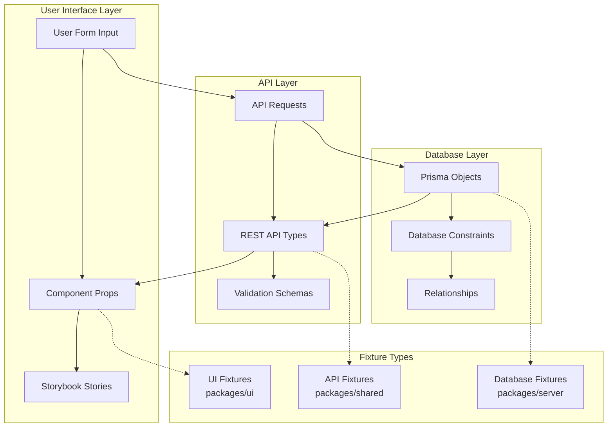
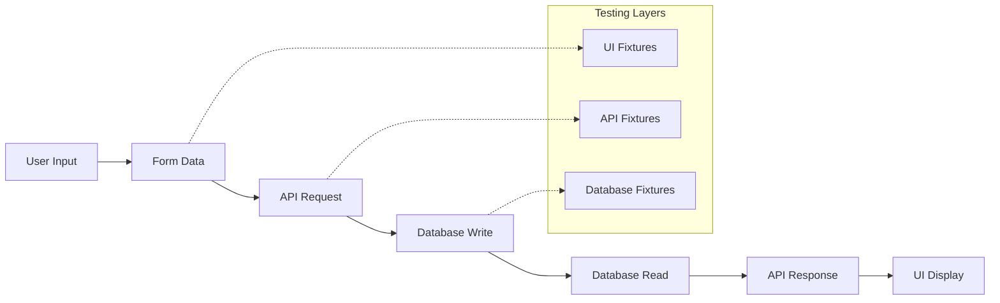

# Fixtures and Data Flow Testing Strategy

This document explains our comprehensive approach to testing data integrity across the entire Vrooli platform. If you're new to fixtures or testing, this guide will teach you why they're essential and how they ensure our app works correctly from user input all the way to the database and back.

## Table of Contents

- [What Are Fixtures and Why Do We Need Them?](#what-are-fixtures-and-why-do-we-need-them)
- [The Problem We're Solving](#the-problem-were-solving)
- [Our Three-Tier Solution](#our-three-tier-solution)
- [Data Flow Architecture](#data-flow-architecture)
- [Fixture Structure and Variants](#fixture-structure-and-variants)
- [Round-Trip Testing Implementation](#round-trip-testing-implementation)
- [Testing Strategies](#testing-strategies)
- [Implementation Guidelines](#implementation-guidelines)
- [Best Practices](#best-practices)
- [Getting Started](#getting-started)

## What Are Fixtures and Why Do We Need Them?

### What Are Fixtures?

**Fixtures** are predefined, consistent test data that represent real objects in your application. Think of them as "fake but realistic" data that you use for testing instead of relying on random or inconsistent test data.

For example, instead of creating a user like this in every test:
```typescript
// ❌ Inconsistent test data
const user = { name: "Test User", id: "123" }; // Different in every test
```

We create a fixture like this:
```typescript
// ✅ Consistent fixture
export const testUser = {
    id: "user_123456789012345678",
    name: "Alice Johnson", 
    email: "alice.johnson@example.com",
    // ... complete, realistic data
};
```

### Why Are Fixtures Critical for Vrooli?

Vrooli is a complex application where data flows through multiple layers:

1. **User types** in a form ("Create a new project called 'AI Assistant'")
2. **Form submits** to our API with structured data
3. **API validates** and saves to database
4. **Database stores** with relationships and constraints
5. **API fetches** data back for display
6. **UI renders** the data to the user

**Without fixtures**, we can't be confident that:
- The form data gets properly transformed for the API
- The API correctly saves to the database
- The database data gets properly returned to the UI
- The user sees exactly what they originally entered

**With fixtures**, we can test the complete round-trip and catch bugs like:
- User enters "AI Assistant" but UI shows "undefined"
- Form submits tags but they disappear in the database
- Permissions get lost during data transformation
- IDs change unexpectedly between layers

## The Problem We're Solving

### Without Proper Fixtures: Data Chaos

```typescript
// ❌ Test files create inconsistent data
// File 1: ProjectForm.test.tsx
const project = { name: "Test", id: 1 };

// File 2: ProjectAPI.test.ts  
const project = { title: "Test Project", projectId: "abc123" };

// File 3: ProjectDatabase.test.ts
const project = { name: "Test Project", id: "proj_123", ownerId: "user_456" };
```

**Result**: Tests pass individually but the app breaks because:
- Field names don't match (`name` vs `title`)
- ID formats are inconsistent (`1` vs `"abc123"` vs `"proj_123"`)
- Missing required fields cause runtime errors
- No way to test data flowing between layers

### With Our Fixture Strategy: Data Confidence

```typescript
// ✅ Same logical project across all layers
// Database layer
export const projectDbFixture = {
    id: "proj_123456789012345678",
    name: "AI Assistant Project",
    // ... complete database structure
};

// API layer  
export const projectApiFixture = {
    id: "proj_123456789012345678", // SAME ID
    name: "AI Assistant Project",   // SAME NAME
    // ... complete API structure
};

// UI layer
export const projectFormFixture = {
    name: "AI Assistant Project",   // SAME NAME
    // ... complete form structure
};
```

**Result**: We can test that user input → database → UI display works perfectly!

## Our Three-Tier Solution

We mirror our application architecture with three types of fixtures:



### 1. Database Fixtures (Server Package)
**What**: Prisma objects that can be saved to the database
**Why**: Ensure database constraints, relationships, and migrations work
**Example**: Complete user with all required fields, foreign keys, and relationships

### 2. API Fixtures (Shared Package)  
**What**: REST API types and validation schemas
**Why**: Ensure API requests/responses match the database and UI expectations
**Example**: User object with `__typename`, permissions, and computed fields

### 3. UI Fixtures (UI Package)
**What**: Component props, form data, and Storybook mocks
**Why**: Ensure components render correctly and forms submit proper data
**Example**: Form input data and component display states

## Data Flow Architecture

### Complete Data Transformation Flow



### Layer Responsibilities

| Layer | Package | Purpose | Example Data |
|-------|---------|---------|--------------|
| **UI** | `packages/ui` | Component props, form data, MSW responses | User input, display states, loading states |
| **API** | `packages/shared` | REST API types, validation schemas | Request/response objects, type definitions |
| **Database** | `packages/server` | Prisma objects, database constraints | Entity relationships, foreign keys, indexes |

## Fixture Structure and Variants

### Why Different Fixture Variants?

Each fixture type serves a specific purpose in our testing strategy:

| Fixture Type | Purpose | What It Tests | Example Use |
|--------------|---------|---------------|-------------|
| **Database Fixtures** | Can be saved to Postgres | Database constraints, relationships, migrations | "Does this user data actually save correctly?" |
| **API Fixtures** | Match REST API schema | API request/response structure, validation | "Does the API return the right shape of data?" |
| **Form Data Fixtures** | User input simulation | Form validation, submission | "What happens when user types this?" |
| **Component Fixtures** | UI rendering | Component display, interactions | "Does this data render correctly?" |
| **Error State Fixtures** | Failure scenarios | Error handling, edge cases | "What if the API returns an error?" |
| **Loading State Fixtures** | Async operations | Loading indicators, skeleton screens | "What does the user see while loading?" |

### Directory Organization

```
packages/
├── server/src/__test/fixtures/          # 🗄️  DATABASE FIXTURES
│   └── db/                              # Database-specific fixtures
│       ├── userFixtures.ts              # Prisma User objects (can save to DB)
│       ├── projectFixtures.ts           # Prisma Project objects (with relationships)
│       └── swarmFixtures.ts             # Prisma Swarm objects (complex nested data)
│
├── shared/src/validation/models/        # 🔗 API FIXTURES (via package exports)
│   └── __test/fixtures/                 # Exported as @vrooli/shared/validation/models/fixtures
│       ├── userFixtures.ts              # API User types (already exist)
│       ├── projectFixtures.ts           # API Project types (would be added)
│       └── swarmFixtures.ts             # API Swarm types (would be added)
│
└── ui/src/__test/fixtures/              # 🎨 UI FIXTURES
    ├── api-responses/                   # What components receive from API calls
    │   ├── userResponses.ts             # User data as components see it
    │   ├── projectResponses.ts          # Project data with UI-specific fields
    │   └── swarmResponses.ts            # Swarm data with computed properties
    │
    ├── form-data/                       # What users type into forms
    │   ├── userFormData.ts              # Registration/profile form inputs
    │   ├── projectFormData.ts           # Project creation form inputs
    │   └── swarmFormData.ts             # Swarm configuration form inputs
    │
    ├── ui-states/                       # Component-specific states
    │   ├── loadingStates.ts             # Loading skeletons, spinners
    │   ├── errorStates.ts               # Error messages, retry states
    │   └── permissionStates.ts          # User permission combinations
    │
    ├── sessions/                        # User authentication states
    │   └── sessionFixtures.ts           # Logged out, premium, admin, etc.
    │
    └── round-trip-tests/                # 🔄 ROUND-TRIP TESTS
        ├── projectRoundTrip.test.ts     # Form → API → DB → API → UI
        ├── userRoundTrip.test.ts        # Complete user data flow tests
        └── swarmRoundTrip.test.ts       # Complex swarm data flow tests
```

### Fixture Categories

#### 1. Database Fixtures (Server)

```typescript
// packages/server/src/__test/fixtures/db/projectFixtures.ts
import { type Prisma } from "@prisma/client";

export const baseProjectDb: Prisma.ProjectCreateInput = {
    id: "proj_123456789012345678",
    publicId: "awesome-ai-project",
    name: "Awesome AI Project",
    description: "An advanced AI automation system",
    isPrivate: false,
    createdAt: new Date("2024-01-01T00:00:00Z"),
    updatedAt: new Date("2024-01-01T00:00:00Z"),
    // Prisma relationships
    owner: { connect: { id: "user_123456789012345678" } },
    translations: {
        create: [{
            language: "en",
            name: "Awesome AI Project",
            description: "An advanced AI automation system"
        }]
    }
}
```

#### 2. API Fixtures (Shared)

```typescript
// packages/shared/src/validation/models/__test/fixtures/projectApiFixtures.ts
import { type Project } from "@vrooli/shared";

export const projectApiResponse: Project = {
    __typename: "Project",
    id: "proj_123456789012345678",  // SAME ID as database
    publicId: "awesome-ai-project",  // SAME as database
    name: "Awesome AI Project",      // SAME as database
    description: "An advanced AI automation system", // SAME as database
    isPrivate: false,
    createdAt: "2024-01-01T00:00:00Z",
    updatedAt: "2024-01-01T00:00:00Z",
    // API-specific fields
    you: {
        __typename: "ProjectYou",
        canUpdate: true,
        canDelete: true,
        isBookmarked: false
    },
    owner: {
        __typename: "User",
        id: "user_123456789012345678",
        handle: "project-owner",
        name: "Project Owner"
    }
}
```

#### 3. UI Fixtures (UI Package)

```typescript
// packages/ui/src/__test/fixtures/form-data/projectFormData.ts
export const projectFormInput = {
    name: "Awesome AI Project",      // SAME as API/database
    description: "An advanced AI automation system", // SAME as API/database
    isPrivate: false,               // SAME as API/database
    tags: ["ai", "automation"],     // UI-specific
    language: "en"                  // UI-specific
}

// packages/ui/src/__test/fixtures/api-responses/projectResponses.ts
export const projectStoryResponse = {
    __typename: "Project" as const,
    id: "proj_123456789012345678",  // SAME ID across all layers
    name: "Awesome AI Project",      // SAME data
    description: "An advanced AI automation system",
    // UI-optimized structure
    you: { canUpdate: true, isBookmarked: false },
    stats: { views: 150, bookmarks: 23 }
}
```

## Round-Trip Testing Implementation

### What Is Round-Trip Testing?

Round-trip testing ensures that data maintains its integrity as it flows through your entire application stack. Think of it like this:

1. **User inputs** "AI Assistant Project" in a form
2. **Form transforms** this to API request data  
3. **API saves** to database with proper relationships
4. **Database returns** the saved data
5. **API transforms** database data for UI consumption
6. **UI displays** "AI Assistant Project" back to the user

**Round-trip testing verifies** that step 6 shows exactly what the user entered in step 1.

### Where Round-Trip Tests Live

Round-trip tests are placed in the **UI package** because they test the complete user experience:

```
packages/ui/src/__test/fixtures/round-trip-tests/
├── projectRoundTrip.test.ts           # Test project creation flow
├── userRoundTrip.test.ts              # Test user registration flow  
├── swarmRoundTrip.test.ts             # Test swarm configuration flow
└── helpers/
    ├── setupTestDatabase.ts           # Test database utilities
    ├── mockApiServer.ts              # Test API server setup
    └── roundTripHelpers.ts           # Common test utilities
```

### Complete Round-Trip Test Example

```typescript
// packages/ui/src/__test/fixtures/round-trip-tests/projectRoundTrip.test.ts

import { describe, test, expect, beforeEach, afterEach } from 'vitest';
import { setupTestDatabase, cleanupTestDatabase } from './helpers/setupTestDatabase.js';
import { projectFormInput } from '../form-data/projectFormData.js';
// UI package CANNOT import from @vrooli/server - this is a limitation!
// Instead, we use the shared fixtures and API calls
import { projectApiFixture } from '@vrooli/shared/validation/models/fixtures';

describe('Project Round-Trip Data Flow', () => {
    beforeEach(async () => {
        await setupTestDatabase();
    });

    afterEach(async () => {
        await cleanupTestDatabase();
    });

    test('project creation maintains data integrity through complete flow', async () => {
        // 🎨 STEP 1: User fills out form
        const userFormData = {
            name: "AI Assistant Project",
            description: "An advanced AI automation system",
            tags: ["ai", "automation", "assistant"],
            isPrivate: false
        };
        
        // 🔗 STEP 2: Form submits to API
        const apiCreateRequest = transformFormToCreateRequest(userFormData);
        expect(apiCreateRequest.name).toBe(userFormData.name);
        expect(apiCreateRequest.description).toBe(userFormData.description);
        
        // 🗄️ STEP 3: API saves to database  
        const savedProject = await projectService.create(apiCreateRequest);
        expect(savedProject.name).toBe(userFormData.name);
        expect(savedProject.id).toMatch(/^proj_\d{18}$/); // Proper ID format
        
        // 🔗 STEP 4: API fetches from database
        const apiResponse = await projectService.findById(savedProject.id);
        expect(apiResponse.name).toBe(userFormData.name);
        expect(apiResponse.description).toBe(userFormData.description);
        expect(apiResponse.__typename).toBe("Project"); // API response type
        
        // 🎨 STEP 5: UI renders the data
        const { render, screen } = setupComponentTest();
        render(<ProjectCard project={apiResponse} />);
        
        // ✅ VERIFICATION: User sees exactly what they entered
        expect(screen.getByText("AI Assistant Project")).toBeInTheDocument();
        expect(screen.getByText("An advanced AI automation system")).toBeInTheDocument();
        expect(screen.getByTestId('project-privacy')).toHaveTextContent('Public');
        
        // 🏷️ STEP 6: Test tag round-trip specifically
        const projectWithTags = await projectService.findByIdWithTags(savedProject.id);
        expect(projectWithTags.tags).toEqual(["ai", "automation", "assistant"]);
    });

    test('project editing preserves existing data', async () => {
        // Create initial project using API (no direct DB access from UI)
        const createRequest = transformFormToCreateRequest(projectFormInput);
        const initialProject = await projectService.create(createRequest);
        
        // User edits the project
        const editFormData = {
            ...projectFormInput,
            name: "Updated AI Assistant",
            description: "Updated description"
        };
        
        // Submit edit
        const updateRequest = transformFormToUpdateRequest(editFormData);
        const updatedProject = await projectService.update(initialProject.id, updateRequest);
        
        // Verify data integrity
        expect(updatedProject.name).toBe("Updated AI Assistant");
        expect(updatedProject.description).toBe("Updated description");
        expect(updatedProject.id).toBe(initialProject.id); // ID unchanged
        expect(updatedProject.createdAt).toBe(initialProject.createdAt); // Created date unchanged
    });
    
    test('project permissions flow correctly', async () => {
        // Create project as one user (using API, not direct DB access)
        const createRequest = {
            ...transformFormToCreateRequest(projectFormInput),
            ownerId: "user_123456789012345678"
        };
        const project = await projectService.create(createRequest);
        
        // Fetch as different user
        const apiResponse = await projectService.findById(project.id, {
            requestingUserId: "user_987654321098765432"
        });
        
        // Verify permissions are correct
        expect(apiResponse.you.canUpdate).toBe(false); // Not the owner
        expect(apiResponse.you.canDelete).toBe(false); // Not the owner
        expect(apiResponse.you.canBookmark).toBe(true); // Anyone can bookmark
    });
});
```

### UI Package Limitations and Solutions

**Important Architecture Constraint:** The UI package cannot import from `@vrooli/server` package. This means UI round-trip tests cannot directly access database fixtures.

#### The Problem
```typescript
// ❌ This WILL NOT WORK in UI package
import { projectDbFixture } from '@vrooli/server/fixtures'; // Error: No access to server
```

#### The Solution: API-Only Round-Trip Testing

Instead of testing UI → API → DB → API → UI, we test **UI → API → API → UI**:

```typescript
// ✅ This WORKS in UI package
import { projectApiFixture } from '@vrooli/shared/validation/models/fixtures';

test('round-trip through API layer', async () => {
    // 1. Start with form data
    const formData = projectFormInput;
    
    // 2. Transform to API request
    const apiRequest = transformFormToCreateRequest(formData);
    
    // 3. Create via API (which handles DB internally)
    const createdProject = await projectService.create(apiRequest);
    
    // 4. Fetch via API (which handles DB internally)  
    const fetchedProject = await projectService.findById(createdProject.id);
    
    // 5. Verify round-trip integrity
    expect(fetchedProject.name).toBe(formData.name);
    expect(fetchedProject.description).toBe(formData.description);
});
```

#### Where Full DB Testing Happens

Full database round-trip tests live in the **server package**:

```typescript
// packages/server/src/__test/integration/projectRoundTrip.test.ts
import { projectDbFixture } from '../fixtures/db/projectFixtures.js';
import { projectApiFixture } from '@vrooli/shared/validation/models/fixtures';

test('complete database round-trip', async () => {
    // Direct database operations + API transformations
    const savedProject = await prisma.project.create({ data: projectDbFixture });
    const apiResponse = transformDbToApi(savedProject);
    expect(apiResponse).toMatchObject(projectApiFixture);
});
```

### Benefits of This Approach

1. **Catch Integration Bugs**: Find issues where data gets corrupted between layers
2. **Verify Transformations**: Ensure form data → API → database → API → UI works
3. **Test Real Workflows**: Simulate actual user interactions end-to-end
4. **Prevent Regressions**: Changes to one layer don't break others
5. **Document Data Flow**: Tests serve as living documentation of how data moves
6. **Respect Architecture**: Each package tests what it has access to

## Testing Strategies

### 1. Unit Testing with Fixtures (Simple)

```typescript
// Test individual component rendering
import { projectStoryResponse } from '../fixtures/api-responses/projectResponses.js';

test('ProjectCard displays project name correctly', () => {
    render(<ProjectCard project={projectStoryResponse} />);
    expect(screen.getByText('AI Assistant Project')).toBeInTheDocument();
});
```

### 2. Integration Testing (Medium Complexity)

```typescript
// Test API transformations  
import { projectFormInput } from '../fixtures/form-data/projectFormData.js';
import { projectApiResponse } from '@vrooli/shared/validation/models/fixtures';

test('form data transforms to API request correctly', async () => {
    const apiRequest = transformFormToApi(projectFormInput);
    expect(apiRequest.name).toBe(projectFormInput.name);
    expect(apiRequest.isPrivate).toBe(projectFormInput.isPrivate);
});
```

### 3. Round-Trip Testing (Full Complexity)

```typescript
// Test complete data flow (shown in detail above)
test('maintains data integrity through complete user workflow', async () => {
    // User input → Form → API → Database → API → UI display
    // Verifies no data is lost or corrupted at any step
});
```

### 4. Storybook Testing (Visual)

```typescript
// Use fixtures for consistent Storybook stories
import { projectStoryResponse } from '../fixtures/api-responses/projectResponses.js';

export const DefaultProject = {
    args: { project: projectStoryResponse }
};

export const LoadingProject = {
    args: { project: null, loading: true }
};
```

## Implementation Guidelines

### 1. Fixture Naming Conventions

```typescript
// Database fixtures (server)
export const baseUserDb: Prisma.UserCreateInput
export const completeUserDb: Prisma.UserCreateInput  
export const adminUserDb: Prisma.UserCreateInput

// API fixtures (shared)
export const userApiResponse: User
export const userListApiResponse: UserSearchResult
export const userProfileApiResponse: UserProfile

// UI fixtures (ui)
export const userFormInput: UserFormData
export const userStoryResponse: UserStoryData
export const userLoadingState: LoadingState
```

### 2. Data Consistency Rules

1. **Identical Core Data**: ID, name, description must match across layers
2. **Layer-Specific Extensions**: Each layer adds what it needs
3. **Timestamp Standardization**: Use ISO 8601 format consistently
4. **ID Generation**: Use same ID generation strategy (`generatePK()`)

### 3. Factory Pattern Implementation

```typescript
// Create flexible fixture factories
export class ProjectFixtureFactory {
    static createDbFixture(overrides?: Partial<Prisma.ProjectCreateInput>) {
        return { ...baseProjectDb, ...overrides };
    }
    
    static createApiFixture(overrides?: Partial<Project>) {
        return { ...projectApiResponse, ...overrides };
    }
    
    static createFormFixture(overrides?: Partial<ProjectFormData>) {
        return { ...projectFormInput, ...overrides };
    }
}
```

### 4. Transformation Utilities

```typescript
// Helper functions to convert between fixture types
import { type Prisma } from "@prisma/client";
import { type Project } from "@vrooli/shared";

export function dbToApi(dbProject: Prisma.Project): Project {
    return {
        __typename: "Project",
        id: dbProject.id,
        name: dbProject.name,
        // ... transformation logic
    };
}

export function apiToForm(apiProject: Project): ProjectFormData {
    return {
        name: apiProject.name,
        description: apiProject.description,
        // ... transformation logic
    };
}
```

## Best Practices

### 1. Fixture Maintenance

- **Single Source of Truth**: Core data values defined once, referenced everywhere
- **Version Control**: Track fixture changes with meaningful commit messages
- **Documentation**: Comment complex fixture relationships and transformations
- **Regular Updates**: Keep fixtures in sync with schema changes

### 2. Test Data Management

- **Realistic Data**: Use data that represents real-world scenarios
- **Edge Cases**: Include fixtures for boundary conditions and error states
- **Performance**: Optimize fixture size for test execution speed
- **Isolation**: Ensure fixtures don't create dependencies between tests

### 3. Type Safety

```typescript
// Use strict typing for fixtures
import { type Project } from "@vrooli/shared";
import { generatePK } from "@vrooli/shared";

export const typedProjectFixture: Project = {
    __typename: "Project", // Required for API responses
    id: generatePK().toString(),
    // ... TypeScript enforces all required fields
} as const; // Prevents accidental mutations
```

### 4. Error State Fixtures

```typescript
// Create fixtures for error scenarios
export const projectErrorStates = {
    notFound: {
        error: "Project not found",
        code: "PROJECT_NOT_FOUND"
    },
    unauthorized: {
        error: "Insufficient permissions",
        code: "UNAUTHORIZED"
    },
    validationError: {
        error: "Invalid project data",
        code: "VALIDATION_ERROR",
        details: { name: "Name is required" }
    }
};
```

## Integration with Existing Systems

### 1. Storybook Integration

```typescript
// Enhanced MSW handlers using fixtures
import { http, HttpResponse } from 'msw';
import { projectStoryResponse } from '../fixtures/api-responses/projectResponses.js';

export const projectHandlers = [
    http.get('/api/projects/:id', ({ params }) => {
        return HttpResponse.json({
            data: { ...projectStoryResponse, id: params.id }
        });
    })
];
```

### 2. Vitest Integration

```typescript
// Setup fixtures in test configuration
import { beforeEach } from 'vitest';
import { resetFixtures, loadFixtures } from '../fixtures/index.js';

beforeEach(async () => {
    await resetFixtures();
    await loadFixtures(['users', 'projects', 'swarms']);
});
```

### 3. Database Seeding

```typescript
// Use fixtures for consistent database seeding
import { baseProjectDb, completeUserDb } from '../fixtures/index.js';

export async function seedTestDatabase() {
    await prisma.user.createMany({ data: [completeUserDb] });
    await prisma.project.createMany({ data: [baseProjectDb] });
}
```

## Getting Started

### Step 1: Understand the Current State

Before implementing fixtures, familiarize yourself with our existing structure:

```bash
# View current test fixtures
ls packages/server/src/__test/fixtures/    # Database fixtures (already exist)
ls packages/shared/src/__test/fixtures/    # API fixtures (already exist)  
ls packages/ui/src/__test/                # UI tests (needs fixture structure)
```

### Step 2: Start with One Entity

Pick a simple entity (like `Project` or `User`) and create the complete fixture chain:

1. **Use existing database fixture** from `packages/server/src/__test/fixtures/`
2. **Use existing API fixture** from `packages/shared/src/__test/fixtures/`
3. **Create UI fixtures** following the structure above
4. **Write a round-trip test** to verify the complete flow

### Step 3: Verify Data Consistency

```typescript
// Example verification script (run this in server package where you have access to both)
import { baseProjectDb } from '../__test/fixtures/db/projectFixtures.js';
import { projectApiFixture } from '@vrooli/shared/validation/models/fixtures';
import { projectFormInput } from '@vrooli/ui/fixtures/form-data/projectFormData.js';

console.log('Database name:', baseProjectDb.name);
console.log('API name:', projectApiFixture.name);
console.log('Form name:', projectFormInput.name);
// Should all print the same value!
```

### Step 4: Add to Your Workflow

1. **When writing components**: Use UI fixtures for props
2. **When writing forms**: Use form data fixtures for testing input
3. **When writing API logic**: Use API fixtures for request/response testing  
4. **When writing database logic**: Use database fixtures for persistence testing
5. **When writing features**: Write round-trip tests for critical user workflows

### Step 5: Maintain Consistency

- **Update all fixture layers** when changing data structure
- **Add new fixture variants** for new UI states or error conditions
- **Keep fixture data realistic** and representative of actual usage
- **Document complex relationships** between fixture variants

## Benefits Summary

### For Developers
- **Faster testing**: Consistent, reusable test data
- **Fewer bugs**: Catch data transformation issues early
- **Better debugging**: Know exactly what data should look like at each layer
- **Easier maintenance**: Change fixture once, affects all tests

### For the Application
- **Data integrity**: Ensure user input survives the complete journey
- **Type safety**: Fixtures enforce consistent data shapes
- **Regression prevention**: Tests catch breaking changes between layers
- **Documentation**: Fixtures serve as examples of correct data structure

### For Users
- **Reliable experience**: Data they enter is data they see
- **Consistent behavior**: Features work predictably across the app
- **Fewer errors**: Robust testing means fewer production bugs
- **Better performance**: Well-tested data flows are optimized flows

## Conclusion

This fixture strategy provides a robust foundation for testing data flow integrity across the entire Vrooli platform. By maintaining consistency between database, API, and UI layers, we can confidently test complex user workflows and catch transformation bugs early in the development process.

**The key insight**: Fixtures aren't just test data—they're a guarantee that your application preserves user intent throughout the entire data journey.

For implementation questions or to propose improvements to this strategy, please refer to the [Test Strategy](./test-strategy.md) or contribute to the documentation directly.