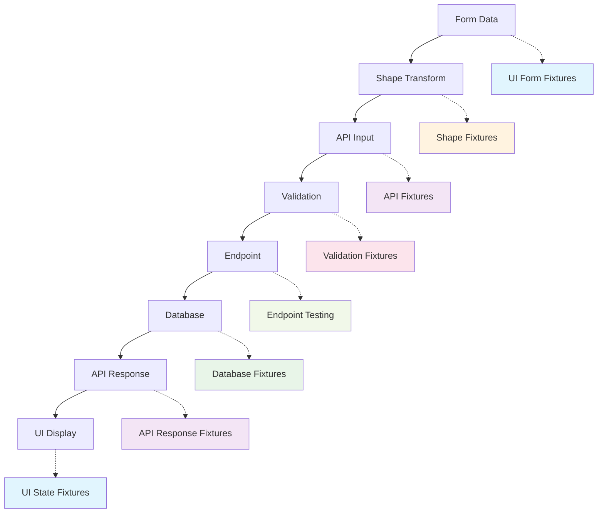
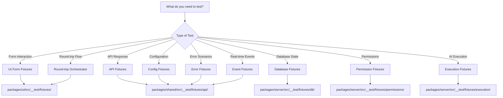

# Fixtures Overview - Quick Reference Guide

This document provides a quick reference for using fixtures in the Vrooli testing ecosystem. For detailed patterns and implementation guides, see the related documents listed below.

**Purpose**: Get started quickly with fixtures for testing data integrity across the Vrooli platform.

**Prerequisites**: Basic understanding of TypeScript and Vitest testing framework.

**Related Documents**:
- [Fixture Patterns](./fixture-patterns.md) - Detailed patterns and best practices
- [Round-Trip Testing](./round-trip-testing.md) - End-to-end data flow testing
- [Fixture Implementation Guide](./fixture-implementation-guide.md) - Step-by-step roadmap
- [Fixture Reference](./fixture-reference.md) - Complete API reference

## Unified Fixture Architecture Overview

The Vrooli testing ecosystem uses a comprehensive fixture system across three main packages, providing type-safe, realistic test data for all 41+ object types. Each fixture layer serves a specific purpose in the testing pipeline.



## Quick Decision Tree



## Fixture Types Overview

### 🎨 UI Fixtures (`packages/ui/src/__test/fixtures/`)
**Purpose**: Production-grade frontend testing infrastructure with real database integration

**Key Features**:
- Type-safe fixture factories using real @vrooli/shared functions
- True round-trip testing (Form → API → Database → Response → UI)
- Testcontainers PostgreSQL integration for real database testing
- MSW handlers generated from fixture responses
- React Hook Form integration for component testing
- Comprehensive scenario orchestration (create, update, delete, verify)

**Architecture**:
```
fixtures/
├── factories/          # Type-safe fixture factories
├── integrations/       # Real database integration tests
├── scenarios/          # Multi-step workflow orchestrators
├── states/             # UI state management fixtures
├── api-responses/      # MSW response handlers
├── form-data/          # React Hook Form integration
└── types.ts           # Core type definitions
```

**Usage**:
```typescript
import { BookmarkFixtureFactory, BookmarkIntegrationTest } from "@/test/fixtures";

// Type-safe form data generation
const factory = new BookmarkFixtureFactory();
const formData = factory.createFormData('withNewList');

// Real database integration testing
const integration = new BookmarkIntegrationTest();
const result = await integration.testCompleteFlow({
  formData,
  shouldSucceed: true
});

expect(result.success).toBe(true);
expect(result.data.databaseRecord).toBeDefined();
```

### 🔗 API Fixtures (`packages/shared/src/__test/fixtures/api/`)
**Purpose**: Shared validation and transformation layer between UI and database

**Key Features**:
- Type-safe fixtures for all 41+ object types
- Integration with real shape functions and validation schemas
- Minimal/complete/invalid/edge case scenarios
- Factory patterns for dynamic data generation

**Usage**:
```typescript
import { userFixtures, shapeUser, userValidation } from "@vrooli/shared";

// API input testing
const input = userFixtures.minimal.create;
const shaped = shapeUser.create(input);
const validation = await userValidation.create.validate(shaped);
```

### 🗄️ Database Fixtures (`packages/server/src/__test/fixtures/db/`)
**Purpose**: Server-side persistence and seeding layer using real Prisma operations

**Key Features**:
- Prisma-based database seeding with testcontainers
- Complex relationship setup and management
- Transaction-based testing support
- Cleanup and verification utilities

**Usage**:
```typescript
import { UserDbFactory, createTestUser } from "../../__test/fixtures/db/userFixtures.js";

// Database seeding
const user = await createTestUser({ name: "Test User" });
const userWithTeams = await UserDbFactory.createWithRelations({
  teams: 3,
  withBots: true
});
```

### ⚙️ Config Fixtures (`packages/shared/src/__test/fixtures/config/`)
**Purpose**: Foundational configuration layer for JSON fields across all object types

**Key Features**:
- Realistic configuration objects for all features
- Minimal/complete/variant patterns
- Used by other fixtures for JSON field population
- Validation and composition helpers

**Usage**:
```typescript
import { botConfigFixtures, chatConfigFixtures } from "@vrooli/shared/__test/fixtures/config";

// JSON field population
const bot = {
  ...userFixtures.minimal.create,
  botSettings: botConfigFixtures.complete, // Use config fixture
};

const chat = {
  ...chatFixtures.minimal.create,
  chatSettings: chatConfigFixtures.variants.supportChat,
};
```

### 🚨 Error Fixtures (`packages/shared/src/__test/fixtures/errors/`)
**Purpose**: Comprehensive error scenario testing across all application layers

**Key Features**:
- API errors (400-500 status codes)
- Network errors (timeouts, connection failures)
- Validation errors with field details
- Business logic and system errors
- Error recovery and retry testing

**Usage**:
```typescript
import { apiErrorFixtures, networkErrorFixtures } from "@vrooli/shared/__test/fixtures/errors";

// Error state testing
const notFoundError = apiErrorFixtures.notFound.standard;
const timeoutError = networkErrorFixtures.timeout.client;

render(<ErrorBoundary error={notFoundError} />);
```

### 📡 Event Fixtures (`packages/shared/src/__test/fixtures/events/`)
**Purpose**: Real-time event simulation for WebSocket, chat, and collaborative features

**Key Features**:
- Socket connection lifecycle events
- Chat messaging and presence events
- AI swarm execution events
- Event sequences and timing simulation
- State synchronization testing

**Usage**:
```typescript
import { chatEventFixtures, swarmEventFixtures } from "@vrooli/shared/__test/fixtures/events";

// Real-time event testing
const message = chatEventFixtures.messages.textMessage;
const progress = swarmEventFixtures.execution.progress;

mockSocket.emit(message.event, message.data);
```

### 🔐 Permission Fixtures (`packages/server/src/__test/fixtures/permissions/`)
**Purpose**: Authentication and authorization testing for all user scenarios

**Key Features**:
- User personas (admin, member, guest, suspended)
- API key permissions and rate limiting
- Team-based permission scenarios
- Multi-user interaction testing
- Security boundary validation

**Usage**:
```typescript
import { userPersonas, apiKeyPermissions } from "../../__test/fixtures/permissions";

// Permission testing
const adminSession = userPersonas.admin.session;
const guestPermissions = apiKeyPermissions.readOnly;

const result = await testEndpoint(adminSession, input);
```

### 🤖 Execution Fixtures (`packages/server/src/__test/fixtures/execution/`)
**Purpose**: AI system testing for the three-tier intelligence architecture

**Key Features**:
- Tier 1: Coordination intelligence (swarms, MOISE+ orgs)
- Tier 2: Process intelligence (routines, navigation)
- Tier 3: Execution intelligence (strategies, tools)
- Emergent capability testing
- Cross-tier integration scenarios

**Usage**:
```typescript
import { swarmFixtures, routineFixtures } from "../../__test/fixtures/execution";

// AI system testing
const swarm = swarmFixtures.customerSupport.complete;
const routine = routineFixtures.dataProcessing.simple;

const result = await executeSwarmWorkflow(swarm, routine);
```

### 🛠️ UI Test Helpers (`packages/ui/src/__test/helpers/`)
**Purpose**: Testing utilities and infrastructure for UI component testing

**Key Features**:
- React Testing Library integration
- MSW setup and API mocking
- Storybook decorators and utilities
- Form testing helpers
- Async testing patterns

**Usage**:
```typescript
import { renderWithProviders, setupMSW } from "../../__test/helpers";

// Component testing
setupMSW([userEndpointHandlers]);
const { getByRole } = renderWithProviders(<UserProfile userId="123" />);
```

## Key Imports - Quick Reference

```typescript
// Shape Functions (for transformations)
import { shapeBookmark, shapeComment, shapeTeam } from "@vrooli/shared";

// Validation Schemas
import { bookmarkValidation, commentValidation, teamValidation } from "@vrooli/shared";

// API Endpoints
import { endpointsBookmark, endpointsComment, endpointsTeam } from "@vrooli/shared";

// Test Fixtures
import { userFixtures, teamFixtures } from "@vrooli/shared/__test/fixtures/api";
import { botConfigFixtures, chatConfigFixtures } from "@vrooli/shared/__test/fixtures/config";
// Or with namespace imports
import { apiFixtures, configFixtures } from "@vrooli/shared/__test/fixtures";

// Action Hooks
import { useBookmarker, useVoter, useCopier, useDeleter } from "../hooks/objectActions.js";

// API Fetching
import { useLazyFetch } from "../hooks/useFetch.js";

// ID Generation
import { generatePK, DUMMY_ID } from "@vrooli/shared";
```

## Using Centralized Fixtures

The shared package provides centralized fixtures in `@vrooli/shared/__test/fixtures/`:

### API Fixtures

```typescript
// Import specific fixtures
import { userFixtures, teamFixtures } from "@vrooli/shared/__test/fixtures/api";

// Use in tests
const testUser = userFixtures.complete.create;
const minimalTeam = teamFixtures.minimal.create;

// Or import all API fixtures
import { apiFixtures } from "@vrooli/shared/__test/fixtures";
const user = apiFixtures.userFixtures.complete.create;
```

### Config Fixtures

```typescript
// Import specific config fixtures
import { botConfigFixtures, chatConfigFixtures } from "@vrooli/shared/__test/fixtures/config";

// Use in tests
const botSettings = botConfigFixtures.complete;
const chatConfig = chatConfigFixtures.variants.privateTeamChat;

// Or import all config fixtures
import { configFixtures } from "@vrooli/shared/__test/fixtures";
const routineConfig = configFixtures.routineConfigFixtures.action.simple;
```

### Error Fixtures

```typescript
// Import error fixtures
import { apiErrorFixtures, networkErrorFixtures } from "@vrooli/shared/__test/fixtures/errors";

// Use in tests
const notFound = apiErrorFixtures.notFound.standard;
const timeout = networkErrorFixtures.timeout.client;

// Or import all error fixtures
import { errorFixtures } from "@vrooli/shared/__test/fixtures";
const rateLimit = errorFixtures.api.rateLimit.standard;
```

### Event Fixtures

Event fixtures provide real-time WebSocket event simulation for testing live functionality across the platform. They're essential for testing chat, swarm execution, notifications, and collaborative features.

```typescript
// Import specific event fixtures
import { chatEventFixtures, swarmEventFixtures } from "@vrooli/shared/__test/fixtures/events";
import { socketEventFixtures, notificationEventFixtures } from "@vrooli/shared/__test/fixtures/events";

// Use in tests - individual events
const message = chatEventFixtures.messages.textMessage;
const swarmState = swarmEventFixtures.state.running;
const notification = notificationEventFixtures.notifications.newMessage;

// Use event sequences for complex flows
await socket.emitSequence(chatEventFixtures.sequences.botResponseFlow);
await socket.emitSequence(swarmEventFixtures.sequences.basicLifecycle);

// Use factory functions for custom events
const customMessage = chatEventFixtures.factories.createMessageEvent({
    id: "custom_123",
    content: "Custom message",
    user: userFixtures.minimal.find,
});

// Or import all event fixtures with namespace
import { eventFixtures } from "@vrooli/shared/__test/fixtures";
const typing = eventFixtures.chat.typing.userStartTyping;
const connection = eventFixtures.socket.connection.connected;
```

**Key Event Categories:**
- **Socket Events**: Connection lifecycle, room management, errors
- **Chat Events**: Messages, streaming, typing, participants, bot status
- **Swarm Events**: AI agent execution, state transitions, resources
- **Notification Events**: Push notifications, alerts, API credits
- **Collaboration Events**: Run tasks, decisions, multi-user workflows
- **System Events**: Health status, deployments, performance, security

For detailed event fixture documentation, see [Event Fixtures README](/packages/shared/src/__test/fixtures/events/README.md).

### Using Fixtures in Different Packages

**In Server Tests:**
```typescript
import { userFixtures } from "@vrooli/shared/__test/fixtures/api";
import { botConfigFixtures } from "@vrooli/shared/__test/fixtures/config";

const testBot = {
    id: "bot_123",
    name: "Test Bot",
    botSettings: botConfigFixtures.complete, // Use config fixture
};
```

**In UI Tests:**
```typescript
import { apiFixtures, configFixtures } from "@vrooli/shared/__test/fixtures";

const mockApiResponse = {
    ...apiFixtures.chatFixtures.complete.create,
    chatSettings: configFixtures.chatConfigFixtures.variants.supportChat,
};
```

## Common Pitfalls to Avoid

| Pitfall | Solution |
|---------|----------|
| Creating custom interfaces when Shape types exist | Always check `@vrooli/shared` for existing types first |
| Duplicating shape transformation logic | Use `shapeX.create()` functions from shared package |
| Writing custom validation | Use `xValidation.create.validate()` from shared package |
| Mocking what you don't need to | Only mock external services; use real functions for internal logic |
| Not cleaning up test data | Always clean up database state after tests |

## What Are Fixtures?

**Fixtures** are pre-defined test data objects that represent consistent, realistic states of your application data. They serve as the foundation for reliable testing by providing:

1. **Consistent test data** - Same structure across all tests
2. **Type safety** - Full TypeScript support with Shape types
3. **Realistic scenarios** - Data that mirrors production
4. **Easy maintenance** - Centralized updates when schemas change

### Why Are Fixtures Critical for Vrooli?

Vrooli's architecture includes:
- **41 object types** with complex relationships
- **Three-tier AI system** requiring specific data states
- **Real-time features** needing consistent test scenarios
- **Multi-user workflows** requiring various permission states

Without fixtures, each test would need to manually create these complex data structures, leading to:
- Inconsistent test data
- Duplicated setup code
- Fragile tests that break with schema changes
- Difficulty testing edge cases

## Getting Started

### Step 1: Identify What You're Testing

```typescript
// Testing a UI component with form interaction?
import { BookmarkFixtureFactory } from "@/test/fixtures/factories";
import { renderWithProviders } from "@/test/testUtils";

// Testing complete data flow (form to database)?
import { BookmarkIntegrationTest } from "@/test/fixtures/integrations";

// Testing multi-step workflows?
import { UserBookmarksProjectScenario } from "@/test/fixtures/scenarios";

// Testing API endpoints directly?
import { userFixtures } from "@vrooli/shared/__test/fixtures/api";

// Testing data transformation?
import { shapeProject, projectValidation } from "@vrooli/shared";
```

### Step 2: Choose the Right Fixture Type

```typescript
// Type-safe form data for UI components
const factory = new BookmarkFixtureFactory();
const formData = factory.createFormData('minimal');

// MSW handlers for component testing
const mswHandlers = factory.createMSWHandlers().success;
server.use(...mswHandlers);

// UI state fixtures for different scenarios
const loadingState = factory.createUIState('loading');
const errorState = factory.createUIState('error', { message: 'Failed to save' });
```

### Step 3: Execute Tests

```typescript
// Component testing
describe("BookmarkForm", () => {
    it("should submit valid form data", async () => {
        const factory = new BookmarkFixtureFactory();
        const formData = factory.createFormData('complete');
        
        const { getByRole } = renderWithProviders(<BookmarkForm />);
        
        // Simulate user filling form
        await userEvent.type(getByRole('textbox', { name: /list name/i }), formData.newListLabel);
        await userEvent.click(getByRole('button', { name: /save/i }));
        
        await waitFor(() => {
            expect(getByRole('alert')).toHaveTextContent('Bookmark saved');
        });
    });
});

// Integration testing
describe("Bookmark Integration", () => {
    it("should complete full bookmark creation flow", async () => {
        const integration = new BookmarkIntegrationTest();
        const factory = new BookmarkFixtureFactory();
        
        const result = await integration.testCompleteFlow({
            formData: factory.createFormData('withNewList'),
            shouldSucceed: true
        });
        
        expect(result.success).toBe(true);
        expect(result.data.databaseRecord).toBeDefined();
        expect(result.data.apiResponse.list.label).toBe('My New List');
    });
});
```

## Quick Examples

### Testing API Response
```typescript
import { apiFixtures } from "@vrooli/shared/__test/fixtures";

const mockResponse = {
    ...apiFixtures.projectFixtures.complete.find,
    team: apiFixtures.teamFixtures.minimal.find,
};
```

### Testing Form Submission
```typescript
import { shapeProject, projectValidation } from "@vrooli/shared";

const formData = { name: "Test Project", description: "Test" };
const validation = await projectValidation.create.validate(formData);
const apiRequest = shapeProject.create(formData);
```

### Testing with Relationships
```typescript
const project = apiFixtures.projectFixtures.complete.create;
const teamWithProjects = {
    ...apiFixtures.teamFixtures.complete.create,
    projects: [project],
};
```

## Database Fixtures

Database fixtures handle the persistence layer in our testing ecosystem. They're located in `packages/server/src/__test/fixtures/db/` and provide:

### Purpose
- **Prisma Integration**: Type-safe database operations using Prisma's generated types
- **Relationship Management**: Easy setup of complex object graphs
- **Test Isolation**: Transaction-based cleanup for test independence
- **Bulk Operations**: Efficient seeding of multiple records

### Key Features
```typescript
// Import database fixtures
import { UserDbFactory, TeamDbFactory } from "../__test/fixtures/db";

// Create minimal user
const user = await UserDbFactory.createMinimal({ name: "Test User" });

// Create user with relationships
const userWithTeams = await UserDbFactory.createWithRelations({
  teams: [
    { teamId: "team_123", role: "Owner" },
    { teamId: "team_456", role: "Member" }
  ],
  withAuth: true
});

// Bulk operations
const users = await UserDbFactory.seedMultiple(5, { isBot: false });

// Verify relationships
await UserDbFactory.verifyRelationships(user.id, {
  teams: 2,
  emails: 1,
  auths: 1
});
```

### Integration with Testcontainers
```typescript
beforeAll(async () => {
  // Database fixtures work with isolated test databases
  const postgres = await new PostgreSQLContainer().start();
  process.env.DATABASE_URL = postgres.getConnectionUri();
});

beforeEach(async () => {
  // Transaction isolation for clean test state
  await prisma.$transaction(async (tx) => {
    // Your test runs here with isolated database
  });
});
```

### Best Practices
1. **Use Factories**: Always use factory methods instead of manual object creation
2. **Transaction Isolation**: Wrap tests in transactions for automatic cleanup
3. **Verify State**: Use built-in verification methods for complex relationships
4. **Choose Appropriate Complexity**: Use `createMinimal()` for simple tests, `createComplete()` for integration tests

For detailed database fixture documentation, see [Database Fixtures README](/packages/server/src/__test/fixtures/db/README.md).

## UI Fixtures Architecture

The UI fixtures provide a complete testing infrastructure for React components with real database integration. The architecture consists of multiple specialized layers:

### Production-Grade Features
- **Zero `any` Types**: Full TypeScript safety throughout all fixtures
- **Real Database Integration**: Uses testcontainers PostgreSQL for authentic testing
- **Testcontainers Integration**: Isolated test environments with real database constraints
- **React Hook Form Integration**: Tests actual form components and validation
- **Scenario Orchestration**: Multi-step workflow testing capabilities

### Factory Layers
```typescript
// 1. Fixture Factory - Type-safe data generation
const factory = new BookmarkFixtureFactory();
const formData = factory.createFormData('withNewList');
const apiInput = factory.transformToAPIInput(formData);

// 2. Integration Test - Real database testing
const integration = new BookmarkIntegrationTest();
const result = await integration.testCompleteFlow({
  formData,
  shouldSucceed: true
});

// 3. Scenario Orchestration - Multi-step workflows
const scenario = new UserBookmarksProjectScenario();
await scenario.execute({
  user: userConfig,
  project: projectConfig,
  bookmarks: bookmarkConfigs
});
```

### Component Testing Integration
```typescript
import { renderWithProviders, setupTestContainers } from "@/test/testUtils";
import { BookmarkFixtureFactory } from "@/test/fixtures/factories";

describe("BookmarkForm Integration", () => {
  let postgres: StartedPostgreSQLContainer;
  
  beforeAll(async () => {
    postgres = await setupTestContainers();
  });
  
  it("should save bookmark to real database", async () => {
    const factory = new BookmarkFixtureFactory();
    const formData = factory.createFormData('complete');
    
    const { getByRole } = renderWithProviders(<BookmarkForm />);
    
    // Fill and submit form
    await userEvent.type(getByRole('textbox', { name: /list name/i }), formData.newListLabel);
    await userEvent.click(getByRole('button', { name: /save/i }));
    
    // Verify data was saved to real database
    const saved = await prisma.bookmark.findFirst({
      where: { list: { label: formData.newListLabel } }
    });
    expect(saved).toBeDefined();
  });
});
```

### Testcontainers Integration
- **Isolated Database**: Each test suite gets a fresh PostgreSQL container
- **Transaction Rollback**: Tests run in transactions that are automatically rolled back
- **Real Constraints**: Tests validate actual foreign key constraints and database rules
- **Performance Testing**: Measure actual database query performance

## Unified Round-Trip Testing

The ultimate goal of the unified fixture architecture is to enable **true round-trip testing** that validates data integrity through the complete application flow:

### The Complete Data Journey
```
UI Form → Shape Transform → API Input → Validation → Endpoint → Database → API Response → UI Display
```

### Round-Trip Testing Architecture

```typescript
// The RoundTripOrchestrator coordinates all fixture layers
interface RoundTripFixtureFactory<TFormData, TAPIResponse> {
  // Full cycle testing
  executeFullCycle: (formData: TFormData) => Promise<RoundTripResult>
  
  // CRUD operation testing
  testCreateFlow: (formData: TFormData) => Promise<TestResult>
  testUpdateFlow: (id: string, formData: Partial<TFormData>) => Promise<TestResult>
  testDeleteFlow: (id: string) => Promise<TestResult>
  
  // Data integrity verification
  verifyDataIntegrity: (original: TFormData, result: TAPIResponse) => boolean
  
  // Error scenario testing
  testErrorRecovery: (errorScenario: ErrorScenario) => Promise<TestResult>
}
```

### How the Factory Chain Works

1. **Form Factory** (`packages/ui/src/__test/fixtures/form-data/`)
   - Generates realistic form data that mirrors actual UI interactions
   - Uses config fixtures for JSON fields
   - Provides error scenarios and edge cases

2. **Shape Factory** (Integrates with `@vrooli/shared` shape functions)
   - Transforms form data using real `shapeX.create()` functions
   - Ensures compatibility between UI and API layers
   - Validates transformations are lossless

3. **API Factory** (`packages/shared/src/__test/fixtures/api/`)
   - Validates API inputs using real validation schemas
   - Provides error injection for testing failure scenarios
   - Ensures type safety across the API layer

4. **Endpoint Factory** (Integrates with real endpoints)
   - Calls actual API endpoints in test environment
   - Works with testcontainers for isolated database testing
   - Tests real business logic and permission validation

5. **Database Factory** (`packages/server/src/__test/fixtures/db/`)
   - Seeds and verifies database state using real Prisma operations
   - Manages complex relationships and foreign keys
   - Provides transaction-based test isolation

6. **Response Factory** (Transforms database results back to API responses)
   - Uses real shape functions for response transformation
   - Validates response structure and data integrity
   - Tests error response scenarios

7. **UI State Factory** (`packages/ui/src/__test/fixtures/ui-states/`)
   - Transforms API responses to UI display state
   - Tests loading, error, and success scenarios
   - Validates that users see the correct data

### Example Round-Trip Test

```typescript
import { bookmarkRoundTripFactory } from "@/test/fixtures";

describe("Bookmark Round-Trip Flow", () => {
  it("should handle complete bookmark lifecycle", async () => {
    // Start with form data (what user would enter)
    const formData = {
      bookmarkFor: "Project",
      forConnect: "project_123",
      createNewList: true,
      newListLabel: "My Projects"
    };

    // Execute full round-trip test
    const result = await bookmarkRoundTripFactory.executeFullCycle(formData);

    // Verify data integrity
    expect(result.success).toBe(true);
    expect(result.finalUIState.bookmark.to.id).toBe(formData.forConnect);
    expect(result.finalUIState.list.label).toBe(formData.newListLabel);
    
    // Verify database state
    expect(result.databaseRecord.id).toBeDefined();
    expect(result.databaseRecord.list).toBeDefined();
    
    // Verify UI can display the result
    expect(result.canDisplay).toBe(true);
  });

  it("should handle error scenarios gracefully", async () => {
    const invalidFormData = { /* invalid data */ };
    
    const result = await bookmarkRoundTripFactory.testErrorRecovery({
      stage: "validation",
      formData: invalidFormData
    });
    
    expect(result.errorHandled).toBe(true);
    expect(result.userErrorMessage).toBeDefined();
  });
});
```

### Benefits of Round-Trip Testing

1. **Complete Integration Validation**: Tests the entire user workflow end-to-end
2. **Data Integrity Assurance**: Ensures data survives all transformations correctly
3. **Error Scenario Coverage**: Tests error handling at every layer
4. **Regression Protection**: Catches breaking changes anywhere in the pipeline
5. **Realistic Testing**: Uses actual application functions, not mocks
6. **Type Safety**: Validates TypeScript types work correctly across all layers

### Getting Started with Round-Trip Testing

1. **Choose a Simple Object**: Start with a basic object like `Bookmark` or `Comment`
2. **Set Up Test Environment**: Ensure testcontainers and MSW are configured
3. **Create Form Data**: Use form fixtures to generate realistic test data
4. **Run Round-Trip Test**: Execute the full cycle and verify results
5. **Add Error Scenarios**: Test various failure modes and recovery

For detailed round-trip testing documentation, see [Round-Trip Testing Guide](./round-trip-testing.md).

## Next Steps

1. **Explore existing fixtures** in `packages/shared/src/__test/fixtures/`
2. **Read [Fixture Patterns](./fixture-patterns.md)** for advanced usage
3. **Try [Round-Trip Testing](./round-trip-testing.md)** for end-to-end validation
4. **Check [Implementation Guide](./fixture-implementation-guide.md)** for adding new fixtures
5. **Start with simple round-trip tests** for basic objects to understand the flow

## Need Help?

- **Can't find a fixture?** Check the [Fixture Reference](./fixture-reference.md)
- **Test failing?** See [Writing Tests](./writing-tests.md) debugging section
- **Performance issues?** Read [Test Execution](./test-execution.md) optimization tips