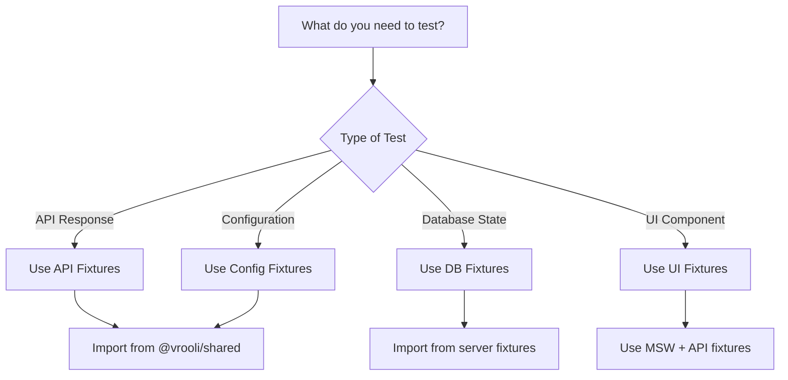

# Fixtures Overview - Quick Reference Guide

This document provides a quick reference for using fixtures in the Vrooli testing ecosystem. For detailed patterns and implementation guides, see the related documents listed below.

**Purpose**: Get started quickly with fixtures for testing data integrity across the Vrooli platform.

**Prerequisites**: Basic understanding of TypeScript and Vitest testing framework.

**Related Documents**:
- [Fixture Patterns](./fixture-patterns.md) - Detailed patterns and best practices
- [Round-Trip Testing](./round-trip-testing.md) - End-to-end data flow testing
- [Fixture Implementation Guide](./fixture-implementation-guide.md) - Step-by-step roadmap
- [Fixture Reference](./fixture-reference.md) - Complete API reference

## Quick Decision Tree



## Key Imports - Quick Reference

```typescript
// Shape Functions (for transformations)
import { shapeBookmark, shapeComment, shapeTeam } from "@vrooli/shared";

// Validation Schemas
import { bookmarkValidation, commentValidation, teamValidation } from "@vrooli/shared";

// API Endpoints
import { endpointsBookmark, endpointsComment, endpointsTeam } from "@vrooli/shared";

// Test Fixtures
import { userFixtures, teamFixtures } from "@vrooli/shared/__test/fixtures/api";
import { botConfigFixtures, chatConfigFixtures } from "@vrooli/shared/__test/fixtures/config";
// Or with namespace imports
import { apiFixtures, configFixtures } from "@vrooli/shared/__test/fixtures";

// Action Hooks
import { useBookmarker, useVoter, useCopier, useDeleter } from "../hooks/objectActions.js";

// API Fetching
import { useLazyFetch } from "../hooks/useFetch.js";

// ID Generation
import { generatePK, DUMMY_ID } from "@vrooli/shared";
```

## Using Centralized Fixtures

The shared package provides centralized fixtures in `@vrooli/shared/__test/fixtures/`:

### API Fixtures

```typescript
// Import specific fixtures
import { userFixtures, teamFixtures } from "@vrooli/shared/__test/fixtures/api";

// Use in tests
const testUser = userFixtures.complete.create;
const minimalTeam = teamFixtures.minimal.create;

// Or import all API fixtures
import { apiFixtures } from "@vrooli/shared/__test/fixtures";
const user = apiFixtures.userFixtures.complete.create;
```

### Config Fixtures

```typescript
// Import specific config fixtures
import { botConfigFixtures, chatConfigFixtures } from "@vrooli/shared/__test/fixtures/config";

// Use in tests
const botSettings = botConfigFixtures.complete;
const chatConfig = chatConfigFixtures.variants.privateTeamChat;

// Or import all config fixtures
import { configFixtures } from "@vrooli/shared/__test/fixtures";
const routineConfig = configFixtures.routineConfigFixtures.action.simple;
```

### Error Fixtures

```typescript
// Import error fixtures
import { apiErrorFixtures, networkErrorFixtures } from "@vrooli/shared/__test/fixtures/errors";

// Use in tests
const notFound = apiErrorFixtures.notFound.standard;
const timeout = networkErrorFixtures.timeout.client;

// Or import all error fixtures
import { errorFixtures } from "@vrooli/shared/__test/fixtures";
const rateLimit = errorFixtures.api.rateLimit.standard;
```

### Event Fixtures

```typescript
// Import event fixtures
import { chatEventFixtures, swarmEventFixtures } from "@vrooli/shared/__test/fixtures/events";

// Use in tests
const message = chatEventFixtures.messages.textMessage;
const progress = swarmEventFixtures.execution.progress;

// Or import all event fixtures
import { eventFixtures } from "@vrooli/shared/__test/fixtures";
const typing = eventFixtures.chat.typing.start;
```

### Using Fixtures in Different Packages

**In Server Tests:**
```typescript
import { userFixtures } from "@vrooli/shared/__test/fixtures/api";
import { botConfigFixtures } from "@vrooli/shared/__test/fixtures/config";

const testBot = {
    id: "bot_123",
    name: "Test Bot",
    botSettings: botConfigFixtures.complete, // Use config fixture
};
```

**In UI Tests:**
```typescript
import { apiFixtures, configFixtures } from "@vrooli/shared/__test/fixtures";

const mockApiResponse = {
    ...apiFixtures.chatFixtures.complete.create,
    chatSettings: configFixtures.chatConfigFixtures.variants.supportChat,
};
```

## Common Pitfalls to Avoid

| Pitfall | Solution |
|---------|----------|
| Creating custom interfaces when Shape types exist | Always check `@vrooli/shared` for existing types first |
| Duplicating shape transformation logic | Use `shapeX.create()` functions from shared package |
| Writing custom validation | Use `xValidation.create.validate()` from shared package |
| Mocking what you don't need to | Only mock external services; use real functions for internal logic |
| Not cleaning up test data | Always clean up database state after tests |

## What Are Fixtures?

**Fixtures** are pre-defined test data objects that represent consistent, realistic states of your application data. They serve as the foundation for reliable testing by providing:

1. **Consistent test data** - Same structure across all tests
2. **Type safety** - Full TypeScript support with Shape types
3. **Realistic scenarios** - Data that mirrors production
4. **Easy maintenance** - Centralized updates when schemas change

### Why Are Fixtures Critical for Vrooli?

Vrooli's architecture includes:
- **41 object types** with complex relationships
- **Three-tier AI system** requiring specific data states
- **Real-time features** needing consistent test scenarios
- **Multi-user workflows** requiring various permission states

Without fixtures, each test would need to manually create these complex data structures, leading to:
- Inconsistent test data
- Duplicated setup code
- Fragile tests that break with schema changes
- Difficulty testing edge cases

## Getting Started

### Step 1: Identify What You're Testing

```typescript
// Testing an API endpoint?
import { endpointsUser } from "@vrooli/shared";
import { userFixtures } from "@vrooli/shared/__test/fixtures/api";

// Testing a UI component?
import { apiFixtures } from "@vrooli/shared/__test/fixtures";
import { server } from "../mocks/server.js"; // MSW server

// Testing data transformation?
import { shapeProject, projectValidation } from "@vrooli/shared";
```

### Step 2: Choose the Right Fixture

```typescript
// Need a complete object with all fields?
const fullUser = userFixtures.complete.create;

// Need minimal valid data?
const minimalUser = userFixtures.minimal.create;

// Need specific scenario?
const adminUser = userFixtures.admin.create;
const guestUser = userFixtures.guest.create;
```

### Step 3: Use Real Functions

```typescript
// ✅ DO: Use real transformation functions
const shaped = shapeUser.create(formData);
const validated = await userValidation.create.validate(shaped);

// ❌ DON'T: Create mock transformation logic
const mockTransform = (data) => ({ ...data, transformed: true });
```

### Step 4: Write Your Test

```typescript
describe("User Creation", () => {
    it("should create user with valid data", async () => {
        // Arrange
        const userData = userFixtures.complete.create;
        
        // Act
        const result = await endpointsUser.create({
            input: userData,
            context: createTestContext()
        });
        
        // Assert
        expect(result.success).toBe(true);
        expect(result.data.id).toBeDefined();
    });
});
```

## Quick Examples

### Testing API Response
```typescript
import { apiFixtures } from "@vrooli/shared/__test/fixtures";

const mockResponse = {
    ...apiFixtures.projectFixtures.complete.find,
    team: apiFixtures.teamFixtures.minimal.find,
};
```

### Testing Form Submission
```typescript
import { shapeProject, projectValidation } from "@vrooli/shared";

const formData = { name: "Test Project", description: "Test" };
const validation = await projectValidation.create.validate(formData);
const apiRequest = shapeProject.create(formData);
```

### Testing with Relationships
```typescript
const project = apiFixtures.projectFixtures.complete.create;
const teamWithProjects = {
    ...apiFixtures.teamFixtures.complete.create,
    projects: [project],
};
```

## Next Steps

1. **Explore existing fixtures** in `packages/shared/src/__test/fixtures/`
2. **Read [Fixture Patterns](./fixture-patterns.md)** for advanced usage
3. **Try [Round-Trip Testing](./round-trip-testing.md)** for end-to-end validation
4. **Check [Implementation Guide](./fixture-implementation-guide.md)** for adding new fixtures

## Need Help?

- **Can't find a fixture?** Check the [Fixture Reference](./fixture-reference.md)
- **Test failing?** See [Writing Tests](./writing-tests.md) debugging section
- **Performance issues?** Read [Test Execution](./test-execution.md) optimization tips