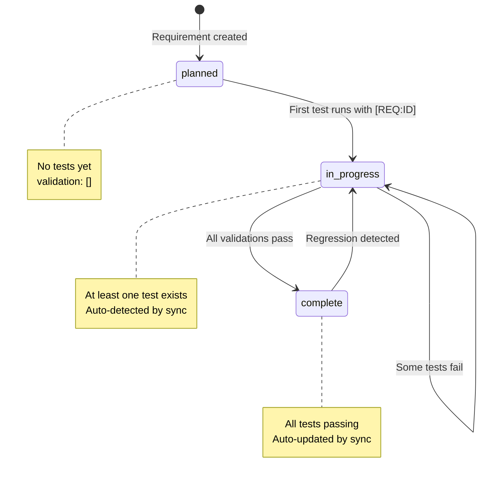

# ⚡ Requirement Tracking in 10 Minutes

Get from zero to automatic requirement tracking in 10 minutes with this hands-on quick start guide.

## What is Requirement Tracking?

**Requirement tracking** automatically connects your PRD requirements to test implementations and generates live coverage reports—with **zero manual tracking overhead**.

```mermaid
graph LR
    A[PRD Requirement] -->|prd_ref| B[Registry Entry]
    B -->|[REQ:ID]| C[Tagged Tests]
    C -->|Auto-Sync| D[Live Coverage]

    style A fill:#fff3e0
    style B fill:#e1f5ff
    style C fill:#e8f5e9
    style D fill:#c8e6c9
```

**The Magic**: Tag tests once with `[REQ:ID]`, then the system:
- ✅ Extracts tags during test execution
- ✅ Updates requirement status automatically
- ✅ Generates coverage reports showing P0/P1/P2 completion
- ✅ Maintains evidence trails (which tests validate which requirements)

**No manual tracking. No spreadsheets. No drift.**

---

## Quick Start: 3 Steps (10 Minutes)

### Step 1: Create a Requirement (2 minutes)

Let's say your PRD requires: *"Users can create projects from the dashboard"*

Create or edit `requirements/index.json` (or modular file like `requirements/projects/core.json`):

```json
{
  "_metadata": {
    "description": "Core project management requirements",
    "auto_sync_enabled": true,
    "schema_version": "1.0.0"
  },
  "requirements": [
    {
      "id": "MY-PROJECT-CREATE",
      "category": "projects.core",
      "prd_ref": "Functional Requirements > Must Have > Project Management",
      "title": "Users can create projects from the dashboard",
      "description": "Validates end-to-end project creation including API, database, and UI",
      "status": "planned",
      "criticality": "P0",
      "validation": []
    }
  ]
}
```

**Key Fields**:
- `id`: Unique ID matching pattern `[A-Z][A-Z0-9]+-[A-Z0-9-]+`
- `prd_ref`: Links to PRD section (bidirectional traceability)
- `status`: `planned` (will auto-update to `in_progress` when first test runs)
- `criticality`: `P0` (critical), `P1` (important), `P2` (nice-to-have)
- `validation`: Empty initially (auto-populated by sync)

---

### Step 2: Tag Your Tests (3 minutes)

Now write tests that validate this requirement. **Tag them with `[REQ:MY-PROJECT-CREATE]`**:

#### **Vitest (TypeScript/React)**

```typescript
// ui/src/api/__tests__/projects.test.ts
import { describe, it, expect } from 'vitest';
import { createProject, getProjects } from '../projects';

describe('Project API [REQ:MY-PROJECT-CREATE]', () => {
  it('creates project with valid name', async () => {
    const project = await createProject({ name: 'Test Project' });
    expect(project.id).toBeDefined();
    expect(project.name).toBe('Test Project');
  });

  it('rejects project with empty name', async () => {
    await expect(createProject({ name: '' })).rejects.toThrow();
  });

  it('lists created projects', async () => {
    const projects = await getProjects();
    expect(projects).toContainEqual(
      expect.objectContaining({ name: 'Test Project' })
    );
  });
});
```

**Note**: All tests in the `describe` block inherit the `[REQ:MY-PROJECT-CREATE]` tag automatically!

#### **Go (API Backend)**

```go
// api/handlers/projects_test.go
package main

import (
    "testing"
    "net/http/httptest"
)

func TestProjectCreation(t *testing.T) {
    t.Run("creates project with valid data [REQ:MY-PROJECT-CREATE]", func(t *testing.T) {
        payload := `{"name": "Test Project", "description": "Test"}`
        req := httptest.NewRequest("POST", "/api/v1/projects", strings.NewReader(payload))
        rr := httptest.NewRecorder()

        handler := http.HandlerFunc(createProjectHandler)
        handler.ServeHTTP(rr, req)

        if status := rr.Code; status != http.StatusCreated {
            t.Errorf("wrong status: got %v want %v", status, http.StatusCreated)
        }
    })

    t.Run("validates project name required [REQ:MY-PROJECT-CREATE]", func(t *testing.T) {
        payload := `{"description": "Missing name"}`
        req := httptest.NewRequest("POST", "/api/v1/projects", strings.NewReader(payload))
        rr := httptest.NewRecorder()

        handler := http.HandlerFunc(createProjectHandler)
        handler.ServeHTTP(rr, req)

        if status := rr.Code; status != http.StatusBadRequest {
            t.Errorf("wrong status: got %v want %v", status, http.StatusBadRequest)
        }
    })
}
```

**Tag Pattern**: Add `[REQ:ID]` to test names (suite or individual test)

---

### Step 3: Run Tests & See Magic (5 minutes)

#### **3a. Configure Vitest Reporter** (if using Vitest)

```typescript
// ui/vite.config.ts
import { defineConfig } from 'vite';
import RequirementReporter from '@vrooli/vitest-requirement-reporter';

export default defineConfig({
  test: {
    reporters: [
      'default',
      new RequirementReporter({
        outputFile: 'coverage/vitest-requirements.json',
        emitStdout: true,  // CRITICAL for phase integration
        verbose: true,
      }),
    ],
  },
});
```

#### **3b. Run Phase Tests**

```bash
cd scenarios/my-scenario/

# Run unit phase (includes Go + Vitest)
./test/phases/test-unit.sh

# Or run all phases
./test/run-tests.sh
```

**What Happens**:
1. Vitest runs UI tests → `vitest-requirement-reporter` extracts `[REQ:MY-PROJECT-CREATE]`
2. Go tests run → Phase script parses `[REQ:MY-PROJECT-CREATE]` from output
3. Both results saved to `coverage/phase-results/unit.json`
4. Auto-sync runs → Updates `requirements/index.json`

#### **3c. View Results**

```bash
# Check phase results
cat coverage/phase-results/unit.json
```

```json
{
  "phase": "unit",
  "status": "passed",
  "requirements": [
    {
      "id": "MY-PROJECT-CREATE",
      "status": "passed",
      "criticality": "P0",
      "evidence": "Vitest ✓ (3 tests, 145ms); Go ✓ (2 tests, 89ms)"
    }
  ]
}
```

```bash
# View updated requirement file
cat requirements/index.json
```

```json
{
  "id": "MY-PROJECT-CREATE",
  "status": "in_progress",  // Auto-updated from "planned"!
  "criticality": "P0",
  "validation": [
    {
      "type": "test",
      "ref": "ui/src/api/__tests__/projects.test.ts",
      "phase": "unit",
      "status": "implemented",  // Auto-added!
      "notes": "Auto-added from vitest evidence"
    },
    {
      "type": "test",
      "ref": "api/handlers/projects_test.go",
      "phase": "unit",
      "status": "implemented",  // Auto-added!
      "notes": "Auto-added from Go test evidence"
    }
  ]
}
```

#### **3d. Generate Coverage Report**

```bash
# Generate JSON report
node scripts/requirements/report.js --scenario my-scenario --format json

# Or Markdown report
node scripts/requirements/report.js --scenario my-scenario --format markdown
```

**Output** (JSON):
```json
{
  "summary": {
    "total": 1,
    "byStatus": { "in_progress": 1 },
    "byCriticality": { "P0": 1 },
    "criticalityGap": 1  // P0/P1 not yet complete
  },
  "requirements": [
    {
      "id": "MY-PROJECT-CREATE",
      "title": "Users can create projects from the dashboard",
      "status": "in_progress",
      "criticality": "P0",
      "liveStatus": "passed",  // All tests passing!
      "coverage": {
        "unit": "passed",
        "integration": "not_tested"
      }
    }
  ]
}
```

---

## 🎉 What Just Happened?

You just experienced **automatic requirement tracking**:

1. ✅ **Created requirement** in JSON registry
2. ✅ **Tagged tests** with `[REQ:ID]` (once, in test names)
3. ✅ **Ran tests** with existing phase scripts
4. ✅ **Auto-sync** updated registry with validation entries
5. ✅ **Generated report** showing live P0 coverage

**No manual tracking. No spreadsheets. No outdated docs.**

---

## 🔄 Status Flow



**Automatic Transitions**:
- `planned` → `in_progress`: When first `[REQ:ID]` tagged test runs
- `in_progress` → `complete`: When all validation tests pass
- `complete` → `in_progress`: When any test starts failing

---

## 🚀 Next Steps

### **Add More Requirements**

Modular structure for complex scenarios:

```
requirements/
├── index.json           # Parent requirements
├── projects/
│   ├── creation.json   # Project creation requirements
│   └── deletion.json   # Project deletion requirements
└── workflows/
    └── execution.json  # Workflow execution requirements
```

**Parent requirement** (`index.json`):
```json
{
  "imports": [
    "projects/creation.json",
    "projects/deletion.json",
    "workflows/execution.json"
  ],
  "requirements": [
    {
      "id": "MY-FUNC-001",
      "title": "Complete project management system",
      "status": "in_progress",
      "criticality": "P0",
      "children": [
        "MY-PROJECT-CREATE",
        "MY-PROJECT-DELETE",
        "MY-WORKFLOW-EXECUTE"
      ]
    }
  ]
}
```

### **Add Integration Tests**

Tag integration tests that require running scenario:

```bash
# test/phases/test-integration.sh
testing::phase::run_api_integration_tests
testing::phase::run_bas_automation_validations  # BAS workflows
```

These auto-populate `validation` entries with `phase: "integration"`.

### **Add BAS Workflows**

For UI automation without Playwright/Puppeteer code:

```json
{
  "id": "MY-PROJECT-CREATE",
  "validation": [
    {
      "type": "automation",
      "ref": "test/playbooks/ui/projects/create-project.json",
      "phase": "integration",
      "scenario": "browser-automation-studio"
    }
  ]
}
```

See: [UI Automation with BAS](ui-automation-with-bas.md)

### **Gate Releases on P0 Coverage**

```bash
# Fail CI if critical requirements incomplete
node scripts/requirements/report.js \
  --scenario my-scenario \
  --fail-on-critical-gap

# Exit code 1 if any P0/P1 requirements not complete
```

---

## 📚 Learn More

| Document | Purpose |
|----------|---------|
| **[Requirement Tracking Guide](requirement-tracking.md)** | Comprehensive system documentation (987 lines) |
| **[Requirement Flow](../architecture/REQUIREMENT_FLOW.md)** | End-to-end flow with diagrams |
| **[Requirement Schema](../reference/requirement-schema.md)** | Complete JSON schema reference |
| **[UI Automation with BAS](ui-automation-with-bas.md)** | Visual workflow testing |
| **[Phased Testing](../architecture/PHASED_TESTING.md)** | 6-phase progressive validation |

---

## 🐛 Troubleshooting

### Requirements not updating after test run

**Check**:
```bash
# 1. Phase results generated?
ls -la coverage/phase-results/

# 2. Vitest output generated?
ls -la ui/coverage/vitest-requirements.json

# 3. Auto-sync enabled?
grep "auto_sync_enabled" requirements/index.json
# Should show: "auto_sync_enabled": true
```

**Manual sync**:
```bash
node scripts/requirements/report.js --scenario my-scenario --mode sync
```

### Tags not detected in Vitest tests

**Check vite.config.ts**:
```typescript
new RequirementReporter({
  emitStdout: true,  // CRITICAL: Must be true
  verbose: true,
})
```

### Tag format incorrect

**Correct patterns**:
- ✅ `describe('tests [REQ:MY-ID]', () => {})`
- ✅ `t.Run("test [REQ:MY-ID]", func(t *testing.T) {})`
- ❌ `describe('tests [REQ MY-ID]', () => {})` (no colon)
- ❌ `describe('tests [req:my-id]', () => {})` (lowercase)

---

## 🎯 Summary

**You learned**:
- ✅ Create requirement in JSON registry
- ✅ Tag tests with `[REQ:ID]` (suite or test level)
- ✅ Run phases → Auto-sync updates registry
- ✅ Generate coverage reports showing P0/P1/P2 status
- ✅ Status flows automatically (planned → in_progress → complete)

**Zero manual tracking. Maximum traceability.**

Ready to track requirements across your entire scenario? See the [full guide](requirement-tracking.md) for advanced features like parent/child hierarchies, dependencies, and multi-phase validation.
