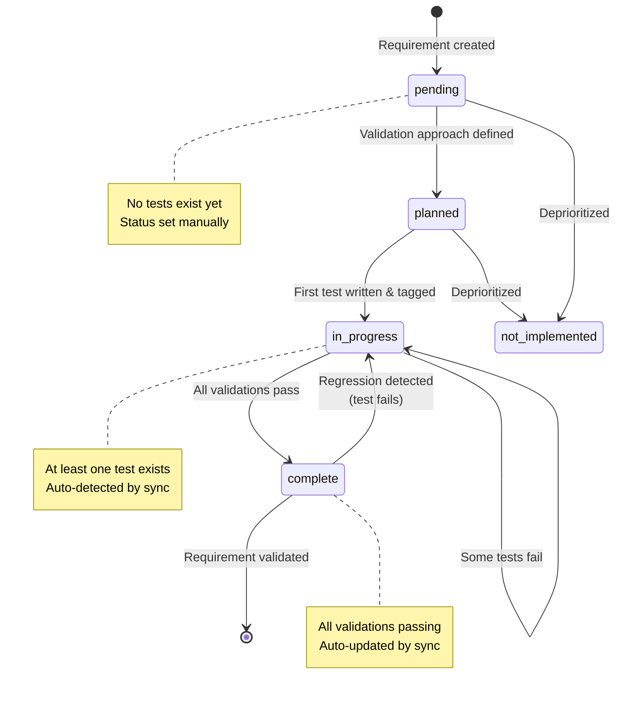
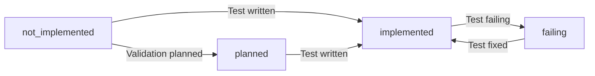

# 📋 Requirement Tracking Guide

Comprehensive guide to Vrooli's automatic requirement tracking system that bridges PRD requirements to test implementation with zero manual overhead.

## Overview

Vrooli's requirement tracking system automatically connects product requirements to test implementations, providing live coverage reports without manual tracking overhead. Simply tag tests with `[REQ:ID]` and the system handles the rest.

**Key Benefits:**
- ✅ **Zero manual tracking** - Tag tests once, coverage updates automatically
- ✅ **Live status** - Phase results show real-time pass/fail state
- ✅ **PRD traceability** - Connect product requirements to technical validation
- ✅ **Criticality awareness** - Enforce P0/P1 coverage before release
- ✅ **Multi-framework** - Works with Go, Vitest, BATS, and automation workflows

## Quick Start

### 1. Initialize Registry

```bash
# Bootstrap modular registry structure
vrooli scenario requirements init browser-automation-studio

# Creates:
# requirements/
# ├── index.json           # Parent requirements with imports
# ├── projects/            # Feature-specific modules
# │   └── dialog.json
# └── workflow-builder/
     └── core.json
```

### 2. Tag Tests

```typescript
// Vitest - Suite level (all tests inherit tag)
describe('projectStore [REQ:BAS-WORKFLOW-PERSIST-CRUD]', () => {
  it('fetches projects', async () => { ... });
  it('creates project', async () => { ... });
});

// Go - Test level
func TestWorkflowCRUD(t *testing.T) {
    t.Run("creates workflow [REQ:BAS-WORKFLOW-PERSIST-CRUD]", func(t *testing.T) {
        // test implementation
    })
}
```

### 3. Run Tests

```bash
cd scenarios/browser-automation-studio
./test/phases/test-unit.sh

# Phase automatically:
# - Detects [REQ:ID] tags
# - Records pass/fail/skipped
# - Writes coverage/phase-results/unit.json
```

### 4. View Coverage

```bash
# Generate report
node scripts/requirements/report.js --scenario browser-automation-studio --format json

# Auto-sync requirement files from test results
node scripts/requirements/report.js --scenario browser-automation-studio --mode sync
```

## Registry Structure

### Modular Format

**Location:** `requirements/` directory (mandatory for all scenarios)

**Structure:**
```
requirements/
├── index.json              # Parent requirements + imports
├── projects/
│   ├── dialog.json        # Project dialog requirements
│   └── api.json           # Project API requirements
├── workflow-builder/
│   └── core.json          # Workflow persistence requirements
└── execution/
    └── telemetry.json     # Execution telemetry requirements
```

**index.json** (parent file):
```json
{
  "_metadata": {
    "description": "Parent-level requirements reference child modules",
    "auto_sync_enabled": true,
    "schema_version": "1.0.0"
  },
  "imports": [
    "projects/dialog.json",
    "workflow-builder/core.json",
    "execution/telemetry.json"
  ],
  "requirements": [
    {
      "id": "BAS-FUNC-001",
      "title": "Visual workflow builder",
      "status": "in_progress",
      "prd_ref": "OT-P0-001",
      "children": [
        "BAS-PROJECT-DIALOG-OPEN",
        "BAS-PROJECT-CREATE-SUCCESS",
        "BAS-WORKFLOW-PERSIST-CRUD"
      ]
    }
  ]
}
```

**projects/dialog.json** (child module):
```json
{
  "_metadata": {
    "description": "Project management UI behaviors",
    "auto_sync_enabled": true,
    "schema_version": "1.0.0"
  },
  "requirements": [
    {
      "id": "BAS-PROJECT-DIALOG-OPEN",
      "category": "projects.ui",
      "prd_ref": "OT-P0-001",
      "title": "New project dialog opens from primary entry points",
      "description": "Verifies the modal opens via button, keyboard, and menu",
      "status": "in_progress",
      "validation": [
        {
          "type": "test",
          "ref": "ui/src/components/__tests__/ProjectModal.test.tsx",
          "phase": "unit",
          "status": "implemented"
        },
        {
          "type": "automation",
          "ref": "test/playbooks/ui/projects/dialog-open.json",
          "phase": "integration",
          "status": "failing"
        }
      ]
    }
  ]
}
```

## Requirement Definition

### Required Fields

| Field | Type | Description |
|-------|------|-------------|
| `id` | string | Unique identifier matching pattern `[A-Z][A-Z0-9]+-[A-Z0-9-]+` |
| `title` | string | Short description (1-2 sentences) |
| `status` | enum | `pending`, `planned`, `in_progress`, `complete`, `not_implemented` |
| `prd_ref` | string | Operational target reference (e.g., `OT-P0-001`) - criticality derived from this |

**ID Pattern Examples:**
- ✅ `BAS-WORKFLOW-PERSIST-CRUD`
- ✅ `BAS-PROJECT-DIALOG-OPEN`
- ✅ `APP-FUNC-001`
- ❌ `bas-workflow-crud` (lowercase)
- ❌ `WORKFLOW_CRUD` (no prefix)

### Optional Fields

| Field | Type | Description |
|-------|------|-------------|
| `category` | string | Hierarchical grouping (e.g., `projects.ui`, `execution.telemetry`) |
| `description` | string | Detailed explanation of what this requirement validates |
| `children` | array | Child requirement IDs for parent/child hierarchies |
| `depends_on` | array | Requirement IDs this one depends on |
| `blocks` | array | Requirement IDs blocked by this one |
| `tags` | array | Custom tags for filtering and categorization |

### Validation Entries

Each requirement can have multiple validation methods tracking how it's verified.

#### Type: test

**Purpose:** Unit, integration, or business tests

```json
{
  "type": "test",
  "ref": "ui/src/stores/__tests__/projectStore.test.ts",
  "phase": "unit",
  "status": "implemented",
  "notes": "Validates CRUD operations with mocked API"
}
```

**Fields:**
- `ref`: Path to test file (relative to scenario root)
- `phase`: `unit`, `integration`, `business`, `performance`
- `status`: `not_implemented`, `planned`, `implemented`, `failing`

**Validation Specificity Requirements:**

The `ref` field MUST point to **specific test files**, not generic phase orchestration scripts.

✅ **ALLOWED patterns:**
```json
// Go unit/integration tests
{"type": "test", "ref": "api/handlers/projects_test.go", "phase": "unit"}

// Vitest unit tests
{"type": "test", "ref": "ui/src/stores/__tests__/projectStore.test.ts", "phase": "unit"}

// CLI BATS integration tests
{"type": "test", "ref": "test/cli/dependency-analysis.bats", "phase": "integration"}
```

❌ **FORBIDDEN patterns:**
```json
// Generic phase scripts - TOO VAGUE, ZERO TRACEABILITY
{"type": "test", "ref": "test/phases/test-integration.sh"}
{"type": "test", "ref": "test/phases/test-unit.sh"}
```

**Why this matters:**
- Phase scripts **orchestrate** test execution but don't contain tests themselves
- Pointing to a phase script provides **zero traceability** to actual test code
- Auto-sync cannot verify which specific tests validate which requirements
- Creates gaming opportunity: many requirements → same vague reference

**Correct approach:**
- **CLI testing**: `test/cli/*.bats` files with `[REQ:ID]` tags
- **UI automation**: Use `type: "automation"` (see below)
- **API integration**: Specific Go test files `api/**/*_test.go`

#### Type: automation

**Purpose:** Browser Automation Studio workflow tests

```json
{
  "type": "automation",
  "ref": "test/playbooks/ui/projects/create-project.json",
  "phase": "integration",
  "status": "implemented",
  "scenario": "browser-automation-studio",
  "folder": "/Testing Harness",
  "notes": "BAS workflow asserting end-to-end project creation"
}
```

**Fields:**
- `ref`: Path to workflow JSON file, OR
- `workflow_id`: Existing workflow ID in BAS database
- `phase`: Usually `integration` or `business`
- `scenario`: Target scenario (defaults to current scenario)
- `folder`: BAS folder path for workflow import

**See Also:** [UI Automation with BAS](ui-automation-with-bas.md) for complete workflow testing guide.

#### Type: manual

**Purpose:** Last-resort coverage for work that cannot yet be automated (e.g., quarterly penetration audits), or as a temporary measure before tests are written. Manual validations **must** be logged through `vrooli scenario requirements manual-log` so they include `validated_at`, `validated_by`, and expiration metadata. `vrooli scenario status` surfaces every manual validation—expired or not—so loops know they still require human action and should be replaced with automated checks.

```json
{
  "type": "manual",
  "ref": "docs/testing/runbooks/security-audit.md",
  "phase": "integration",
  "status": "planned",
  "notes": "Security penetration testing checklist (logged via manual manifest; expires in 30 days)"
}
```

**Best practice:**
- Document the workflow now, but prioritize building Browser Automation Studio workflows (see [UI Automation with BAS](ui-automation-with-bas.md)) or other scripted validations so future loops can retire the manual entry.
- Run `vrooli scenario requirements manual-log my-scenario BAS-SECURITY-AUDIT --status passed --notes "Quarterly pen test" --artifact docs/security-report.pdf` immediately after completing the manual step. The CLI writes to `coverage/manual-validations/log.jsonl`, and auto-sync propagates the evidence into `_sync_metadata.manual` so drift detection can warn when it expires.

## Test Integration

### Tagging Conventions

#### Vitest Tests

**Suite-level tagging** (all tests inherit):
```typescript
describe('projectStore [REQ:BAS-WORKFLOW-PERSIST-CRUD]', () => {
  it('fetches projects', async () => { ... });      // Inherits tag
  it('creates project', async () => { ... });       // Inherits tag
  it('updates project', async () => { ... });       // Inherits tag
});
```

**Test-level tagging** (specific requirement):
```typescript
describe('projectStore', () => {
  it('validates names [REQ:BAS-PROJECT-CREATE-VALIDATION]', async () => { ... });
  it('handles errors [REQ:BAS-PROJECT-ERROR-HANDLING]', async () => { ... });
});
```

**Multiple requirements**:
```typescript
describe('CRUD operations [REQ:BAS-WORKFLOW-PERSIST-CRUD, BAS-PROJECT-API]', () => {
  it('performs all operations', async () => { ... });
});
```

**Configuration:**
```typescript
// vite.config.ts
import RequirementReporter from '@vrooli/vitest-requirement-reporter';

export default defineConfig({
  test: {
    reporters: [
      'default',
      new RequirementReporter({
        outputFile: 'coverage/vitest-requirements.json',
        emitStdout: true,  // Required for phase integration
        verbose: true,
      }),
    ],
  },
});
```

**See Also:** [@vrooli/vitest-requirement-reporter](../../../packages/vitest-requirement-reporter/README.md)

#### Go Tests

**Test-level tagging:**
```go
func TestWorkflowCRUD(t *testing.T) {
    t.Run("creates workflow [REQ:BAS-WORKFLOW-PERSIST-CRUD]", func(t *testing.T) {
        // Create workflow
        workflow := createTestWorkflow(t)
        assert.NotNil(t, workflow.ID)
    })

    t.Run("updates workflow [REQ:BAS-WORKFLOW-PERSIST-CRUD]", func(t *testing.T) {
        // Update workflow
        updated := updateWorkflow(t, workflow.ID, changes)
        assert.Equal(t, changes.Name, updated.Name)
    })
}
```

**Suite-level context:**
```go
// TestProjectValidation validates all project creation rules [REQ:BAS-PROJECT-CREATE-VALIDATION]
func TestProjectValidation(t *testing.T) {
    t.Run("rejects empty name", func(t *testing.T) { ... })
    t.Run("rejects duplicate", func(t *testing.T) { ... })
    t.Run("rejects invalid chars", func(t *testing.T) { ... })
}
```

**No configuration needed** - Go test parser automatically extracts `[REQ:ID]` from output.

### Phase Integration

**Automatic flow:**

```mermaid
graph TB
    A[Developer tags test with [REQ:ID]] --> B[Test execution]
    B -->|Vitest| C[RequirementReporter extracts tags]
    B -->|Go| D[Test output parser extracts tags]
    C --> E[vitest-requirements.json]
    D --> F[TESTING_GO_REQUIREMENT_STATUS]
    E --> G[testing::unit::run_all_tests]
    F --> G
    G --> H[testing::phase::add_requirement]
    H --> I[coverage/phase-results/unit.json]
    I --> J[test/run-tests.sh completes]
    J --> K[report.js --mode sync]
    K --> L[requirements/*.json updated]
```

**Phase results format** (`coverage/phase-results/unit.json`):
```json
{
  "phase": "unit",
  "scenario": "browser-automation-studio",
  "status": "passed",
  "tests": 24,
  "errors": 0,
  "requirements": [
    {
      "id": "BAS-WORKFLOW-PERSIST-CRUD",
      "status": "passed",
      "evidence": "Node test ✓ PASS REQ:BAS-WORKFLOW-PERSIST-CRUD (7 tests, 9ms)"
    },
    {
      "id": "BAS-PROJECT-CREATE-SUCCESS",
      "status": "passed",
      "evidence": "Node test ✓ PASS REQ:BAS-PROJECT-CREATE-SUCCESS (10 tests, 567ms)"
    }
  ]
}
```

## Auto-Sync Behavior

### What Auto-Sync Does

After test execution, `report.js --mode sync` automatically:

1. **Reads phase results** from `coverage/phase-results/*.json`
2. **Reads vitest output** from `ui/coverage/vitest-requirements.json`
3. **Adds missing validations** - Creates `type: test` entries for tagged tests not yet in registry
4. **Updates validation statuses** - Sets status based on live test results (passed → implemented, failed → failing)
5. **Updates requirement statuses** - Rolls up validation results to parent requirement
6. **Removes orphaned validations** (with `--prune-stale`) - Deletes validation entries pointing to non-existent test files

### Example Auto-Sync

**Before sync** (`requirements/projects/dialog.json`):
```json
{
  "id": "BAS-PROJECT-DIALOG-OPEN",
  "status": "planned",
  "validation": []
}
```

**Test exists with tag:**
```typescript
describe('ProjectModal [REQ:BAS-PROJECT-DIALOG-OPEN]', () => {
  it('renders create mode', () => { ... });
});
```

**After sync**:
```json
{
  "id": "BAS-PROJECT-DIALOG-OPEN",
  "status": "in_progress",
  "validation": [
    {
      "type": "test",
      "ref": "ui/src/components/__tests__/ProjectModal.test.tsx",
      "phase": "unit",
      "status": "implemented",
      "notes": "Auto-added from vitest evidence"
    }
  ]
}
```

### Manual Sync

```bash
# Standard sync
node scripts/requirements/report.js --scenario browser-automation-studio --mode sync

# Sync with orphan removal
node scripts/requirements/report.js --scenario browser-automation-studio --mode sync --prune-stale
```

### Automatic Sync

The `test/run-tests.sh` orchestrator automatically runs sync after all phases complete:

```bash
#!/bin/bash
# From browser-automation-studio/test/run-tests.sh

# ... run all phases ...

if node "$APP_ROOT/scripts/requirements/report.js" --scenario "$SCENARIO_NAME" --mode sync; then
  log::info "📋 Requirements registry synced after test run"
else
  log::warning "⚠️  Failed to sync requirements registry"
fi
```

Only full suites can produce a snapshot: `_testing_suite_sync_requirements` inspects the phases that ran during the current execution and skips `report.js --mode sync` whenever you run presets like `quick` or `smoke`. To override (for debugging), set `TESTING_REQUIREMENTS_SYNC_FORCE=1` before running tests. Manual invocations must pass `--allow-partial-sync` (or export `REQUIREMENTS_SYNC_ALLOW_PARTIAL=1`) if you truly need to update requirements from a partial run.

After the sync completes, the runner now emits an immutable snapshot under `coverage/requirements-sync/latest.json` plus a manifest entry in `coverage/requirements-sync/run-log.jsonl`:

- `latest.json` contains the executed commands, a hash + mtime for every requirement module, the flattened `_sync_metadata` for each requirement/validation, and operational-target rollups derived from `prd_ref`/folder structure. CLI tooling reads this file to detect drift without re-running sync.
- `run-log.jsonl` captures a JSON line per suite run (`timestamp`, `scenario`, `commands`). `_testing_suite_sync_requirements` appends to this log before invoking `report.js --mode sync`, so drift detectors can warn when someone edits requirement files without executing tests.

`vrooli scenario status` now consumes these artifacts automatically. The requirements quick check runs `scripts/requirements/drift-check.js`, which (a) hashes every requirements module, (b) compares against `coverage/requirements-sync/latest.json`, (c) parses the scenario's PRD via `scripts/prd/parser.js`, and (d) inspects `coverage/phase-results`/`ui/coverage/vitest-requirements.json` for fresher evidence. If any mismatch is detected, the CLI prints explicit remediation steps ("Requirement files changed outside auto-sync" / "PRD mismatch" / "Newer coverage artifacts detected"). Agents no longer need to manually speculate whether a checkbox or JSON edit is trustworthy—the command refuses to treat requirements as complete until tests regenerate the snapshot.

**Bonus:** `report.js --mode sync` now feeds those rollups back into `PRD.md`. Each operational-target checkbox is toggled based on the aggregated requirement status, so the spec stays honest without manual edits. When a regression lands, the checkbox reverts automatically.

Need to inspect the stored evidence? Run `vrooli scenario requirements snapshot <scenario>` to print the synced-at timestamp, executed commands, operational-target completion totals, and any expiring manual validations pulled straight from `coverage/requirements-sync/latest.json`.

The test harness treats `coverage/<scenario>/requirements-sync/` as a reserved directory. Artifact cleanup and log rotation skip this folder so the snapshot (`latest.json`) and run log survive between suites.

## Commands

### Initialize Registry

```bash
# Bootstrap modular registry structure
vrooli scenario requirements init <scenario-name>

# Creates scaffold with:
# - requirements/index.json
# - requirements/<module>/ subdirectories
# - Copies shared requirement templates
```

### Generate Reports

```bash
# JSON report (default)
node scripts/requirements/report.js --scenario <name> --format json

# Markdown report
node scripts/requirements/report.js --scenario <name> --format markdown

# Include pending requirements
node scripts/requirements/report.js --scenario <name> --include-pending
```

**Output:**
```json
{
  "generatedAt": "2025-11-05T15:09:20.982Z",
  "summary": {
    "total": 21,
    "byStatus": {
      "in_progress": 3,
      "complete": 18
    },
    "criticalityGap": 3
  },
  "requirements": [
    {
      "id": "BAS-FUNC-001",
      "status": "in_progress",
      "title": "Persist visual workflows",
      "liveStatus": "failed",
      "children": ["BAS-PROJECT-DIALOG-OPEN", "..."]
    }
  ]
}
```

### Validate Schema

```bash
# Validate registry against JSON schema
node scripts/requirements/validate.js --scenario <name>

# Automatically invoked by:
vrooli scenario status <name>
```

**Checks:**
- Schema compliance (required fields, valid enums)
- ID pattern validation
- Reference path existence
- Import resolution for modular registries

### Lint PRD Alignment

```bash
# Ensure every OT-P*-### entry in PRD.md has at least one requirement
vrooli scenario requirements lint-prd <name>

# Machine-readable output
vrooli scenario requirements lint-prd <name> --json
```

Run this lint whenever you add operational targets or reorganize the numbered requirement folders. It flags PRD targets without linked requirements and requirements referencing unknown `OT-*` identifiers so drift detection has reliable `prd_ref` data.

### Sync from Tests

```bash
# Standard sync
node scripts/requirements/report.js --scenario <name> --mode sync

# Sync with orphan removal
node scripts/requirements/report.js --scenario <name> --mode sync --prune-stale

# Inspect expected requirements for a phase
node scripts/requirements/report.js --scenario <name> --mode phase-inspect --phase unit
```

## Status Management

### Requirement Status Flow



**Status Definitions:**
- `pending`: Requirement identified but not yet planned
- `planned`: Requirement scheduled, validation approach defined
- `in_progress`: At least one validation exists (auto-detected by sync when test written)
- `complete`: All validations passing (auto-updated by sync)
- `not_implemented`: Requirement deprioritized or deferred

**Automatic Transitions**:
- `planned` → `in_progress`: Happens automatically when first `[REQ:ID]` tagged test runs
- `in_progress` → `complete`: Happens automatically when all validation tests pass
- `complete` → `in_progress`: Happens automatically if any test starts failing

### Validation Status Flow



**Status Definitions:**
- `not_implemented`: Validation identified but test not written
- `planned`: Validation approach defined, test not yet written
- `implemented`: Test exists and passing (auto-updated by sync)
- `failing`: Test exists but currently failing (auto-updated by sync)

### Criticality Levels

**P0 - Critical** (Must Have)
- Core functionality required for MVP
- Blocking bugs that prevent major workflows
- Security vulnerabilities
- Data loss scenarios

**P1 - Important** (Should Have)
- Secondary features that significantly improve UX
- Non-blocking bugs with workarounds
- Performance issues affecting >50% of users

**P2 - Nice-to-Have** (Could Have)
- Polish and convenience features
- Minor bugs with minimal impact
- Optimization for edge cases

**Criticality Gap:**
The count of P0/P1 requirements with `status != complete`. Use this metric to gate releases:

```bash
# Fail CI if criticality gap > 0
node scripts/requirements/report.js --scenario <name> --fail-on-critical-gap
```

## Requirement Hierarchies

### Parent-Child Relationships

**Use case:** Aggregate implementation requirements under PRD-level requirements

```json
{
  "id": "BAS-FUNC-001",
  "title": "Visual workflow builder (PRD)",
  "prd_ref": "OT-P0-001",
  "children": [
    "BAS-PROJECT-DIALOG-OPEN",
    "BAS-PROJECT-CREATE-SUCCESS",
    "BAS-WORKFLOW-PERSIST-CRUD"
  ]
}
```

**Behavior:**
- Parent status is rolled up from children
- Parent is `complete` only when all children are `complete`
- Phase results show both parent and child coverage

### Dependencies

**Use case:** Requirement B cannot be tested until requirement A is complete

```json
{
  "id": "BAS-WORKFLOW-EXECUTE",
  "depends_on": ["BAS-WORKFLOW-PERSIST-CRUD"],
  "blocks": []
}
```

**Future:** Dependency-aware test ordering (not yet implemented)

### Blockers

**Use case:** Requirement A blocks progress on requirement B

```json
{
  "id": "BAS-WORKFLOW-PERSIST-CRUD",
  "blocks": ["BAS-WORKFLOW-EXECUTE", "BAS-WORKFLOW-SHARE"]
}
```

**Future:** Blocker visualization in reports (not yet implemented)

## Examples

### Complete Requirement: Unit Test Only

```json
{
  "id": "MY-API-001",
  "category": "api.handlers",
  "prd_ref": "OT-P0-001",
  "title": "Create project endpoint persists to database",
  "description": "Validates the POST handler creates projects with unique names and returns 201",
  "status": "complete",
  "validation": [
    {
      "type": "test",
      "ref": "api/handlers/projects_test.go",
      "phase": "unit",
      "status": "implemented",
      "notes": "Covers happy path, duplicate detection, and validation errors"
    }
  ]
}
```

### Complete Requirement: Multi-Phase Testing

```json
{
  "id": "MY-UI-001",
  "category": "ui.projects",
  "prd_ref": "OT-P0-001",
  "title": "Users can create projects from dashboard",
  "description": "End-to-end project creation workflow including UI, API, and database persistence",
  "status": "complete",
  "validation": [
    {
      "type": "test",
      "ref": "ui/src/stores/__tests__/projectStore.test.ts",
      "phase": "unit",
      "status": "implemented",
      "notes": "Store logic with mocked API"
    },
    {
      "type": "test",
      "ref": "api/handlers/projects_test.go",
      "phase": "unit",
      "status": "implemented",
      "notes": "API handler with mocked database"
    },
    {
      "type": "automation",
      "ref": "test/playbooks/ui/projects/create-project.json",
      "phase": "integration",
      "status": "implemented",
      "scenario": "browser-automation-studio",
      "notes": "BAS workflow testing full stack"
    }
  ]
}
```

### Parent Requirement with Children

```json
{
  "id": "MY-FUNC-001",
  "category": "foundation",
  "prd_ref": "OT-P0-001",
  "title": "Complete project management system",
  "description": "Aggregates all project-related requirements from PRD section",
  "status": "in_progress",
  "children": [
    "MY-PROJECT-CREATE",
    "MY-PROJECT-EDIT",
    "MY-PROJECT-DELETE",
    "MY-PROJECT-LIST"
  ],
  "validation": []
}
```

## Troubleshooting

### Requirements Not Showing in Phase Results

**Symptom:** Tagged tests run but requirements don't appear in `coverage/phase-results/unit.json`

**Causes:**
1. Vitest reporter not configured
2. `emitStdout: false` in reporter config
3. Tag pattern doesn't match registry ID
4. Requirement ID not in registry

**Solutions:**
```typescript
// ✅ Correct configuration
new RequirementReporter({
  outputFile: 'coverage/vitest-requirements.json',
  emitStdout: true,  // CRITICAL
  verbose: true,
})

// ✅ Tag matches registry ID exactly
describe('test [REQ:BAS-WORKFLOW-PERSIST-CRUD]', () => { ... })

// Registry must have:
{ "id": "BAS-WORKFLOW-PERSIST-CRUD", ... }
```

### Tags Not Inherited from Describe Blocks

**Symptom:** Only some tests in a suite are tagged

**Expected behavior:** Suite-level tags apply to ALL child tests

```typescript
// ✅ All 3 tests inherit the tag
describe('projectStore [REQ:BAS-WORKFLOW-PERSIST-CRUD]', () => {
  it('fetches', () => { ... });  // Inherits tag
  it('creates', () => { ... });  // Inherits tag
  it('updates', () => { ... });  // Inherits tag
});

// ❌ Only first test is tagged
describe('projectStore', () => {
  it('fetches [REQ:BAS-WORKFLOW-PERSIST-CRUD]', () => { ... });  // Tagged
  it('creates', () => { ... });  // NOT tagged
  it('updates', () => { ... });  // NOT tagged
});
```

### Auto-Sync Not Updating Files

**Symptom:** `--mode sync` runs but requirement files unchanged

**Causes:**
1. No test results in `coverage/phase-results/`
2. No tagged tests executed
3. `auto_sync_enabled: false` in metadata
4. File permissions issue

**Solutions:**
```bash
# Check phase results exist
ls -la coverage/phase-results/

# Check vitest output exists
ls -la ui/coverage/vitest-requirements.json

# Check metadata in requirements file
{
  "_metadata": {
    "auto_sync_enabled": true  // Must be true
  }
}

# Run with verbose output
node scripts/requirements/report.js --scenario <name> --mode sync
```

### Validation References Missing Files

**Symptom:** `report.js` warns about missing file references

**Cause:** Validation `ref` points to non-existent test file

**Solutions:**
```bash
# Find orphaned validations
node scripts/requirements/report.js --scenario <name> --mode sync

# Output shows:
⚠️  Orphaned Validations (file not found):
   BAS-PROJECT-DIALOG-OPEN: × ui/src/components/__tests__/OldModal.test.tsx

# Remove orphaned validations
node scripts/requirements/report.js --scenario <name> --mode sync --prune-stale
```

### Snapshot or Manifest Drift Warnings

**Symptom:** `vrooli scenario status` reports that the requirements snapshot is missing/stale or that the manifest log predates your latest edits.

**Causes:**
1. `coverage/requirements-sync/latest.json` not generated because sync was skipped or interrupted.
2. `coverage/requirements-sync/run-log.jsonl` missing entries (for example, running `report.js --mode sync` directly instead of via `test/run-tests.sh`).
3. `jq` unavailable on the host, preventing `_testing_suite_sync_requirements` from recording the manifest entry.

**Solutions:**
```bash
# Always rerun the suite so the manifest + snapshot regenerate from fresh evidence
test/run-tests.sh

# Ensure jq is installed; the runner depends on it for manifest JSON
sudo apt-get install jq

# Remove stale snapshot to force a clean rebuild on the next run
rm -f coverage/requirements-sync/latest.json
```

## Best Practices

### 1. Use Descriptive Requirement IDs

```
✅ BAS-WORKFLOW-PERSIST-CRUD
✅ BAS-PROJECT-CREATE-VALIDATION
✅ BAS-EXEC-TELEMETRY-STREAM

❌ BAS-001
❌ REQUIREMENT-1
❌ TEST-WORKFLOW
```

### 2. Keep Requirement Scope Focused

**Too broad:**
```json
{
  "id": "BAS-ALL-PROJECT-FEATURES",
  "title": "All project features work"
}
```

**Well-scoped:**
```json
{
  "id": "BAS-PROJECT-CREATE-SUCCESS",
  "title": "Operators can create a project from the dialog"
}
```

### 3. Tag at Suite Level When Possible

```typescript
// ✅ One tag covers all project CRUD operations
describe('projectStore [REQ:BAS-WORKFLOW-PERSIST-CRUD]', () => {
  it('fetches projects', () => { ... });
  it('creates project', () => { ... });
  it('updates project', () => { ... });
  it('deletes project', () => { ... });
});

// ❌ Repetitive tagging
describe('projectStore', () => {
  it('fetches [REQ:BAS-WORKFLOW-PERSIST-CRUD]', () => { ... });
  it('creates [REQ:BAS-WORKFLOW-PERSIST-CRUD]', () => { ... });
  it('updates [REQ:BAS-WORKFLOW-PERSIST-CRUD]', () => { ... });
  it('deletes [REQ:BAS-WORKFLOW-PERSIST-CRUD]', () => { ... });
});
```

### 4. Use Modular Structure for Complex Scenarios

**When to use modular:**
- 20+ requirements
- Multiple feature areas
- Multiple teams working on scenario

**File organization:**
```
requirements/
├── index.json              # Parent requirements only
├── feature-a/
│   ├── ui.json
│   └── api.json
└── feature-b/
    ├── core.json
    └── advanced.json
```

### 5. Reference PRD Sections

```json
{
  "id": "BAS-WORKFLOW-PERSIST-CRUD",
  "prd_ref": "Operational Targets > P0 > OT-P0-001",
  "title": "Workflows persist nodes, edges, and metadata"
}
```

**Benefits:**
- Bidirectional traceability (PRD ↔ tests)
- Easier requirement audits
- Clear acceptance criteria

## See Also

### Documentation
- [Phased Testing Architecture](../architecture/PHASED_TESTING.md) - How requirements integrate with phases
- [Requirement Schema Reference](../reference/requirement-schema.md) - Complete schema documentation
- [UI Automation with BAS](ui-automation-with-bas.md) - Using automation validations

### Tools
- [@vrooli/vitest-requirement-reporter](../../../packages/vitest-requirement-reporter/README.md) - Vitest integration
- [scripts/requirements/schema.json](/scripts/requirements/schema.json) - JSON schema definition
- [scripts/requirements/report.js](/scripts/requirements/report.js) - Reporting tool source

### Examples
- [browser-automation-studio requirements](/scenarios/browser-automation-studio/requirements/) - Reference implementation
- [Scenario Testing Guide](scenario-testing.md) - Complete testing guide
- [Gold Standard Examples](../reference/examples.md) - Best practice implementations
