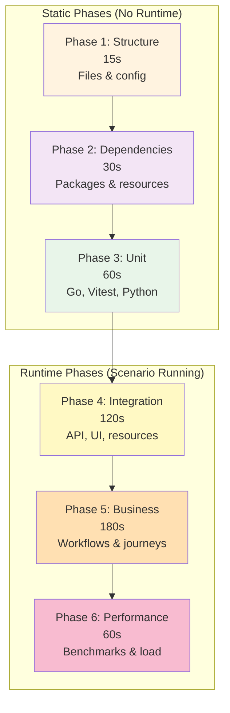

# Vrooli Scenario Testing Guide

This guide explains how to properly test Vrooli scenarios using the modern phased testing architecture.

## Overview

Vrooli uses a comprehensive **phased testing approach** configured through `.vrooli/service.json`.

## Modern Testing Architecture

### Configuration via service.json

All testing is configured in `.vrooli/service.json`:

```json
{
  "test": {
    "description": "Comprehensive phased testing",
    "steps": [{
      "name": "run-comprehensive-tests",
      "run": "test/run-tests.sh",
      "description": "Execute comprehensive phased testing"
    }]
  }
}
```

### Testing Phases

The modern architecture uses 6 progressive phases:



1. **Structure Validation** (15s) - Validates files and configuration
2. **Dependencies Check** (30s) - Verifies all dependencies available
3. **Unit Tests** (60s) - Language-specific unit testing
4. **Integration Tests** (120s) - Component interaction testing
5. **Business Logic** (180s) - End-to-end workflow validation
6. **Performance** (60s) - Benchmarks and resource usage

## Running Tests

### Recommended Method: Makefile

```bash
# From scenario directory
cd scenarios/<scenario-name>
make test     # Run all tests
make logs     # View test logs
```

### Alternative: Vrooli CLI

```bash
# Test a specific scenario
vrooli scenario test <scenario-name>

# Allow runtime-dependent phases to skip when the scenario isn't running
vrooli scenario test <scenario-name> --allow-skip-missing-runtime
vrooli scenario test <scenario-name> --manage-runtime

# Or from scenario directory  
cd scenarios/<scenario-name>
make test
```

### Direct Execution

```bash
# Run test orchestrator directly
./test/run-tests.sh

# Run specific phase
./test/phases/test-unit.sh
```

## Test Directory Structure

```
scenario/
├── .vrooli/
│   └── service.json           # Modern configuration
├── test/
│   ├── run-tests.sh          # Main test orchestrator
│   ├── phases/               # Phased test scripts
│   │   ├── test-structure.sh
│   │   ├── test-dependencies.sh
│   │   ├── test-unit.sh
│   │   ├── test-integration.sh
│   │   ├── test-business.sh
│   │   └── test-performance.sh
│   └── cli/                  # CLI BATS tests
│       └── my-cli.bats
├── api/
│   └── *_test.go             # Go unit tests
└── ui/
    └── *.test.js             # JavaScript tests
```

## Writing Tests

### Test Orchestrator Pattern

**Canonical Implementation**: [/scripts/scenarios/templates/react-vite/test/run-tests.sh](/scripts/scenarios/templates/react-vite/test/run-tests.sh)

The test orchestrator (`test/run-tests.sh`) is the main entry point for scenario testing. It follows a consistent pattern across all scenarios:

#### Core Responsibilities

1. **Configuration Management**
   - Detects scenario context (name, root directory)
   - Sets up logging and output paths
   - Parses command-line arguments

2. **Phase Registration**
   - Declares testing phases with timeouts
   - Configures phase dependencies (e.g., integration requires running scenario)
   - Defines phase order

3. **Execution Orchestration**
   - Runs phases sequentially with timeout enforcement
   - Tracks pass/fail/skip status
   - Handles failures (fail-fast vs. continue-on-error)

4. **Result Aggregation**
   - Collects phase results
   - Generates summary report
   - Returns appropriate exit code for CI/CD

#### Key Pattern Elements

```bash
# 1. Initialize context
readonly SCENARIO_NAME="$(basename "$(cd "$SCRIPT_DIR/.." && pwd)")"
readonly LOG_FILE="/tmp/test-${SCENARIO_NAME}-$$.log"

# 2. Register phases (name:timeout:description)
readonly PHASES=(
    "structure:15:Structure Validation"
    "unit:60:Unit Tests"
    "integration:120:Integration Tests"
)

# 3. Execute phases with timeout and logging
run_phase() {
    timeout "${timeout}" bash "$phase_script" > "$phase_log" 2>&1
    # Track results, handle errors
}

# 4. Summary and exit
cleanup() {
    log "Passed: $PASSED_PHASES, Failed: $FAILED_PHASES"
    exit $([[ $FAILED_PHASES -gt 0 ]] && echo 1 || echo 0)
}
```

#### Command-Line Options

Most orchestrators support:
- `--phase NAME` - Run single phase
- `--skip-phase NAME` - Skip specific phase
- `--fail-fast` - Stop on first failure
- `--verbose` - Detailed output
- `--help` - Usage information

#### Customization Points

When creating your orchestrator:
1. **Copy template**: `cp scripts/scenarios/templates/react-vite/test/run-tests.sh scenarios/my-scenario/test/`
2. **Adjust phases**: Add/remove/reorder phases based on scenario needs
3. **Configure timeouts**: Adjust based on scenario complexity
4. **Add custom options**: Extend CLI parsing for scenario-specific needs

**See the canonical implementation for complete, production-ready code.**

### Phase 1: Structure Validation Pattern

**Canonical Implementation**: [/scripts/scenarios/templates/react-vite/test/phases/test-structure.sh](/scripts/scenarios/templates/react-vite/test/phases/test-structure.sh)

Structure validation ensures the scenario has all required files, correct directory layout, and valid configuration. This phase runs first (target: <15 seconds) and catches basic setup issues before running expensive tests.

#### What Structure Validation Checks

1. **Essential Files**
   - `README.md` - Documentation exists and not empty
   - `PRD.md` - Product requirements documented
   - `.vrooli/service.json` - Modern configuration (valid JSON)
   - `Makefile` - Build/test targets defined

2. **Directory Layout**
   - `test/` - Test directory exists
   - `test/phases/` - Phase scripts present
   - `test/run-tests.sh` - Main orchestrator exists and executable
   - Component directories (`api/`, `ui/`, `cli/`) match service.json

3. **Configuration Validity**
   - `service.json` has required fields (name, version)
   - Component ports configured correctly
   - JSON syntax valid

4. **Basic Integrity**
   - Test scripts are executable
   - No obviously missing dependencies
   - File permissions correct

#### Pattern Structure

```bash
#!/bin/bash
set -euo pipefail

# 1. Initialize test tracking
tests_passed=0
tests_failed=0

# 2. Define test helper
run_test() {
    local description="$1"
    local test_command="$2"
    
    if eval "$test_command" 2>/dev/null; then
        echo "✅ PASS: $description"
        ((tests_passed++))
    else
        echo "❌ FAIL: $description"
        ((tests_failed++))
    fi
}

# 3. Run test groups
test_core_files() {
    run_test "README.md exists" "[ -f 'README.md' ]"
    run_test ".vrooli/service.json valid JSON" "jq empty .vrooli/service.json"
}

test_directory_structure() {
    run_test "Test directory exists" "[ -d 'test' ]"
    run_test "Main test runner executable" "[ -x 'test/run-tests.sh' ]"
}

# 4. Execute and exit
test_core_files
test_directory_structure
exit $tests_failed
```

#### Common Checks

**File existence**:
```bash
run_test "README exists" "[ -f 'README.md' ]"
run_test "README not empty" "[ -s 'README.md' ]"
```

**JSON validity**:
```bash
run_test "service.json valid" "jq empty .vrooli/service.json"
run_test "service has name" "jq -e '.name' .vrooli/service.json >/dev/null"
```

**Directory presence**:
```bash
run_test "API directory exists" "[ -d 'api' ]"
run_test "UI directory exists" "[ -d 'ui' ]"
```

**Executable permissions**:
```bash
run_test "Test runner executable" "[ -x 'test/run-tests.sh' ]"
```

#### Customization for Your Scenario

1. **Add scenario-specific files**: Check for required config files, data directories, etc.
2. **Validate component structure**: If scenario has specific architecture (microservices, monolith), validate accordingly
3. **Check external dependencies**: Verify Docker Compose files, Kubernetes manifests, etc.
4. **Warn on legacy patterns**: Alert if deprecated structures detected

**See the canonical implementation for complete validation logic.**
### Phase 5: Business Logic Testing Pattern

**Canonical Implementation**: Scenario-specific, see [browser-automation-studio example](/scenarios/browser-automation-studio/test/phases/test-business.sh)

Business logic testing validates end-to-end workflows, user journeys, and core business requirements. This phase runs after integration tests and targets real-world scenarios (target: <180 seconds).

#### What Business Logic Testing Validates

1. **Complete User Journeys**
   - Multi-step workflows from start to finish
   - Cross-component interactions
   - State management across requests

2. **Business Rules**
   - Domain-specific validation logic
   - Permission/authorization workflows
   - Data transformation pipelines

3. **Real-World Scenarios**
   - Common use cases from PRD
   - Edge cases that matter to users
   - Error recovery workflows

4. **Integration with External Systems**
   - Resource dependencies (databases, APIs)
   - Third-party service interactions
   - Data consistency across boundaries

#### Pattern Structure

Business logic tests are **highly scenario-specific** but follow this general pattern:

```bash
#!/bin/bash
set -euo pipefail

APP_ROOT="${APP_ROOT:-$(cd "${BASH_SOURCE[0]%/*}/../../../.." && pwd)}"
source "${APP_ROOT}/scripts/scenarios/testing/shell/phase-helpers.sh"

# 1. Initialize phase
testing::phase::init --target-time "180s"

# 2. Ensure scenario is running
if ! testing::core::is_scenario_running "$SCENARIO_NAME"; then
    testing::phase::add_error "Scenario not running"
    testing::phase::end_with_summary "Business logic phase requires running scenario"
fi

# 3. Test business workflows
test_user_workflow() {
    local workflow_name="$1"
    
    # Execute workflow steps
    # Validate outcomes
    # Report to phase system
    
    if workflow_passed; then
        testing::phase::add_test passed
    else
        testing::phase::add_test failed
        testing::phase::add_error "Workflow $workflow_name failed"
    fi
}

# 4. Run workflow tests
test_user_workflow "project-creation"
test_user_workflow "workflow-execution"
test_user_workflow "data-export"

# 5. Complete phase
testing::phase::end_with_summary "Business logic tests completed"
```

#### Using BAS Workflows for UI Testing

For UI-heavy scenarios, use **Browser Automation Studio** workflows:

```bash
#!/bin/bash
source "${APP_ROOT}/scripts/scenarios/testing/shell/phase-helpers.sh"

testing::phase::init --target-time "180s"

# Run all automation validations for this phase
testing::phase::run_bas_automation_validations \
    --scenario "$SCENARIO_NAME" \
    --manage-runtime skip

testing::phase::end_with_summary "UI workflow tests completed"
```

**See**: [UI Automation with BAS](../ui-automation-with-bas.md) for complete workflow testing guide.

#### Example Business Tests

**API Workflow Test**:
```bash
test_api_workflow() {
    # 1. Create resource
    local create_response=$(curl -s -X POST "$API_URL/projects" \
        -H "Content-Type: application/json" \
        -d '{"name":"Test Project"}')
    
    local project_id=$(echo "$create_response" | jq -r '.id')
    
    # 2. Verify resource created
    if [ -z "$project_id" ] || [ "$project_id" = "null" ]; then
        testing::phase::add_error "Failed to create project"
        return 1
    fi
    
    # 3. Update resource
    curl -s -X PUT "$API_URL/projects/$project_id" \
        -H "Content-Type: application/json" \
        -d '{"name":"Updated Project"}' >/dev/null
    
    # 4. Verify update
    local updated=$(curl -s "$API_URL/projects/$project_id" | jq -r '.name')
    
    if [ "$updated" != "Updated Project" ]; then
        testing::phase::add_error "Project update failed"
        return 1
    fi
    
    testing::phase::add_test passed
}
```

**Database Consistency Test**:
```bash
test_data_consistency() {
    # Verify data consistency across operations
    local count_before=$(psql -h localhost -U test -d testdb -tc "SELECT COUNT(*) FROM projects")
    
    # Perform operation
    curl -s -X POST "$API_URL/projects" -d '{"name":"Test"}' >/dev/null
    
    # Verify count increased
    local count_after=$(psql -h localhost -U test -d testdb -tc "SELECT COUNT(*) FROM projects")
    
    if [ "$count_after" -eq $((count_before + 1)) ]; then
        testing::phase::add_test passed
    else
        testing::phase::add_error "Database count mismatch"
        testing::phase::add_test failed
    fi
}
```

#### Key Differences from Integration Tests

| Aspect | Integration Tests | Business Logic Tests |
|--------|-------------------|----------------------|
| **Scope** | Component interactions | Complete user journeys |
| **Duration** | <120 seconds | <180 seconds |
| **Data** | Minimal test data | Realistic datasets |
| **Assertions** | Technical correctness | Business requirements |
| **Examples** | "API returns 200" | "User can complete checkout flow" |

#### Best Practices

1. **Test Real Workflows**: Mirror actual user behavior, not just technical operations
2. **Use Realistic Data**: Test with data volumes and complexity matching production
3. **Validate Business Rules**: Ensure domain logic works correctly
4. **Test Error Recovery**: Validate graceful degradation and error handling
5. **Integrate with Requirements**: Tag tests with `[REQ:ID]` for traceability

**Business logic tests prove the scenario delivers value to users, not just that it works technically.**

For complex multi-step UI testing, consider using **Browser Automation Studio (BAS) workflows** instead of curl-based testing:

**Benefits:**
- Declarative JSON workflows (version controlled)
- Visual authoring in BAS UI
- Integrated with requirement tracking
- Automatic execution via phase helpers

**Example validation:**
```json
{
  "type": "automation",
  "ref": "test/playbooks/ui/create-project.json",
  "phase": "integration",
  "status": "implemented"
}
```

**See:** [UI Automation with BAS](ui-automation-with-bas.md) for complete guide.

# Test business-specific features (customize for your scenario)
test_business_features() {
    case "$SCENARIO_NAME" in
        "visited-tracker")
            test_file_tracking_features
            ;;
        "task-manager") 
            test_task_management_features
            ;;
        "data-processor")
            test_data_processing_features
            ;;
        *)
            log_info "No specific business tests for scenario: $SCENARIO_NAME"
            ;;
    esac
}

# Example: File tracking specific tests
test_file_tracking_features() {
    run_test "File tracking: Record visit" "
        visit_data='{\"files\":[\"test.py\",\"main.go\"]}'
        response=\$(curl -sf -X POST '$API_URL/api/visit' \\
            -H 'Content-Type: application/json' \\
            -d \"\$visit_data\" 2>/dev/null)
        echo \"\$response\" | grep -q 'recorded\\|success'
    "
    
    run_test "File tracking: Get visit statistics" "
        response=\$(curl -sf '$API_URL/api/stats' 2>/dev/null)
        echo \"\$response\" | jq -e '.total_visits' >/dev/null 2>&1
    "
}

# Test integration with external resources
test_resource_integration() {
    # Test database connectivity through API
    run_test "Database integration via API" "
        response=\$(curl -sf '$API_URL/api/health/db' 2>/dev/null || echo 'null')
        [ \"\$response\" != \"null\" ] && echo \"\$response\" | jq -e '.status' >/dev/null 2>&1
    "
    
    # Test cache integration if applicable
    run_test "Cache integration check" "
        response=\$(curl -sf '$API_URL/api/health/cache' 2>/dev/null || echo 'null')
        [ \"\$response\" != \"null\" ] || echo 'Cache not configured (OK)'
    "
}

# Main execution
main() {
    echo "=== Business Logic Testing for $SCENARIO_NAME ==="
    echo "Timestamp: $(date)"
    echo
    
    # Check if scenario is running
    if ! testing::core::is_scenario_running "$SCENARIO_NAME"; then
        log_error "Scenario $SCENARIO_NAME is not running. Start it first with 'make run' or 'vrooli scenario run $SCENARIO_NAME'"
        exit 1
    fi
    
    # Get service URLs
    if ! get_service_urls; then
        exit 1
    fi
    
    echo
    
    # Run test categories
    log_info "=== Testing API Health ==="
    test_api_health
    echo
    
    log_info "=== Testing CRUD Operations ==="
    test_crud_operations
    echo
    
    log_info "=== Testing User Workflows ==="
    test_user_workflows
    echo
    
    log_info "=== Testing Error Handling ==="
    test_error_handling
    echo
    
    log_info "=== Testing UI Functionality ==="
    test_ui_functionality
    echo
    
    log_info "=== Testing Business Features ==="
    test_business_features
    echo
    
    log_info "=== Testing Resource Integration ==="
    test_resource_integration
    echo
    
    # Summary
    local total_tests=$((tests_passed + tests_failed))
    echo "=== Business Logic Test Summary ==="
    echo "Total tests: $total_tests"
    echo "Passed: $tests_passed"
    echo "Failed: $tests_failed"
    
    if [ $tests_failed -eq 0 ]; then
        log_success "All business logic tests passed!"
        exit 0
    else
        log_error "$tests_failed business logic tests failed!"
        exit 1
    fi
}

# Execute from scenario directory
cd "$SCENARIO_DIR"
main "$@"
```

## Using Testing Libraries

The centralized testing library provides reusable functions:

```bash
# Source what you need
source "$APP_ROOT/scripts/scenarios/testing/shell/core.sh"
source "$APP_ROOT/scripts/scenarios/testing/shell/connectivity.sh"
source "$APP_ROOT/scripts/scenarios/testing/shell/dependencies.sh"

# Use the functions
scenario=$(testing::core::detect_scenario)
api_url=$(testing::connectivity::get_api_url "$scenario")
testing::dependencies::validate_all --scenario "$scenario"
```

## Safety Guidelines

⚠️ **CRITICAL**: Always follow safety guidelines to prevent data loss:

1. **Never use wildcards with unvalidated variables**
2. **Always validate variables in BATS teardown functions**
3. **Set critical variables before skip conditions**
4. **Use the safety linter on test scripts**

```bash
# Lint your test scripts for safety
scripts/scenarios/testing/lint-tests.sh test/
```

See [Safety Guidelines](../safety/GUIDELINES.md) for complete details.

## Dynamic Port Discovery

Never hardcode ports. Always use dynamic discovery:

```bash
# Get ports dynamically
API_PORT=$(vrooli scenario port "$scenario_name" API_PORT)
UI_PORT=$(vrooli scenario port "$scenario_name" UI_PORT)

# Build URLs
API_URL="http://localhost:$API_PORT"
UI_URL="http://localhost:$UI_PORT"
```

## Coverage Standards

- **Unit Tests**: Minimum 70% (80% warning)
- **Integration**: All endpoints tested
- **Business Logic**: Core workflows validated
- **Performance**: Baselines established

## Common Issues & Solutions

| Issue | Solution |
|-------|----------|
| "service.json not found" | Place in `.vrooli/service.json` |
| "Invalid JSON" | Validate with `jq empty .vrooli/service.json` |
| "Port discovery fails" | Ensure scenario is running |
| "Tests deleting files" | Use safety linter, validate variables |
| "Coverage too low" | Add more unit tests |

## Testing Checklist

- [ ] `.vrooli/service.json` properly configured
- [ ] Test directory with all phase scripts
- [ ] Unit tests with coverage >70%
- [ ] Integration tests for all endpoints
- [ ] Business logic tests for workflows
- [ ] Performance baselines established
- [ ] Safety linter run on all test scripts
- [ ] Dynamic port discovery implemented
- [ ] Optional: set `TEST_ALLOW_SKIP_MISSING_RUNTIME=true` (or use
      `--allow-skip-missing-runtime`) when you intentionally want integration
      phases to report skips without auto-starting services. Use `--manage-runtime`
      when you want the CLI to bring the scenario up for those phases and tear it
      down afterward (unless it was already running).
- [ ] Makefile with test target

## See Also

- [Phased Testing Architecture](../architecture/PHASED_TESTING.md)
- [Safety Guidelines](../safety/GUIDELINES.md)
- [Test Runners Reference](../reference/test-runners.md)
- [Shell Libraries Reference](../reference/shell-libraries.md)
