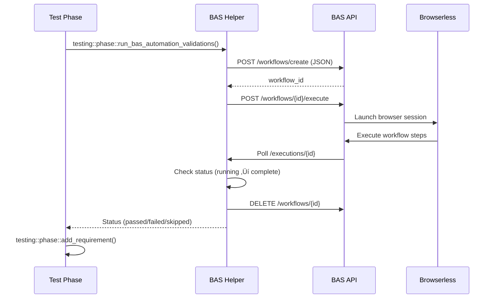

# 🤖 UI Automation with Browser Automation Studio

> **Essential guide for writing UI tests as JSON workflows that integrate with requirement tracking**

## Table of Contents
- [Overview](#overview)
- [Why BAS Workflows](#why-bas-workflows)
- [Workflow Structure](#workflow-structure)
- [Node Types Reference](#node-types-reference)
- [Authoring Workflows](#authoring-workflows)
- [Workflow Lifecycle](#workflow-lifecycle)
- [Requirements Integration](#requirements-integration)
- [Storage Location](#storage-location)
- [Execution Helper](#execution-helper)
- [Troubleshooting](#troubleshooting)
- [See Also](#see-also)

## Overview

Browser Automation Studio (BAS) enables **declarative UI testing** through JSON workflows that execute via API. This eliminates Playwright/Puppeteer code while maintaining version control and requirement tracking integration.

**What is BAS workflow testing?**
- Write UI tests as **declarative JSON workflows** with nodes and edges
- Execute workflows via **BAS API** (no manual clicking, fully automated)
- Integrate with **requirement tracking** using `automation` validation type
- **Self-testing**: BAS validates itself using its own automation capabilities

**Benefits:**
- ✅ **Declarative** - JSON workflows are version-controlled, not imperative code
- ✅ **No Playwright code** - Node configuration instead of page.click() calls
- ✅ **Requirement tracking** - Auto-sync like unit tests (`type: automation`)
- ✅ **Maintainable** - Update UI → regenerate workflow → commit JSON
- ✅ **AI-friendly** - Agents write JSON directly, no framework learning curve

## Why BAS Workflows

**vs. Playwright/Puppeteer**:
- ❌ Playwright: Requires JavaScript knowledge, imperative code, brittle selectors
- ✅ BAS: Declarative JSON, visual editor option, requirement integration built-in

**vs. Manual Testing**:
- ❌ Manual: Not repeatable, can't integrate with CI, no coverage tracking
- ✅ BAS: Automated, versioned, integrated with requirement tracking
- ℹ️ Manual validations remain a last-resort escape hatch. If you absolutely need one, log it with `vrooli scenario requirements manual-log` so drift detection knows when it expires—but build a BAS workflow as soon as possible to retire the manual checklist entry.

**For AI Agents**:
- BAS workflows are **JSON structures** that agents can write directly
- No need to learn Playwright API or handle async/await patterns
- Clear node types with typed `data` properties
- Execution errors include screenshots and DOM snapshots for debugging

## Workflow Structure

### Minimal Example

```json
{
  "metadata": {
    "description": "Test project creation flow",
    "requirement": "BAS-PROJECT-CREATE",
    "version": 1
  },
  "settings": {
    "executionViewport": {
      "width": 1440,
      "height": 900,
      "preset": "desktop"
    }
  },
  "nodes": [
    {
      "id": "navigate-home",
      "type": "navigate",
      "position": { "x": 0, "y": 0 },
      "data": {
        "label": "Navigate to homepage",
        "destinationType": "scenario",
        "scenario": "my-scenario",
        "scenarioPath": "/",
        "waitUntil": "networkidle0"
      }
    },
    {
      "id": "click-button",
      "type": "click",
      "position": { "x": 220, "y": 0 },
      "data": {
        "label": "Click create button",
        "selector": "[data-testid='create-btn']",
        "waitForSelector": "[data-testid='create-btn']"
      }
    }
  ],
  "edges": [
    {
      "id": "edge-1",
      "source": "navigate-home",
      "target": "click-button",
      "type": "smoothstep"
    }
  ]
}
```

### Key Components

**metadata**: Links workflow to requirement, describes purpose
```json
{
  "description": "Human-readable purpose",
  "requirement": "REQ-ID-FROM-REGISTRY",
  "version": 1  // Increment when workflow changes significantly
}
```

**settings**: Execution environment configuration
```json
{
  "executionViewport": {
    "width": 1440,      // Browser width
    "height": 900,      // Browser height
    "preset": "desktop" // "mobile" | "tablet" | "desktop"
  }
}
```

**nodes**: Array of steps in the workflow
```json
{
  "id": "unique-node-id",           // Must be unique within workflow
  "type": "navigate",               // Node type (see reference below)
  "position": { "x": 0, "y": 0 },  // Visual editor position (optional for execution)
  "data": {
    "label": "Step description",   // Shown in execution logs
    // ... type-specific properties
  }
}
```

**edges**: Connections defining execution order
```json
{
  "id": "unique-edge-id",
  "source": "source-node-id",  // Node to execute first
  "target": "target-node-id",  // Node to execute after source completes
  "type": "smoothstep"         // Visual style (doesn't affect execution)
}
```

## Node Types Reference

### Navigate Node

**Purpose**: Navigate to a URL or scenario

**Type-specific data**:
```json
{
  "type": "navigate",
  "data": {
    "label": "Navigate to dashboard",
    "destinationType": "scenario",  // "scenario" | "url"
    "scenario": "my-scenario",      // Scenario name (when destinationType="scenario")
    "scenarioPath": "/dashboard",   // Path within scenario
    "url": "https://example.com",   // Direct URL (when destinationType="url")
    "waitUntil": "networkidle0",    // "load" | "domcontentloaded" | "networkidle0" | "networkidle2"
    "timeoutMs": 30000,             // Max wait time
    "waitForMs": 1000               // Additional wait after navigation
  }
}
```

**Use scenario navigation** when testing Vrooli scenarios (auto-resolves ports):
```json
{
  "destinationType": "scenario",
  "scenario": "browser-automation-studio",
  "scenarioPath": "/projects"
  // Resolves to http://localhost:{UI_PORT}/projects
}
```

### Click Node

**Purpose**: Click an element

**Type-specific data**:
```json
{
  "type": "click",
  "data": {
    "label": "Click submit button",
    "selector": "[data-testid='submit-btn']",  // CSS selector
    "waitForSelector": "[data-testid='submit-btn']",  // Wait for element before clicking
    "timeoutMs": 10000,
    "waitForMs": 500,  // Wait after click
    "clickCount": 1    // Number of clicks (default: 1)
  }
}
```

**Best practices**:
- Always use `data-testid` selectors
- Set `waitForSelector` to ensure element exists
- Add `waitForMs` if subsequent nodes need time to react

### Type Node

**Purpose**: Enter text into an input field

**Type-specific data**:
```json
{
  "type": "type",
  "data": {
    "label": "Enter project name",
    "selector": "[data-testid='project-name-input']",
    "text": "My Test Project",
    "clearExisting": true,  // Clear field before typing
    "delay": 50             // Milliseconds between keystrokes (simulates human typing)
  }
}
```

### Assert Node

**Purpose**: Verify element existence, text content, or attributes

**Type-specific data**:
```json
{
  "type": "assert",
  "data": {
    "label": "Verify success message",
    "selector": "[data-testid='success-message']",
    "assertMode": "exists",         // "exists" | "not_exists" | "contains_text" | "exact_text"
    "expectedText": "Success!",     // Required for text assertions
    "timeoutMs": 10000,
    "failureMessage": "Success message should appear after project creation"
  }
}
```

**Assert modes**:
- `exists`: Element present in DOM
- `not_exists`: Element not in DOM (useful for testing removal)
- `contains_text`: Element text contains substring (case-sensitive)
- `exact_text`: Element text exactly matches (case-sensitive)

### Wait Node

**Purpose**: Pause execution for a fixed duration

**Type-specific data**:
```json
{
  "type": "wait",
  "data": {
    "label": "Wait for animation",
    "durationMs": 1500  // Milliseconds to wait
  }
}
```

**When to use**:
- After navigation to let page settle
- After modal open/close animations
- When waiting for visual transitions

**Prefer assertions over fixed waits** when possible - they're more reliable.

### Screenshot Node

**Purpose**: Capture page or element screenshot

**Type-specific data**:
```json
{
  "type": "screenshot",
  "data": {
    "label": "Capture dashboard state",
    "fullPage": true,              // Capture entire page (scrolls if needed)
    "captureDomSnapshot": true,    // Also capture DOM for replay
    "selector": "[data-testid='chart']",  // Capture specific element (optional)
    "waitForMs": 1000              // Wait before capturing
  }
}
```

**Artifacts**:
- Screenshots saved to execution artifacts
- Accessible via `/api/v1/executions/{id}/artifacts`
- Viewable in BAS UI replay panel

### Extract Node

**Purpose**: Extract data from page (text, attributes, HTML)

**Type-specific data**:
```json
{
  "type": "extract",
  "data": {
    "label": "Extract username",
    "selector": "[data-testid='user-name']",
    "extractMode": "text",        // "text" | "attribute" | "html"
    "attribute": "data-value",    // Required when extractMode="attribute"
    "variable": "extractedUsername"  // Store in execution context (future use)
  }
}
```

## Authoring Workflows

### For AI Agents (Direct JSON)

When writing workflows programmatically, follow this pattern:

1. **Start with navigation**
   ```json
   {
     "id": "nav-start",
     "type": "navigate",
     "data": {
       "destinationType": "scenario",
       "scenario": "target-scenario",
       "scenarioPath": "/"
     }
   }
   ```

2. **Use data-testid selectors** (from Writing Testable UIs guide)
   ```json
   {
     "selector": "[data-testid='element-id']"  // ✅ Stable
   }
   // NOT:
   { "selector": "div > button.btn-primary" }  // ❌ Brittle
   ```

3. **Add waits strategically**
   - After navigation: `waitForMs: 1000-2000`
   - After clicks that trigger navigation: `waitForMs: 500`
   - Before assertions: Use assert node's built-in timeout

4. **Include screenshots** at key points
   - After navigation (capture initial state)
   - Before form submission (capture input values)
   - After expected state changes

5. **Use descriptive labels**
   ```json
   { "label": "Click submit after filling form" }  // ✅ Clear
   { "label": "Click button" }                     // ❌ Vague
   ```

6. **Create linear flows first**, branch later
   - Start with happy path (success scenario)
   - Add error paths once happy path works

### Example: Complete Form Workflow

```json
{
  "metadata": {
    "description": "Test complete project creation with validation",
    "requirement": "MY-PROJECT-CREATE",
    "version": 1
  },
  "settings": {
    "executionViewport": { "width": 1440, "height": 900, "preset": "desktop" }
  },
  "nodes": [
    {
      "id": "nav",
      "type": "navigate",
      "position": { "x": 0, "y": 0 },
      "data": {
        "label": "Navigate to homepage",
        "destinationType": "scenario",
        "scenario": "my-scenario",
        "scenarioPath": "/",
        "waitUntil": "networkidle0",
        "waitForMs": 1500
      }
    },
    {
      "id": "screenshot-initial",
      "type": "screenshot",
      "position": { "x": 220, "y": -100 },
      "data": {
        "label": "Capture initial state",
        "fullPage": true,
        "captureDomSnapshot": true
      }
    },
    {
      "id": "click-create",
      "type": "click",
      "position": { "x": 220, "y": 100 },
      "data": {
        "label": "Click new project button",
        "selector": "[data-testid='new-project-btn']",
        "waitForSelector": "[data-testid='new-project-btn']",
        "waitForMs": 500
      }
    },
    {
      "id": "assert-modal",
      "type": "assert",
      "position": { "x": 440, "y": 100 },
      "data": {
        "label": "Verify modal opened",
        "selector": "[data-testid='project-modal']",
        "assertMode": "exists",
        "timeoutMs": 5000,
        "failureMessage": "Project creation modal should appear"
      }
    },
    {
      "id": "fill-name",
      "type": "type",
      "position": { "x": 660, "y": 100 },
      "data": {
        "label": "Enter project name",
        "selector": "[data-testid='project-name-input']",
        "text": "E2E Test Project",
        "clearExisting": true
      }
    },
    {
      "id": "fill-description",
      "type": "type",
      "position": { "x": 880, "y": 100 },
      "data": {
        "label": "Enter description",
        "selector": "[data-testid='project-description-input']",
        "text": "Created by automated workflow test"
      }
    },
    {
      "id": "screenshot-form",
      "type": "screenshot",
      "position": { "x": 1100, "y": 0 },
      "data": {
        "label": "Capture filled form",
        "fullPage": false,
        "captureDomSnapshot": true
      }
    },
    {
      "id": "submit",
      "type": "click",
      "position": { "x": 1100, "y": 200 },
      "data": {
        "label": "Submit form",
        "selector": "[data-testid='project-modal-submit']",
        "waitForMs": 2000
      }
    },
    {
      "id": "assert-success",
      "type": "assert",
      "position": { "x": 1320, "y": 200 },
      "data": {
        "label": "Verify success message",
        "selector": "[data-testid='success-message']",
        "assertMode": "contains_text",
        "expectedText": "Project created successfully",
        "timeoutMs": 10000
      }
    }
  ],
  "edges": [
    { "id": "e1", "source": "nav", "target": "screenshot-initial" },
    { "id": "e2", "source": "nav", "target": "click-create" },
    { "id": "e3", "source": "click-create", "target": "assert-modal" },
    { "id": "e4", "source": "assert-modal", "target": "fill-name" },
    { "id": "e5", "source": "fill-name", "target": "fill-description" },
    { "id": "e6", "source": "fill-description", "target": "screenshot-form" },
    { "id": "e7", "source": "fill-description", "target": "submit" },
    { "id": "e8", "source": "submit", "target": "assert-success" }
  ]
}
```

**Note**: The `position` values are for visual editor layout and don't affect execution order. Execution follows the `edges` graph.

## Workflow Lifecycle

```mermaid
graph TB
    Author[Author workflow<br/>in BAS UI] --> Export[Export to JSON<br/>via BAS API]
    Export --> Commit[Commit to repo<br/>test/playbooks/*.json]
    Commit --> Phase[Phase script<br/>executes workflow]
    Phase --> Import[Import to BAS<br/>Testing Harness project]
    Import --> Execute[Execute via<br/>/workflows/{id}/execute]
    Execute --> Track[Update requirement<br/>tracking]
    Track --> Cleanup[Cleanup temp<br/>workflows]

    style Author fill:#e1f5ff
    style Export fill:#fff3e0
    style Commit fill:#f3e5f5
    style Execute fill:#e8f5e9
    style Track fill:#c8e6c9
```

**Key insight:** Workflows are created visually, stored as code, executed programmatically.

## Storage Location

- Each scenario owns its automation assets under `scenarios/<name>/test/playbooks/`.
- Group related flows into subdirectories (`executions/`, `projects/`, `replay/`, etc.) for
  readability.
- Workflow definitions are exported JSON payloads from the BAS UI/API. Do not hand-edit the graph
  structure—regenerate from BAS when behaviour changes.
- Optionally attach metadata in `workflow.metadata` to describe intent, version, or requirement IDs.

## Execution Helper

Use the shared helper in `scripts/scenarios/testing/playbooks/browser-automation-studio.sh`:

```bash
source "${APP_ROOT}/scripts/scenarios/testing/playbooks/browser-automation-studio.sh"

if testing::playbooks::bas::run_workflow \
    --file "test/playbooks/executions/telemetry-smoke.json" \
    --scenario "browser-automation-studio"; then
  testing::phase::add_requirement --id BAS-EXEC-TELEMETRY-AUTOMATION --status passed \
    --evidence "Telemetry workflow executed"
else
  # Non-zero exit codes indicate execution failure; exit 210 marks missing workflow exports.
  ...
fi
```

Or allow the phase helper to execute every validated workflow automatically:

```bash
# Runs all `type: automation` validations assigned to this phase
testing::phase::run_bas_automation_validations --scenario "$SCENARIO_NAME" --manage-runtime skip
```

Key behaviours (API-native pipeline):

- Ensures `jq` and `curl` are available, resolves the scenario’s `API_PORT` via `vrooli`, and talks to
  `http://localhost:<API_PORT>/api/v1` directly—no CLI dependency.
- Auto-creates (or reuses) a “Testing Harness” BAS project rooted at
  `<scenario>/data/projects/testing-harness` so imported workflows live outside the demo data.
- Imports JSON definitions with `POST /workflows/create`, executes them with
  `POST /workflows/{id}/execute`, then polls `/executions/{id}` until BAS reports the final status.
- Deletes temporary workflows through the bulk-delete endpoint when `--keep-workflow` is not set,
  keeping the database clean between test runs.
- Automatically starts/stops the scenario when `--manage-runtime auto` (default) and tolerates being
  sourced outside the phased shell helpers (it only calls `testing::core::*` helpers when present).
- Returns exit code **210** when `--allow-missing` is passed and the workflow JSON is absent, letting
  callers treat unexported flows as skips during migrations.
- Exposes execution metadata so phases can attach precise evidence:
  - `TESTING_PLAYBOOKS_BAS_LAST_WORKFLOW_ID`
  - `TESTING_PLAYBOOKS_BAS_LAST_EXECUTION_ID`
  - `TESTING_PLAYBOOKS_BAS_LAST_SCENARIO`
- Surfaces the raw execution JSON when BAS returns `failed/errored`, which makes it easy to include
  the Browserless error string in requirement evidence.

## Requirements Integration

Annotate requirement validations with the `automation` type and reference the workflow JSON path:

```yaml
validation:
  - type: automation
    ref: test/playbooks/projects/demo-sanity.json
    scenario: browser-automation-studio   # optional override
    status: planned
    notes: Replays the seeded demo workflow end-to-end.

  # Example pointing at an existing workflow stored inside BAS
  - type: automation
    workflow_id: WORKFLOW-123456
    phase: integration
    scenario: browser-automation-studio
    status: planned
    notes: Executes a shared workflow without committing JSON to the repo.
```

During `testing::phase::init`, these validations are exposed via
`testing::phase::expected_validations_for <requirement_id>` so phase scripts can iterate over
expected workflows without hardcoding filenames.

## Authoring Checklist

1. Build/record the workflow inside BAS.
2. Export the workflow JSON (via API or CLI) and store under `test/playbooks/`.
3. Link the workflow to requirement validations and phase scripts.
4. Commit supporting fixtures (mock servers, test data) alongside the workflow when necessary.
5. Regenerate exports whenever BAS node semantics change to keep tests honest.

Maintaining this contract keeps UI smoke coverage declarative: requirements declare which workflows prove them, and phases simply execute those workflows via the shared helper.

## Workflow Execution Flow



## Troubleshooting

### Workflow Fails to Import

**Symptom**: Phase script errors with "Failed to import BAS workflow"

**Causes**:
1. JSON file doesn't exist at specified path
2. JSON syntax error (invalid JSON)
3. BAS scenario not running
4. Missing required fields in workflow JSON

**Solutions**:
```bash
# 1. Verify file exists
ls -la test/playbooks/ui/projects/create.json

# 2. Validate JSON syntax
jq . test/playbooks/ui/projects/create.json

# 3. Check BAS is running
vrooli scenario status browser-automation-studio

# 4. Check required fields
# Workflow must have: metadata, nodes, edges
```

### Selector Not Found

**Symptom**: Workflow fails at specific step with "selector not found" or timeout error

**Causes**:
1. `data-testid` doesn't exist in UI
2. Timing issue (element not loaded yet)
3. Modal/dialog not opened
4. Typo in selector

**Solutions**:
```json
// 1. Verify data-testid exists in UI code
// Check: <button data-testid="submit-btn">

// 2. Add wait before selector-dependent nodes
{
  "id": "wait-for-load",
  "type": "wait",
  "data": { "durationMs": 1500 }
}

// 3. Use waitForSelector in click/type nodes
{
  "type": "click",
  "data": {
    "selector": "[data-testid='submit-btn']",
    "waitForSelector": "[data-testid='submit-btn']",  // Waits up to timeout
    "timeoutMs": 10000
  }
}

// 4. Double-check selector syntax
"[data-testid='name']"  // ✅ Correct
"[data-testid=name]"    // ❌ Missing quotes
"data-testid='name'"    // ❌ Missing brackets
```

### Workflow Times Out

**Symptom**: Workflow execution exceeds timeout, returns incomplete

**Causes**:
1. Page never reaches `networkidle0`
2. Continuous polling/requests preventing idle state
3. Timeout too short for slow operations
4. Infinite loop in workflow

**Solutions**:
```json
// 1. Use different waitUntil strategy
{
  "type": "navigate",
  "data": {
    "waitUntil": "load"  // Instead of "networkidle0"
  }
}

// 2. Add explicit waits after navigation
{
  "type": "navigate",
  "data": {
    "waitUntil": "domcontentloaded",
    "waitForMs": 2000  // Additional wait
  }
}

// 3. Increase timeouts
{
  "data": {
    "timeoutMs": 60000  // 60 seconds for slow operations
  }
}

// 4. Check edges for cycles
// Edges should form DAG (directed acyclic graph), not loops
```

### Assert Node Fails

**Symptom**: Assert node fails despite element appearing correct visually

**Causes**:
1. Text assertion is case-sensitive
2. Element contains extra whitespace
3. Element not yet updated with expected content
4. Wrong assert mode

**Solutions**:
```json
// 1. Use contains_text instead of exact_text
{
  "assertMode": "contains_text",
  "expectedText": "Success"  // Matches "Success!" and "Success: Project created"
}

// 2. Trim expected text
{
  "expectedText": "Project Name"  // Matches "  Project Name  " with whitespace
}

// 3. Add wait before assertion
{
  "id": "wait-update",
  "type": "wait",
  "data": { "durationMs": 1000 }
}

// 4. Choose correct mode
"assertMode": "exists"         // Element in DOM
"assertMode": "contains_text"  // Text includes substring
"assertMode": "exact_text"     // Text exactly matches
```

### BAS Scenario Not Running

**Symptom**: Execution helper reports "Unable to resolve API_PORT"

**Causes**:
1. BAS scenario not started
2. Scenario crashed/stopped
3. Port allocation conflict

**Solutions**:
```bash
# 1. Start BAS
vrooli scenario start browser-automation-studio

# 2. Check status
vrooli scenario status browser-automation-studio

# 3. Check logs for errors
vrooli scenario logs browser-automation-studio

# 4. Restart if needed
vrooli scenario stop browser-automation-studio
vrooli scenario start browser-automation-studio --clean-stale
```

### Workflow Execution Shows Success but Requirement Fails

**Symptom**: Workflow executes successfully but requirement shows "failing"

**Causes**:
1. Workflow metadata doesn't match requirement ID
2. Requirement validation missing `type: automation` entry
3. Phase script not calling `testing::phase::add_requirement`

**Solutions**:
```json
// 1. Check metadata.requirement matches registry
{
  "metadata": {
    "requirement": "BAS-PROJECT-CREATE"  // Must match registry ID exactly
  }
}

// 2. Add automation validation to requirement
{
  "id": "BAS-PROJECT-CREATE",
  "validation": [
    {
      "type": "automation",
      "ref": "test/playbooks/ui/projects/create.json",
      "phase": "integration"
    }
  ]
}

// 3. Verify phase script uses helper
// test/phases/test-integration.sh should call:
testing::phase::run_bas_automation_validations --scenario "$SCENARIO_NAME"
```

## See Also

### Related Guides
- **[Writing Testable UIs](writing-testable-uis.md)** - Use `data-testid`, design for automation
- **[End-to-End Example](end-to-end-example.md)** - Complete flow from PRD to BAS workflow
- **[Requirement Tracking](requirement-tracking.md)** - Understanding `automation` validation type
- **[Scenario Testing](scenario-testing.md)** - Complete testing workflow
- **[Phased Testing Architecture](../architecture/PHASED_TESTING.md)** - How BAS integrates with phases

### Reference Implementation
- **[browser-automation-studio scenario](../../../scenarios/browser-automation-studio/)** - Self-testing example
- **[Example workflows](../../../scenarios/browser-automation-studio/test/playbooks/)** - Real workflow JSON files
- **[demo-sanity.json](../../../scenarios/browser-automation-studio/test/playbooks/projects/demo-sanity.json)** - Simple workflow example

### Tools
- **[browser-automation-studio.sh](../../../scripts/scenarios/testing/playbooks/browser-automation-studio.sh)** - Execution helper source code

---

**Remember**: BAS workflows are JSON data structures. AI agents can write them directly without learning Playwright APIs or handling async patterns.
