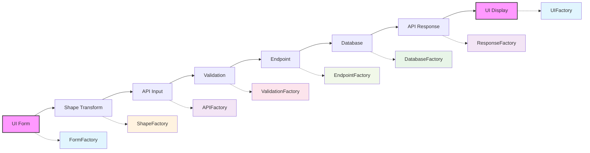

# Round-Trip Testing Guide

This document explains how to implement comprehensive round-trip tests that validate data flow through all layers of the Vrooli application.

**Purpose**: Ensure data integrity from UI forms through API calls to database storage and back.

**Prerequisites**: 
- Read [Fixtures Overview](./fixtures-overview.md) first
- Understanding of [Fixture Patterns](./fixture-patterns.md)

**Related Documents**:
- [Fixtures Overview](./fixtures-overview.md) - Quick start guide
- [Fixture Patterns](./fixture-patterns.md) - Pattern catalog
- [Writing Tests](./writing-tests.md) - General testing guidelines
- [Test Execution](./test-execution.md) - Running tests

## What is Round-Trip Testing?

Round-trip testing validates that data maintains its integrity through a complete cycle using the Unified Fixture Architecture:



The data that starts in the UI should match what's displayed after the complete journey, with each factory ensuring type safety and data integrity between layers.

## The Problem We're Solving

### Without Round-Trip Testing

```typescript
// ❌ Fragmented testing approach
it("validates form data", () => { /* only tests validation */ });
it("transforms data correctly", () => { /* only tests shape function */ });
it("saves to database", () => { /* only tests persistence */ });
// But do they work together? 🤷
```

**Problems**:
- Integration bugs slip through
- Data corruption goes unnoticed
- Schema mismatches cause runtime errors
- User-reported bugs that "work in unit tests"

### With Round-Trip Testing

```typescript
// ✅ Comprehensive integration testing
it("should handle complete bookmark flow", async () => {
    // Tests validation + transformation + API + persistence + retrieval
    const result = await testBookmarkRoundTrip(formData);
    expect(result.displayed).toEqual(result.submitted);
});
```

**Benefits**:
- Catches integration issues early
- Validates actual user workflows
- Ensures data consistency
- Builds confidence in the system

## Round-Trip Testing with the Unified Architecture

The Unified Fixture Architecture provides a factory-based approach where each factory connects exactly two layers, ensuring type safety and real function usage throughout.

### Core Principles

1. **Factory Chain Pattern**: Each factory connects 2 adjacent layers
2. **Type Safety**: No `any` types - full TypeScript support
3. **Real Functions**: Use actual shape, validation, and endpoint functions
4. **True Database Testing**: Via testcontainers for isolated database operations
5. **Error Injection**: Each factory supports error scenario testing

### The Factory Chain

```typescript
// Complete factory chain for round-trip testing
export interface RoundTripFactoryChain<TObject> {
  // Layer-to-layer factories
  formFactory: FormFactory<FormData, ShapeObject>
  shapeFactory: ShapeFactory<ShapeObject, APIInput>
  apiFactory: APIFactory<APIInput, ValidatedInput>
  validationFactory: ValidationFactory<ValidatedInput, EndpointInput>
  endpointFactory: EndpointFactory<EndpointInput, DatabaseInput>
  databaseFactory: DatabaseFactory<DatabaseInput, DatabaseResult>
  responseFactory: ResponseFactory<DatabaseResult, APIResponse>
  uiFactory: UIFactory<APIResponse, UIState>
  
  // Orchestrator combines all factories
  orchestrator: RoundTripOrchestrator<FormData, UIState>
}
```

### Implementing Round-Trip Tests

```typescript
import { BookmarkRoundTripFactory } from "@/test/fixtures/round-trip-tests/bookmarkRoundTrip";
import { DbProvider } from "@/test/fixtures/db";
import { PostgreSQLContainer } from "@testcontainers/postgresql";

describe("Bookmark Round-Trip Testing", () => {
  let container: PostgreSQLContainer;
  let roundTripFactory: BookmarkRoundTripFactory;
  
  beforeAll(async () => {
    // Set up real database with testcontainers
    container = await new PostgreSQLContainer()
      .withDatabase("test_db")
      .start();
      
    process.env.DATABASE_URL = container.getConnectionUri();
    await DbProvider.initialize();
    
    // Initialize factory chain
    roundTripFactory = new BookmarkRoundTripFactory({
      database: DbProvider.get(),
      useRealEndpoints: true,
      validateAtEachStep: true
    });
  });
  
  afterAll(async () => {
    await container.stop();
  });
  
  it("should handle complete bookmark lifecycle", async () => {
    // Start with form data (what user actually enters)
    const formData = {
      bookmarkFor: "Project",
      forConnect: "project_123",
      createNewList: true,
      newListLabel: "My Projects"
    };
    
    // Execute full round-trip through all layers
    const result = await roundTripFactory.executeFullCycle(formData);
    
    // Verify success
    expect(result.success).toBe(true);
    expect(result.stages).toEqual({
      form: "completed",
      shape: "completed",
      api: "completed",
      validation: "completed",
      endpoint: "completed",
      database: "completed",
      response: "completed",
      ui: "completed"
    });
    
    // Verify data integrity
    expect(result.dataIntegrity).toBe(true);
    expect(result.finalUIState.bookmark.to.id).toBe(formData.forConnect);
    expect(result.finalUIState.list.label).toBe(formData.newListLabel);
    
    // Verify database state
    expect(result.databaseRecord).toBeDefined();
    expect(result.databaseRecord.id).toBeDefined();
    expect(result.databaseRecord.list).toBeDefined();
    
    // Verify UI can display the result
    expect(result.canDisplay).toBe(true);
  });
  
  it("should handle validation errors gracefully", async () => {
    const invalidFormData = {
      bookmarkFor: null, // Invalid
      forConnect: "project_123"
    };
    
    const result = await roundTripFactory.testErrorRecovery({
      stage: "validation",
      formData: invalidFormData,
      expectedError: "VALIDATION_ERROR"
    });
    
    expect(result.errorHandled).toBe(true);
    expect(result.failedAtStage).toBe("validation");
    expect(result.userErrorMessage).toContain("bookmark type");
  });
  
  it("should handle database errors with retry", async () => {
    const formData = bookmarkFormData.minimal;
    
    // Inject database error
    await roundTripFactory.injectError({
      stage: "database",
      error: new Error("Connection timeout"),
      retryable: true
    });
    
    const result = await roundTripFactory.executeFullCycle(formData);
    
    expect(result.retryAttempts).toBe(1);
    expect(result.success).toBe(true); // Succeeded on retry
  });
});
    
    // Step 2: Transform for API (as UI would)
    const apiRequest = shapeBookmark.create({
        __typename: "Bookmark",
        id: DUMMY_ID,
        bookmarkFor: formData.bookmarkFor,
        to: { 
            __typename: formData.bookmarkFor,
            id: formData.forConnect 
        }
    });
    
    // Step 3: Send to API (real endpoint)
    const createResponse = await fetch(endpointsBookmark.create.path, {
        method: "POST",
        body: JSON.stringify(apiRequest),
    });
    const created = await createResponse.json();
    
    // Step 4: Retrieve from API (verify persistence)
    const getResponse = await fetch(`${endpointsBookmark.find.path}/${created.id}`);
    const retrieved = await getResponse.json();
    
    // Step 5: Transform for display (as UI would)
    const displayData = shapeBookmark.find(retrieved);
    
    return {
        submitted: formData,
        created: created,
        retrieved: retrieved,
        displayed: displayData,
    };
}
```

## Complete Example: Comment Round-Trip Test

Here's a full implementation of a round-trip test for the comment system:

```typescript
import { describe, it, expect, beforeEach, afterEach } from 'vitest';
import { 
    shapeComment, 
    commentValidation, 
    endpointsComment,
    Shape
} from "@vrooli/shared";
import { DbProvider } from '@vrooli/server';
import { createTestUser, createTestProject } from '../fixtures/testHelpers.js';

describe("Comment Round-Trip Testing", () => {
    let testUser: Shape.User;
    let testProject: Shape.Project;
    let createdCommentId: string;
    
    beforeEach(async () => {
        // Setup test data
        testUser = await createTestUser();
        testProject = await createTestProject({ owner: testUser });
    });
    
    afterEach(async () => {
        // Cleanup in reverse order of foreign keys
        if (createdCommentId) {
            await DbProvider.get().comment.delete({
                where: { id: createdCommentId }
            });
        }
        await DbProvider.get().project.delete({
            where: { id: testProject.id }
        });
        await DbProvider.get().user.delete({
            where: { id: testUser.id }
        });
    });
    
    it("should complete full comment lifecycle", async () => {
        // Step 1: Start with form data (as user would input)
        const formData = {
            text: "This is a test comment",
            parentType: "Project",
            parentId: testProject.id,
        };
        
        // Step 2: Validate form data
        const validation = await commentValidation.create.validate(formData);
        expect(validation.isValid).toBe(true);
        
        // Step 3: Transform for API request
        const createRequest = shapeComment.create({
            __typename: "Comment",
            id: DUMMY_ID,
            text: formData.text,
            parent: {
                __typename: formData.parentType,
                id: formData.parentId,
            },
            user: {
                __typename: "User",
                id: testUser.id,
            },
        });
        
        // Step 4: Create via API endpoint
        const createResult = await endpointsComment.create({
            input: createRequest,
            context: { user: testUser },
        });
        expect(createResult.success).toBe(true);
        createdCommentId = createResult.data.id;
        
        // Step 5: Retrieve via API endpoint
        const findResult = await endpointsComment.find({
            input: { id: createdCommentId },
            context: { user: testUser },
        });
        expect(findResult.success).toBe(true);
        
        // Step 6: Transform for display
        const displayData = shapeComment.find(findResult.data);
        
        // Step 7: Verify round-trip integrity
        expect(displayData).toMatchObject({
            text: formData.text,
            parent: expect.objectContaining({
                id: testProject.id,
            }),
            user: expect.objectContaining({
                id: testUser.id,
            }),
        });
        
        // Step 8: Test update flow
        const updateData = {
            id: createdCommentId,
            text: "Updated comment text",
        };
        
        const updateValidation = await commentValidation.update.validate(updateData);
        expect(updateValidation.isValid).toBe(true);
        
        const updateRequest = shapeComment.update(updateData);
        const updateResult = await endpointsComment.update({
            input: updateRequest,
            context: { user: testUser },
        });
        expect(updateResult.success).toBe(true);
        expect(updateResult.data.text).toBe("Updated comment text");
        
        // Step 9: Verify update persisted
        const verifyResult = await endpointsComment.find({
            input: { id: createdCommentId },
            context: { user: testUser },
        });
        expect(verifyResult.data.text).toBe("Updated comment text");
    });
    
    it("should handle validation errors appropriately", async () => {
        const invalidData = {
            text: "", // Empty text should fail validation
            parentType: "Project",
            parentId: testProject.id,
        };
        
        const validation = await commentValidation.create.validate(invalidData);
        expect(validation.isValid).toBe(false);
        expect(validation.errors).toContain("Text is required");
    });
    
    it("should enforce permissions in round-trip", async () => {
        // Create comment as one user
        const comment = await createTestComment({ 
            author: testUser,
            project: testProject 
        });
        
        // Try to update as different user
        const otherUser = await createTestUser();
        const updateResult = await endpointsComment.update({
            input: { id: comment.id, text: "Hacked!" },
            context: { user: otherUser },
        });
        
        expect(updateResult.success).toBe(false);
        expect(updateResult.error).toContain("Permission denied");
        
        // Verify original comment unchanged
        const verifyResult = await endpointsComment.find({
            input: { id: comment.id },
            context: { user: testUser },
        });
        expect(verifyResult.data.text).toBe(comment.text);
    });
});
```

## Advanced Round-Trip Patterns

### Testing Complex Relationships

```typescript
describe("Project with Team Round-Trip", () => {
    it("should maintain team relationships through round-trip", async () => {
        // Create team with members
        const team = await createTestTeam({
            members: [user1, user2, user3],
        });
        
        // Create project assigned to team
        const projectData = {
            name: "Team Project",
            team: { id: team.id },
        };
        
        // Full round-trip
        const created = await testProjectRoundTrip(projectData);
        
        // Verify team relationship preserved
        expect(created.displayed.team).toMatchObject({
            id: team.id,
            name: team.name,
            members: expect.arrayContaining([
                expect.objectContaining({ id: user1.id }),
                expect.objectContaining({ id: user2.id }),
                expect.objectContaining({ id: user3.id }),
            ]),
        });
    });
});
```

### Testing State Transitions

```typescript
describe("Task State Machine Round-Trip", () => {
    it("should handle state transitions correctly", async () => {
        // Create task in initial state
        const task = await createTestTask({ status: "pending" });
        
        // Test each valid transition
        const transitions = [
            { from: "pending", to: "in_progress", action: "start" },
            { from: "in_progress", to: "completed", action: "complete" },
        ];
        
        for (const transition of transitions) {
            // Verify current state
            const before = await getTask(task.id);
            expect(before.status).toBe(transition.from);
            
            // Perform transition
            const result = await updateTaskStatus(task.id, transition.action);
            expect(result.success).toBe(true);
            
            // Verify new state persisted
            const after = await getTask(task.id);
            expect(after.status).toBe(transition.to);
        }
    });
});
```

### Testing Concurrent Operations

```typescript
describe("Concurrent Update Round-Trip", () => {
    it("should handle concurrent updates safely", async () => {
        const project = await createTestProject();
        
        // Simulate concurrent updates
        const updates = Promise.all([
            updateProject(project.id, { name: "Update 1" }),
            updateProject(project.id, { description: "Update 2" }),
            updateProject(project.id, { tags: ["tag1", "tag2"] }),
        ]);
        
        const results = await updates;
        
        // All should succeed
        results.forEach(result => {
            expect(result.success).toBe(true);
        });
        
        // Final state should have all updates
        const final = await getProject(project.id);
        expect(final).toMatchObject({
            name: "Update 1",
            description: "Update 2",
            tags: expect.arrayContaining(["tag1", "tag2"]),
        });
    });
});
```

## Debugging Round-Trip Failures

### Common Issues and Solutions

| Issue | Symptom | Solution |
|-------|---------|----------|
| Schema Mismatch | "Unknown field" errors | Verify shape functions match API schema |
| Validation Drift | Works in UI but fails API | Ensure client/server validation aligned |
| Transform Bugs | Data corrupted in transit | Log at each step to isolate issue |
| Permission Errors | Inconsistent access | Test with multiple user contexts |
| Race Conditions | Intermittent failures | Add proper async/await handling |

### Debugging Strategy

```typescript
async function debugRoundTrip(formData) {
    console.log("1. Initial form data:", formData);
    
    const validation = await validate(formData);
    console.log("2. Validation result:", validation);
    
    const transformed = shape.create(formData);
    console.log("3. Transformed data:", transformed);
    
    const apiResult = await callApi(transformed);
    console.log("4. API response:", apiResult);
    
    const retrieved = await getFromDb(apiResult.id);
    console.log("5. Database state:", retrieved);
    
    const displayed = shape.find(retrieved);
    console.log("6. Display data:", displayed);
    
    // Compare each step to isolate issues
}
```

## Performance Considerations

### Optimizing Round-Trip Tests

```typescript
describe("Optimized Round-Trip Tests", () => {
    // Reuse expensive setup
    let sharedUser;
    let sharedProject;
    
    beforeAll(async () => {
        sharedUser = await createTestUser();
        sharedProject = await createTestProject({ owner: sharedUser });
    });
    
    afterAll(async () => {
        // Clean up shared resources
        await cleanupTestData([sharedProject, sharedUser]);
    });
    
    // Use transactions for automatic rollback
    it("should test with transaction", async () => {
        await withDbTransaction(async () => {
            // All DB operations auto-rollback after test
            await testCommentRoundTrip(data);
        });
    });
});
```

### Parallel Round-Trip Testing

```typescript
describe("Parallel Round-Trip Tests", () => {
    it("should handle multiple objects efficiently", async () => {
        // Create test data in parallel
        const [user1, user2, project] = await Promise.all([
            createTestUser(),
            createTestUser(),
            createTestProject(),
        ]);
        
        // Test round-trips in parallel
        const results = await Promise.all([
            testCommentRoundTrip({ author: user1, project }),
            testCommentRoundTrip({ author: user2, project }),
            testBookmarkRoundTrip({ user: user1, project }),
        ]);
        
        // Verify all succeeded
        results.forEach(result => {
            expect(result.success).toBe(true);
        });
    });
});
```

## Integration with CI/CD

### GitHub Actions Configuration

```yaml
round-trip-tests:
  runs-on: ubuntu-latest
  timeout-minutes: 20  # Round-trip tests take longer
  
  services:
    postgres:
      image: postgres:15
    redis:
      image: redis:7
      
  steps:
    - name: Run Round-Trip Tests
      run: |
        pnpm test:round-trip
      env:
        TEST_TIMEOUT: 60000  # 1 minute per test
```

## Key Benefits

### ✅ Testing Real Application Logic
- Catches actual integration bugs
- Validates complete user workflows  
- Tests production code paths
- Ensures data consistency

### 🚀 Reduced Maintenance
- No mock drift from real implementation
- Automatic updates when functions change
- Single source of truth for behavior
- Consistent patterns across objects

### 💡 Better Developer Experience  
- Confidence in full-stack changes
- Clear debugging path for issues
- Type safety throughout
- Realistic test scenarios

## Next Steps

1. **Start with critical flows**: User registration, core object creation
2. **Add round-trip tests** to existing test suites
3. **Monitor test performance**: Optimize slow round-trips
4. **Share patterns**: Document successful round-trip patterns

For implementation details, see the [Fixture Implementation Guide](./fixture-implementation-guide.md).