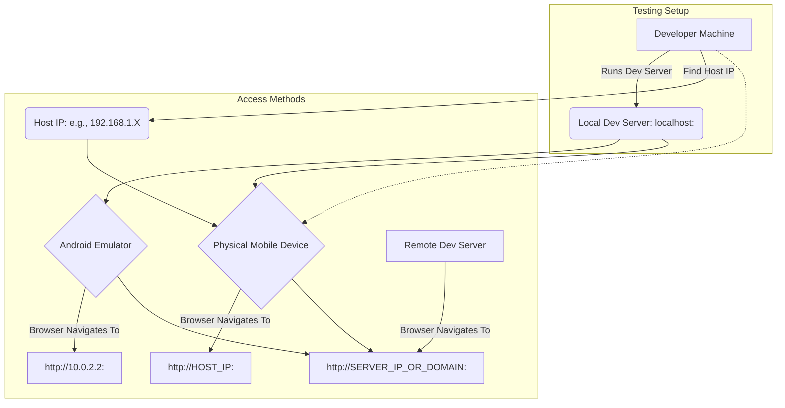

# Test Execution

This document provides guidelines on how to execute various types of tests for the Vrooli platform, including automated tests, linting, and mobile testing setup.

## 1. Running Automated Tests (Unit & Integration)

Automated tests are crucial for verifying the functionality of individual components and their integrations. We use Vitest as our test runner, which includes built-in assertion capabilities and mocking functionality. All packages use standard `vitest.config.ts` configurations with package-specific customizations for testcontainers and environment setup.

### 1.1. Prerequisites

-   Ensure your development environment is set up correctly.
-   Ensure all dependencies are installed (`pnpm install` in the root and relevant package directories).
-   Ensure environment variables are configured (e.g., `.env-test`).
-   **⚠️ CRITICAL: Docker must be running** (typically already running) for server and jobs package tests. These packages use testcontainers for Redis and PostgreSQL integration testing and will fail without Docker.
-   **Use extended timeouts** - test commands can take 15+ minutes in worst case scenarios due to container setup, test complexity, and limited resources.

### 1.2. Test Commands

#### Root-Level Test Commands

From the project root, you can run tests across all packages:

```bash
# Run all tests (shell scripts, unit tests, and run tests)
pnpm test

# Run only unit tests across all packages
pnpm test:unit

# Run only shell script tests
pnpm test:shell

```

**⚠️ Important:** Root-level test commands can take 15+ minutes in worst case scenarios. Use appropriate timeouts when running via scripts or CI. See [CLAUDE.md timeout guidelines](/CLAUDE.md#️-timeout-guidelines-for-long-running-commands) for complete timeout information.

#### Package-Level Test Commands

Test commands are typically run from within the specific package directory (e.g., `packages/server`, `packages/shared`, `packages/ui`, or `packages/jobs`).

**Common Test Scripts (from `package.json`):**

-   **Run all tests in a package:**
    ```bash
    # Example for packages/server
    cd packages/server
    pnpm test
    
    # Example for packages/jobs
    cd packages/jobs
    pnpm test
    ```
    This runs Vitest directly on TypeScript source files in the `src/` directory matching patterns like `*.test.ts`.

-   **Run tests in watch mode:**
    ```bash
    # Example for packages/server
    cd packages/server
    pnpm run test-watch
    ```
    This will re-run tests automatically when source files change.

-   **Run tests with coverage:**
    ```bash
    # Example for packages/shared
    cd packages/shared
    pnpm run test-coverage
    
    # Example for packages/server (requires Docker)
    cd packages/server
    pnpm run test-coverage
    ```
    Coverage reports help identify areas of the code not covered by tests. Vitest uses the v8 coverage provider to generate these reports.
    
    **Coverage Support by Package:**
    - ✅ server, shared, ui, jobs: Full coverage support with v8 provider
    - ❌ og-worker: No coverage (uses Cloudflare workers testing)
    - ❌ extension: No test setup
    - ⚠️ server & jobs: Require Docker

-   **Running individual test files:**
    ```bash
    # Run a specific test file (from within package directory)
    npx vitest run src/services/stripe.test.ts
    
    # For server package (consistent with other packages)
    npx vitest run -c vitest.config.ts src/services/stripe.test.ts
    
    # Run tests matching a pattern
    npx vitest run src/models/**/*.test.ts
    
    # Run with coverage for specific files
    npx vitest run --coverage src/services/stripe.test.ts
    ```

#### Package-Specific Considerations

**Performance Note:** All packages can potentially take 15+ minutes to run tests in worst-case scenarios. Factors affecting test duration include:
- Container setup time (for packages using testcontainers)
- Test complexity and coverage
- System resources and load
- Number of tests being run

**packages/server:**
- Uses testcontainers for Redis and PostgreSQL (Docker required)
- Uses standard `vitest.config.ts` with testcontainer setup
- Memory allocation:
  - `pnpm test`: 8192MB
  - `pnpm test-coverage`: 8192MB
  - `pnpm run type-check`: 6144MB
  - `start-development`: 4096MB

**packages/jobs:**
- Uses testcontainers for Redis and PostgreSQL (Docker required)  
- Has pretest step that builds both shared AND server packages
- Memory allocation:
  - `pnpm test`: 8192MB
  - `pnpm test-coverage`: 8192MB
  - `start-development`: 4096MB
  - No specific allocation for type-check

**packages/ui:**
- Has pretest step that builds shared package only
- Uses jsdom environment for React component testing
- Memory allocation:
  - `pnpm test-coverage`: 8192MB
  - `pnpm run type-check`: 4096MB
  - No specific allocation for regular tests

**packages/shared:**
- No external dependencies or Docker required
- Has dedicated build step for other packages to consume
- Memory allocation:
  - `pnpm test`: 8192MB
  - `pnpm test-coverage`: 8192MB
  - No specific allocation for type-check

### 1.3. Interpreting Test Results

-   **Pass:** The test executed successfully and all assertions passed.
-   **Fail:** The test executed, but one or more assertions failed, or an error occurred during test execution.
-   Vitest provides detailed output on failures, including stack traces, assertion differences, and helpful error messages with code context.

## 2. Linting

Linting is a static analysis process that checks code for programmatic and stylistic errors. It helps maintain code quality and consistency.

-   **Tool:** We use [ESLint](https://eslint.org/) integrated with the [ESLINT VSCode extension](https://marketplace.visualstudio.com/items?itemName=dbaeumer.vscode-eslint).
-   **Configuration:** ESLint is configured per package extending root `.eslintrc`:
    - `packages/server/.eslintrc` - Extends root config
    - `packages/shared/.eslintrc` - Extends root config  
    - `packages/jobs/.eslintrc` - Extends root config with import handling
    - `packages/ui/.eslintrc` - Extends root config with React-specific rules
    - `packages/extension` - No ESLint configuration
    - `packages/og-worker` - No ESLint configuration
-   **Automatic Linting:** The VSCode extension provides real-time linting for open files.

### 2.1. Manual Linting Commands

To lint the project manually:

**Root-level linting:**
```bash
# Lint all JavaScript/TypeScript files
pnpm run lint:js

# Lint all shell scripts
pnpm run lint:shell

# Lint both JS/TS and shell scripts
pnpm run lint
```

**Package-level linting:**
```bash
# Example for packages/server
cd packages/server
pnpm run lint

# Example for packages/ui
cd packages/ui
pnpm run lint
```


### 2.2. Disabling/Re-enabling the Linter in VSCode

If the linter impacts performance, you can temporarily disable it:

1.  Open the Command Palette (`Ctrl+Shift+P` or `Cmd+Shift+P`).
2.  Select `Extensions: Focus on Extensions View`.
3.  Search for "ESLint".
4.  Click the gear icon next to the ESLint extension and choose `Disable (Workspace)` or `Disable (Global)`.
5.  To re-enable, follow the same steps and choose `Enable`.

## 3. Mobile Testing (Web App)

This section provides guidance on testing the Vrooli web application on mobile devices, using either emulators or physical devices.

### 3.1. Accessing the Application URL

The URL depends on whether your development server is running locally or on a remote machine. Replace `<UI_PORT>` with the port number specified in your `.env` file (e.g., `3000`).

-   **Remote Server:** Use the server's IP address or domain name (e.g., `http://your-server-ip:<UI_PORT>` or `http://your-domain.com:<UI_PORT>`).
-   **Local Server (Emulator - Android Studio Recommended):**
    -   Use `http://10.0.2.2:<UI_PORT>` from the Android emulator's browser. This IP address is an alias for your host machine's loopback address (127.0.0.1).
-   **Local Server (Physical Device):**
    -   You'll need your computer's local network IP address. Both your computer and the physical mobile device must be on the **same Wi-Fi network**.
    -   **Finding your Local IP Address:**
        -   **Windows (PowerShell/Command Prompt):**
            ```powershell
            # For Wi-Fi connections
            (Get-NetIPAddress -AddressFamily IPv4 -InterfaceAlias "Wi-Fi*").IPAddress
            # For Ethernet connections
            (Get-NetIPAddress -AddressFamily IPv4 -InterfaceAlias "Ethernet*").IPAddress
            ```
            Or run `ipconfig` and look for the IPv4 address of your active network adapter.
        -   **macOS (Terminal):**
            ```bash
            ipconfig getifaddr en0  # For Wi-Fi (usually en0 or en1)
            # Or check System Settings > Network > Wi-Fi > Details...
            ```
        -   **Linux (Terminal):**
            ```bash
            hostname -I
            # or
            ip addr show | grep "inet "
            ```
    -   Once you have your computer's IP address (e.g., `192.168.1.100`), the URL for the physical device will be `http://192.168.1.100:<UI_PORT>`.

### 3.2. Using an Emulator (Android Studio Example)

1.  **Install Android Studio:** Download and install from the [official website](https://developer.android.com/studio).
2.  **Set up AVD Manager:** Open Android Studio, go to `Tools > AVD Manager`.
3.  **Create/Start Emulator:** Create a new Android Virtual Device (AVD) with a desired screen size and Android version, or start an existing one.
4.  **Access App:** Open the web browser (e.g., Chrome) within the emulator and navigate to the appropriate URL (see section 3.1).

### 3.3. Using Browser Developer Tools for Mobile Simulation

Most modern desktop browsers (Chrome, Firefox, Edge, Safari) offer built-in developer tools that can simulate various mobile devices, screen sizes, and touch events. This is a quick way to check responsiveness without a physical device or emulator.

-   **Chrome:** Open DevTools (`F12` or `Ctrl+Shift+I`), then click the "Toggle device toolbar" icon (looks like a phone and tablet).
-   Select a device from the dropdown or set custom dimensions.


This diagram shows how different devices can access the application for testing. 