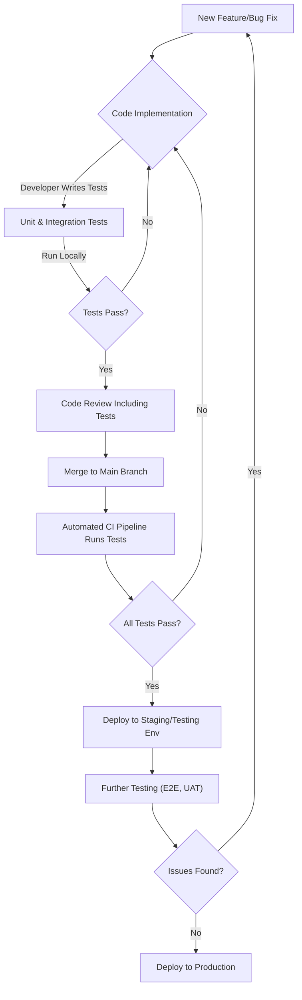

# Test Strategy

This document outlines the high-level testing strategy for the Vrooli platform. Our goal is to ensure a robust, reliable, and high-quality application through a comprehensive and integrated testing approach.

## 1. Testing Philosophy

We believe in a proactive and continuous testing approach, where quality is built into the development process from the start. This involves:

- **Early Testing:** Identifying and addressing defects as early as possible in the development lifecycle.
- **Automation:** Automating repetitive tests to improve efficiency, consistency, and coverage.
- **Collaboration:** Fostering close collaboration between developers, testers (if applicable), and product owners to ensure a shared understanding of quality expectations.
- **Risk-Based Testing:** Prioritizing testing efforts based on the criticality and risk associated with different features and components.

## 2. Types of Testing

We employ a variety of testing types to cover different aspects of the application:

- **Unit Testing:** Verifying individual components or modules in isolation. This is primarily the responsibility of developers.
- **Integration Testing:** Testing the interfaces and interactions between integrated components or systems.
- **End-to-End (E2E) Testing:** Validating complete application workflows from the user's perspective. (Aspirational, to be expanded as per roadmap)
- **UI/UX Testing:** Ensuring the user interface is intuitive, user-friendly, and adheres to design specifications. This includes manual checks and potentially automated UI tests.
- **API Testing:** Verifying the functionality, reliability, performance, and security of the application's APIs.
- **Performance Testing:** Assessing the responsiveness, stability, and scalability of the application under various load conditions. (Aspirational, to be expanded as per roadmap)
- **Security Testing:** Identifying and mitigating potential security vulnerabilities. (Aspirational, to be expanded as per roadmap)
- **Compatibility Testing:** Ensuring the application works correctly across different browsers, devices, and operating systems. (Partially covered by Mobile Testing practices)
- **Linting:** Static code analysis to enforce coding standards and catch potential errors before runtime. This is integrated into the development workflow.

## 3. Testing Tools and Technologies

Our primary testing stack includes:

- **Test Framework:** [Vitest](https://vitest.dev/) - A blazing fast unit test framework powered by Vite
- **Assertion Library:** Built-in Vitest assertions (chai-compatible)
- **Mocking:** Built-in Vitest mocking capabilities with `vi`
- **Test Containers:** For Redis and PostgreSQL testing (never mock core infrastructure)
- **Code Coverage:** v8 coverage provider integrated with Vitest
- **UI Testing:** Vitest + React Testing Library + MSW (Mock Service Worker)
- **Component Testing:** [Storybook](https://storybook.js.org/) for visual testing
- **E2E Testing:** [Cypress](https://www.cypress.io/) (pending implementation)
- **Linting:** [ESLint](https://eslint.org/) with project-specific configurations.

## 4. Test Environments

- **Development:** Local developer machines for unit and integration testing during development.
- **Testing/Staging:** A dedicated environment that mirrors production as closely as possible for E2E, performance, and UAT. (Details to be defined)
- **Production:** Live environment; testing is limited to smoke tests and monitoring.

## 5. Roles and Responsibilities

- **Developers:** Responsible for writing unit and integration tests for their code, ensuring sufficient coverage, and participating in code reviews that include test validation.
- **QA Team (Future):** As the project grows, a dedicated QA team may be established to oversee broader testing efforts, including E2E, performance, and exploratory testing.
- **Product Owners/Stakeholders:** Involved in defining acceptance criteria and participating in User Acceptance Testing (UAT).

## 6. Testing Process Flow

This diagram illustrates the general flow of testing within our development lifecycle. Continuous feedback and iteration are key components of this process.

## 7. Continuous Improvement

Our testing strategy is not static. We will continuously review and refine our processes, tools, and techniques based on feedback, lessons learned, and evolving project needs. This includes regularly assessing test coverage, defect escape rates, and the overall effectiveness of our testing efforts. 