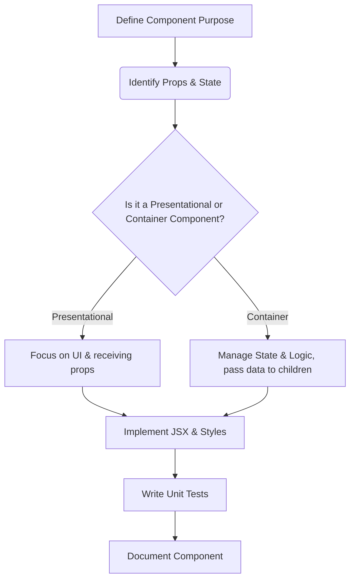

# Vrooli UI Development Guidelines

This document provides guidelines and best practices for developing User Interface (UI) components and features for the Vrooli platform. Our goal is to create a modern, responsive, accessible, and maintainable UI.

## Table of Contents
- [UI Philosophy](#ui-philosophy)
- [Core Technologies & Principles](#core-technologies--principles)
- [Component Design](#component-design)
- [State Management](#state-management)
- [Styling](#styling)
- [Folder Structure](#folder-structure)
- [Naming Conventions](#naming-conventions)
- [Accessibility (A11Y)](#accessibility-a11y)
- [Testing](#testing)
- [Documentation](#documentation)
- [Helpful Resources](#helpful-resources)

## UI Philosophy

Vrooli's UI aims to be:
-   **Modern & Intuitive:** Leveraging contemporary design patterns and providing a seamless user experience.
-   **Responsive:** Ensuring a consistent experience across various devices and screen sizes.
-   **Accessible:** Adhering to WCAG guidelines to make the platform usable by everyone. (See [Accessibility Guidelines](./ui-performance.md#accessibility)).
-   **Performant:** Optimized for fast loading and smooth interactions. (See [UI Performance Guidelines](./ui-performance.md)).
-   **Maintainable:** Built with clean, well-structured, and documented code.
-   **Consistent:** Utilizing a consistent design language based on [Material UI (MUI)](https://mui.com/), with a custom theme to align with Vrooli's branding.

## Core Technologies & Principles

-   **React:** All UI is built using [React](https://react.dev/).
-   **Functional Components & Hooks:** Exclusively use functional components with React Hooks. Avoid class components.
-   **TypeScript:** All code must be written in [TypeScript](https://www.typescriptlang.org/) for strong typing and improved developer experience.
-   **Composition over Inheritance:** Favor component composition to share functionality.
-   **Single Responsibility Principle (SRP):** Each component should ideally have one primary responsibility. If a component grows too complex, decompose it into smaller, focused subcomponents.

## Component Design

When designing and building React components:
-   **Props:**
    -   Keep props simple and clear. Prefer primitive types (string, number, boolean) over complex objects where possible.
    -   Provide sensible default values for optional props.
    -   For boolean props, use names like `isDisabled`, `isLoading`, `isOpen`.
    -   Strive to match standard HTML attribute names and conventions where appropriate (e.g., `disabled`, `onClick`).
    -   Clearly document all props (name, type, description, default, required).
-   **Readability:** Write clean, well-formatted code. Use comments for complex logic.
-   **Reusability:** Design components to be reusable in different contexts if applicable.



## State Management

-   **Local State:** Use the `useState` hook for managing component-level state.
-   **Complex Local State:** For more complex state logic within a component, use the `useReducer` hook.
-   **Shared State (Lifting State Up):** When multiple components need to share state, lift the state up to their closest common ancestor.
-   **Global State / Context API:** For state that needs to be accessible by many components at different nesting levels without prop drilling, use React's [Context API](https://react.dev/learn/passing-data-deeply-with-context). Use it judiciously to avoid over-complicating component re-renders.
-   **Zustand:** For more complex global state scenarios, particularly those involving asynchronous operations or requiring more structured store management, Vrooli utilizes [Zustand](https://github.com/pmndrs/zustand). Examples can be found in stores like `activeChatStore.ts`.
-   Refer to React's guide on [Choosing the State Structure](https://react.dev/learn/choosing-the-state-structure) for more details.

## Styling

Vrooli's UI is built with [Material UI (MUI)](https://mui.com/) as the core component library and styling foundation. Styling is primarily achieved through:

-   **MUI `styled` Utility:** For creating custom, reusable styled components that encapsulate MUI components or standard HTML elements. This is the preferred method for component-specific, complex styles.
    ```typescript
    import { styled } from '@mui/material/styles';
    import Button from '@mui/material/Button';

    const StyledButton = styled(Button)(({ theme }) => ({
      backgroundColor: theme.palette.primary.main,
      color: theme.palette.primary.contrastText,
      '&:hover': {
        backgroundColor: theme.palette.primary.dark,
      },
    }));
    ```
-   **`sx` Prop:** For instance-specific customizations and one-off style overrides directly on MUI components or elements. This is useful for minor adjustments without creating a new styled component.
    ```tsx
    <Box sx={{ marginTop: 2, padding: 1, backgroundColor: 'primary.light' }}>...</Box>
    ```
-   **Theme Customization:** A custom MUI theme is defined in `packages/ui/src/App.tsx` using `createTheme`. This theme provides consistent colors, typography, spacing, and breakpoints throughout the application.
-   **Global Styles:** Global styles and resets are managed in `packages/ui/src/App.tsx` using MUI's `CssBaseline` component and a custom `getGlobalStyles` function injected via the `GlobalStyles` component. This ensures a consistent baseline and applies application-wide styles (e.g., custom scrollbars, font faces).
-   **CSS Modules or separate `.css` files per component are generally not used.** Styling is co-located with components or managed centrally through the theme and global styles.

Ensure styles are responsive by leveraging MUI's breakpoint system and responsive design capabilities. Maintain a consistent visual appearance by adhering to the established theme.

## Folder Structure

The `packages/ui/src/components` directory generally follows this pattern:
-   **Grouped Components:** Subdirectories for related components (e.g., `inputs/`, `buttons/`, `dialogs/`).
-   **Individual Components:** Directly within `components/` for more standalone or unique components.
-   **Component Files:** A common pattern for a component named `MyComponent` is:
    -   `MyComponent.tsx` (or `MyComponent.view.tsx`): The main component logic and JSX.
    -   `MyComponent.stories.tsx`: Storybook stories for component development and visual testing.
    -   `MyComponent.test.tsx`: Unit tests using Mocha, Chai, and Sinon.
    -   `index.ts` (optional, often used in subdirectories): To export the component and related types/interfaces.
    -   Component-specific hooks or complex logic might be co-located or in separate utility files within the component's directory if warranted.

## Naming Conventions

-   **Components:** `PascalCase` (e.g., `UserProfileCard.tsx`).
-   **Files:** `PascalCase` for component files (e.g., `UserProfileCard.tsx`) or `camelCase` for utility files (e.g., `dateUtils.ts`).
-   **Functions/Variables:** `camelCase` (e.g., `handleInputChange`, `userName`).
-   **Hooks:** Prefix custom hooks with `use` (e.g., `useUserData`).
-   **Style Objects/Properties:** When using the `sx` prop or `styled` utility, JavaScript object syntax with `camelCase` properties is used (e.g., `backgroundColor: 'blue'`, `fontSize: 16`).

## Accessibility (A11Y)

Accessibility is a top priority.
-   Follow [WCAG guidelines](https://www.w3.org/WAI/standards-guidelines/wcag/).
-   Use semantic HTML elements.
-   Ensure proper ARIA attributes where necessary.
-   Test for keyboard navigability.
-   Ensure sufficient color contrast.
-   Provide text alternatives for non-text content.
-   Refer to the [Accessibility section in ui-performance.md](./ui-performance.md#accessibility) and the [WAI-ARIA Authoring Practices](https://www.w3.org/WAI/ARIA/apg/) for detailed guidance.

## Testing

-   Write unit tests for all components using **Mocha, Chai, and Sinon**.
-   Tests should cover different states, props, and user interactions.
-   Aim for high test coverage.
-   Storybook can be used for visual testing and developing components in isolation. (See `docs/tools.md` for Storybook commands).

## Documentation

-   **Component Documentation:** Each significant component or group of components should have a corresponding markdown file in `docs/ui/components/`.
    -   **Contents:** Purpose, props table (name, type, description, default, required), usage examples (TypeScript), states/variations, accessibility notes, and related components.
    -   Use Mermaid diagrams to visualize complex logic or flows. (See [Mermaid.js documentation](https://mermaid.js.org/intro/getting-started.html) and [GitHub diagram creation](https://docs.github.com/en/get-started/writing-on-github/working-with-advanced-formatting/creating-diagrams)).
-   **Docstrings & Comments:** Use TSDoc-style docstrings for exported functions, classes, and types. Add comments for complex or non-obvious logic within the code.

## Helpful Resources
-   [React Documentation](https://react.dev/)
-   [TypeScript Handbook](https://www.typescriptlang.org/docs/handbook/intro.html)
-   [Material UI (MUI) Documentation](https://mui.com/)
-   [Zustand Documentation](https://github.com/pmndrs/zustand)
-   [Thinking in React](https://react.dev/learn/thinking-in-react)
-   [React Best Practices – A 10-Point Guide (uxpin.com)](https://www.uxpin.com/studio/blog/react-best-practices/)
-   [How to document design system components (blog.stackblitz.com)](https://blog.stackblitz.com/posts/design-system-component-documentation/)
-   [Vrooli Fonts Guide](./fonts.md)
-   [Vrooli Logo Guide](./logo.md)
-   [Vrooli PWA & TWA Guide](./pwa-and-twa.md) 