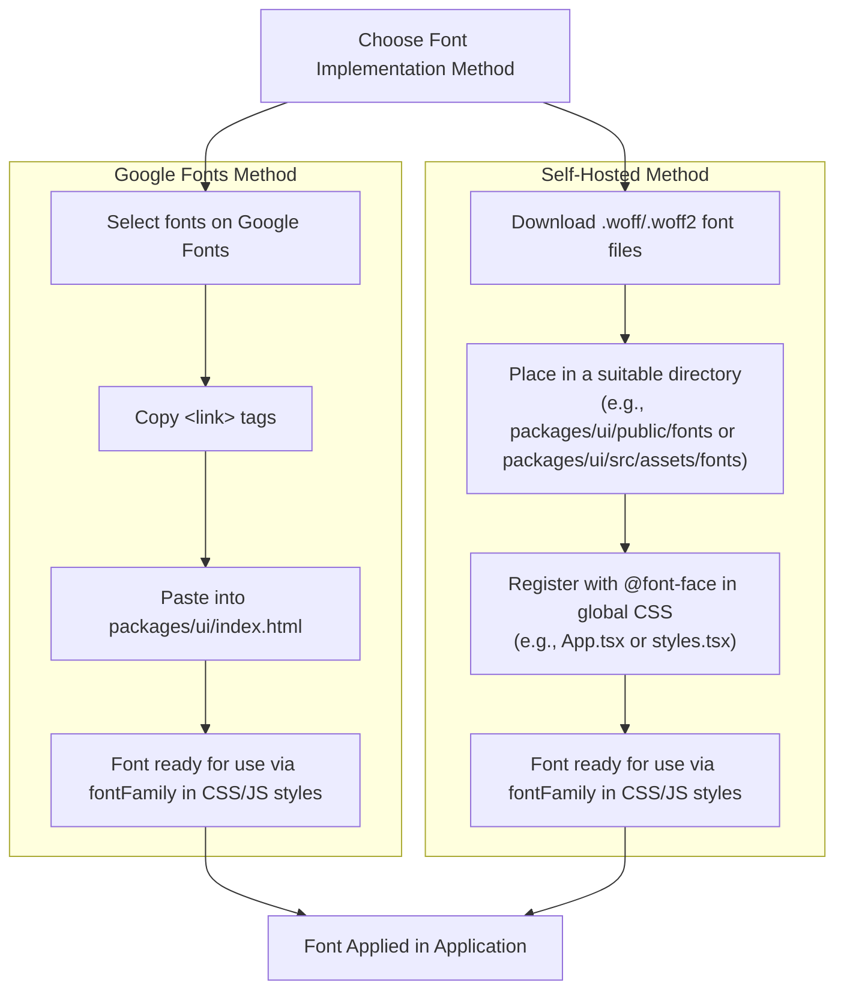

# Fonts
It's a good idea to use custom fonts for the UI because it makes the app look more professional and unique. As of Vrooli version 1.9.6 and beyond, the UI primarily uses the **Roboto** font for both body text and headings. This font is sourced from [Google Fonts](https://fonts.google.com/specimen/Roboto).

Additionally, a custom font named **"sakbunderan"** is self-hosted and used specifically for the application logo, as seen in the main navigation bar.

This document outlines the primary methods for incorporating fonts into the Vrooli UI:



## Method 1: Using Google Fonts (Primary Method for Roboto)

The easiest way to find and use custom fonts is through [Google Fonts](https://fonts.google.com/). This is how "Roboto" is implemented in Vrooli.

1.  **Select Fonts**: Choose your desired fonts on the Google Fonts website.
2.  **Get Embed Code**: Google Fonts provides `<link>` tags to embed in your HTML. For Roboto, this looks like:
    ```html
    <link rel="preconnect" href="https://fonts.googleapis.com">
    <link rel="preconnect" href="https://fonts.gstatic.com" crossorigin>
    <link href="https://fonts.googleapis.com/css2?family=Roboto&display=swap" rel="stylesheet">
    ```
3.  **Add to `index.html`**: Paste these `<link>` tags into the `<head>` section of `packages/ui/index.html`.
4.  **Use in Styles**: The font can then be applied in your CSS, JSS (CSS-in-JS), or Material UI theme typography settings. For global application, "Roboto" is set as the `fontFamily` for the `body` tag within the `getGlobalStyles` function in `packages/ui/src/App.tsx`:
    ```javascript
    // packages/ui/src/App.tsx
    // ...
    body: {
        fontFamily: "Roboto", // Primary global font
        fontWeight: 400,
        // ...
    },
    // ...
    ```
    Or, for specific Material UI typography variants, you *could* define `fontFamily` within a theme definition (this is a conceptual example, as Vrooli primarily uses the `GlobalStyles` method above for its global font):
    ```javascript
    // packages/ui/src/utils/display/theme.ts (conceptual example)
    // Note: Vrooli primarily sets the global font via GlobalStyles in App.tsx.
    // This example shows how you *could* define font families for specific
    // typography variants if needed.
    const theme = createTheme({
      typography: {
        fontFamily: 'Roboto, "Helvetica Neue", Arial, sans-serif', // Would apply to MUI components using theme typography
        h1: { fontFamily: 'Roboto, ...' }, // Specific variant override, e.g., for headings
        // ... other variants
      },
      // ... other theme options
    });
    ```

## Method 2: Self-Hosting Fonts (Used for "sakbunderan" Logo Font)

Alternatively, you can download font files (e.g., `.woff`, `.woff2`) and host them locally. This method is used for the "sakbunderan" logo font.

1.  **Obtain Font Files**: Download the font files from a source like [1001 Fonts](https://www.1001fonts.com/) or a custom font foundry. Ensure you have the appropriate licenses.
2.  **Place Files**: Store the font files.
    *   For general self-hosted fonts, a common location could be `packages/ui/src/assets/fonts/` (if imported as modules in JS/TS) or `packages/ui/public/fonts/` (if referenced directly by URL in CSS).
    *   For Vrooli's "sakbunderan" logo font, the file `sakbunderan-logo-only-webfont.woff2` is placed directly in the `packages/ui/public/` directory. This is because its `@font-face` rule in `packages/ui/src/App.tsx` uses `src: "url('/sakbunderan-logo-only-webfont.woff2')"`, which resolves relative to the public root.
3.  **Register with `@font-face`**: Define the font in your global CSS. In Vrooli, this is done within the `getGlobalStyles` function in `packages/ui/src/App.tsx`:
    ```javascript
    // packages/ui/src/App.tsx
    // ...
    function getGlobalStyles(theme: Theme) {
        return {
            // ... other global styles
            "@font-face": [
                {
                    fontFamily: "sakbunderan",
                    src: "url('/sakbunderan-logo-only-webfont.woff2') format('woff2')", // Path relative to /public
                    fontWeight: "normal",
                    fontStyle: "normal",
                    fontDisplay: "swap", // Ensures text remains visible while font loads
                },
                // ... other @font-face rules if any
            ],
            // ...
        };
    }
    // ...
    ```
4.  **Use in Styles**: Reference the `fontFamily` in your components or stylesheets:
    ```javascript
    // Example from packages/ui/src/components/navigation/Navbar.tsx
    const NameTypography = styled(Typography)(() => ({
        // ...
        fontFamily: "sakbunderan",
        // ...
    }));
    ```

## Font Optimization
Regardless of the method chosen, optimizing fonts is crucial for web performance:

*   **Compression**: When self-hosting, ensure fonts are in a compressed format like WOFF2. Tools like [Font Squirrel's Webfont Generator](https://www.fontsquirrel.com/tools/webfont-generator) can help convert and compress fonts.
*   **Subsetting**: If you know which characters are needed (e.g., for a logo or specific language support), you can remove unused characters/glyphs to reduce file size. Tools like [FontForge](https://fontforge.org/) can be used for this.
*   **`font-display: swap;`**: Using `font-display: swap;` in your `@font-face` declaration ensures that fallback text is shown while the custom font loads, improving perceived performance and preventing Flash of Invisible Text (FOIT).

## Advanced: Base64 Encoding (Use with Caution)

You can encode font files as base64 strings and embed them directly into your CSS. This eliminates a separate font file request but increases the CSS file size and can make caching less efficient.

On a Unix-based terminal, a `.woff` file can be converted to base64 using:
`base64 -w 0 yourfont.woff > yourfont-64.txt`

Then, use it in `@font-face`:
```css
@font-face {
    font-family: 'YourCustomFont';
    src: local('YourCustomFont'), url(data:font/woff;charset=utf-8;base64,INSERT_BASE64_STRING_HERE) format('woff');
    font-display: swap;
}
```
This method is generally not recommended for Vrooli unless there's a very specific use case due to the trade-offs.
