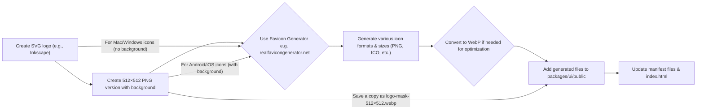

# Logo
This section will guide you through the process of creating and applying a logo.

## Basic Design Principles
Creating a logo is an intricate task and understanding some basic design principles is crucial:

1. **Simplicity**: A simple logo design allows for easy recognition. Complex designs can be difficult to reproduce across different platforms and sizes.  
2. **Memorability**: An effective logo design should be memorable, and this is achieved by keeping it simple yet appropriate.  
3. **Versatility**: An effective logo should be versatile and be able to work across a variety of mediums and applications.   
4. **Appropriateness**: The logo should be appropriate for the business or product it represents.  

## Creating Different Logo Versions
For all devices and operating systems to display the logo correctly, it needs to be created in different sizes and formats. The basic workflow is as follows:




1. Create an SVG version of the logo, using a tool like [Inkscape](https://inkscape.org/).  
2. Create a square PNG version of the logo (512px x 512px), using a tool like [GIMP](https://www.gimp.org/). This is simply the logo in the center, with some solid or gradient background.  
3. Use a tool like [realfavicongenerator](https://realfavicongenerator.net/) to generate the different versions of the logo. Passing in the SVG (i.e. no background) often looks better for the Mac and Windows icons, and the PNG (i.e. with background) often looks better for the Android and iOS icons. You can also pass in a version of the PNG with rounded corners for Android.  
4. If your images are not in the `webp` format, you may want to use a tool to convert them. `webp` images are smaller and load faster than other formats. Vrooli uses `.webp` for many of its icons in the manifest.
5. Add the generated logo files to `packages/ui/public`. Also add the square PNG from step 2, but save it as `logo-mask-512x512.webp` (this name is used in Vrooli's manifests for the maskable icon). It's also good practice to include a `favicon.ico` in the root of `public` for older browsers.

## Splash Screens
Splash screens are displayed on mobile devices while the app is loading. For Android, they are created automatically using the theme color and icon. For iOS, you need to create a splash screen for every device and theme combination. For this, you can use [Progressier](https://progressier.com/pwa-icons-and-ios-splash-screen-generator).  

## Manifest and index.html  
There are 3 places that need to define the logo: `packages/ui/index.html`, and the Vrooli project's manifest files (e.g., `packages/ui/public/manifest.light.manifest` and `packages/ui/public/manifest.dark.manifest`).

Here's an example of what needs to be included in `packages/ui/index.html` for favicons and Apple splash screens (Vrooli's `index.html` contains an extensive list for various devices):

```html
    <!-- Favicons -->
    <link rel="apple-touch-icon" sizes="180x180" href="/apple-touch-icon.webp">
    <link rel="icon" type="image/png" sizes="32x32" href="/favicon-32x32.png">
    <link rel="icon" type="image/png" sizes="16x16" href="/favicon-16x16.png">
    <link rel="manifest" href="/site.webmanifest"> <!-- Or specific light/dark manifests -->
    <link rel="mask-icon" href="/safari-pinned-tab.svg" color="#5bbad5">
    <link rel="shortcut icon" href="/favicon.ico">

    <!-- Example Apple Splash Screen -->
    <link rel="apple-touch-startup-image"
        media="(prefers-color-scheme: light) and screen and (device-width: 430px) and (device-height: 932px) and (-webkit-device-pixel-ratio: 3) and (orientation: landscape)"
        href="/splash_screens/light/iPhone_14_Pro_Max_landscape.png">
    <link rel="apple-touch-startup-image"
        media="(prefers-color-scheme: dark) and screen and (device-width: 430px) and (device-height: 932px) and (-webkit-device-pixel-ratio: 3) and (orientation: landscape)"
        href="/splash_screens/dark/iPhone_14_Pro_Max_landscape.png">
```

And here's an example of a manifest file that includes different icon sizes. Note that Vrooli's actual manifests (`manifest.light.manifest`, `manifest.dark.manifest`) are the source of truth and may contain more or different entries.

```json
{
  "name": "Vrooli",
  "short_name": "Vrooli",
  "description": "A collaborative and self-improving automation platform",
  "icons": [
        {
            "src": "/favicon-16x16.png",
            "sizes": "16x16",
            "type": "image/png"
        },
        {
            "src": "/android-chrome-192x192.webp",
            "sizes": "192x192",
            "type": "image/webp"
        },
        {
            "src": "/android-chrome-512x512.webp",
            "sizes": "512x512",
            "type": "image/webp",
            "purpose": "any"
        },
        {
            "src": "/logo-mask-512x512.webp",
            "sizes": "512x512",
            "type": "image/webp",
            "purpose": "maskable"
        }
    ],
  "start_url": "/",
  "display": "standalone",
  "background_color": "#ffffff",
  "theme_color": "#000000",
  "orientation": "any"
}
```
Some other important manifest fields to keep in mind are: 
1. `name` - Name of application in install dialog and Chrome Web Store. Maximum 45 characters. (e.g., "Vrooli")
2. `short_name` - Short version of application name. Maximum 12 characters. (e.g., "Vrooli")
3. `description` - A brief description of the application.
4. `display` - How the app is displayed. Common values: `fullscreen`, `standalone`, `minimal-ui`, or `browser`. Vrooli uses `standalone` and `display_override` for more control.
5. `scope` - The navigation scope of this web application's context. Usually `/`.
6. `start_url` - The preferred URL that should be loaded when the user launches the web application. Usually `/`.
7. `background_color` - Defines a placeholder background color for the application page to display before its stylesheet is loaded.
8. `theme_color` - Defines the default theme color for an application.
9. `orientation` - Defines the default orientation for all the website's top-level browsing contexts (e.g., `any`, `portrait`, `landscape`).

See [this web.dev guide](https://web.dev/add-manifest/) for more information on manifest fields.