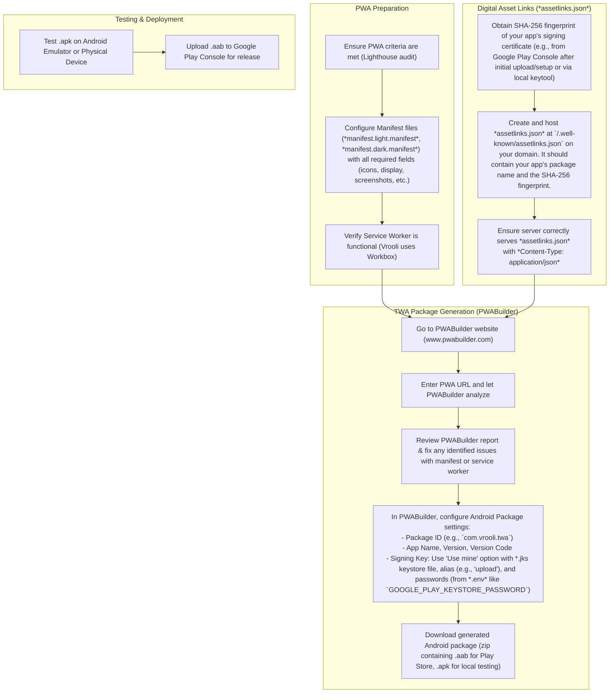

# PWAs and TWAs

## Progressive Web App (PWA)
A PWA is a website that can be installed on mobile devices. These don't have quite the same functionality as native apps, but hopefully one day they will. To make your website PWA-compatable, perform an audit on Lighthouse (found in your browser's developer console). Then, follow the steps it provides. **Make sure `NODE_ENV` is set to `production` when testing PWA.** Key elements include a correctly configured web app manifest and a registered service worker. Vrooli registers its service worker in `packages/ui/src/index.jsx` via `packages/ui/src/serviceWorkerRegistration.js`, and the service worker is generated using Workbox as part of the build process (`node workbox-build.js` in `packages/ui/package.json`).

## App Store Eligibility
Use the [PWABuilder tool](https://www.pwabuilder.com/) to check if your PWA is eligible for various app stores. This website generates a score for your PWA based on the information provided in your manifest file, the service worker, and other factors.

## Trusted Web Activity (TWA)
A trusted web activity is a PWA that runs natively on Android devices. They can also be listed on the Google Play store, making them almost identical to traditional apps. 

### Environment Variables
There are a few environment variables related to setting up a TWA:
- `GOOGLE_PLAY_KEYSTORE_PASSWORD`: This is a password for the keystore file used to sign the TWA. It can be any string (preferably without special characters), but it should be secure.
- `GOOGLE_PLAY_DOMAIN_FINGERPRINT`: This is the SHA-256 fingerprint provided by Google Play Console, typically in the "Deep links" section. It's used to verify the domain of the TWA.

### Creating a TWA
The overall process involves preparing your PWA, ensuring domain verification with `assetlinks.json`, and then using a tool like PWABuilder.



First, ensure that the Vrooli manifest files (`packages/ui/public/manifest.light.manifest` and `packages/ui/public/manifest.dark.manifest`) have the following data:
1. `orientation` and `display` to define how the app should feel (likely "any" and "standalone" to feel like a native app).
2. `screenshots` (displayed in the store).
3. `name`, `short_name`, and `description`
4. `dir` and `lang` for localization
5. `icons`
6. `start_url` and `scope`

Once that is complete, and your `assetlinks.json` is correctly set up and hosted, you can use the [PWABuilder tool](https://www.pwabuilder.com/) to generate an Android package. Make sure the following fields are filled out (you may need to press "All Settings" in PWABuilder):
- Package ID: Should match what's declared in your `assetlinks.json` and is typically a reverse domain name like `com.vrooli.twa`.
- Version: The current version from `packages/ui/package.json`.
- Version code: Any integer higher than the previous version code. A good approach if you don't feel like checking the previous code is to use the version without decimals and add zeros until it's 4 digits. For example, if the version is 1.2.3, the version code should be 1230.
- Signing Key: Select the "Use mine" option
    - Key file: Use the `*.jks` file (Java KeyStore) used for signing. This might be generated locally or through Android Studio. If a `build.sh` script sets up signing, it would use this keystore.
    - Key alias: The alias for the key within the keystore (e.g., "upload" is a common default).
    - Key password: The password for the specific key, often the same as the keystore password (e.g., `GOOGLE_PLAY_KEYSTORE_PASSWORD` from `.env`).
    - Key store password: The password for the JKS keystore file (e.g., `GOOGLE_PLAY_KEYSTORE_PASSWORD` from `.env`).

If all goes well, you should receive a zip file from PWABuilder with the TWA package. Unzip it to receive an `.aab` file (Android App Bundle for the Play Store) and usually an `.apk` file (for direct installation and testing).

### Testing a TWA
To test your TWA locally, you can use either Android Studio emulators or a physical Android device:

#### Using Android Studio Emulator
1. Install and open Android Studio.
2. Navigate to the **Virtual Device Manager** and set up an Android emulator.
3. Start the emulator.
4. Drag and drop the `.apk` file onto the emulator to install
5. Open the app from the app drawer in the emulator to test its functionality.

#### Using a Physical Android Device
1. Enable Developer Options and USB Debugging on your Android device.
2. Connect your device to your computer via USB.
3. Transfer the `.apk` file to your device and install it, or use:
   ```bash
   adb install path_to_your_apk/app-release.apk
   ```
4. Open the app from the device's app drawer to ensure it functions as expected.

### Deploying a TWA
When you're ready to test or deploy your app to the Google Play store, visit [Google Play Console](https://play.google.com/) to receive instructions.