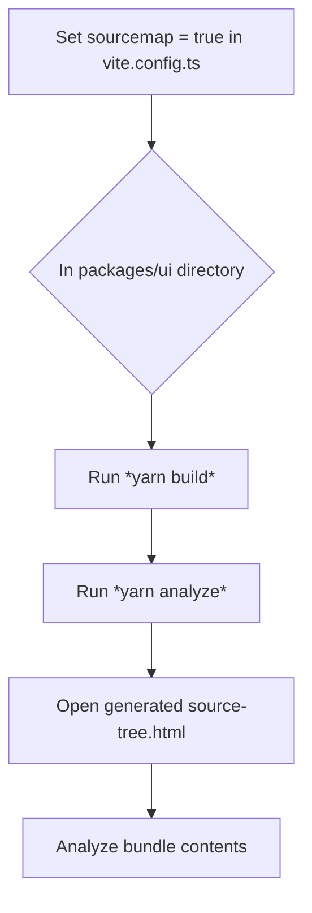
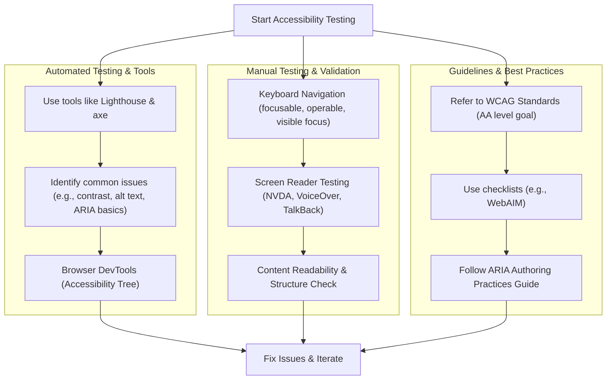

# Testing UI Performance, Accessibility, and SEO
Performance, accessibility, and SEO are all important aspects of a website. They improve the user experience, contribute to Core Web Vitals (CWV), and can help your website rank higher in search engines. This guide will show you how to test your website for these aspects, and how to improve them.

## Performance
Below are a few approaches to testing and improving performance.

**NOTE**: When testing for performance, make sure you are running a production build. This can be set with `NODE_ENV` in the .env file. If you would like to test performance locally, be mindful that certain performance features (such as cache policy) may be handled by Nginx, so they won't be available locally.

- [Lighthouse](https://developers.google.com/web/tools/lighthouse) is an open-source tool for testing any website's (even localhost) performance, accessibility, and Search Engine Optimization (SEO). This can be accessed in Chrome Dev Tools. The tool generates a report in less than a minute, which gives plenty of details and resources that you can look through. This website template is designed to maximize Lighthouse performance by default, but your specific needs may vary. Some places to look at are:  
- Compress static images - The easiest way to reduce request payloads is by compressing static images. This can be done on many sites, such as [this one for PNGs](https://compresspng.com/) and [this one](https://jakearchibald.github.io/svgomg/) for SVGs.
- Remove unused dependencies - The easiest way I've found to discover unused dependencies is with [depcheck](https://www.npmjs.com/package/depcheck):    
    1. In project's root directory, enter `yarn global add depcheck`  
    2. `depcheck` or `npx depcheck`  
    3. Repeat in each package (packages/server, packages/shared, packages/ui)  
Before removing packages, please make sure that depcheck was correct. If you are only using the package in a Dockerfile, for example, it may not catch it!
- Remove unused components and pages - Every byte counts with web responsiveness! One method for finding unused code is to use [ts-unused-exports](https://github.com/pzavolinsky/ts-unused-exports).
- Peek inside code bundles - Seeing what's inside the code bundles can help you determine what areas of the code should be lazy loaded, and what is taking the most space. To do this:  
    1. Make sure `sourcemap` is set to `true` in the `vite.config.ts` file.
    1. Navigate to the UI package: `cd packages/ui ` 
    2. `yarn build`
    3. `yarn analyze`
    4. Open the generated `source-tree.html` file in your browser. This will show you the size of each file in the bundle, and how they are related to each other.



### React-Specific Performance Tips
Beyond general web performance practices, there are React-specific patterns that can impact performance. Understanding when and how to use (and not use) certain React features like `useEffect` is key. Much of this advice is sourced from React's official documentation on [You Might Not Need an Effect](https://react.dev/learn/you-might-not-need-an-effect) and community best practices like those highlighted in [useEffect: Best Practices for Using and Avoiding it](https://medium.com/@heWhoScripts/useeffect-best-practices-for-using-and-avoiding-it-ae3f047db871).

**1. Avoid `useEffect` for Data Transformation**

If you need to derive data for rendering based on existing props or state, calculate it directly during rendering. Using `useEffect` to update another state variable for this is inefficient as it causes an extra render cycle.

*   **Inefficient (Avoid):**
    ```javascript
    // Conceptual Example - Bad Practice
    function UserProfile({ user }) {
      const [fullName, setFullName] = useState('');

      useEffect(() => {
        setFullName(user.firstName + ' ' + user.lastName);
      }, [user.firstName, user.lastName]);

      return <p>Full Name: {fullName}</p>;
    }
    ```
*   **Efficient (Recommended):**
    ```javascript
    // Conceptual Example - Good Practice
    function UserProfile({ user }) {
      const fullName = user.firstName + ' ' + user.lastName; // Calculated during rendering
      return <p>Full Name: {fullName}</p>;
    }
    ```

**2. Caching Expensive Calculations with `useMemo` (Use Sparingly)**

If a calculation during rendering is genuinely expensive and profiling shows it's a bottleneck, you can memoize it with `useMemo`. However, don't overuse `useMemo`, as it adds its own overhead.

```javascript
// Conceptual Example
import { useMemo } from 'react';

function Cart({ items }) {
  const total = useMemo(() => {
    console.log('Calculating total...'); // Should only log if items change
    return items.reduce((sum, item) => sum + item.price, 0);
  }, [items]);

  return <div>Total: ${total}</div>;
}
```

**3. Handle User Events Directly**

Code that runs in response to a specific user interaction (like a button click) should be in the event handler itself, not in an `useEffect` triggered by a state change from that event.

*   **Less Clear (Avoid `useEffect` for direct event consequences):**
    ```javascript
    // Conceptual Example - Bad Practice
    function RegistrationForm() {
      const [formData, setFormData] = useState({});
      const [dataToSubmit, setDataToSubmit] = useState(null);

      useEffect(() => {
        if (dataToSubmit) {
          // fetch('/api/register', { method: 'POST', body: JSON.stringify(dataToSubmit) });
          console.log('Submitting with useEffect:', dataToSubmit);
        }
      }, [dataToSubmit]);

      function handleSubmit(e) {
        e.preventDefault();
        setDataToSubmit(formData);
      }
      // ...
    }
    ```
*   **Clearer (Handle in event handler):**
    ```javascript
    // Conceptual Example - Good Practice
    function RegistrationForm() {
      const [formData, setFormData] = useState({});

      function handleSubmit(e) {
        e.preventDefault();
        // fetch('/api/register', { method: 'POST', body: JSON.stringify(formData) });
        console.log('Submitting directly:', formData);
      }
      // ...
    }
    ```

**4. Resetting State with `key` Prop**

If you need to reset the entire state of a component or a component tree when a prop changes (e.g., a user ID changes and you want to refetch all data for a profile page), a simple and effective way is to change the `key` prop on that component. This tells React to unmount the old component instance and mount a new one, naturally resetting its state.

```javascript
// Conceptual Example
// function UserProfilePage({ userId }) {
//   return <UserProfileDetails key={userId} userId={userId} />;
// }
```

**5. Initializing Application State / Global Singletons**

Avoid using `useEffect` with an empty dependency array (`[]`) solely for initializing global singletons or one-time application setup that doesn't need to re-run if the component re-renders. This can lead to the effect running twice in React 18's Strict Mode during development. It's often better to perform such initializations at the module level or in a dedicated setup function called once when your application bootstraps.

```javascript
// Conceptual Example - Module level initialization
// analyticsService.initialize(); // Called once when this module is loaded

// function App() {
//   // No useEffect needed for the above initialization
//   return (/*...*/);
// }
```

**6. When are Effects Appropriate?**

Effects are primarily for synchronizing your React components with an *external system*. Examples include:
*   Setting up and tearing down subscriptions to browser APIs (e.g., `IntersectionObserver`, `addEventListener`).
*   Fetching data from a server (though modern frameworks and libraries often provide better abstractions for this).
*   Manually manipulating the DOM (e.g., focusing an input, integrating with a third-party non-React UI library).

Always include a cleanup function if your Effect sets up something that needs to be disposed of (e.g., an event listener or a subscription) to prevent memory leaks.

```javascript
// Conceptual Example - Effect for an external subscription
// useEffect(() => {
//   const subscription = externalStore.subscribe(onStoreChange);
//   return () => {
//     subscription.unsubscribe(); // Cleanup
//   };
// }, [onStoreChange]);
```
For subscribing to external stores, React 18 introduced `useSyncExternalStore`, which is generally preferred over a manual `useEffect` implementation.

**7. Data Fetching in Effects**

If you fetch data in an `useEffect`, always handle potential race conditions by ignoring stale responses. This usually involves a local boolean flag that's set to true in the cleanup function.

```javascript
// Conceptual Example - Fetching with cleanup
// useEffect(() => {
//   let ignore = false;
//   async function fetchData() {
//     const response = await fetch(`/api/data?query=${query}`);
//     const json = await response.json();
//     if (!ignore) {
//       setData(json);
//     }
//   }

//   fetchData();

//   return () => {
//     ignore = true;
//   };
// }, [query]);
```
Consider extracting data fetching logic into custom hooks or using a dedicated data fetching library (like React Query, SWR) for more robust solutions that handle caching, refetching, and race conditions out of the box.

By being mindful of these patterns, you can often write more performant, readable, and less error-prone React code.

## Accessibility
Accessibility is a crucial aspect of web development, ensuring that your website is usable by people with various disabilities. This section guides you on how to test and improve the accessibility of your website.



### Testing for Accessibility
1. **Automated Testing with Tools**: Use tools like [axe](https://www.deque.com/axe/) or Lighthouse (already mentioned in the Performance section) to perform automated accessibility checks. These tools can detect common accessibility issues such as missing alt text, poor contrast ratios, and incorrect ARIA attributes.
2. **Manual Testing**: While automated tools catch many issues, some require manual checking. This includes verifying keyboard navigation, ensuring all interactive elements are focusable and operable with a keyboard, and testing with screen readers like NVDA or VoiceOver.
3. **Browser Developer Tools**: Modern browsers have built-in accessibility inspectors (like Chrome's Accessibility Tree in DevTools) that can help you understand how assistive technologies interpret your page.
4. **Checklists and Guidelines**: Refer to the [Web Content Accessibility Guidelines (WCAG)](https://www.w3.org/WAI/standards-guidelines/wcag/) for a comprehensive set of guidelines. Use checklists like [WebAIM's WCAG Checklist](https://webaim.org/standards/wcag/checklist) for a more approachable format.

### Improving Accessibility
- **Semantic HTML**: Use semantic HTML elements (like `<button>`, `<nav>`, `<header>`, `<footer>`, `<article>`, `<aside>`, etc.) as they provide inherent accessibility features and document structure.
- **ARIA Attributes**: Use ARIA (Accessible Rich Internet Applications) attributes judiciously when semantic HTML is insufficient to convey roles, states, and properties of UI components. Prefer native HTML solutions when possible. Refer to the [ARIA Authoring Practices Guide (APG)](https://www.w3.org/WAI/ARIA/apg/) for correct implementation patterns.
- **Color Contrast**: Ensure that text and interactive elements have sufficient contrast against their backgrounds. Tools like [WebAIM's Contrast Checker](https://webaim.org/resources/contrastchecker/) can help.
- **Alt Text for Images**: Provide descriptive alt text for images, especially for informative images.
- **Labels for Interactive Elements**: Ensure all form inputs have associated labels, and interactive elements have accessible names.
- **Error Identification and Recovery**: Provide clear error messages and guidance for error correction in forms.
- **Responsive and Mobile Accessibility**: Ensure that your website is accessible on mobile devices, with touch-friendly interactive elements and readable text without zooming.
- **Captions and Transcripts**: For multimedia content, provide captions for videos and transcripts for audio content.
- **Testing with Real Users**: Conduct usability testing with people who have disabilities to get direct feedback on the accessibility of your site.

## SEO
- Sitemaps are used by search engines to index your website. This is especially important for client-side rendered websites, as search engines may not be able to crawl your website effectively. We use [sitemap.ts](https://github.com/Vrooli/Vrooli/tree/master/packages/ui/src/__tools/sitemap/sitemap.ts) to do this automatically for static pages (e.g. /about, /auth/login), and [genSitemap.ts](https://github.com/Vrooli/Vrooli/tree/master/packages/jobs/src/schedules/genSitemap.ts) to do this for dynamic pages (e.g. /profile/:id). If these are working correctly, you shouldn't need to worry about sitemaps.

Beyond sitemaps, several other factors are critical for SEO in React applications:

```mermaid
graph TD
    subgraph "Rendering Strategy"
        R1[CSR (Client-Side Rendering)] --> R2{Challenges for some crawlers & CWV};
        R3[SSR (Server-Side Rendering)] --> R4[Optimal: Delivers HTML, better for SEO & CWV];
        R5[SSG (Static Site Generation)] --> R4;
        R6[Vrooli Target: SSR/SSG for public pages] --> R4;
    end

    subgraph "On-Page Metadata (per page)"
        M1["Unique & Descriptive <title>"] --> M0[Document Head Management];
        M2["Unique & Descriptive <meta name='description'>"] --> M0;
        M3["Open Graph Tags (og:title, og:description, og:image, etc.)"] --> M0;
        M4["<link rel='canonical' href='preferred-url'>"] --> M0;
        M5[Vrooli: `useTabTitle` hook for document.title] --> M1;
        M6[Recommendation: `react-helmet-async` for comprehensive head management] --> M0;
    end

    subgraph "Content & Structure"
        C1[High-Quality, Relevant Content] --> C2[SEO Success];
        C3[Proper Heading Structure (H1-H6)] --> C2;
        C4[Internal Linking Strategy] --> C2;
        C5[Mobile-Friendliness (Responsive Design)] --> C2;
        C6[Page Load Speed (Core Web Vitals)] --> C2;
    end

    SEO_Overall[SEO Strategy for React Apps] --> R1;
    SEO_Overall --> M1;
    SEO_Overall --> C1;
```

### Rendering Strategy (CSR, SSR, SSG)
- **Client-Side Rendering (CSR)**: By default, React applications render on the client-side. While Google has improved at rendering JavaScript, CSR can still pose challenges for some search engines and may lead to slower initial page loads, potentially impacting Core Web Vitals (LCP, TTI, CLS).
- **Server-Side Rendering (SSR) & Static Site Generation (SSG)**: For optimal SEO, SSR (e.g., using frameworks like Next.js or a custom Express server setup) or SSG (e.g., Next.js, Gatsby, Astro) is highly recommended for public-facing content. These approaches deliver fully rendered HTML to the browser, making it easier for search engines to crawl and index content, and generally improving perceived performance and Core Web Vitals. Vrooli should aim to use SSR/SSG for its public-facing pages where SEO is critical.

### Metadata Management
- **Dynamic Titles and Descriptions**: Each publicly accessible page should have a unique and descriptive `<title>` tag and `<meta name="description">` content. Vrooli currently uses a `useTabTitle` hook (found in `packages/ui/src/components/navigation/Navbar.tsx`) to dynamically set `document.title` based on the current view.
- **Comprehensive Head Management**: For more comprehensive control over document head elements (including meta descriptions, Open Graph tags, canonical tags, etc.) on a per-page basis, a library like [react-helmet-async](https://github.com/staylor/react-helmet-async) is recommended if the built-in capabilities or current `useTabTitle` hook are insufficient.
- **Open Graph (OG) Tags**: Implement OG tags (`og:title`, `og:description`, `og:image`, `og:url`, `og:type`) to control how your content appears when shared on social media platforms. These are typically static in `packages/ui/index.html` but ideally would be dynamic per page for shareable content.
- **Canonical Tags**: Use `<link rel="canonical" href="your-preferred-url">` to specify the preferred version of a page if duplicate content might exist (e.g., from URL parameters that don't change content significantly), preventing SEO penalties.

### Content and Structure
- **Crawlable Links**: Ensure that internal navigation uses standard `<a href="...">` tags. Search engines may not follow links generated purely by JavaScript click handlers without an `href` attribute.
- **Semantic HTML**: Use semantic HTML5 elements (`<article>`, `<nav>`, `<aside>`, etc.) correctly to provide structure and meaning to your content, which helps search engines understand your page.
- **Structured Data (Schema Markup)**: Implement structured data (e.g., using JSON-LD) to provide explicit clues about the meaning of your content to search engines. This can enhance your appearance in SERPs with rich snippets. The `react-helmet-async` library can be used to inject JSON-LD scripts.

### Performance for SEO
- **Lazy Loading**:
    - **Components**: Use `React.lazy()` and `<Suspense>` to lazy-load components that are not immediately visible, reducing the initial JavaScript payload. For example:
      ```javascript
      // Conceptual Example
      import React, { Suspense } from 'react';

      const OtherComponent = React.lazy(() => import('./OtherComponent'));

      function MyComponent() {
        return (
          <div>
            <Suspense fallback={<div>Loading...</div>}>
              <OtherComponent />
            </Suspense>
          </div>
        );
      }
      ```
    - **Images**: Lazy-load offscreen images (e.g., using `loading="lazy"` attribute on `` tags or Intersection Observer API based solutions) to improve initial page load time.
- **Image Optimization**:
    - **Compression**: Compress images to reduce file size without significant quality loss.
    - **Modern Formats**: Use modern image formats like WebP where supported, as they offer better compression and quality.
    - **Responsive Images**: Use the `<picture>` element or `srcset` attribute on `` tags to serve appropriately sized images for different devices.
- **Code Splitting**: Vite (and other bundlers like Webpack) automatically performs code splitting. Ensure this is leveraged effectively to create smaller initial chunks.

### Handling Non-HTML Content and Errors
- **Proper HTTP Status Codes**: Ensure your server (if using SSR/SSG) or your client-side routing logic correctly returns HTTP status codes. For example:
    - `404 Not Found` for pages that don't exist (avoid "soft 404s" where a 200 status is returned for a non-existent page).
    - `301 Moved Permanently` for permanent redirects.
    - React Router can be configured to render specific components for 404s, and if using SSR, the server should send the actual 404 status.
- **Robots.txt**: Use a `robots.txt` file to guide search engine crawlers on which parts of your site to crawl or ignore.

### SEO Testing Tools
- **Google Search Console**: Monitor your site's performance in Google Search, submit sitemaps, and identify crawling issues.
- **Lighthouse**: (As mentioned in Performance) Provides SEO audits in addition to performance and accessibility.
- **Ahrefs, SEMrush, Moz**: Comprehensive SEO platforms for site audits, keyword research, and competitor analysis (though primarily for publicly deployed sites).
