# Agent Basics 🤖

Welcome to the world of Vrooli agents! Agents are AI-powered assistants that bring your routines to life. This guide will help you understand what agents are, how they work, and how to use them effectively.

## 🎯 What Are Agents?

Agents are intelligent entities that:
- Execute tasks within your routines
- Understand natural language
- Learn from interactions
- Collaborate with other agents
- Make decisions based on context

Think of agents as your digital workforce - each with specialized skills and growing capabilities.

## 🧠 How Agents Work

Agents operate within Vrooli's three-tier architecture:

```mermaid
graph TD
    U[👤 You] --> R[📋 Routine]
    R --> A[🤖 Agent]
    
    A --> P[🧠 Processing]
    P --> U1[Understand Request]
    P --> T1[Think & Plan]
    P --> E1[Execute Task]
    P --> L1[Learn & Improve]
    
    A --> C[🔧 Capabilities]
    C --> C1[Text Generation]
    C --> C2[Data Analysis]
    C --> C3[Tool Usage]
    C --> C4[Collaboration]
    
    A --> M[💾 Memory]
    M --> M1[Context]
    M --> M2[History]
    M --> M3[Preferences]
    M --> M4[Learning]
    
    style A fill:#e3f2fd,stroke:#1565c0,stroke-width:3px
    style P fill:#e8f5e8,stroke:#2e7d32
    style C fill:#fff3e0,stroke:#e65100
    style M fill:#f3e5f5,stroke:#7b1fa2
```

## 🎭 Types of Agents

Vrooli provides different agent types for various needs:

### 🤝 General Assistant
**Best for**: General tasks, conversations, brainstorming
```mermaid
graph LR
    GA[General Assistant] --> T1[✍️ Writing]
    GA --> T2[💡 Ideas]
    GA --> T3[📝 Summaries]
    GA --> T4[🗣️ Conversations]
    
    style GA fill:#e3f2fd,stroke:#1565c0,stroke-width:2px
```

**Characteristics**:
- Versatile and adaptable
- Good at understanding context
- Friendly conversational style
- Broad knowledge base

### 📊 Data Analyst
**Best for**: Data processing, analysis, insights
```mermaid
graph LR
    DA[Data Analyst] --> T1[📈 Analysis]
    DA --> T2[📊 Visualization]
    DA --> T3[🔍 Patterns]
    DA --> T4[💹 Insights]
    
    style DA fill:#e8f5e8,stroke:#2e7d32,stroke-width:2px
```

**Characteristics**:
- Statistical expertise
- Pattern recognition
- Data visualization
- Quantitative reasoning

### 👨‍💻 Code Expert
**Best for**: Programming tasks, debugging, architecture
```mermaid
graph LR
    CE[Code Expert] --> T1[💻 Coding]
    CE --> T2[🐛 Debugging]
    CE --> T3[🏗️ Architecture]
    CE --> T4[📚 Documentation]
    
    style CE fill:#fff3e0,stroke:#e65100,stroke-width:2px
```

**Characteristics**:
- Multiple language fluency
- Best practices knowledge
- Debugging skills
- Architecture patterns

### 🔍 Research Specialist
**Best for**: Information gathering, fact-checking, analysis
```mermaid
graph LR
    RS[Research Specialist] --> T1[🔎 Search]
    RS --> T2[✅ Verify]
    RS --> T3[📑 Compile]
    RS --> T4[📊 Analyze]
    
    style RS fill:#f3e5f5,stroke:#7b1fa2,stroke-width:2px
```

**Characteristics**:
- Thorough investigation
- Source verification
- Comprehensive summaries
- Critical analysis

## 💬 Interacting with Agents

### Natural Language Communication

Agents understand context and intent:

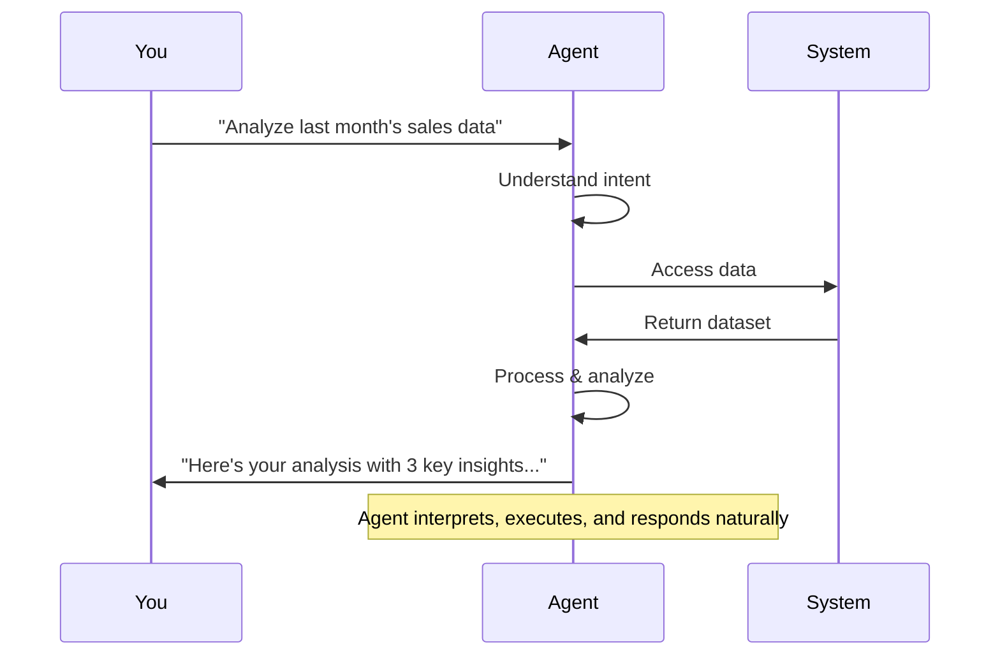

### Effective Communication Tips

1. **Be Clear**: State your goal explicitly
2. **Provide Context**: Share relevant background
3. **Iterate**: Refine based on responses
4. **Give Examples**: Show desired format/style

### Example Interactions

#### ❌ Less Effective:
```
"Do the thing with the data"
```

#### ✅ More Effective:
```
"Analyze Q3 sales data and identify the top 3 
performing products by revenue, including 
year-over-year growth percentages"
```

## 🔧 Agent Capabilities

Agents can perform various tasks:

### Core Capabilities
```mermaid
graph TD
    AC[🤖 Agent Capabilities] --> T[📝 Text]
    AC --> D[📊 Data]
    AC --> I[🔗 Integration]
    AC --> C[🤝 Collaboration]
    
    T --> T1[Generate]
    T --> T2[Summarize]
    T --> T3[Translate]
    T --> T4[Format]
    
    D --> D1[Analyze]
    D --> D2[Transform]
    D --> D3[Validate]
    D --> D4[Visualize]
    
    I --> I1[APIs]
    I --> I2[Databases]
    I --> I3[Files]
    I --> I4[Web]
    
    C --> C1[Other Agents]
    C --> C2[Humans]
    C --> C3[Systems]
    C --> C4[Workflows]
    
    style AC fill:#e3f2fd,stroke:#1565c0,stroke-width:3px
```

### Advanced Features

- **🧠 Context Awareness**: Remember conversation history
- **🎯 Goal Orientation**: Work towards specific objectives
- **🔄 Adaptive Learning**: Improve from feedback
- **🛡️ Safety Checks**: Validate outputs for accuracy
- **⚡ Parallel Processing**: Handle multiple tasks

## 🎮 Using Agents in Routines

### Step Configuration

When adding an agent step to your routine:

```mermaid
graph LR
    RS[📋 Routine Step] --> AC[⚙️ Agent Config]
    AC --> AT[🤖 Agent Type]
    AC --> AP[📝 Prompt]
    AC --> AS[⚡ Settings]
    AC --> AO[📤 Output]
    
    AT --> AT1[Choose Type]
    AP --> AP1[Write Instructions]
    AS --> AS1[Temperature]
    AS --> AS2[Max Length]
    AS --> AS3[Retry Logic]
    AO --> AO1[Variable Name]
    AO --> AO2[Format]
    
    style RS fill:#e3f2fd,stroke:#1565c0,stroke-width:2px
```

### Configuration Example

```yaml
Step: Generate Report
Agent: Data Analyst
Prompt: |
  Analyze the sales data in {{salesData}} and create
  a executive summary including:
  - Total revenue
  - Top 5 products
  - Growth trends
  - Recommendations
  
  Format as a professional report.
Settings:
  temperature: 0.3  # More focused/deterministic
  maxTokens: 2000
  retryOnError: true
Output:
  variable: executiveReport
  format: markdown
```

## 🌟 Agent Evolution

Agents improve over time through:

### Automatic Learning
```mermaid
graph TD
    E[🔄 Evolution] --> P[📊 Performance Data]
    E --> F[💬 User Feedback]
    E --> C[🌐 Community Input]
    E --> S[🧠 Self-Analysis]
    
    P --> I[Improve Speed]
    F --> I2[Enhance Quality]
    C --> I3[Add Features]
    S --> I4[Optimize Costs]
    
    I --> B[🚀 Better Agent]
    I2 --> B
    I3 --> B
    I4 --> B
    
    style E fill:#e8f5e8,stroke:#2e7d32,stroke-width:2px
    style B fill:#ffeb3b,stroke:#f57f17,stroke-width:2px
```

### What Improves:
- Response accuracy
- Task completion speed
- Context understanding
- Error handling
- Resource efficiency

## 🎯 Best Practices

### 1. Choose the Right Agent
Match agent type to task:
- 📝 Writing → General Assistant
- 📊 Analysis → Data Analyst
- 💻 Programming → Code Expert
- 🔍 Information → Research Specialist

### 2. Write Clear Prompts
Structure your instructions:
```
Context: [Background information]
Task: [What you want done]
Format: [How to present results]
Constraints: [Any limitations]
```

### 3. Use Variables Effectively
Reference previous outputs:
```
Based on {{previousAnalysis}}, identify trends
and project next quarter's performance.
```

### 4. Handle Errors Gracefully
Configure retry logic and fallbacks:
```yaml
Settings:
  retryOnError: true
  maxRetries: 3
  fallbackResponse: "Unable to complete analysis"
```

### 5. Monitor Performance
Review agent execution logs to:
- Identify bottlenecks
- Optimize prompts
- Reduce costs
- Improve quality

## 🚀 Advanced Agent Features

### Multi-Agent Collaboration
Agents can work together:

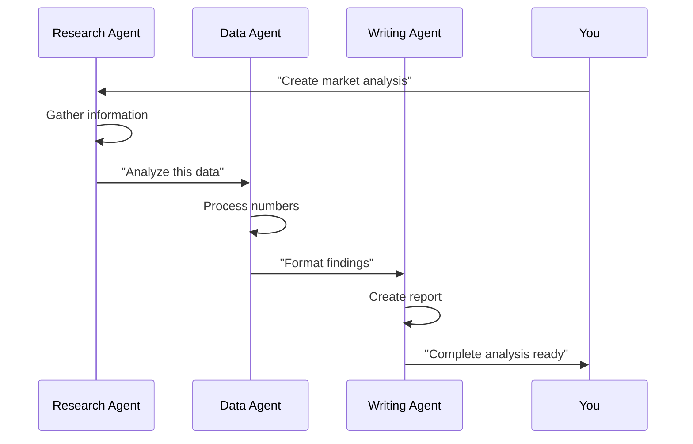

### Custom Agent Training
Coming soon:
- Fine-tune agents for your domain
- Create specialized vocabularies
- Define custom behaviors
- Share trained agents

## 📊 Agent Performance Metrics

Monitor your agents with built-in analytics:

```mermaid
graph TD
    M[📊 Metrics] --> S[⚡ Speed<br/>Response Time]
    M --> Q[✨ Quality<br/>Success Rate]
    M --> C[💰 Cost<br/>Token Usage]
    M --> E[🎯 Efficiency<br/>Task Completion]
    
    S --> D1[Average: 2.3s]
    Q --> D2[Success: 94%]
    C --> D3[Cost: $0.02/task]
    E --> D4[Completion: 97%]
    
    style M fill:#e3f2fd,stroke:#1565c0,stroke-width:2px
```

## 🛡️ Security & Privacy

Agents operate with security in mind:
- **Sandboxed Execution**: Isolated environments
- **Data Privacy**: Your data stays yours
- **Access Control**: Permission-based operations
- **Audit Trails**: Complete activity logs

## 🎓 Learning Resources

### Next Steps
1. 📋 [Create Your First Routine](../routines/creating-your-first-routine.md)
2. 🎓 [Explore Learning Paths](../learning-paths.md)

### Quick Experiments
Try these in your next routine:
1. **Comparison Task**: Have two agents analyze the same data
2. **Creative Challenge**: Ask for 5 different approaches to a problem
3. **Iterative Refinement**: Have an agent improve its own output
4. **Cross-Domain**: Use a Code Expert for writing tasks

## ❓ Frequently Asked Questions

**Q: Can agents access my private data?**
A: Agents only access data you explicitly provide in routines. They follow strict permission models.

**Q: How do I reduce agent costs?**
A: Use specific prompts, set token limits, and choose the right agent type for each task.

**Q: Can agents learn my preferences?**
A: Yes! Agents adapt to your style and preferences over time through usage patterns.

**Q: What if an agent gives incorrect information?**
A: You can provide feedback, which helps improve the agent. Always verify critical information.

---

🎉 **You now understand agent basics!** Ready to put this knowledge to use? [Create Your First Routine](../routines/creating-your-first-routine.md) or explore [Learning Paths](../learning-paths.md) for your specific goals.