# Creating Your Account 🎯

Welcome! Let's get you set up with your Vrooli account in just a few minutes. This guide covers everything from initial signup to configuring your workspace for success.

## 🚀 Quick Start

### Sign Up Process

```mermaid
graph LR
    A[Visit vrooli.com] --> B[Click Sign Up]
    B --> C{Choose Method}
    C -->|Email| D[Enter Details]
    C -->|Google| E[OAuth Login]
    C -->|GitHub| F[OAuth Login]
    D --> G[Verify Email]
    E --> H[Grant Permissions]
    F --> H
    G --> I[Complete Profile]
    H --> I
    I --> J[🎉 Ready!]
    
    style A fill:#e3f2fd,stroke:#1565c0
    style J fill:#e8f5e8,stroke:#2e7d32,stroke-width:2px
```



### Step 1: Choose Your Signup Method

**Option A: Email Signup** (Recommended)
- Full control over your account
- No third-party dependencies
- Easy password recovery

**Option B: Social Login**
- Faster signup process
- Single sign-on convenience
- Automatic profile import

### Step 2: Complete Registration

#### Email Registration Form
```yaml
Required Fields:
  - Email: Your email address
  - Password: Minimum 8 characters
  - Name: Display name
  
Optional Fields:
  - Organization: Company/team name
  - Role: Your job title
  - Use Case: How you plan to use Vrooli
```

#### Security Requirements
- Password must include:
  - ✓ At least 8 characters
  - ✓ One uppercase letter
  - ✓ One number
  - ✓ One special character

### Step 3: Verify Your Email

1. Check your inbox for verification email
2. Click the verification link
3. Link expires in 24 hours
4. Didn't receive it? Check spam or request resend

## 🛠️ Initial Setup

### Complete Your Profile


### Essential Settings

#### 1. Timezone Configuration
Set your timezone for accurate scheduling:
- Go to Settings → General
- Select your timezone
- Enable "Adjust for daylight saving"

#### 2. Notification Preferences
```yaml
Email Notifications:
  - Routine completions: On/Off
  - Error alerts: Recommended ON
  - Weekly digest: On/Off
  - Community updates: On/Off

In-App Notifications:
  - Real-time alerts: On/Off
  - Agent messages: On/Off
  - Team mentions: On/Off
```

#### 3. Privacy Settings
- **Profile Visibility**: Public / Team / Private
- **Routine Sharing**: Default visibility for new routines
- **Data Retention**: Choose data retention period
- **Analytics**: Opt in/out of usage analytics

## 🔗 Connect Your Tools

### Quick Integrations

Connect your existing tools for seamless automation:

```mermaid
graph LR
    V[Vrooli] --> E[📧 Email]
    V --> C[📅 Calendar]
    V --> S[💬 Slack]
    V --> G[📁 Google Drive]
    V --> N[📝 Notion]
    V --> J[🎯 Jira]
    
    style V fill:#e3f2fd,stroke:#1565c0,stroke-width:3px
```



### Integration Steps

1. **Email (Gmail/Outlook)**
   - Click "Connect Email"
   - Authorize read access
   - Select folders to monitor
   - Test connection

2. **Calendar (Google/Outlook)**
   - Click "Connect Calendar"
   - Grant calendar permissions
   - Choose calendars to sync
   - Set refresh frequency

3. **Slack**
   - Click "Add to Slack"
   - Select workspace
   - Choose channels
   - Configure bot permissions

## 🎓 Onboarding Tour

### Interactive Tutorial

When you first log in, you'll see our interactive tour:


### Skip or Customize

- **New to Automation?** → Take full tour (recommended)
- **Experienced User?** → Skip to advanced features
- **Developer?** → Jump to API documentation
- **Just Browsing?** → Explore demo mode

## 💳 Account Setup Complete

Your account is now ready to use! Vrooli offers various plans to suit different needs. Check the pricing page in the platform for current details and features.

## 🏃 Quick Wins

### First Day Goals

Complete these to get immediate value:

```mermaid
graph TD
    G[First Day Goals] --> T1[✅ Complete profile]
    G --> T2[✅ Connect one tool]
    G --> T3[✅ Create first routine]
    G --> T4[✅ Run successfully]
    G --> T5[✅ Join community]
    
    T1 --> R[🏆 Profile Badge]
    T2 --> R2[🏆 Integration Badge]
    T3 --> R3[🏆 Creator Badge]
    T4 --> R4[🏆 Automation Badge]
    T5 --> R5[🏆 Community Badge]
    
    style G fill:#e8f5e8,stroke:#2e7d32,stroke-width:2px
```



### Recommended First Routines

1. **Daily Standup Assistant**
   - Simple and immediately useful
   - Great for learning basics
   - Template available

2. **Email Summarizer**
   - Saves time daily
   - Shows AI capabilities
   - Easy to customize

3. **Meeting Prep Bot**
   - Practical automation
   - Multi-step workflow
   - Impressive results

## 🛡️ Security Best Practices

### Protect Your Account

1. **Enable Two-Factor Authentication**
   - Settings → Security → 2FA
   - Use authenticator app (recommended)
   - Save backup codes securely

2. **API Key Management**
   - Never share API keys
   - Rotate keys regularly
   - Use environment-specific keys
   - Monitor key usage

3. **Session Security**
   - Log out from shared devices
   - Review active sessions monthly
   - Set session timeout preferences

### Data Security
```yaml
Your Data is Protected By:
  - End-to-end encryption
  - SOC2 compliance
  - GDPR compliance
  - Regular security audits
  - Isolated execution environments
```

## 🎯 Personalization

### Customize Your Experience

#### Dashboard Layout
- Drag and drop widgets
- Show/hide sections
- Set default view
- Configure quick actions

#### Theme Preferences
- Light/Dark/Auto mode
- Accent colors
- Font size
- Reduce animations option

#### Language & Region
- Interface language
- Date format
- Number format
- Currency display

## 🚨 Troubleshooting

### Common Setup Issues

| Issue | Solution |
|-------|----------|
| Verification email not received | Check spam, request resend |
| Can't connect Google account | Check popup blockers |
| Integration failing | Revoke and reconnect |
| Credits not showing | Refresh page, check plan |

### Getting Help
- 💬 **In-app chat**: Click help icon
- 📧 **Email**: support@vrooli.com
- 🏘️ **Community**: forum.vrooli.com
- 📚 **Docs**: docs.vrooli.com

## ✅ Setup Checklist

Make sure you've completed:

- [ ] Email verified
- [ ] Profile completed
- [ ] Timezone set
- [ ] At least one integration connected
- [ ] Notification preferences configured
- [ ] First routine created
- [ ] Security settings reviewed
- [ ] Tour completed or skipped

## 🎉 You're All Set!

Congratulations! Your Vrooli account is ready. Here's what to do next:

### Immediate Next Steps
1. 🏃 [Create Your First Automation](./your-first-automation.md)
2. 🗺️ [Explore the Platform](./navigation-basics.md)
3. 📚 [Browse Learning Paths](../learning-paths.md)

### This Week
- Create 3 different routines
- Connect all your daily tools
- Join community discussions
- Explore template library

### This Month
- Automate a complex workflow
- Share a routine with community
- Try multi-agent coordination
- Track time saved

---

💡 **Pro Tip**: The more you connect and configure now, the more powerful your automations will be. Take 10 extra minutes to connect your most-used tools!

**Need help?** Our community is friendly and helpful. Don't hesitate to ask questions!