# Vrooli User Guide 📚

Welcome to the Vrooli User Guide! This comprehensive guide will help you master the Vrooli platform, from basic concepts to advanced automation techniques.

## 🎯 Who This Guide Is For

- **New Users**: Start with our getting started section
- **Business Users**: Learn to automate workflows and processes
- **Developers**: Integrate Vrooli into your applications
- **Power Users**: Master advanced features like multi-agent swarms

## 📖 Guide Structure

### 🚀 [Getting Started](./getting-started/)
- [Platform Overview](./getting-started/platform-overview.md) - Understand Vrooli's core concepts
- [Creating Your Account](./getting-started/creating-your-account.md) - Set up and configure your workspace
- [Navigation Basics](./getting-started/navigation-basics.md) - Find your way around the platform
- [Your First Automation](./getting-started/your-first-automation.md) - Create something amazing in 5 minutes

### 📋 [Working with Routines](./routines/)
- [Creating Your First Routine](./routines/creating-your-first-routine.md) - Step-by-step tutorial
- [Advanced Routine Development](./routines/advanced-routine-development.md) - Complex workflows and patterns

### 🤖 [Understanding Agents](./agents/)
- [Agent Basics](./agents/agent-basics.md) - What agents can do for you

### 🤝 [Teams and Collaboration](./teams-and-collaboration.md)
- Working together on automation projects

## 🗺️ Learning Paths

Choose a learning path that matches your goals:

```mermaid
graph LR
    Start[🎯 Start Here] --> Q{What's your goal?}
    
    Q -->|Automate Tasks| B[Business Path]
    Q -->|Build Apps| D[Developer Path]
    Q -->|Master Platform| P[Power User Path]
    
    B --> B1[Platform Basics]
    B1 --> B2[Simple Routines]
    B2 --> B3[Team Collaboration]
    B3 --> B4[Process Automation]
    
    D --> D1[API Overview]
    D1 --> D2[Integration Basics]
    D2 --> D3[Custom Agents]
    D3 --> D4[Advanced Features]
    
    P --> P1[All Basics]
    P1 --> P2[Complex Workflows]
    P2 --> P3[Swarm Management]
    P3 --> P4[System Architecture]
    
    style Start fill:#e3f2fd,stroke:#1565c0,stroke-width:3px
    style B4 fill:#e8f5e8,stroke:#2e7d32,stroke-width:2px
    style D4 fill:#e8f5e8,stroke:#2e7d32,stroke-width:2px
    style P4 fill:#e8f5e8,stroke:#2e7d32,stroke-width:2px
```

## 🎯 Quick Start Checklist

- [ ] Create your account and complete profile
- [ ] Take the platform tour
- [ ] Create your first routine
- [ ] Run a routine and see results
- [ ] Share a routine with the community
- [ ] Configure your first AI agent
- [ ] Join or create a team

## 💡 Tips for Success

1. **Start Simple**: Begin with basic routines before tackling complex workflows
2. **Use Templates**: Browse community templates to learn patterns
3. **Ask for Help**: The community and AI assistants are here to help
4. **Experiment Safely**: Use the sandbox for testing
5. **Share Knowledge**: Contribute your learnings back to the community

## 🔍 Finding Help

- **In-App Help**: Click the ? icon anywhere in the platform
- **AI Assistant**: Type "help" in any chat to get assistance
- **Community Forum**: Connect with other users
- **Video Tutorials**: Watch step-by-step guides
- **API Documentation**: For developers

## 📈 Track Your Progress

As you learn, you'll unlock achievements:
- 🏆 **First Steps**: Complete your first routine
- 🏆 **Team Player**: Join or create a team
- 🏆 **Automation Master**: Create 10 successful routines
- 🏆 **Swarm Commander**: Orchestrate your first multi-agent swarm
- 🏆 **Community Hero**: Share 5 routines with others

Ready to begin? Start with our [Platform Overview](./getting-started/platform-overview.md) →