# Navigation Basics 🧭

Master Vrooli's interface in minutes! This guide will help you navigate the platform like a pro, showing you where everything is and how to access features quickly.

## 🎯 Interface Overview


## 🔝 Header Navigation

The header is your command center, always accessible:

### 1. Logo/Home Button
- Click to return to dashboard from anywhere
- Long-press for quick navigation menu

### 2. Universal Search (🔍)
```
Shortcuts: Ctrl/Cmd + K

Search for:
- Routines by name or tag
- Agents and configurations  
- Team members
- Documentation
- Settings

Pro tip: Use filters
- "routine: daily" - Find routines with 'daily'
- "agent: data" - Find data-related agents
- "tag: automation" - Find by tag
```

### 3. Create Button (➕)
Quick creation menu for:
- 📋 New Routine
- 🤖 New Agent
- 👥 New Team
- 📁 New Project
- 🔗 New Integration

### 4. Notifications (🔔)
- Red dot indicates unread items
- Click to see recent activity
- Filter by type (alerts, mentions, updates)

### 5. Profile Menu
Access to:
- Your profile
- Account settings
- Billing
- Help & Support
- Sign out

## 📍 Sidebar Navigation

The sidebar is your main navigation hub:

### Dashboard (🏠)


**Key Features:**
- Customizable widget layout
- Drag and drop organization
- Quick stats at a glance
- Activity feed

### Routines (📋)
Your automation command center:

**Views Available:**
- **My Routines**: Your created routines
- **Shared with Me**: Team/community shares  
- **Templates**: Pre-built starting points
- **Running**: Active executions
- **Scheduled**: Upcoming runs

**Organization Tools:**
```
Folders/         Tags/          Filters/
├── Personal     #daily         ✓ Active
├── Work         #automation    ✓ Scheduled
├── Projects     #productivity  ✓ Archived
└── Archive      #team         ✓ Failed
```

### Agents (🤖)
Manage your AI workforce:

**Sections:**
- **Active Agents**: Currently available
- **Agent Types**: Browse by capability
- **Custom Agents**: Your configurations
- **Usage Stats**: Performance metrics

### Teams (👥)
Collaboration central:

**Features:**
- Team list and management
- Member directories
- Shared resources
- Team activity feeds
- Permission management

### Settings (⚙️)
Comprehensive configuration:

**Categories:**
- General (profile, preferences)
- Integrations (connected services)
- Security (2FA, sessions)
- Billing (plans, usage)
- Advanced (API, developer)

## 📋 Main Content Area

The main area adapts based on your current task:

### List Views

```mermaid
graph TD
    L[List View] --> F[Filters]
    L --> S[Sort Options]
    L --> V[View Modes]
    L --> B[Bulk Actions]
    
    F --> F1[Status]
    F --> F2[Date Range]
    F --> F3[Tags]
    
    S --> S1[Name]
    S --> S2[Modified]
    S --> S3[Popularity]
    
    V --> V1[📊 Grid]
    V --> V2[📋 List]
    V --> V3[📇 Cards]
    
    style L fill:#e3f2fd,stroke:#1565c0,stroke-width:2px
```


### Detail Views
When viewing a specific item:
- **Header**: Title, status, actions
- **Tabs**: Different aspects (Overview, History, Settings)
- **Content**: Main information
- **Sidebar**: Related items, quick actions

## 💬 Quick Access Tools

### Chat Assistant (💬)
Access anywhere with `/` key:


**Quick Commands:**
- `/help` - Get assistance
- `/create` - Start creating
- `/search` - Find items
- `/run` - Execute routine

### Command Palette (🎮)
Power user tool (Ctrl/Cmd + .):

**Available Commands:**
```
> Create new routine
> Run routine: [name]
> Go to settings
> Toggle dark mode
> Export data
> View shortcuts
> Clear cache
```

### Keyboard Navigation

**Global Shortcuts:**
```
Navigation:
G → H     : Go Home
G → R     : Go to Routines  
G → A     : Go to Agents
G → T     : Go to Teams
G → S     : Go to Settings

Actions:
Ctrl+N    : New item
Ctrl+S    : Save
Ctrl+Enter: Submit/Run
Esc       : Close/Cancel

Quick Access:
/         : Open chat
Ctrl+K    : Search
Ctrl+.    : Command palette
?         : Show help
```

## 🎨 Interface Customization

### Layout Options

**Sidebar:**
- Collapsible (more space)
- Pinned (always visible)
- Auto-hide (hover to show)

**Theme:**
- 🌞 Light mode
- 🌙 Dark mode
- 🎨 Auto (follows system)
- Custom accent colors

**Density:**
- Comfortable (default)
- Compact (see more)
- Spacious (touch-friendly)

### Dashboard Customization


## 📱 Mobile Navigation

Optimized for mobile devices:

### Bottom Navigation
```
🏠        📋        ➕        🤖        👤
Home    Routines  Create   Agents   Profile
```

### Gestures
- **Swipe right**: Open sidebar
- **Swipe left**: Close sidebar
- **Pull down**: Refresh
- **Long press**: Context menu

## 🔍 Finding Things Quickly

### Search Strategies

**1. Universal Search** (Ctrl+K)
- Start typing immediately
- Use natural language
- Filter by type with prefixes

**2. Contextual Search**
- Within sections (routines, agents)
- More specific filters
- Advanced options

**3. Quick Filters**
```yaml
Status Filters:
  - Active/Inactive
  - Public/Private
  - Succeeded/Failed

Time Filters:
  - Today
  - This Week
  - This Month
  - Custom Range

Type Filters:
  - By creator
  - By tag
  - By integration
  - By usage
```

## 🎯 Navigation Tips

### Pro Navigation Patterns

1. **Breadcrumb Trail**
   ```
   Home > Routines > My Projects > Daily Digest
   ```
   Click any part to navigate back

2. **Right-Click Menus**
   - Open in new tab
   - Duplicate
   - Share
   - Delete

3. **Hover Actions**
   - Quick preview
   - Inline edit
   - Fast actions

### Common Workflows

**Creating a Routine:**


**Finding and Running:**


## 🚨 Navigation Troubleshooting

### Common Issues

| Problem | Solution |
|---------|----------|
| Can't find feature | Use search or command palette |
| Lost in navigation | Click logo to reset to home |
| Sidebar missing | Check collapse button or settings |
| Shortcuts not working | Check focus is on Vrooli window |

### Getting Un-stuck
1. Press `Esc` to close any dialogs
2. Click the logo to return home
3. Use breadcrumbs to navigate back
4. Press `?` for context help

## 📚 Learning Resources

### Interactive Tours
- **First-Time User**: Comprehensive platform tour
- **Feature Tours**: Specific feature walkthroughs
- **Tips & Tricks**: Advanced navigation techniques

### Practice Areas
- **Sandbox Mode**: Safe space to explore
- **Demo Data**: Pre-populated examples
- **Guided Tutorials**: Step-by-step learning

## ✅ Navigation Mastery Checklist

Test your navigation skills:

- [ ] Access all main sections
- [ ] Use keyboard shortcuts
- [ ] Customize your dashboard
- [ ] Search for items
- [ ] Use command palette
- [ ] Create from any page
- [ ] Filter and sort lists
- [ ] Access help quickly

## 🎉 You're a Navigation Pro!

With these navigation skills, you can:
- Move efficiently through Vrooli
- Access features quickly
- Customize your experience
- Help others navigate

### Next Steps
1. 🚀 [Create Your First Automation](./your-first-automation.md)
2. 📋 [Create Your First Routine](../routines/creating-your-first-routine.md)
3. 🤖 [Discover Agents](../agents/agent-basics.md)

---

💡 **Remember**: The interface is designed to be intuitive. When in doubt, try clicking, searching, or pressing `?` for help. The more you explore, the more natural navigation becomes!