# Platform Overview 🌟

Welcome to Vrooli - a revolutionary platform that democratizes access to AI-powered automation. This guide will help you understand what Vrooli is, how it works, and what you can achieve with it.

## 🎯 What is Vrooli?

Vrooli is an intelligent automation platform that uses AI agent swarms to help you:
- **Automate Complex Tasks**: From simple workflows to sophisticated processes
- **Collaborate with AI**: Work alongside intelligent agents that learn and improve
- **Share Knowledge**: Build on community-created routines and share your own
- **Scale Effortlessly**: From personal productivity to enterprise automation

## 🧠 Core Concepts

Understanding these key concepts will help you master Vrooli quickly:

```mermaid
graph TD
    V[🌟 Vrooli Platform] --> R[📋 Routines]
    V --> A[🤖 Agents]
    V --> T[👥 Teams]
    V --> S[🌊 Swarms]
    
    R --> R1[Workflows]
    R --> R2[Automations]
    R --> R3[Processes]
    
    A --> A1[AI Assistants]
    A --> A2[Specialized Bots]
    A --> A3[Custom Agents]
    
    T --> T1[Collaboration]
    T --> T2[Shared Resources]
    T --> T3[Permissions]
    
    S --> S1[Multi-Agent]
    S --> S2[Coordination]
    S --> S3[Complex Tasks]
    
    style V fill:#e3f2fd,stroke:#1565c0,stroke-width:3px
    style R fill:#e8f5e8,stroke:#2e7d32
    style A fill:#fff3e0,stroke:#e65100
    style T fill:#f3e5f5,stroke:#7b1fa2
    style S fill:#fce4ec,stroke:#c2185b
```

### 📋 Routines
**Routines** are the heart of Vrooli - reusable workflows that automate tasks. Think of them as intelligent recipes that can:
- Execute step-by-step processes
- Make decisions based on conditions
- Integrate with external services
- Evolve and improve over time

### 🤖 Agents
**Agents** are AI-powered assistants that execute tasks within routines. They can:
- Understand natural language
- Process data and make decisions
- Learn from experience
- Collaborate with other agents

### 👥 Teams
**Teams** allow multiple users to collaborate on projects, sharing:
- Routines and workflows
- Agent configurations
- Resources and data
- Permissions and access

### 🌊 Swarms
**Swarms** are coordinated groups of agents working together on complex tasks, featuring:
- Distributed problem-solving
- Parallel execution
- Emergent intelligence
- Self-organization

## 🏗️ How Vrooli Works

Vrooli operates on a three-tier intelligence architecture:

### The Three Tiers Explained

1. **🧠 Tier 1 - Coordination Intelligence**
   - Strategic planning and resource allocation
   - High-level decision making
   - Swarm orchestration

2. **🔄 Tier 2 - Process Intelligence**
   - Task decomposition and routing
   - Workflow management
   - Progress monitoring

3. **⚡ Tier 3 - Execution Intelligence**
   - Direct task execution
   - Tool integration
   - Data processing

## 🚀 What Can You Build?

Vrooli enables a wide range of automation possibilities:

### Personal Productivity

```mermaid
graph LR
    A[📧 Email Management] --> V[Vrooli]
    B[📅 Calendar Scheduling] --> V
    C[📝 Content Creation] --> V
    D[📊 Data Analysis] --> V
    V --> E[⚡ Automated Workflows]
    
    style V fill:#e3f2fd,stroke:#1565c0,stroke-width:2px
    style E fill:#e8f5e8,stroke:#2e7d32,stroke-width:2px
```

### Business Automation
- Customer service workflows
- Data processing pipelines
- Report generation
- Process optimization

### Creative Projects
- Content generation systems
- Research assistants
- Design automation
- Media processing

### Technical Solutions
- Code generation
- Testing automation
- Deployment pipelines
- Monitoring systems

## 💡 Key Benefits

### 🎯 For Individuals
- **Save Time**: Automate repetitive tasks
- **Learn Faster**: AI assists your learning
- **Create More**: Focus on creative work
- **Stay Organized**: Intelligent task management

### 🏢 For Teams
- **Collaborate Better**: Shared workflows and resources
- **Scale Efficiently**: Grow without growing complexity
- **Maintain Quality**: Consistent execution
- **Reduce Costs**: Optimize resource usage

### 🌍 For Organizations
- **Innovation at Scale**: Rapid prototyping and deployment
- **Knowledge Preservation**: Capture and share expertise
- **Continuous Improvement**: Self-optimizing systems
- **Competitive Advantage**: Cutting-edge automation

## 🎮 Getting Started is Easy

## 🔐 Security & Privacy

Vrooli takes your security seriously:
- **Data Encryption**: End-to-end encryption for sensitive data
- **Access Control**: Fine-grained permissions
- **Audit Trails**: Complete activity logging
- **Compliance**: GDPR and SOC2 compliant
- **Isolation**: Sandboxed execution environments

## 💰 Resource Management

Vrooli provides flexible resource management:
- **Scalable Infrastructure**: Grow as you need
- **Team Collaboration**: Share resources efficiently
- **Usage Monitoring**: Track your usage
- **Optimization Tools**: AI helps optimize performance

## 🌟 Unique Features

What sets Vrooli apart:

### 🔄 Self-Improvement
Routines and agents continuously learn and optimize themselves based on:
- Performance metrics
- User feedback
- Pattern recognition
- Community insights

### 🌐 Open Ecosystem
- Share and discover routines
- Contribute to community knowledge
- Build on others' work
- Earn from your creations

### 🎯 Intelligent Routing
Tasks automatically route to the most suitable agents based on:
- Expertise matching
- Resource availability
- Performance history
- Cost optimization

## 🚀 Ready to Start?

Now that you understand the platform, let's get hands-on:

1. **Next Step**: [Create Your Account](./creating-your-account.md)
2. **Then**: [Learn Navigation Basics](./navigation-basics.md)
3. **Finally**: [Build Your First Automation](./your-first-automation.md)

## 💬 Common Questions

**Q: Do I need programming knowledge?**
A: No! Vrooli is designed for everyone. Visual builders and AI assistance make it accessible to all skill levels.

**Q: How much does it cost?**
A: Vrooli offers flexible pricing plans. Check the platform for current pricing details.

**Q: Can I integrate with my existing tools?**
A: Yes! Vrooli supports webhooks, APIs, and native integrations with popular services.

**Q: Is my data safe?**
A: Absolutely. Enterprise-grade security, encryption, and compliance certifications protect your data.

---

Ready to transform how you work? Let's [create your account](./creating-your-account.md) and begin your automation journey! 🚀