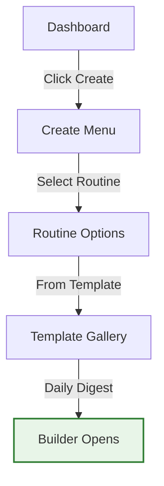
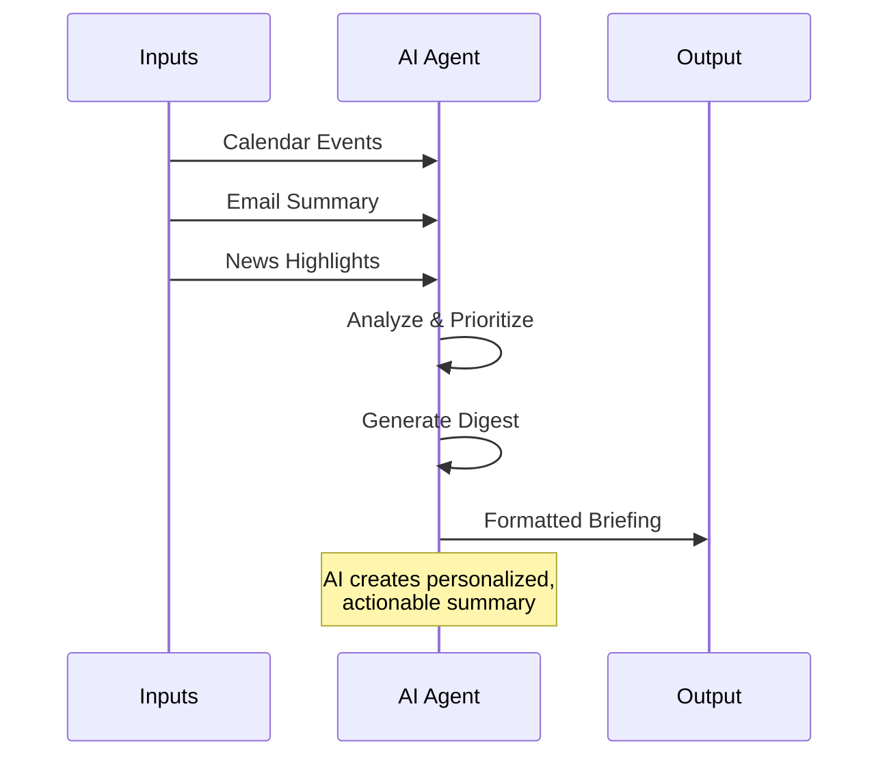
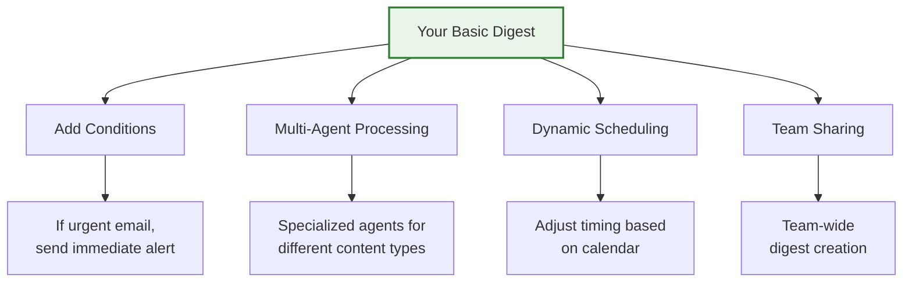

# Your First Automation 🎉

Welcome to your first hands-on experience with Vrooli! In just 5 minutes, you'll create a working automation that demonstrates the power of the platform. We'll build a "Smart Daily Digest" that gathers information from multiple sources and creates a personalized summary.

## 🎯 What We're Building

A Smart Daily Digest that:
- Checks your calendar for today's events
- Summarizes important emails
- Gathers relevant news
- Creates a formatted daily briefing
- Sends it to you via your preferred channel

```mermaid
graph LR
    A[📅 Calendar] --> D[🤖 AI Agent]
    B[📧 Email] --> D
    C[📰 News] --> D
    D --> E[📋 Daily Digest]
    E --> F[📱 Send to You]
    
    style D fill:#e3f2fd,stroke:#1565c0,stroke-width:2px
    style E fill:#e8f5e8,stroke:#2e7d32,stroke-width:2px
```



## ⏱️ Time Estimate

- **Setup**: 1 minute
- **Building**: 3 minutes  
- **Testing**: 1 minute
- **Total**: 5 minutes

## 🚀 Let's Start!

### Step 1: Access the Routine Builder (30 seconds)

1. From your dashboard, click the **Create** button
2. Select **"Routine"** from the dropdown
3. Choose **"Start from Template"**
4. Search for **"Daily Digest"** and select it



> 💡 **Can't find the template?** No problem! Select "Blank Routine" and we'll build it from scratch.

### Step 2: Customize Your Digest (2 minutes)

The template provides a great starting point. Let's personalize it:

#### A. Update Basic Information
```yaml
Name: "My Smart Daily Digest"
Description: "Gathers my daily information and creates a 
             personalized briefing every morning"
Tags: ["productivity", "daily", "personal"]
Schedule: "Every day at 7:00 AM"
```

#### B. Configure Information Sources

The routine has pre-configured steps. Let's adjust them:

**1. Calendar Check Step**

```mermaid
graph LR
    CS[📅 Calendar Step] --> S[Settings]
    S --> T[Time Range: Today]
    S --> F[Filter: All Events]
    S --> O[Output: todayEvents]
    
    style CS fill:#e3f2fd,stroke:#1565c0
```


Click the Calendar step and verify:
- **Integration**: Your calendar is connected
- **Time Range**: "Today" 
- **Include**: All event details

**2. Email Summary Step**
```yaml
Step: Email Summary
Settings:
  inbox: "Primary"
  unreadOnly: true
  maxEmails: 10
  summaryLength: "brief"
Output: emailSummary
```

**3. News Gathering Step**
Customize your news sources:
```yaml
Step: News Digest
Sources:
  - Tech news
  - Industry updates
  - Local news
Topics: ["AI", "automation", "productivity"]
Output: newsHighlights
```

### Step 3: Configure the AI Summarizer (1 minute)

The magic happens in the AI summarization step:



Update the AI prompt:
```markdown
Create my daily digest using:
- Calendar: {{todayEvents}}
- Emails: {{emailSummary}}
- News: {{newsHighlights}}

Format as:
1. 🎯 Top 3 priorities for today
2. 📅 Schedule overview with time blocks
3. 📧 Important emails needing response
4. 📰 Relevant news affecting my work
5. 💡 One productivity tip

Keep it concise and actionable.
```

### Step 4: Set Up Delivery (30 seconds)

Choose how you want to receive your digest:

```mermaid
graph TD
    D[Digest Ready] --> C{Choose Channel}
    C -->|Option 1| E[📧 Email]
    C -->|Option 2| S[💬 Slack]
    C -->|Option 3| T[📱 Text]
    C -->|Option 4| A[🔔 In-App]
    
    style D fill:#e8f5e8,stroke:#2e7d32
```



Configure your preferred channel:
- **Email**: Enter your email address
- **Slack**: Connect workspace and choose channel
- **Text**: Add phone number
- **In-App**: No configuration needed

### Step 5: Test Run! (1 minute)

Time to see your automation in action:

1. Click the **"Test"** button in the toolbar
2. The routine will run with sample data
3. Watch each step execute
4. Review the generated digest

```mermaid
graph LR
    T[Click Test] --> R[Running...]
    R --> S1[✓ Calendar]
    S1 --> S2[✓ Email]
    S2 --> S3[✓ News]
    S3 --> S4[✓ AI Summary]
    S4 --> D[📋 View Digest]
    
    style T fill:#2196f3,stroke:#1565c0,color:#fff
    style D fill:#4caf50,stroke:#2e7d32,color:#fff
```



## 🎉 Congratulations!

You've just created your first Vrooli automation! Here's what you accomplished:

- ✅ Built a multi-step routine
- ✅ Connected external services
- ✅ Configured AI processing
- ✅ Set up automated delivery
- ✅ Tested the workflow

## 📊 Your Daily Digest in Action

Here's what your digest might look like:

```markdown
# Daily Digest - Monday, January 15

## 🎯 Top 3 Priorities
1. **9:00 AM** - Team standup (prepare update on project X)
2. **2:00 PM** - Client presentation (review slides)
3. **EOD** - Submit expense report (deadline today)

## 📅 Schedule Overview
- 9:00-9:30: Team standup
- 10:00-11:00: Deep work block
- 11:00-11:30: 1:1 with Sarah
- 2:00-3:00: Client presentation
- 3:30-4:00: Project review

## 📧 Important Emails (3)
- **From: Boss** - Re: Q1 Planning (needs response)
- **From: Client** - Contract approval ✓
- **From: IT** - System maintenance tonight

## 📰 Relevant News
- OpenAI announces new API features
- Industry report: Automation trends 2024
- Your competitor launched new product

## 💡 Productivity Tip
Block 2-3 hours for deep work when your energy
is highest. Your calendar shows 10-12 AM is free!
```

## 🚀 Next Steps

### Immediate Enhancements

1. **Add More Sources**
   - Task manager integration
   - Weather information
   - Stock market updates
   - Social media mentions

2. **Customize the Format**
   - Add emoji indicators
   - Include time estimates
   - Add direct links
   - Color coding for priority

3. **Create Variations**
   - Weekly summary version
   - End-of-day recap
   - Weekend edition
   - Project-specific digests

### Advanced Features to Try



## 💡 Pro Tips

### Make It More Intelligent
- Add conditional logic: "If important meeting today, include prep materials"
- Use multiple agents: Research agent for news, Analyst for email priorities
- Learn from feedback: Rate daily digests to improve over time

### Optimize Performance
- Schedule during off-peak hours
- Cache frequently accessed data
- Use specific news keywords
- Limit email scanning to key folders

### Share and Collaborate
- Share with your team as a template
- Create department-specific versions
- Build a library of digest variations

## 🎯 Challenge Yourself

Try these modifications:
1. **5-minute challenge**: Add weather and commute info
2. **10-minute challenge**: Include task manager integration
3. **15-minute challenge**: Create team digest that combines multiple calendars
4. **30-minute challenge**: Build intelligent priority scoring system

## 🎊 You Did It!

You've successfully created your first automation in Vrooli! This is just the beginning. With this foundation, you can:

- Build complex business workflows
- Automate repetitive tasks
- Create intelligent systems
- Save hours every week

### Ready for More?

- 📋 [Create your first routine](../routines/creating-your-first-routine.md)
- 🤖 [Learn about agents](../agents/agent-basics.md)
- 🎓 [Follow a learning path](../learning-paths.md)

---

**Remember**: Every expert was once a beginner. You've taken the first step on an exciting automation journey. Keep experimenting, and don't hesitate to ask for help!

🚀 **What will you automate next?**