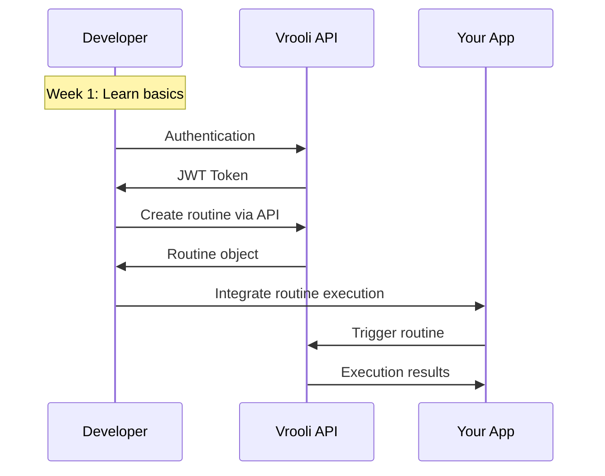
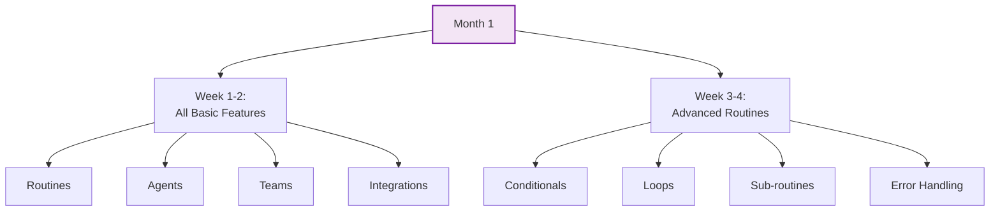
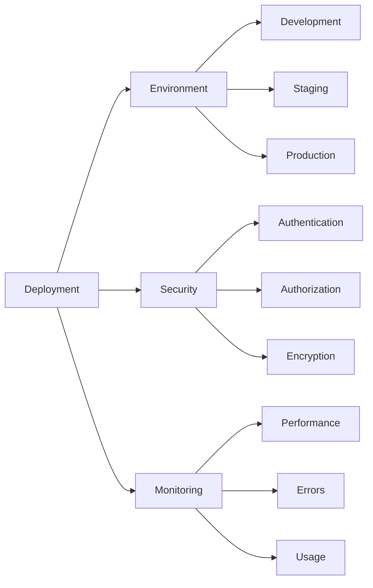
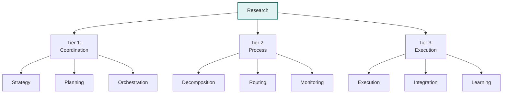

# Learning Paths 🎓

Choose your adventure! This guide provides structured learning paths tailored to different goals and skill levels. Each path is designed to take you from beginner to expert in your area of interest.

## 🗺️ Choose Your Path

```mermaid
graph TD
    Start[🎯 Start Here] --> Q{What's your primary goal?}
    
    Q -->|Automate Work| B[💼 Business User Path]
    Q -->|Build Apps| D[👨‍💻 Developer Path]
    Q -->|Master Platform| P[🚀 Power User Path]
    Q -->|Deploy & Manage| A[🔧 Administrator Path]
    Q -->|Explore AI| R[🧠 AI Researcher Path]
    
    B --> BG[Business Goals:<br/>• Automate workflows<br/>• Improve productivity<br/>• Reduce manual tasks]
    D --> DG[Developer Goals:<br/>• API integration<br/>• Custom solutions<br/>• Extended features]
    P --> PG[Power User Goals:<br/>• Advanced automation<br/>• Complex systems<br/>• Community leadership]
    A --> AG[Admin Goals:<br/>• System deployment<br/>• User management<br/>• Performance optimization]
    R --> RG[Research Goals:<br/>• AI capabilities<br/>• Agent development<br/>• Innovation]
    
    style Start fill:#e3f2fd,stroke:#1565c0,stroke-width:3px
    style B fill:#e8f5e8,stroke:#2e7d32
    style D fill:#fff3e0,stroke:#e65100
    style P fill:#f3e5f5,stroke:#7b1fa2
    style A fill:#ffebee,stroke:#c62828
    style R fill:#e0f2f1,stroke:#00695c
```

## 💼 Business User Path

**Goal**: Automate daily tasks and improve team productivity without coding

### Week 1: Foundation

```mermaid
graph LR
    W1[Week 1] --> D1[Day 1-2:<br/>Platform Basics]
    W1 --> D3[Day 3-4:<br/>First Routine]
    W1 --> D5[Day 5-7:<br/>Simple Automations]
    
    D1 --> T1[✅ Account setup<br/>✅ Navigation<br/>✅ Core concepts]
    D3 --> T2[✅ Routine builder<br/>✅ Basic steps<br/>✅ Testing]
    D5 --> T3[✅ Email automation<br/>✅ Data collection<br/>✅ Scheduling]
```

### Week 2-3: Building Skills
- Create department-specific workflows
- Integrate with existing tools (Slack, Email, Calendar)
- Learn conditional logic and branching
- Share routines with team members

### Week 4-6: Advanced Automation
- Multi-step approval processes
- Data transformation and reporting
- Team collaboration patterns
- Cost optimization strategies

### Certification Milestones
- 🏆 **Automation Novice**: Complete 5 routines
- 🏆 **Efficiency Expert**: Save 10 hours/week
- 🏆 **Team Champion**: Deploy team-wide automation
- 🏆 **Process Master**: Transform entire workflow

### Resources
- 📚 [Platform Overview](./getting-started/platform-overview.md)
- 🎬 Video: "Business Automation Best Practices"
- 💡 Template Library: Business Workflows
- 👥 Community: Business Users Forum

## 👨‍💻 Developer Path

**Goal**: Build applications and integrations using Vrooli's API and framework

### Week 1: API Fundamentals

### Week 2-3: Integration Patterns
- RESTful API deep dive
- WebSocket real-time events
- Webhook configurations
- Error handling and retries
- Rate limiting strategies

### Week 4-8: Advanced Development
- Custom agent development
- MCP (Model Context Protocol) integration
- Building custom navigators
- Performance optimization
- Security best practices

### Project Milestones
- 🏗️ **Hello World**: First API integration
- 🏗️ **Integration Pro**: Connect 3 external services
- 🏗️ **Agent Creator**: Deploy custom agent
- 🏗️ **Platform Contributor**: Merge PR to core

### Resources
- 📚 [API Documentation](../server/api-comprehensive.md)
- 💻 Code Examples: GitHub Repository
- 🔧 SDK Documentation
- 🐛 Developer Discord Channel

## 🚀 Power User Path

**Goal**: Master every aspect of Vrooli to build complex, self-improving systems

### Month 1: Complete Platform Mastery

### Month 2: Multi-Agent Systems
- Swarm orchestration
- Agent specialization
- Communication protocols
- Resource optimization
- Performance monitoring

### Month 3: Innovation & Leadership
- Recursive self-improvement
- Community contributions
- Advanced prompt engineering
- System architecture design
- Teaching and mentoring

### Achievement Levels
- 🎯 **Platform Expert**: Master all features
- 🎯 **Swarm Commander**: Orchestrate 10+ agent swarms
- 🎯 **Innovation Leader**: Create novel solutions
- 🎯 **Community Pillar**: Help 100+ users

### Resources
- 📚 Advanced Architecture Guides
- 🧪 Experimental Features Access
- 🎓 Expert Workshops
- 🌟 Direct Access to Core Team

## 🔧 Administrator Path

**Goal**: Deploy, manage, and optimize Vrooli for organizations

### Week 1-2: Deployment Basics

### Week 3-4: User Management
- Role-based access control
- Team configuration
- Resource allocation
- Usage monitoring
- Compliance setup

### Month 2-3: Advanced Operations
- High availability setup
- Disaster recovery
- Performance tuning
- Cost optimization
- Security hardening

### Operational Milestones
- 🛡️ **Deployment Success**: Production ready
- 🛡️ **Security Champion**: Pass security audit
- 🛡️ **Performance Guru**: Optimal system performance
- 🛡️ **Scale Master**: Support 1000+ users

### Resources
- 📚 [Deployment Guide](../devops/server-deployment.md)
- 🔐 Security Best Practices
- 📊 Monitoring Dashboards
- 🚨 Incident Response Playbooks

## 🧠 AI Researcher Path

**Goal**: Explore and expand AI capabilities within Vrooli

### Month 1: Understanding the Architecture

### Month 2-3: Agent Development
- Prompt engineering mastery
- Agent behavior modeling
- Performance optimization
- Emergent capabilities
- Ethical considerations

### Month 4-6: Innovation Projects
- Novel agent architectures
- Cross-domain applications
- Research publications
- Community experiments
- Future roadmap influence

### Research Achievements
- 🔬 **AI Explorer**: Understand all agent types
- 🔬 **Prompt Master**: Create optimal prompts
- 🔬 **Innovation Pioneer**: Discover new patterns
- 🔬 **Thought Leader**: Publish findings

### Resources
- 📚 Architecture Deep Dives
- 🧪 Research Sandbox Access
- 📊 Performance Analytics
- 🤝 Research Community

## 📈 Progress Tracking

Track your learning journey:

### Daily Habits

```mermaid
graph LR
    DH[Daily Habits] --> M[🌅 Morning:<br/>Check updates]
    DH --> A[☀️ Afternoon:<br/>Practice skills]
    DH --> E[🌙 Evening:<br/>Review & reflect]
    
    M --> M1[New features]
    M --> M2[Community posts]
    
    A --> A1[Build routines]
    A --> A2[Experiment]
    
    E --> E1[Log progress]
    E --> E2[Plan tomorrow]
```

### Weekly Goals
- **Week 1**: Complete orientation
- **Week 2**: First working automation
- **Week 3**: Share with community
- **Week 4**: Optimize and iterate

### Monthly Milestones
- **Month 1**: Foundation complete
- **Month 2**: Intermediate skills
- **Month 3**: Advanced features
- **Month 6**: Path mastery

## 🎯 Quick Start by Goal

### "I want to automate repetitive tasks"
1. Start: [Platform Overview](./getting-started/platform-overview.md)
2. Then: [Your First Routine](./routines/creating-your-first-routine.md)
3. Next: Business User Path

### "I want to build an integration"
1. Start: [API Documentation](../server/api-comprehensive.md)
2. Then: Developer Quick Start
3. Next: Developer Path

### "I want to optimize our deployment"
1. Start: [Deployment Guide](../devops/server-deployment.md)
2. Then: Security Setup
3. Next: Administrator Path

### "I want to explore AI capabilities"
1. Start: [Agent Basics](./agents/agent-basics.md)
2. Then: Architecture Overview
3. Next: AI Researcher Path

## 🏆 Certification Program

Coming soon:
- **Vrooli Certified User**: Basic proficiency
- **Vrooli Certified Developer**: API mastery
- **Vrooli Certified Administrator**: Deployment expertise
- **Vrooli Certified Expert**: Complete platform mastery

## 💡 Learning Tips

1. **Practice Daily**: Consistency beats intensity
2. **Join Community**: Learn from others
3. **Share Progress**: Teaching reinforces learning
4. **Experiment Freely**: Sandbox is your friend
5. **Ask Questions**: No question is too simple

## 🚀 Start Your Journey

Ready to begin? Choose your path above and start with the Week 1 materials. Remember:
- Progress at your own pace
- Focus on understanding, not speed
- Apply learning immediately
- Celebrate small wins

---

🎓 **Your learning adventure starts now!** Pick your path and take the first step. The Vrooli community is here to support you every step of the way.