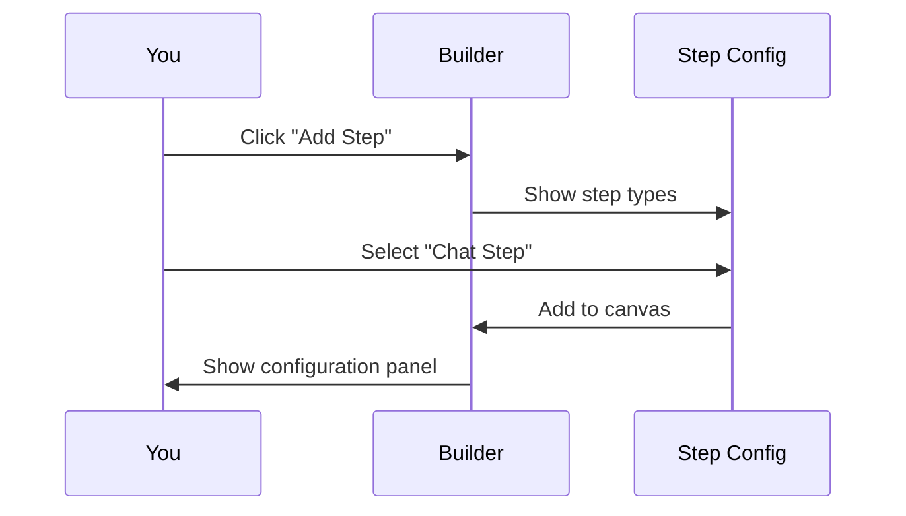
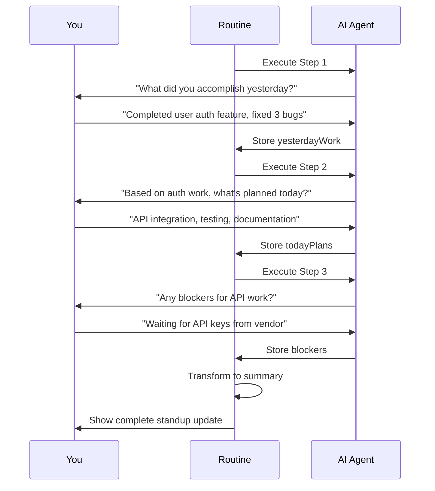
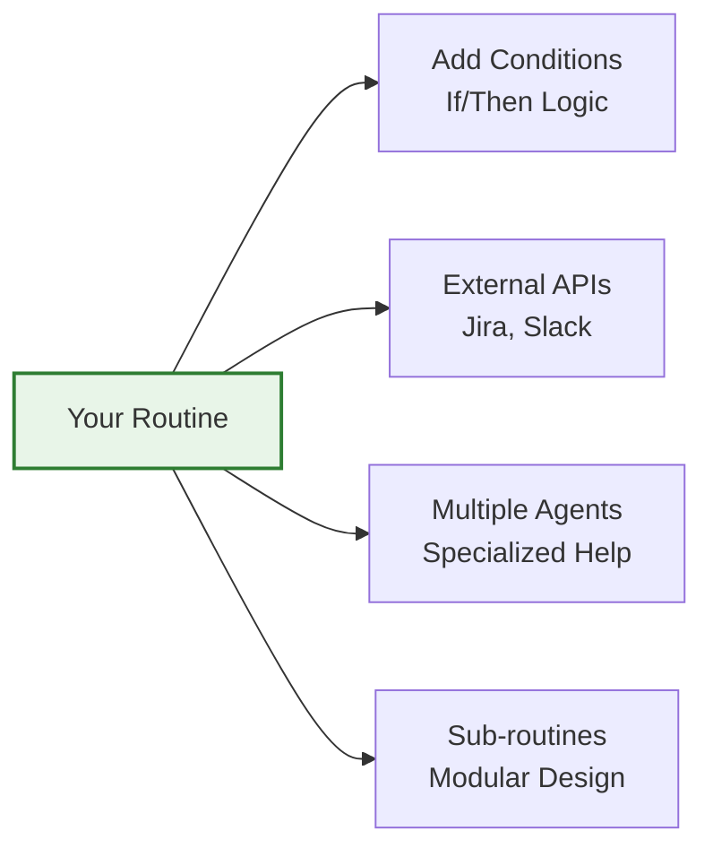

# Creating Your First Routine 🚀

Welcome to the exciting world of Vrooli routines! In this hands-on tutorial, you'll create your first automated workflow in just 5 minutes. We'll build a "Daily Standup Assistant" that helps prepare your daily status updates.

## 🎯 What You'll Learn

- Understanding routine components
- Using the visual routine builder
- Adding and configuring steps
- Testing your routine
- Sharing with others

## 📋 Prerequisites

- A Vrooli account
- 5 minutes of your time
- Enthusiasm to automate!

## 🏗️ Understanding Routine Architecture

Before we build, let's understand what makes a routine:

```mermaid
graph TD
    R[📋 Routine] --> M[📝 Metadata<br/>Name, Description, Tags]
    R --> T[⚡ Triggers<br/>When to Run]
    R --> S[📊 Steps<br/>What to Do]
    R --> O[📤 Outputs<br/>Results]
    
    T --> T1[⏰ Scheduled]
    T --> T2[🔔 Event-Based]
    T --> T3[👆 Manual]
    T --> T4[🔗 API Call]
    
    S --> S1[💬 Chat Step]
    S --> S2[🤖 Agent Task]
    S --> S3[🔧 Transform Data]
    S --> S4[🌐 External API]
    
    O --> O1[📄 Documents]
    O --> O2[📊 Structured Data]
    O --> O3[🔄 Trigger Another]
    
    style R fill:#e3f2fd,stroke:#1565c0,stroke-width:3px
    style S fill:#e8f5e8,stroke:#2e7d32,stroke-width:2px
```



## 🎬 Step 1: Create New Routine

### Navigate to Routine Builder

1. Click the **"Create"** button in the top navigation
2. Select **"Routine"** from the dropdown
3. You'll see the visual routine builder

```mermaid
graph LR
    A[🏠 Dashboard] -->|Click Create| B[➕ Create Menu]
    B -->|Select Routine| C[🎨 Routine Builder]
    
    style C fill:#e8f5e8,stroke:#2e7d32,stroke-width:2px
```



### Name Your Routine

Give your routine a descriptive name and purpose:

- **Name**: "Daily Standup Assistant"
- **Description**: "Helps me prepare my daily standup updates by gathering yesterday's work, today's plans, and any blockers"
- **Tags**: `productivity`, `daily`, `team`

## 🔧 Step 2: Add Your First Step

Let's add a step to gather yesterday's accomplishments:

### Click "Add Step"



### Configure the Chat Step

1. **Step Name**: "Gather Yesterday's Work"
2. **Prompt**: 
   ```
   Please help me summarize what I accomplished yesterday.
   Ask me about:
   - Completed tasks
   - Progress on ongoing projects
   - Any unexpected achievements
   
   Format the response as bullet points.
   ```
3. **Agent**: Select "Assistant" (default)
4. **Output Variable**: `yesterdayWork`

## 📝 Step 3: Add Today's Plans

Add a second step for today's plans:

1. Click **"Add Step"** again
2. Select **"Chat Step"**
3. Configure:
   - **Name**: "Today's Plans"
   - **Prompt**: 
     ```
     Based on yesterday's work: {{yesterdayWork}}
     
     Help me plan today's priorities.
     Ask about:
     - Top 3 priorities
     - Estimated time for each
     - Any dependencies
     ```
   - **Output Variable**: `todayPlans`

Notice how we reference the previous step's output using `{{yesterdayWork}}`!

## 🚧 Step 4: Identify Blockers

Add a third step for blockers:

1. **Step Type**: Chat Step
2. **Name**: "Identify Blockers"
3. **Prompt**:
   ```
   Review my plans: {{todayPlans}}
   
   Help me identify potential blockers:
   - Technical challenges
   - Waiting on others
   - Resource constraints
   
   Suggest mitigation strategies.
   ```
4. **Output Variable**: `blockers`

## 📊 Step 5: Generate Summary

Final step - compile everything into a standup update:

1. **Step Type**: Transform Step
2. **Name**: "Compile Standup Update"
3. **Transformation**:
   ```
   # Daily Standup Update - {{date}}
   
   ## Yesterday
   {{yesterdayWork}}
   
   ## Today
   {{todayPlans}}
   
   ## Blockers
   {{blockers}}
   ```
4. **Output Variable**: `standupUpdate`

## 🔗 Step 6: Connect the Steps

Your routine should now look like this:

```mermaid
graph LR
    Start([🟢 Start]) --> S1[💬 Gather Yesterday's Work]
    S1 --> S2[💬 Today's Plans]
    S2 --> S3[💬 Identify Blockers]
    S3 --> S4[🔧 Compile Update]
    S4 --> End([🏁 End])
    
    S1 -.->|yesterdayWork| S2
    S2 -.->|todayPlans| S3
    S1 -.->|yesterdayWork| S4
    S2 -.->|todayPlans| S4
    S3 -.->|blockers| S4
    
    style Start fill:#e8f5e8,stroke:#2e7d32
    style End fill:#ffebee,stroke:#c62828
```



## 🧪 Step 7: Test Your Routine

Time to see your creation in action!

### Run Test Mode

1. Click the **"Test"** button in the top toolbar
2. The routine will start with the first step
3. Answer the AI's questions naturally
4. Watch as each step builds on the previous

### Test Interaction Example



## 💾 Step 8: Save and Configure

### Save Your Routine

1. Click **"Save"** in the top toolbar
2. Choose visibility:
   - **Private**: Only you can use it
   - **Team**: Share with your team
   - **Public**: Share with community

### Configure Triggers (Optional)

Make it run automatically:

```mermaid
graph TD
    T[⚡ Trigger Options] --> S[⏰ Schedule<br/>Every weekday at 8:30 AM]
    T --> E[📧 Email<br/>When receiving standup request]
    T --> W[🌐 Webhook<br/>From your task manager]
    T --> M[👆 Manual<br/>Run on demand]
    
    style S fill:#e3f2fd,stroke:#1565c0
```



## 🎉 Step 9: Run Your First Routine!

1. Go to your dashboard
2. Find "Daily Standup Assistant" in your routines
3. Click **"Run"**
4. Follow the interactive prompts
5. Get your formatted standup update!

## 📈 Step 10: Evolve and Improve

Your routine will get smarter over time:

### Automatic Improvements
- AI learns your patterns
- Steps optimize based on usage
- Community enhancements applied

### Manual Enhancements
- Add more steps (like Jira integration)
- Customize prompts
- Create variations for different projects

## 🏆 Congratulations!

You've created your first Vrooli routine! Here's what you achieved:

- ✅ Built a multi-step workflow
- ✅ Connected steps with data flow
- ✅ Tested and refined
- ✅ Saved for future use

## 🚀 What's Next?

### Immediate Next Steps

1. **Run it tomorrow**: See how it helps your actual standup
2. **Share with team**: Get feedback and iterate
3. **Clone and modify**: Create variations for different contexts

### Advanced Features to Explore



### Learning Resources

- 🤖 [Working with Agents](../agents/agent-basics.md)
- 🏫 [Learning Paths](../learning-paths.md)

## 💡 Pro Tips

1. **Start Simple**: Don't over-engineer your first routines
2. **Iterate Often**: Small improvements compound
3. **Use Templates**: Browse community routines for inspiration
4. **Monitor Performance**: Check execution logs for optimization opportunities
5. **Get Feedback**: Share with others and incorporate suggestions

## 🤔 Common Questions

**Q: Can I edit my routine after saving?**
A: Yes! Routines are always editable. Changes take effect on the next run.

**Q: What happens if a step fails?**
A: Vrooli has built-in error handling. You can configure retry logic and fallbacks.

**Q: Can I use routines in other routines?**
A: Absolutely! Sub-routines are a powerful way to build modular automations.

**Q: How do I share with specific people?**
A: Use team sharing for private collaboration, or generate secure share links.

---

🎊 **You're now a Routine Creator!** Ready to explore more? Check out [Agent Basics](../agents/agent-basics.md) or follow a [Learning Path](../learning-paths.md).