# Advanced Routine Development 🏗️

Ready to build sophisticated automations? This guide covers advanced patterns, complex workflows, and professional techniques for creating powerful routines.

## 🎯 Beyond the Basics

You've mastered simple routines - now let's explore the advanced features that make Vrooli truly powerful.

### What Makes a Routine "Advanced"?

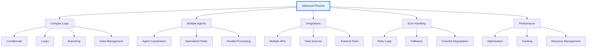

## 🔄 Advanced Control Flow

### Conditional Logic

#### If/Then/Else Patterns
```yaml
Step: Decision Point
Type: Conditional
Condition: {{score}} > 80
Then:
  - Approve automatically
  - Send confirmation email
  - Update status to "Approved"
Else:
  - Route to manual review
  - Notify reviewer
  - Set status to "Pending Review"
```

#### Complex Conditions
```javascript
// Multiple conditions
if ({{user.role}} === "admin" && {{request.priority}} === "high") {
  // Fast-track processing
}

// Nested conditions
if ({{data.type}} === "sensitive") {
  if ({{user.clearance}} >= 3) {
    // Allow access
  } else {
    // Deny and log attempt
  }
}
```

### Loop Patterns

#### Processing Collections
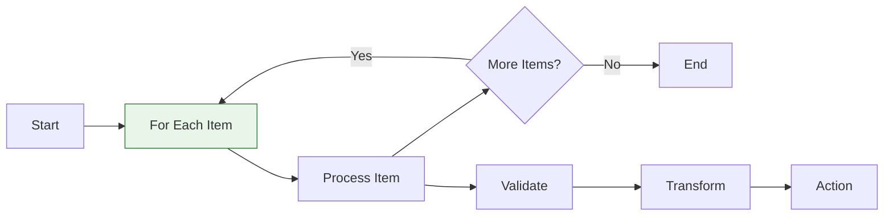

```yaml
Step: Process Email List
Type: Loop
Collection: {{emailList}}
For Each: {{email}}
Do:
  - Validate email format
  - Check subscription status
  - Send personalized message
  - Log result
Output: {{processedEmails}}
```

#### Conditional Loops
```yaml
Step: Retry Until Success
Type: While Loop
Condition: {{attempts}} < 3 AND {{success}} === false
Do:
  - Attempt API call
  - Check response status
  - Increment attempts counter
  - Wait if failed
Break When: {{success}} === true
```

## 🤖 Multi-Agent Orchestration

### Agent Specialization

#### Coordinated Workflow
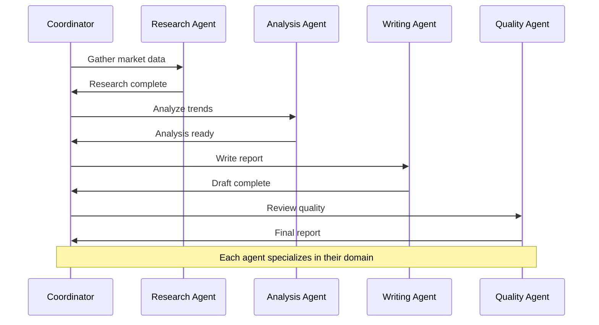

#### Agent Selection Strategy
```yaml
Research Tasks:
  Agent: Research Specialist
  Prompt: "Comprehensive analysis with source verification"
  
Data Analysis:
  Agent: Data Analyst
  Prompt: "Statistical analysis with visualizations"
  
Content Creation:
  Agent: Content Writer
  Prompt: "Professional tone, executive audience"
  
Code Review:
  Agent: Code Expert
  Prompt: "Security-focused review with optimization"
```

### Parallel Processing

#### Concurrent Execution
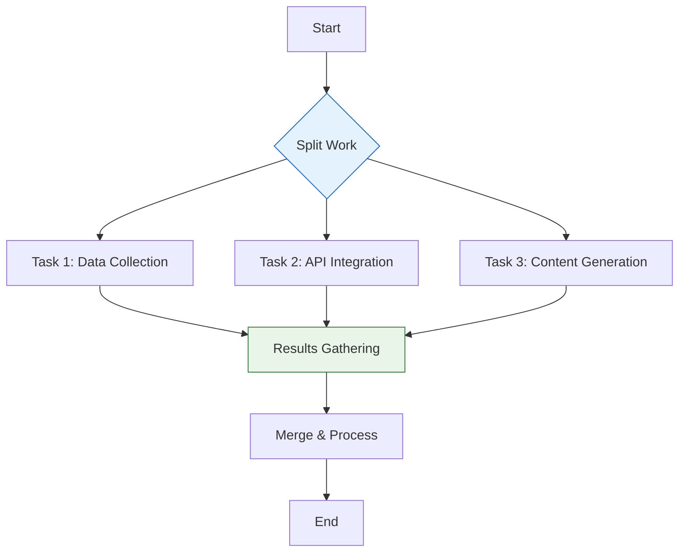

```yaml
Step: Parallel Data Processing
Type: Parallel
Branches:
  Branch1:
    - Fetch financial data
    - Process quarterly reports
  Branch2:
    - Gather market research
    - Analyze competitor data
  Branch3:
    - Generate trend analysis
    - Create visualizations
Wait For: All branches complete
Merge Strategy: Combine all outputs
```

## 🔧 Advanced Integration Patterns

### API Orchestration

#### Multi-Service Workflow
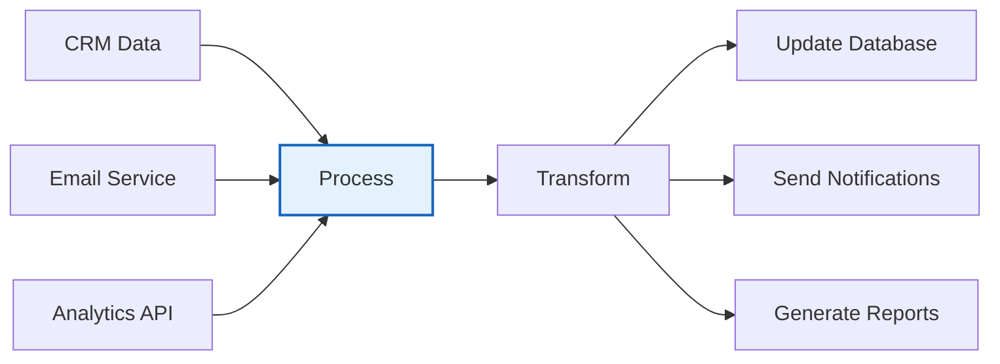

#### Error Handling in Integrations
```yaml
Step: Robust API Call
Service: External CRM
Endpoint: /api/customers
Method: POST
Data: {{customerData}}

Error Handling:
  Retry:
    Attempts: 3
    Backoff: Exponential
    Conditions:
      - Status code: 5xx
      - Timeout errors
      - Network failures
  
  Fallbacks:
    - Try backup service
    - Use cached data
    - Send to manual queue
  
  Final Failure:
    - Log detailed error
    - Notify administrator
    - Continue with partial data
```

### Data Pipeline Design

#### ETL Patterns
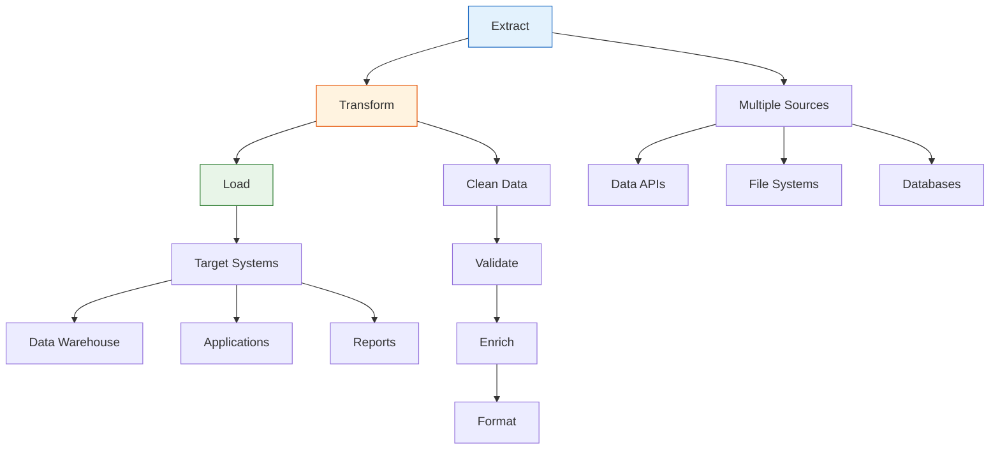

## ⚡ Performance Optimization

### Caching Strategies

#### Intelligent Caching
```yaml
Step: Optimized Data Retrieval
Cache Strategy:
  Level1: In-memory (fast access)
  Level2: Database (persistent)
  Level3: External API (fallback)
  
Cache Rules:
  - Financial data: 15 minutes
  - User preferences: 1 hour
  - Static content: 24 hours
  - Reference data: 1 week

Cache Invalidation:
  - Manual refresh trigger
  - Data change events
  - Time-based expiry
  - Version updates
```

#### Performance Monitoring
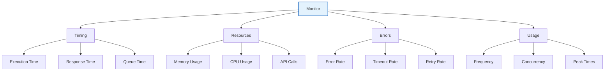

### Resource Management

#### Optimization Techniques
```yaml
Performance Best Practices:
  
  Minimize API Calls:
    - Batch requests when possible
    - Use pagination efficiently
    - Cache frequently accessed data
    - Implement request deduplication
  
  Optimize Data Processing:
    - Stream large datasets
    - Use incremental processing
    - Implement parallel processing
    - Filter data early in pipeline
  
  Resource Allocation:
    - Set appropriate timeouts
    - Limit concurrent executions
    - Use resource pools
    - Monitor memory usage
```

## 🛡️ Error Handling and Resilience

### Comprehensive Error Strategy

#### Error Classification
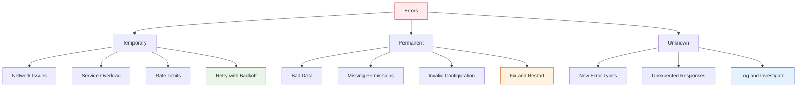

#### Resilience Patterns
```yaml
Circuit Breaker Pattern:
  Failure Threshold: 5 consecutive failures
  Timeout: 30 seconds
  Recovery Test: Every 60 seconds
  
  States:
    Closed: Normal operation
    Open: Reject requests immediately
    Half-Open: Test if service recovered

Bulkhead Pattern:
  Isolate Resources:
    - Separate thread pools
    - Resource quotas
    - Service boundaries
    - Failure isolation

Retry Pattern:
  Strategy: Exponential backoff
  Max Attempts: 3
  Base Delay: 1 second
  Max Delay: 30 seconds
  Jitter: Random variance
```

### Graceful Degradation

#### Fallback Strategies
```yaml
Primary Service Unavailable:
  Fallback 1: Use cached data
  Fallback 2: Call backup service
  Fallback 3: Use default values
  Fallback 4: Manual intervention

Data Quality Issues:
  Validation: Check data integrity
  Cleaning: Fix common issues
  Enrichment: Add missing fields
  Alerting: Notify data team

Service Degradation:
  Reduced Functionality: Core features only
  Simplified Processing: Basic operations
  User Notification: Explain limitations
  Automatic Recovery: When service restored
```

## 📊 Advanced Monitoring and Analytics

### Execution Analytics

#### Performance Metrics
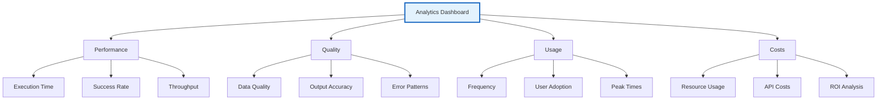

#### Business Intelligence
```yaml
KPI Tracking:
  Operational:
    - Time saved per execution
    - Error reduction percentage
    - Process efficiency gains
    - User satisfaction scores
  
  Financial:
    - Cost per execution
    - ROI calculation
    - Resource optimization savings
    - Total cost of ownership
  
  Strategic:
    - Innovation metrics
    - Adoption rates
    - Competitive advantages
    - Scalability indicators
```

## 🎯 Design Patterns for Complex Routines

### Modular Design

#### Sub-routine Architecture
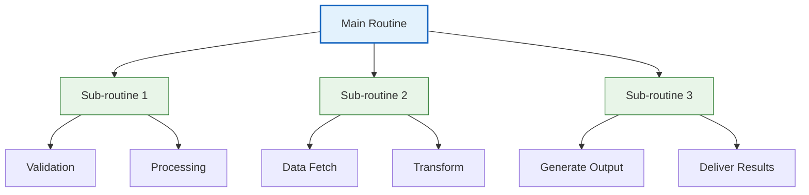

### Reusable Components

#### Component Library
```yaml
Validation Components:
  - Email format validator
  - Data type checker
  - Required field validator
  - Business rule validator

Processing Components:
  - Data transformer
  - File processor
  - API caller
  - Report generator

Utility Components:
  - Error handler
  - Logger
  - Notification sender
  - Cache manager
```

## 🚀 Advanced Deployment Strategies

### Environment Management

#### Deployment Pipeline
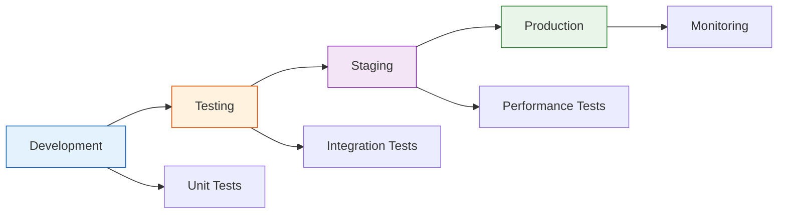

#### Configuration Management
```yaml
Environment Configs:
  Development:
    - Debug logging enabled
    - Relaxed validation
    - Test data sources
    - Shorter timeouts
  
  Production:
    - Minimal logging
    - Strict validation
    - Live data sources
    - Robust error handling
```

## 🎓 Learning Path for Advanced Development

### Skill Progression

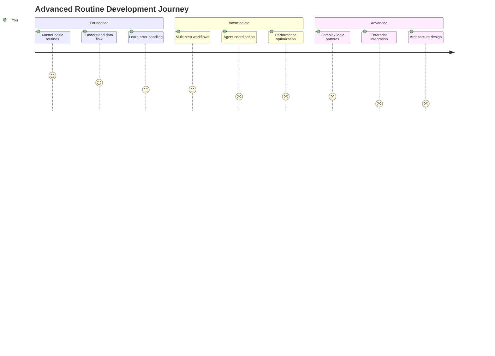

### Practice Projects

#### Progressive Complexity
1. **Multi-step Data Pipeline** (Intermediate)
   - Extract data from multiple sources
   - Transform and validate
   - Load into target systems

2. **Intelligent Document Processing** (Advanced)
   - OCR and text extraction
   - AI-powered classification
   - Automated workflow routing

3. **Real-time Monitoring System** (Expert)
   - Continuous data ingestion
   - Complex event processing
   - Automated response workflows

## 💡 Best Practices Summary

### Design Principles
1. **Modularity**: Break complex routines into reusable components
2. **Resilience**: Plan for failures and build in recovery mechanisms
3. **Performance**: Optimize for speed and resource efficiency
4. **Maintainability**: Write clear, documented, and testable routines
5. **Security**: Protect data and implement proper access controls

### Development Workflow
1. **Plan thoroughly**: Design before implementing
2. **Start simple**: Begin with basic version and iterate
3. **Test extensively**: Validate functionality and performance
4. **Monitor continuously**: Track performance and errors
5. **Optimize iteratively**: Improve based on real-world usage

---

🏗️ **Ready to build advanced automations?** These patterns and techniques will help you create sophisticated, production-ready routines that can handle complex business requirements and scale with your needs.