# Teams and Collaboration 🤝

Vrooli is designed for teamwork! This guide will help you create teams, collaborate on automation projects, and share resources effectively.

## 🎯 What is Team Collaboration?

Teams in Vrooli allow multiple users to:
- Share routines and automations
- Collaborate on complex projects
- Pool resources and permissions
- Coordinate automation strategies
- Learn from each other's work

```mermaid
graph TD
    T[👥 Team] --> M[Team Members]
    T --> R[Shared Resources]
    T --> P[Permissions]
    T --> G[Goals]
    
    M --> M1[👤 Owner/Admin]
    M --> M2[👤 Members]
    M --> M3[👤 Contributors]
    
    R --> R1[📋 Routines]
    R --> R2[🤖 Agents]
    R --> R3[📊 Data]
    R --> R4[🔗 Integrations]
    
    P --> P1[View/Edit Rights]
    P --> P2[Share Controls]
    P --> P3[Resource Access]
    
    G --> G1[🎯 Projects]
    G --> G2[📈 Objectives]
    G --> G3[🏆 Achievements]
    
    style T fill:#e3f2fd,stroke:#1565c0,stroke-width:3px
```



## 🏗️ Creating Your First Team

### Step 1: Set Up the Team

1. **Navigate to Teams**
   - Click "Teams" in the sidebar
   - Click "Create New Team"

2. **Configure Team Details**
   ```yaml
   Team Name: "Marketing Automation Team"
   Description: "Collaborative automation for marketing workflows"
   Visibility: Private/Public
   Team Type: Organization/Project/Department
   ```

3. **Set Team Goals**
   - Define team objectives
   - Set collaboration guidelines
   - Establish communication preferences

### Step 2: Invite Team Members


**Invitation Methods**:
- **Email Invitation**: Send direct email invites
- **Team Link**: Share a join link
- **User Search**: Find and invite existing users
- **Bulk Import**: Upload member list (for larger teams)

### Step 3: Configure Permissions

**Role Types**:
- **Owner**: Full control, can delete team
- **Admin**: Manage members and settings
- **Member**: Full collaboration access
- **Contributor**: Limited access, can contribute but not manage
- **Viewer**: Read-only access

## 📋 Collaborative Routine Development

### Working Together on Routines

#### Individual Development

```mermaid
graph LR
    I[💡 Idea] --> D[👤 Developer]
    D --> R[📋 Draft Routine]
    R --> T[🧪 Test]
    T --> S[📤 Share with Team]
    S --> F[💬 Feedback]
    F --> I2[🔄 Iterate]
    
    style D fill:#e3f2fd,stroke:#1565c0
```


#### Team Development

```mermaid
graph LR
    I[💡 Team Idea] --> P[📋 Planning Session]
    P --> A[👥 Assign Roles]
    A --> D[🔧 Development]
    D --> R[📝 Review]
    R --> M[🔄 Merge]
    M --> T[🚀 Team Deployment]
    
    style P fill:#e8f5e8,stroke:#2e7d32
```


### Collaboration Workflows

#### 1. Fork and Improve
- **Fork routine**: Create your own copy
- **Make improvements**: Enhance functionality
- **Share back**: Contribute improvements to team
- **Merge changes**: Team admin approves and merges

#### 2. Paired Development
- **Real-time collaboration**: Work together simultaneously
- **Screen sharing**: Share development sessions
- **Voice/video chat**: Coordinate complex changes
- **Version control**: Track who changed what

#### 3. Review and Approval
- **Peer review**: Team members review changes
- **Testing protocol**: Ensure quality before deployment
- **Approval process**: Admin approval for critical routines
- **Documentation**: Maintain change logs

## 🔗 Resource Sharing

### Shared Team Assets

#### Routines Library

```mermaid
graph TD
    L[📚 Team Library] --> C[Categories]
    C --> T[🎯 Templates]
    C --> P[🏭 Production]
    C --> E[🧪 Experimental]
    C --> A[📁 Archive]
    
    T --> T1[Onboarding]
    T --> T2[Data Processing]
    T --> T3[Reporting]
    
    P --> P1[Live Routines]
    P --> P2[Mission Critical]
    
    E --> E1[Prototypes]
    E --> E2[Innovation]
    
    style L fill:#e3f2fd,stroke:#1565c0,stroke-width:2px
```


#### Agent Configurations
- **Shared agent setups**: Standardized agent configurations
- **Specialized agents**: Domain-specific AI assistants
- **Performance data**: Shared metrics and optimization insights
- **Best practices**: Proven agent patterns

#### Integration Templates
- **API configurations**: Pre-configured service connections
- **Authentication templates**: Secure connection patterns
- **Data mappings**: Standardized data transformation patterns
- **Error handling**: Shared error management strategies

### Resource Management

#### Access Control
```yaml
Resource Visibility:
  - Public: Anyone can view and use
  - Team: Only team members can access
  - Private: Creator only (can share individually)
  - Restricted: Admin approval required

Permission Levels:
  - View: Can see and use resource
  - Edit: Can modify resource
  - Share: Can share with others
  - Admin: Full control including deletion
```

#### Version Control
- **Change tracking**: See who changed what and when
- **Version history**: Access previous versions
- **Rollback capability**: Revert to working versions
- **Conflict resolution**: Handle simultaneous edits

## 📊 Team Projects and Organization

### Project Structure

```mermaid
graph TD
    P[📁 Project] --> O[🎯 Objectives]
    P --> R[📋 Routines]
    P --> M[👥 Members]
    P --> T[📅 Timeline]
    
    O --> O1[Goals]
    O --> O2[Success Metrics]
    O --> O3[Deliverables]
    
    R --> R1[Core Workflows]
    R --> R2[Supporting Tools]
    R --> R3[Integrations]
    
    M --> M1[Project Lead]
    M --> M2[Contributors]
    M --> M3[Reviewers]
    
    T --> T1[Milestones]
    T --> T2[Deadlines]
    T --> T3[Dependencies]
    
    style P fill:#e3f2fd,stroke:#1565c0,stroke-width:3px
```



### Project Management Features

#### Planning and Coordination
- **Project dashboards**: Overview of progress and status
- **Task assignment**: Delegate specific work to team members
- **Milestone tracking**: Monitor progress toward goals
- **Resource allocation**: Manage team capacity and priorities

#### Communication and Updates
- **Activity feeds**: Stay updated on team progress
- **Notification system**: Get alerts for important changes
- **Comment system**: Discuss specific routines or issues
- **Status reporting**: Regular progress updates

## 🎯 Team Communication

### Built-in Communication Tools

#### Team Chat and Discussions
- **Team channels**: Organized discussion spaces
- **Direct messages**: Private communication
- **Announcement system**: Important team updates
- **File sharing**: Share relevant documents and resources

#### Collaborative Decision Making
- **Voting system**: Democratic decision making
- **Proposal system**: Suggest and discuss changes
- **Consensus building**: Ensure team alignment
- **Documentation**: Record important decisions

### External Communication Integration

#### Connect Your Tools

```mermaid
graph LR
    V[Vrooli Team] --> S[💬 Slack]
    V --> T[👥 Teams]
    V --> D[🎮 Discord]
    V --> E[📧 Email]
    V --> Z[📹 Zoom]
    
    style V fill:#e3f2fd,stroke:#1565c0,stroke-width:2px
```


- **Slack integration**: Team notifications and updates
- **Microsoft Teams**: Enterprise communication
- **Discord**: Community-style collaboration
- **Email notifications**: Keep everyone informed
- **Calendar integration**: Schedule team meetings

## 📈 Team Performance and Analytics

### Team Metrics

#### Collaboration Analytics


#### Success Indicators
- **Automation efficiency**: Time saved through collaboration
- **Knowledge transfer**: Skills and insights shared
- **Innovation rate**: New solutions developed
- **Team satisfaction**: Collaboration effectiveness

### Continuous Improvement

#### Team Retrospectives
- **Regular reviews**: Assess what's working and what isn't
- **Process optimization**: Improve collaboration workflows
- **Tool evaluation**: Assess and improve team tools
- **Goal adjustment**: Adapt objectives based on learning

## 🛡️ Team Security and Governance

### Security Best Practices

#### Access Management
- **Role-based permissions**: Appropriate access for each member
- **Regular access reviews**: Ensure permissions stay current
- **Secure sharing**: Protect sensitive team resources
- **Audit trails**: Track team activity for security

#### Data Protection
- **Confidentiality**: Protect sensitive team information
- **Data classification**: Categorize information by sensitivity
- **Backup procedures**: Ensure team data is protected
- **Compliance**: Meet organizational security requirements

### Governance Framework

#### Team Policies
```yaml
Collaboration Guidelines:
  - Communication standards
  - Code quality requirements
  - Review processes
  - Conflict resolution
  - Decision-making procedures

Resource Management:
  - Naming conventions
  - Organization standards
  - Sharing policies
  - Backup procedures
  - Retention policies
```

## 🎓 Team Learning and Development

### Knowledge Sharing

#### Learning Resources
- **Team documentation**: Shared knowledge base
- **Best practices library**: Proven patterns and approaches
- **Training materials**: Skill development resources
- **Mentorship programs**: Experienced members help newcomers

#### Skill Development
- **Cross-training**: Learn from team members' expertise
- **Experimentation**: Safe space to try new approaches
- **External training**: Participate in courses and workshops
- **Community participation**: Engage with broader Vrooli community

## 🚀 Getting Started with Team Collaboration

### Quick Start Checklist

For Team Creators:
- [ ] Define team purpose and goals
- [ ] Set up team structure and roles
- [ ] Invite initial team members
- [ ] Create first shared project
- [ ] Establish communication channels
- [ ] Set up collaboration guidelines

For Team Members:
- [ ] Complete team onboarding
- [ ] Understand team goals and processes
- [ ] Set up your profile and preferences
- [ ] Explore shared team resources
- [ ] Introduce yourself to the team
- [ ] Start contributing to team projects

### Success Tips

1. **Start Small**: Begin with simple collaboration before tackling complex projects
2. **Communicate Often**: Keep team members informed and engaged
3. **Share Knowledge**: Document insights and learnings for the team
4. **Be Patient**: Building effective collaboration takes time
5. **Celebrate Wins**: Acknowledge team achievements and milestones

---

🤝 **Ready to collaborate?** Team automation is more powerful than individual effort. Start building your automation dream team today!