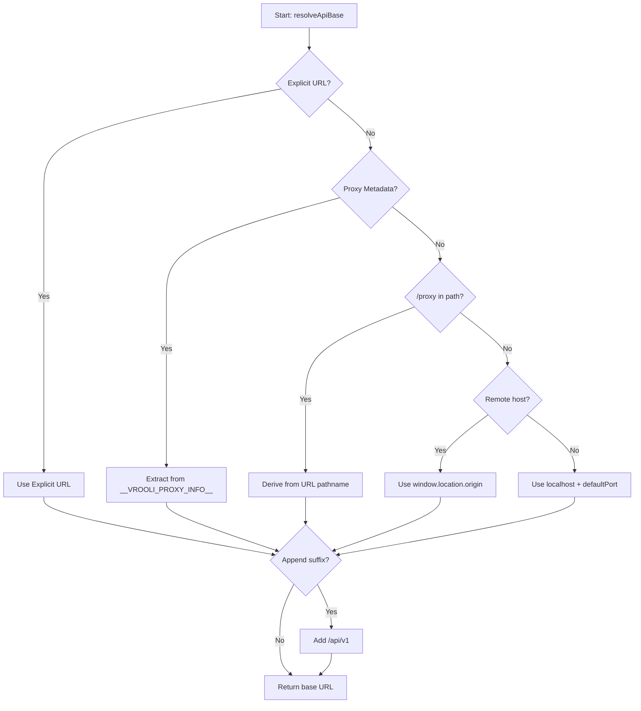

# Proxy Resolution

Understanding how `@vrooli/api-base` resolves API URLs across different deployment contexts.

## Overview

API resolution is the process of determining the correct base URL for API requests based on the current execution context. This is critical because Vrooli scenarios run in multiple environments:

- **Localhost**: Direct access during development
- **Direct Tunnel**: Cloudflare tunnel or traditional deployment
- **Proxied Context**: Embedded in another scenario (iframe)

The resolution algorithm must work correctly in **all contexts** without hardcoded domain names or assumptions.

---

## The Resolution Algorithm

### Priority Order

When `resolveApiBase()` is called, it checks sources in this priority order:



### Source 1: Explicit URL

**Priority**: Highest
**Use Case**: Override all detection for testing or specific deployments

```typescript
resolveApiBase({
  explicitUrl: 'https://api.example.com/v1'
})
// → "https://api.example.com/v1"
```

**When to use**:
- Environment-specific overrides
- Testing specific configurations
- Deploying to non-standard environments

---

### Source 2: Proxy Metadata

**Priority**: High
**Use Case**: Scenario embedded in another scenario (iframe)

**How it works**:

1. Parent scenario injects metadata into child's HTML:
```javascript
window.__VROOLI_PROXY_INFO__ = {
  hostScenario: 'app-monitor',
  targetScenario: 'my-scenario',
  basePath: '/apps/my-scenario/proxy',
  primary: {
    port: 3000,
    path: '/apps/my-scenario/proxy',
    // ...
  },
  ports: [/* ... */],
  hosts: ['localhost', '127.0.0.1'],
}
```

2. Child scenario detects metadata:
```typescript
resolveApiBase({ defaultPort: '8080' })
// Reads window.__VROOLI_PROXY_INFO__.primary.path
// → "https://app-monitor.example.com/apps/my-scenario/proxy"
```

**Supported Global Names** (checked in order):
1. `__VROOLI_PROXY_INFO__` (new standard)
2. `__VROOLI_PROXY_INDEX__` (indexed version)
3. `__APP_MONITOR_PROXY_INFO__` (backwards compatibility)
4. `__APP_MONITOR_PROXY_INDEX__` (backwards compatibility)

**Custom Global Names**:
```typescript
resolveApiBase({
  proxyGlobalNames: ['__CUSTOM_PROXY__']
})
```

---

### Source 3: Path-Based Detection

**Priority**: Medium
**Use Case**: Proxy context without injected metadata

**How it works**:

Looks for `/proxy` marker in URL pathname:

```typescript
// URL: https://example.com/embed/my-scenario/proxy/dashboard
// Pathname: /embed/my-scenario/proxy/dashboard

resolveApiBase()
// Finds "/proxy" at position 22
// Extracts: /embed/my-scenario/proxy
// → "https://example.com/embed/my-scenario/proxy"
```

**Detection Logic**:
```typescript
const proxyMarker = '/proxy'
const index = pathname.indexOf(proxyMarker)
if (index !== -1) {
  const basePath = pathname.slice(0, index + proxyMarker.length)
  return `${origin}${basePath}`
}
```

**Why this works**:
- No hardcoded path assumptions
- Works with **any** proxy pattern:
  - `/apps/{name}/proxy` (app-monitor convention)
  - `/embed/{name}/proxy` (custom embedding)
  - `/preview/{name}/proxy` (preview mode)
  - `/widgets/{name}/proxy` (widget system)

---

### Source 4: App Shell Detection

**Priority**: Medium-Low
**Use Case**: Backwards compatibility with app-monitor pattern

**How it works**:

Specific helper for `/apps/{slug}/proxy` pattern:

```typescript
// URL: https://example.com/apps/scenario-auditor/proxy/
resolveApiBase()
// Detects /apps/ pattern
// Extracts scenario slug: "scenario-auditor"
// → "https://example.com/apps/scenario-auditor/proxy"
```

**Note**: This is a **convenience helper**. The generic `/proxy` detection (Source 3) would also catch this pattern.

---

### Source 5: Remote Host Fallback

**Priority**: Low
**Use Case**: Direct tunnel or VPS deployment

**How it works**:

If on a remote (non-localhost) domain, use the current origin:

```typescript
// URL: https://my-scenario.example.com/dashboard

resolveApiBase({ appendSuffix: true })
// hostname: "my-scenario.example.com" → remote host
// → "https://my-scenario.example.com/api/v1"
```

**Localhost Detection**:
```typescript
const LOCAL_HOST_PATTERN = /^(localhost|127\.0\.0\.1|0\.0\.0\.0|\[?::1\]?)/i

function isLocalHostname(hostname: string): boolean {
  return LOCAL_HOST_PATTERN.test(hostname)
}
```

**Detected as localhost**:
- `localhost`
- `127.0.0.1`
- `0.0.0.0`
- `::1`
- `[::1]`

---

### Source 6: Localhost Fallback

**Priority**: Lowest (default)
**Use Case**: Local development

**How it works**:

When all else fails, use localhost with default port:

```typescript
resolveApiBase({ defaultPort: '8080' })
// No proxy metadata, localhost environment
// → "http://127.0.0.1:8080"
```

**Why `127.0.0.1` instead of `localhost`**:
- Avoids DNS lookup delays
- More reliable in some environments
- Consistent behavior across platforms

---

## Resolution Examples

### Example 1: Localhost Development

```typescript
// Browser: http://localhost:3000
// Environment: Local dev server

resolveApiBase({
  defaultPort: '8080',
  appendSuffix: true
})
// → "http://127.0.0.1:8080/api/v1"
```

**Flow**:
1. ❌ No explicit URL
2. ❌ No proxy metadata
3. ❌ No `/proxy` in path
4. ❌ Not remote host (localhost)
5. ✅ **Use localhost fallback**

---

### Example 2: Direct Tunnel

```typescript
// Browser: https://my-scenario.itsagitime.com/dashboard
// Environment: Cloudflare tunnel

resolveApiBase({ appendSuffix: true })
// → "https://my-scenario.itsagitime.com/api/v1"
```

**Flow**:
1. ❌ No explicit URL
2. ❌ No proxy metadata
3. ❌ No `/proxy` in path
4. ✅ **Remote host** → use origin

---

### Example 3: App-Monitor Proxy (with metadata)

```typescript
// Browser: https://app-monitor.itsagitime.com/apps/scenario-auditor/proxy/
// Environment: Embedded in app-monitor with injected metadata

// Metadata was injected:
window.__VROOLI_PROXY_INFO__ = {
  primary: {
    path: '/apps/scenario-auditor/proxy'
  },
  // ...
}

resolveApiBase()
// → "https://app-monitor.itsagitime.com/apps/scenario-auditor/proxy"
```

**Flow**:
1. ❌ No explicit URL
2. ✅ **Proxy metadata found** → use primary.path

---

### Example 4: Custom Proxy (no metadata)

```typescript
// Browser: https://dashboard.example.com/widgets/analyzer/proxy/tools
// Environment: Custom dashboard embedding analyzer widget

resolveApiBase({ appendSuffix: true })
// → "https://dashboard.example.com/widgets/analyzer/proxy/api/v1"
```

**Flow**:
1. ❌ No explicit URL
2. ❌ No proxy metadata
3. ✅ **`/proxy` found in path** → derive from pathname

---

### Example 5: VPS Deployment

```typescript
// Browser: https://scenarios.company.com/
// Environment: Traditional VPS deployment

resolveApiBase({ appendSuffix: true })
// → "https://scenarios.company.com/api/v1"
```

**Flow**:
1. ❌ No explicit URL
2. ❌ No proxy metadata
3. ❌ No `/proxy` in path
4. ✅ **Remote host** → use origin

---

## Advanced Features

### Custom Proxy Global Names

Support for non-standard proxy metadata:

```typescript
// Parent injects custom global
window.__MY_CUSTOM_PROXY__ = {
  primary: { path: '/custom/path' }
}

// Child resolves with custom name
resolveApiBase({
  proxyGlobalNames: ['__MY_CUSTOM_PROXY__']
})
```

---

### Suffix Handling

Smart suffix appending:

```typescript
// Add suffix
resolveApiBase({
  defaultPort: '8080',
  appendSuffix: true,
  apiSuffix: '/api/v1'
})
// → "http://127.0.0.1:8080/api/v1"

// Custom suffix
resolveApiBase({
  defaultPort: '8080',
  appendSuffix: true,
  apiSuffix: '/graphql'
})
// → "http://127.0.0.1:8080/graphql"

// No suffix
resolveApiBase({ defaultPort: '8080' })
// → "http://127.0.0.1:8080"
```

**Idempotent suffix appending**:
```typescript
// Base already has suffix
resolveApiBase({
  explicitUrl: 'http://localhost:8080/api/v1',
  appendSuffix: true,
  apiSuffix: '/api/v1'
})
// → "http://localhost:8080/api/v1" (not duplicated)
```

---

### Testing with Mock Windows

Inject custom window object for testing:

```typescript
const mockWindow: WindowLike = {
  location: {
    hostname: 'test.example.com',
    origin: 'https://test.example.com',
    pathname: '/apps/test/proxy/',
    protocol: 'https:',
  },
  __VROOLI_PROXY_INFO__: {
    primary: { path: '/apps/test/proxy' },
    // ...
  },
}

resolveApiBase({ windowObject: mockWindow })
// → "https://test.example.com/apps/test/proxy"
```

---

## WebSocket Resolution

WebSocket URLs follow the same resolution algorithm, but with protocol conversion:

```typescript
resolveWsBase({ defaultPort: '8080' })
// HTTP base: "http://127.0.0.1:8080"
// → "ws://127.0.0.1:8080"

resolveWsBase({ defaultPort: '8080', appendSuffix: true })
// HTTPS base: "https://example.com/api/v1"
// → "wss://example.com/api/v1"
```

**Protocol Mapping**:
- `http://` → `ws://`
- `https://` → `wss://`

---

## Context Detection

Check if running in proxy context:

```typescript
import { isProxyContext } from '@vrooli/api-base'

if (isProxyContext()) {
  console.log('Running in proxied iframe')
} else {
  console.log('Running standalone')
}
```

**Detection Logic**:
1. Check for proxy global variables
2. Check for `/proxy` in pathname
3. Return `true` if either found

---

## Best Practices

### ✅ Do

**1. Use standard resolution**:
```typescript
const API_BASE = resolveApiBase({
  defaultPort: '8080',
  appendSuffix: true
})
```

**2. Provide default port**:
```typescript
// Environment variable with fallback
const API_BASE = resolveApiBase({
  defaultPort: process.env.API_PORT || '8080'
})
```

**3. Use explicit URLs for overrides**:
```typescript
const API_BASE = resolveApiBase({
  explicitUrl: process.env.REACT_APP_API_URL,
  defaultPort: '8080'  // Fallback if env var missing
})
```

---

### ❌ Don't

**1. Hardcode URLs**:
```typescript
// ❌ Bad
const API_BASE = 'http://localhost:8080'

// ✅ Good
const API_BASE = resolveApiBase({ defaultPort: '8080' })
```

**2. Assume specific domains**:
```typescript
// ❌ Bad
if (hostname === 'itsagitime.com') {
  // ...
}

// ✅ Good
if (isProxyContext()) {
  // ...
}
```

**3. Duplicate suffix logic**:
```typescript
// ❌ Bad
const base = resolveApiBase()
const url = `${base}/api/v1/health`

// ✅ Good
const base = resolveApiBase({ appendSuffix: true })
const url = buildApiUrl('/health', { baseUrl: base })
```

---

## Troubleshooting

### Problem: API requests fail in proxy context

**Symptoms**: Works in localhost, fails when embedded

**Solution**: Check proxy metadata injection

```typescript
// Debug: Check what's injected
console.log('Proxy info:', window.__VROOLI_PROXY_INFO__)
console.log('Resolved base:', resolveApiBase())

// Verify metadata structure
const info = window.__VROOLI_PROXY_INFO__
if (!info?.primary?.path) {
  console.error('Missing proxy path in metadata')
}
```

---

### Problem: Wrong base URL in direct tunnel

**Symptoms**: Resolves to localhost instead of tunnel domain

**Solution**: Check for explicit URL override

```typescript
// Bad: Build-time env vars don't work in production bundles
const API_BASE = resolveApiBase({
  explicitUrl: import.meta.env.VITE_API_URL  // ❌ undefined in prod
})

// Good: Runtime resolution
const API_BASE = resolveApiBase()  // ✅ Uses window.location.origin
```

---

### Problem: Suffix duplicated

**Symptoms**: URL ends with `/api/v1/api/v1`

**Solution**: Use idempotent suffix handling

```typescript
// The resolution is already idempotent
resolveApiBase({
  explicitUrl: 'http://localhost:8080/api/v1',
  appendSuffix: true,
  apiSuffix: '/api/v1'
})
// ✅ Correctly returns: "http://localhost:8080/api/v1" (not duplicated)
```

---

## See Also

- [Client API Reference](../api/client.md#resolveapibase)
- [Deployment Contexts](./deployment-contexts.md)
- [Runtime Configuration](./runtime-config.md)
- [Quick Start Guide](../guides/quick-start.md)
