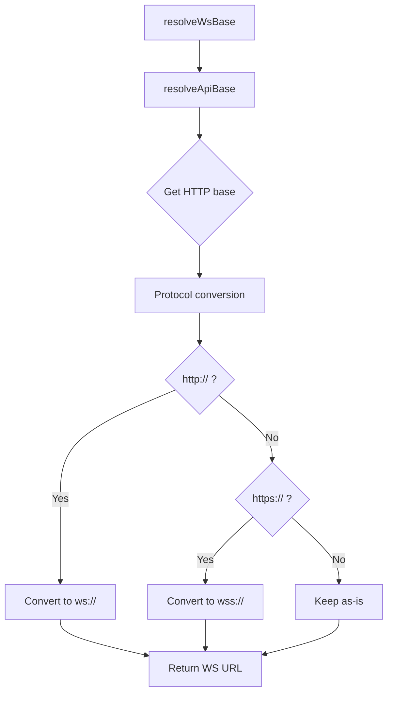

# WebSocket Support

Understanding how `@vrooli/api-base` resolves WebSocket URLs across deployment contexts.

## Overview

WebSockets require **different protocols** than HTTP:
- HTTP → `http://` or `https://`
- WebSocket → `ws://` or `wss://`

But the **resolution logic is identical** - only the protocol differs. `@vrooli/api-base` handles this automatically.

---

## Quick Start

### Basic Resolution

```typescript
import { resolveWsBase } from '@vrooli/api-base'

// Resolve WebSocket base URL
const WS_BASE = resolveWsBase({
  defaultPort: '8081',  // WebSocket port
})

// Connect to WebSocket
const ws = new WebSocket(`${WS_BASE}/events`)
```

### With Suffix

```typescript
const WS_BASE = resolveWsBase({
  defaultPort: '8081',
  appendSuffix: true,
  apiSuffix: '/ws',  // Custom suffix for WebSocket
})

// Result: ws://127.0.0.1:8081/ws
const ws = new WebSocket(WS_BASE)
```

---

## Resolution Algorithm

WebSocket resolution uses **the same algorithm** as HTTP resolution:



**Protocol Mapping**:
| HTTP Protocol | WebSocket Protocol |
|---------------|-------------------|
| `http://`     | `ws://`           |
| `https://`    | `wss://`          |

---

## Context Examples

### Localhost Development

```typescript
// Browser: http://localhost:3000

resolveWsBase({ defaultPort: '8081' })
// → "ws://127.0.0.1:8081"

// Usage
const ws = new WebSocket('ws://127.0.0.1:8081/events')
```

---

### Direct Tunnel (HTTPS)

```typescript
// Browser: https://my-scenario.itsagitime.com

resolveWsBase({ appendSuffix: true, apiSuffix: '/ws' })
// → "wss://my-scenario.itsagitime.com/ws"

// Note: Automatic wss:// for secure origins
const ws = new WebSocket('wss://my-scenario.itsagitime.com/ws/events')
```

---

### Proxy Context

```typescript
// Browser: https://app-monitor.com/apps/scenario/proxy/
// Proxy metadata injected with path: /apps/scenario/proxy

resolveWsBase()
// → "wss://app-monitor.com/apps/scenario/proxy"

const ws = new WebSocket('wss://app-monitor.com/apps/scenario/proxy/ws')
```

---

## Building WebSocket URLs

### Simple Path

```typescript
import { buildWsUrl } from '@vrooli/api-base'

const wsUrl = buildWsUrl('/events', {
  defaultPort: '8081',
})

const ws = new WebSocket(wsUrl)
// → ws://127.0.0.1:8081/events
```

### With Query Parameters

```typescript
const wsUrl = buildWsUrl('/events?channel=notifications', {
  defaultPort: '8081',
  appendSuffix: true,
  apiSuffix: '/ws',
})

const ws = new WebSocket(wsUrl)
// → ws://127.0.0.1:8081/ws/events?channel=notifications
```

---

## Runtime Configuration

### From Injected Config

```typescript
import { getScenarioConfig } from '@vrooli/api-base'

const config = getScenarioConfig()

if (config?.wsUrl) {
  const ws = new WebSocket(config.wsUrl)
} else {
  // Fallback to resolution
  const wsBase = resolveWsBase({ defaultPort: '8081' })
  const ws = new WebSocket(`${wsBase}/events`)
}
```

---

### From Config Endpoint

```typescript
import { fetchRuntimeConfig } from '@vrooli/api-base'

const config = await fetchRuntimeConfig('./config')

if (config?.wsUrl) {
  const ws = new WebSocket(config.wsUrl)
}
```

---

## Server Configuration

### Standard Template

```typescript
import { createScenarioServer } from '@vrooli/api-base/server'

const app = createScenarioServer({
  uiPort: 3000,
  apiPort: 8080,
  wsPort: 8081,  // WebSocket port

  configBuilder: (env) => ({
    apiUrl: `http://localhost:${env.API_PORT}/api/v1`,
    wsUrl: `ws://localhost:${env.WS_PORT}/ws`,  // Injected into config
    apiPort: String(env.API_PORT),
    wsPort: String(env.WS_PORT),
    uiPort: String(env.UI_PORT),
  }),
})
```

**Result**: `window.__VROOLI_CONFIG__.wsUrl = "ws://localhost:8081/ws"`

---

### Separate WebSocket Server

```typescript
// Different host/port for WebSocket server
const app = createScenarioServer({
  uiPort: 3000,
  apiPort: 8080,
  apiHost: '127.0.0.1',

  wsPort: 9000,  // Different port
  wsHost: 'ws-server.local',  // Different host

  configBuilder: (env) => ({
    apiUrl: `http://127.0.0.1:${env.API_PORT}/api/v1`,
    wsUrl: `ws://ws-server.local:${env.WS_PORT}/ws`,
    apiPort: String(env.API_PORT),
    wsPort: String(env.WS_PORT),
    uiPort: String(env.UI_PORT),
  }),
})
```

---

## Protocol Security

### Automatic wss:// on HTTPS

```typescript
// Browser: https://example.com (secure)

resolveWsBase({ defaultPort: '8081' })
// → "wss://example.com:8081" (secure WebSocket)

// ✅ Browser allows wss:// on HTTPS pages
// ❌ Browser blocks ws:// on HTTPS pages (mixed content)
```

### Development with HTTP

```typescript
// Browser: http://localhost:3000 (insecure)

resolveWsBase({ defaultPort: '8081' })
// → "ws://127.0.0.1:8081" (insecure WebSocket)

// ✅ OK for development
```

---

## Advanced Patterns

### Connection Management

```typescript
import { resolveWsBase, buildWsUrl } from '@vrooli/api-base'

class WebSocketManager {
  private ws: WebSocket | null = null
  private wsBase: string

  constructor() {
    this.wsBase = resolveWsBase({
      defaultPort: '8081',
      appendSuffix: true,
      apiSuffix: '/ws',
    })
  }

  connect(channel: string) {
    const url = buildWsUrl(`/${channel}`, {
      baseUrl: this.wsBase,
    })

    this.ws = new WebSocket(url)

    this.ws.onopen = () => {
      console.log(`Connected to ${url}`)
    }

    this.ws.onerror = (error) => {
      console.error('WebSocket error:', error)
    }

    this.ws.onclose = () => {
      console.log('WebSocket closed')
      this.reconnect(channel)
    }
  }

  reconnect(channel: string) {
    setTimeout(() => this.connect(channel), 5000)
  }

  send(data: any) {
    if (this.ws?.readyState === WebSocket.OPEN) {
      this.ws.send(JSON.stringify(data))
    }
  }

  close() {
    this.ws?.close()
  }
}

// Usage
const wsManager = new WebSocketManager()
wsManager.connect('events')
```

---

### Fallback Strategy

```typescript
import { getScenarioConfig, resolveWsBase } from '@vrooli/api-base'

function getWebSocketUrl(path: string): string {
  // 1. Try injected config first
  const config = getScenarioConfig()
  if (config?.wsUrl) {
    return `${config.wsUrl}${path}`
  }

  // 2. Try fetching runtime config
  fetchRuntimeConfig('./config')
    .then(config => {
      if (config?.wsUrl) {
        return `${config.wsUrl}${path}`
      }
    })
    .catch(() => {
      // Config fetch failed, continue to fallback
    })

  // 3. Fallback to resolution
  const wsBase = resolveWsBase({
    defaultPort: '8081',
    appendSuffix: true,
    apiSuffix: '/ws',
  })

  return `${wsBase}${path}`
}

// Usage
const wsUrl = getWebSocketUrl('/events')
const ws = new WebSocket(wsUrl)
```

---

### TypeScript Connection Wrapper

```typescript
import { resolveWsBase, buildWsUrl } from '@vrooli/api-base'

interface WebSocketMessage<T = unknown> {
  type: string
  payload: T
}

class TypedWebSocket<TSend = unknown, TReceive = unknown> {
  private ws: WebSocket
  private messageHandlers = new Map<string, (payload: TReceive) => void>()

  constructor(path: string, options?: { defaultPort?: string }) {
    const url = buildWsUrl(path, {
      defaultPort: options?.defaultPort || '8081',
    })

    this.ws = new WebSocket(url)

    this.ws.onmessage = (event) => {
      try {
        const message: WebSocketMessage<TReceive> = JSON.parse(event.data)
        const handler = this.messageHandlers.get(message.type)
        if (handler) {
          handler(message.payload)
        }
      } catch (error) {
        console.error('Failed to parse WebSocket message:', error)
      }
    }
  }

  on(type: string, handler: (payload: TReceive) => void) {
    this.messageHandlers.set(type, handler)
  }

  send(type: string, payload: TSend) {
    const message: WebSocketMessage<TSend> = { type, payload }
    this.ws.send(JSON.stringify(message))
  }

  close() {
    this.ws.close()
  }
}

// Usage
interface ChatMessage {
  user: string
  text: string
  timestamp: number
}

const ws = new TypedWebSocket<ChatMessage, ChatMessage>('/chat', {
  defaultPort: '8081',
})

ws.on('message', (payload) => {
  console.log(`${payload.user}: ${payload.text}`)
})

ws.send('message', {
  user: 'Alice',
  text: 'Hello!',
  timestamp: Date.now(),
})
```

---

## Best Practices

### ✅ Do

**1. Use resolveWsBase for consistency**:
```typescript
// ✅ Good
const wsBase = resolveWsBase({ defaultPort: '8081' })
const ws = new WebSocket(`${wsBase}/events`)

// ❌ Bad
const ws = new WebSocket('ws://localhost:8081/events')  // Hardcoded
```

**2. Handle both ws:// and wss://**:
```typescript
// ✅ Good - automatically handles protocol
const wsBase = resolveWsBase({ defaultPort: '8081' })

// Works in dev (ws://) and prod (wss://)
const ws = new WebSocket(`${wsBase}/events`)
```

**3. Use config for WebSocket URL**:
```typescript
// ✅ Good
const config = getScenarioConfig()
const wsUrl = config?.wsUrl || resolveWsBase({ defaultPort: '8081' })
```

**4. Implement reconnection logic**:
```typescript
// ✅ Good
ws.onclose = () => {
  setTimeout(() => reconnect(), 5000)
}
```

---

### ❌ Don't

**1. Hardcode WebSocket protocol**:
```typescript
// ❌ Bad - fails on HTTPS
const ws = new WebSocket('ws://example.com/events')

// ✅ Good - automatic protocol
const wsBase = resolveWsBase()
const ws = new WebSocket(`${wsBase}/events`)
```

**2. Mix protocols incorrectly**:
```typescript
// ❌ Bad - mixed content error on HTTPS
if (window.location.protocol === 'https:') {
  ws = new WebSocket('ws://example.com/events')  // Blocked!
}

// ✅ Good - matching protocols
const wsBase = resolveWsBase()  // Automatic wss:// on HTTPS
ws = new WebSocket(`${wsBase}/events`)
```

**3. Forget query parameters**:
```typescript
// ❌ Bad
const ws = new WebSocket(`${wsBase}/events?token=abc`)

// ✅ Good
const ws = new WebSocket(buildWsUrl('/events?token=abc', {
  baseUrl: wsBase,
}))
```

---

## Troubleshooting

### WebSocket connection fails

**Symptom**: `WebSocket connection failed` error

**Solutions**:

1. **Check URL**:
```typescript
const wsUrl = resolveWsBase({ defaultPort: '8081' })
console.log('WebSocket URL:', wsUrl)

// Verify protocol matches page protocol
console.log('Page protocol:', window.location.protocol)
```

2. **Check mixed content** (HTTPS page, ws:// WebSocket):
```typescript
// ❌ Blocked by browser
// Page: https://example.com
// WebSocket: ws://example.com/events

// ✅ Fixed
// Use wss:// for HTTPS pages (automatic with resolveWsBase)
```

3. **Check CORS/proxy configuration**:
```typescript
// WebSocket in proxy context
// Make sure proxy metadata includes WebSocket port
```

---

### Wrong protocol (ws:// vs wss://)

**Symptom**: Mixed content error or insecure WebSocket on HTTPS

**Solution**: Use `resolveWsBase()` for automatic protocol:

```typescript
// ✅ Automatic protocol selection
const wsBase = resolveWsBase({ defaultPort: '8081' })

// http:// page → ws://
// https:// page → wss://
```

---

### Connection in proxy context

**Symptom**: WebSocket connects to wrong server when embedded

**Solution**: Check proxy metadata:

```typescript
// Debug proxy info
console.log('Proxy info:', window.__VROOLI_PROXY_INFO__)

const wsBase = resolveWsBase()
console.log('Resolved WebSocket base:', wsBase)

// Should resolve to proxy path
// e.g., wss://app-monitor.com/apps/scenario/proxy
```

---

## See Also

- [Client API: resolveWsBase](../api/client.md#resolvewsbase)
- [Client API: buildWsUrl](../api/client.md#buildwsurl)
- [Proxy Resolution](./proxy-resolution.md)
- [Runtime Configuration](./runtime-config.md)
- [Quick Start Guide](../guides/quick-start.md)
