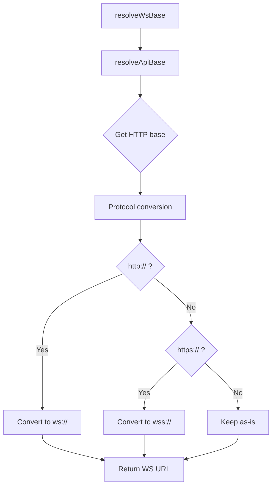

# WebSocket Support

Understanding how `@vrooli/api-base` resolves WebSocket URLs across deployment contexts.

## Overview

WebSockets require **different protocols** than HTTP:
- HTTP → `http://` or `https://`
- WebSocket → `ws://` or `wss://`

But the **resolution logic is identical** - only the protocol differs. `@vrooli/api-base` handles this automatically.

---

## Quick Start

### Basic Resolution

```typescript
import { resolveWsBase } from '@vrooli/api-base'

// Resolve WebSocket base URL
const WS_BASE = resolveWsBase({
})

// Connect to WebSocket
const ws = new WebSocket(`${WS_BASE}/events`)
```

### With Suffix

```typescript
const WS_BASE = resolveWsBase({
  appendSuffix: true,
  apiSuffix: '/ws',  // Custom suffix for WebSocket
})

// Result: ws://127.0.0.1:8081/ws
const ws = new WebSocket(WS_BASE)
```

---

## Resolution Algorithm

WebSocket resolution uses **the same algorithm** as HTTP resolution:



**Protocol Mapping**:
| HTTP Protocol | WebSocket Protocol |
|---------------|-------------------|
| `http://`     | `ws://`           |
| `https://`    | `wss://`          |

---

## Context Examples

### Localhost Development

```typescript
// Browser: http://localhost:3000

resolveWsBase({ appendSuffix: true, apiSuffix: '/ws' })
// → "ws://127.0.0.1:8081"

// Usage
const ws = new WebSocket('ws://127.0.0.1:8081/events')
```

---

### Direct Tunnel (HTTPS)

```typescript
// Browser: https://my-scenario.itsagitime.com

resolveWsBase({ appendSuffix: true, apiSuffix: '/ws' })
// → "wss://my-scenario.itsagitime.com/ws"

// Note: Automatic wss:// for secure origins
const ws = new WebSocket('wss://my-scenario.itsagitime.com/ws/events')
```

---

### Proxy Context

```typescript
// Browser: https://app-monitor.com/apps/scenario/proxy/
// Proxy metadata injected with path: /apps/scenario/proxy

resolveWsBase()
// → "wss://app-monitor.com/apps/scenario/proxy"

const ws = new WebSocket('wss://app-monitor.com/apps/scenario/proxy/ws')
```

---

## Building WebSocket URLs

### Simple Path

```typescript
import { buildWsUrl } from '@vrooli/api-base'

const wsUrl = buildWsUrl('/events', {
})

const ws = new WebSocket(wsUrl)
// → ws://127.0.0.1:8081/events
```

### With Query Parameters

```typescript
const wsUrl = buildWsUrl('/events?channel=notifications', {
  appendSuffix: true,
  apiSuffix: '/ws',
})

const ws = new WebSocket(wsUrl)
// → ws://127.0.0.1:8081/ws/events?channel=notifications
```

---

## Runtime Configuration

### From Injected Config

```typescript
import { getScenarioConfig } from '@vrooli/api-base'

const config = getScenarioConfig()

if (config?.wsUrl) {
  const ws = new WebSocket(config.wsUrl)
} else {
  // Fallback to resolution
  const wsBase = resolveWsBase({ appendSuffix: true, apiSuffix: '/ws' })
  const ws = new WebSocket(`${wsBase}/events`)
}
```

---

### From Config Endpoint

```typescript
import { fetchRuntimeConfig } from '@vrooli/api-base'

const config = await fetchRuntimeConfig('./config')

if (config?.wsUrl) {
  const ws = new WebSocket(config.wsUrl)
}
```

---

## Server Configuration

### Standard Template

```typescript
import { createScenarioServer } from '@vrooli/api-base/server'

const app = createScenarioServer({
  uiPort: 3000,
  apiPort: 8080,
  wsPort: 8081,  // WebSocket port

  configBuilder: (env) => ({
    apiUrl: `http://localhost:${env.API_PORT}/api/v1`,
    wsUrl: `ws://localhost:${env.WS_PORT}/ws`,  // Injected into config
    apiPort: String(env.API_PORT),
    wsPort: String(env.WS_PORT),
    uiPort: String(env.UI_PORT),
  }),
})
```

**Result**: `window.__VROOLI_CONFIG__.wsUrl = "ws://localhost:8081/ws"`

---

### Separate WebSocket Server

```typescript
// Different host/port for WebSocket server
const app = createScenarioServer({
  uiPort: 3000,
  apiPort: 8080,
  apiHost: '127.0.0.1',

  wsPort: 9000,  // Different port
  wsHost: 'ws-server.local',  // Different host

  configBuilder: (env) => ({
    apiUrl: `http://127.0.0.1:${env.API_PORT}/api/v1`,
    wsUrl: `ws://ws-server.local:${env.WS_PORT}/ws`,
    apiPort: String(env.API_PORT),
    wsPort: String(env.WS_PORT),
    uiPort: String(env.UI_PORT),
  }),
})
```

---

## Protocol Security

### Automatic wss:// on HTTPS

```typescript
// Browser: https://example.com (secure)

resolveWsBase({ appendSuffix: true, apiSuffix: '/ws' })
// → "wss://example.com:8081" (secure WebSocket)

// ✅ Browser allows wss:// on HTTPS pages
// ❌ Browser blocks ws:// on HTTPS pages (mixed content)
```

### Development with HTTP

```typescript
// Browser: http://localhost:3000 (insecure)

resolveWsBase({ appendSuffix: true, apiSuffix: '/ws' })
// → "ws://127.0.0.1:8081" (insecure WebSocket)

// ✅ OK for development
```

---

## Advanced Patterns

### Connection Management

```typescript
import { resolveWsBase, buildWsUrl } from '@vrooli/api-base'

class WebSocketManager {
  private ws: WebSocket | null = null
  private wsBase: string

  constructor() {
    this.wsBase = resolveWsBase({
          appendSuffix: true,
      apiSuffix: '/ws',
    })
  }

  connect(channel: string) {
    const url = buildWsUrl(`/${channel}`, {
      baseUrl: this.wsBase,
    })

    this.ws = new WebSocket(url)

    this.ws.onopen = () => {
      console.log(`Connected to ${url}`)
    }

    this.ws.onerror = (error) => {
      console.error('WebSocket error:', error)
    }

    this.ws.onclose = () => {
      console.log('WebSocket closed')
      this.reconnect(channel)
    }
  }

  reconnect(channel: string) {
    setTimeout(() => this.connect(channel), 5000)
  }

  send(data: any) {
    if (this.ws?.readyState === WebSocket.OPEN) {
      this.ws.send(JSON.stringify(data))
    }
  }

  close() {
    this.ws?.close()
  }
}

// Usage
const wsManager = new WebSocketManager()
wsManager.connect('events')
```

---

### Fallback Strategy

```typescript
import { getScenarioConfig, resolveWsBase } from '@vrooli/api-base'

function getWebSocketUrl(path: string): string {
  // 1. Try injected config first
  const config = getScenarioConfig()
  if (config?.wsUrl) {
    return `${config.wsUrl}${path}`
  }

  // 2. Try fetching runtime config
  fetchRuntimeConfig('./config')
    .then(config => {
      if (config?.wsUrl) {
        return `${config.wsUrl}${path}`
      }
    })
    .catch(() => {
      // Config fetch failed, continue to fallback
    })

  // 3. Fallback to resolution
  const wsBase = resolveWsBase({
      appendSuffix: true,
    apiSuffix: '/ws',
  })

  return `${wsBase}${path}`
}

// Usage
const wsUrl = getWebSocketUrl('/events')
const ws = new WebSocket(wsUrl)
```

---

### TypeScript Connection Wrapper

```typescript
import { resolveWsBase, buildWsUrl } from '@vrooli/api-base'

interface WebSocketMessage<T = unknown> {
  type: string
  payload: T
}

class TypedWebSocket<TSend = unknown, TReceive = unknown> {
  private ws: WebSocket
  private messageHandlers = new Map<string, (payload: TReceive) => void>()

  constructor(path: string) {
    const url = buildWsUrl(path, {
    })

    this.ws = new WebSocket(url)

    this.ws.onmessage = (event) => {
      try {
        const message: WebSocketMessage<TReceive> = JSON.parse(event.data)
        const handler = this.messageHandlers.get(message.type)
        if (handler) {
          handler(message.payload)
        }
      } catch (error) {
        console.error('Failed to parse WebSocket message:', error)
      }
    }
  }

  on(type: string, handler: (payload: TReceive) => void) {
    this.messageHandlers.set(type, handler)
  }

  send(type: string, payload: TSend) {
    const message: WebSocketMessage<TSend> = { type, payload }
    this.ws.send(JSON.stringify(message))
  }

  close() {
    this.ws.close()
  }
}

// Usage
interface ChatMessage {
  user: string
  text: string
  timestamp: number
}

const ws = new TypedWebSocket<ChatMessage, ChatMessage>('/chat', {
})

ws.on('message', (payload) => {
  console.log(`${payload.user}: ${payload.text}`)
})

ws.send('message', {
  user: 'Alice',
  text: 'Hello!',
  timestamp: Date.now(),
})
```

---

## Best Practices

### ✅ Do

**1. Use resolveWsBase for consistency**:
```typescript
// ✅ Good
const wsBase = resolveWsBase({ appendSuffix: true, apiSuffix: '/ws' })
const ws = new WebSocket(`${wsBase}/events`)

// ❌ Bad
const ws = new WebSocket('ws://localhost:8081/events')  // Hardcoded
```

**2. Handle both ws:// and wss://**:
```typescript
// ✅ Good - automatically handles protocol
const wsBase = resolveWsBase({ appendSuffix: true, apiSuffix: '/ws' })

// Works in dev (ws://) and prod (wss://)
const ws = new WebSocket(`${wsBase}/events`)
```

**3. Use config for WebSocket URL**:
```typescript
// ✅ Good
const config = getScenarioConfig()
const wsUrl = config?.wsUrl || resolveWsBase({ appendSuffix: true, apiSuffix: '/ws' })
```

**4. Implement reconnection logic**:
```typescript
// ✅ Good
ws.onclose = () => {
  setTimeout(() => reconnect(), 5000)
}
```

---

### ❌ Don't

**1. Hardcode WebSocket protocol**:
```typescript
// ❌ Bad - fails on HTTPS
const ws = new WebSocket('ws://example.com/events')

// ✅ Good - automatic protocol
const wsBase = resolveWsBase()
const ws = new WebSocket(`${wsBase}/events`)
```

**2. Mix protocols incorrectly**:
```typescript
// ❌ Bad - mixed content error on HTTPS
if (window.location.protocol === 'https:') {
  ws = new WebSocket('ws://example.com/events')  // Blocked!
}

// ✅ Good - matching protocols
const wsBase = resolveWsBase()  // Automatic wss:// on HTTPS
ws = new WebSocket(`${wsBase}/events`)
```

**3. Forget query parameters**:
```typescript
// ❌ Bad
const ws = new WebSocket(`${wsBase}/events?token=abc`)

// ✅ Good
const ws = new WebSocket(buildWsUrl('/events?token=abc', {
  baseUrl: wsBase,
}))
```

---

## Troubleshooting

This comprehensive troubleshooting guide covers common WebSocket issues and their solutions.

---

### Connection Refused / 404 Error

**Symptoms**:
- Browser console: `WebSocket connection to 'ws://localhost:3000/api/v1/ws' failed`
- Network tab: 404 Not Found or Connection Refused

**Root Causes**:

1. **Missing server upgrade handler**
   ```javascript
   // ❌ WRONG - No upgrade handler
   const app = createScenarioServer({ uiPort, apiPort })
   app.listen(uiPort)
   // WebSocket connections will fail!
   ```

   ```javascript
   // ✅ CORRECT - Add upgrade handler
   const app = createScenarioServer({ uiPort, apiPort })
   const server = app.listen(uiPort)

   server.on('upgrade', (req, socket, head) => {
     if (req.url?.startsWith('/api')) {
       proxyWebSocketUpgrade(req, socket, head, {
         apiPort: process.env.API_PORT,
         verbose: true  // Enable to see connection logs
       })
     } else {
       socket.destroy()
     }
   })
   ```

2. **API server not running or wrong port**
   ```bash
   # Check if API server is running
   curl http://localhost:YOUR_API_PORT/health

   # Check server logs
   vrooli scenario logs your-scenario --step start-api
   ```

3. **Wrong WebSocket endpoint path**
   ```typescript
   // ❌ WRONG - Endpoint doesn't exist
   const ws = new WebSocket('ws://localhost:3000/ws')

   // ✅ CORRECT - Match your API endpoint
   const wsBase = resolveWsBase({ appendSuffix: true, apiSuffix: '/api/v1/ws' })
   const ws = new WebSocket(wsBase)
   ```

**Debugging Steps**:

1. Enable verbose logging in server:
   ```javascript
   proxyWebSocketUpgrade(req, socket, head, {
     apiPort: process.env.API_PORT,
     verbose: true  // See all proxy activity
   })
   ```

2. Check browser console for exact error
3. Check server logs for connection attempts
4. Verify API endpoint exists: `curl http://localhost:API_PORT/api/v1/ws`

---

### Connection Hangs / Timeout

**Symptoms**:
- Connection attempt never completes
- No error message, just hangs
- Browser eventually times out

**Root Causes**:

1. **WebSocket headers being filtered**

   This was a bug in api-base where critical headers like `Sec-WebSocket-Version` were incorrectly removed.

   **Check server logs for**:
   ```
   [ws-proxy] Missing required WebSocket headers: Sec-WebSocket-Version
   ```

   **Solution**: Update to latest api-base version (includes fix)

2. **Firewall blocking WebSocket connections**
   ```bash
   # Test if port is accessible
   telnet localhost YOUR_UI_PORT

   # Check firewall rules
   sudo ufw status
   ```

3. **Network proxy interfering**

   Some corporate proxies block WebSocket upgrades.

   **Workaround**: Use secure WebSockets (wss://) on HTTPS

---

### "unsupported version: 13 not found in 'Sec-Websocket-Version'"

**Symptom**:
- API server logs show: `websocket: unsupported version: 13 not found in 'Sec-Websocket-Version' header`
- Connection fails immediately

**Root Cause**:
The proxy is not forwarding WebSocket-specific headers to the API server.

**Solution**:
This is the exact bug that was fixed in api-base. The proxy was filtering out `Sec-WebSocket-Version` and other critical headers.

**Verify Fix**:
1. Update api-base to latest version
2. Check that `proxyWebSocketUpgrade` is forwarding all headers
3. Enable verbose logging to see forwarded headers:
   ```javascript
   proxyWebSocketUpgrade(req, socket, head, {
     apiPort,
     verbose: true  // Will log: "Sec-WebSocket-Version: 13"
   })
   ```

**Expected Output** (verbose mode):
```
[ws-proxy] Upgrade request: GET /api/v1/ws -> 127.0.0.1:8080
[ws-proxy] Client headers: host, connection, upgrade, sec-websocket-key, sec-websocket-version
[ws-proxy] Connected to upstream 127.0.0.1:8080
[ws-proxy] Forwarding upgrade request with headers:
[ws-proxy]   Sec-WebSocket-Version: 13
[ws-proxy]   Sec-WebSocket-Key: [present]
[ws-proxy]   Connection: Upgrade
[ws-proxy]   Upgrade: websocket
```

---

### Mixed Content Error (HTTPS + ws://)

**Symptom**:
- Browser console: `Mixed Content: The page was loaded over HTTPS, but attempted to connect to an insecure WebSocket endpoint`

**Root Cause**:
Browsers block insecure WebSocket connections (ws://) from secure pages (https://).

**Solution**:
Use `resolveWsBase()` which automatically uses wss:// for HTTPS pages:

```typescript
// ✅ Automatic protocol selection
const wsBase = resolveWsBase({ appendSuffix: true, apiSuffix: '/api/v1/ws' })

// http:// page → ws://localhost:3000/api/v1/ws
// https:// page → wss://example.com/api/v1/ws
```

**Manual Override** (not recommended):
```typescript
// ⚠️  Only if you have a specific reason
const wsBase = window.location.protocol === 'https:'
  ? 'wss://example.com/api/v1/ws'
  : 'ws://localhost:3000/api/v1/ws'
```

---

### Connection Works in Localhost but Fails in Production

**Symptoms**:
- Works: `http://localhost:3000`
- Fails: `https://your-app.com`

**Root Causes**:

1. **Hardcoded localhost URL**
   ```typescript
   // ❌ WRONG - Only works in localhost
   const ws = new WebSocket('ws://localhost:3000/api/v1/ws')

   // ✅ CORRECT - Works everywhere
   const wsBase = resolveWsBase({ appendSuffix: true, apiSuffix: '/api/v1/ws' })
   const ws = new WebSocket(wsBase)
   ```

2. **Missing wss:// support in production**

   Ensure your production deployment supports WebSocket upgrades with TLS.

3. **Reverse proxy not configured for WebSockets**

   If using nginx/Apache:
   ```nginx
   # nginx configuration
   location /api/v1/ws {
     proxy_pass http://backend;
     proxy_http_version 1.1;
     proxy_set_header Upgrade $http_upgrade;
     proxy_set_header Connection "Upgrade";
   }
   ```

---

### Connection Drops Unexpectedly

**Symptoms**:
- Connection established successfully
- Closes after a few seconds/minutes
- No error message

**Root Causes**:

1. **Reverse proxy timeout**

   Many proxies have default timeouts for inactive connections.

   **Solution**: Implement heartbeat/ping-pong:
   ```typescript
   const ws = new WebSocket(wsUrl)

   // Send ping every 30 seconds
   const pingInterval = setInterval(() => {
     if (ws.readyState === WebSocket.OPEN) {
       ws.send(JSON.stringify({ type: 'ping' }))
     }
   }, 30000)

   ws.on('close', () => {
     clearInterval(pingInterval)
   })
   ```

2. **Server-side idle timeout**

   Check your WebSocket server configuration for idle timeouts.

3. **Network interruption**

   **Solution**: Implement reconnection logic:
   ```typescript
   function connect() {
     const ws = new WebSocket(wsUrl)

     ws.on('close', () => {
       console.log('Connection lost, reconnecting in 5s...')
       setTimeout(connect, 5000)
     })

     return ws
   }

   let ws = connect()
   ```

---

### "Invalid API_PORT configuration"

**Symptom**:
Server logs show: `[ws-proxy] Invalid API_PORT configuration: undefined`

**Root Cause**:
The `API_PORT` environment variable is not set or being passed incorrectly.

**Solution**:

1. **Check environment variables**:
   ```bash
   echo $API_PORT
   # Should output a port number
   ```

2. **Verify server.js passes port correctly**:
   ```javascript
   const server = app.listen(process.env.UI_PORT)

   server.on('upgrade', (req, socket, head) => {
     if (req.url?.startsWith('/api')) {
       proxyWebSocketUpgrade(req, socket, head, {
         apiPort: process.env.API_PORT,  // ✅ Must be set
         verbose: true
       })
     }
   })
   ```

3. **Check .vrooli/service.json**:
   ```json
   {
     "start": {
       "steps": [{
         "name": "ui",
         "env": {
           "API_PORT": "{{api_port}}"  // ✅ Pass to UI server
         }
       }]
     }
   }
   ```

---

### Messages Not Being Received

**Symptoms**:
- Connection established
- Can send messages
- Never receive messages

**Debugging**:

1. **Check message event handler**:
   ```typescript
   const ws = new WebSocket(wsUrl)

   ws.onmessage = (event) => {
     console.log('Received:', event.data)  // Add this!
   }

   // Or with EventEmitter syntax
   ws.on('message', (data) => {
     console.log('Received:', data.toString())
   })
   ```

2. **Verify API server is sending messages**:

   Add logging to your WebSocket server:
   ```go
   // Go example
   func (h *Handler) handleWebSocket(w http.ResponseWriter, r *http.Request) {
     conn, err := upgrader.Upgrade(w, r, nil)
     // ...

     err = conn.WriteMessage(websocket.TextMessage, data)
     log.Printf("Sent message to client: %s", data)  // Add this!
   }
   ```

3. **Check proxy is forwarding data**:

   The proxy uses bidirectional pipes, so it should forward everything. But verify with verbose logging.

---

### Multiple Connections Being Created

**Symptom**:
Browser creates many WebSocket connections instead of one.

**Root Cause**:
React/component re-renders creating new connections without cleaning up old ones.

**Solution**:

```typescript
// ✅ CORRECT - Cleanup in useEffect
useEffect(() => {
  const ws = new WebSocket(wsUrl)

  ws.onopen = () => console.log('Connected')
  ws.onmessage = (event) => handleMessage(event.data)

  // Cleanup function
  return () => {
    console.log('Cleaning up WebSocket')
    ws.close()
  }
}, [wsUrl])  // Only recreate if URL changes
```

---

### Proxy Context Issues

**Symptom**: WebSocket connects to wrong server when embedded in another scenario (e.g., app-monitor)

**Solution**: Ensure proxy metadata is properly configured:

```typescript
// Debug proxy detection
console.log('Proxy info:', window.__VROOLI_PROXY_INFO__)
console.log('Is proxy context:', isProxyContext())

const wsBase = resolveWsBase({ appendSuffix: true, apiSuffix: '/api/v1/ws' })
console.log('Resolved WebSocket URL:', wsBase)

// In proxy context, should be:
// wss://app-monitor.com/apps/your-scenario/proxy/api/v1/ws
```

**Check hosting scenario is injecting metadata**:
```javascript
// In host scenario (e.g., app-monitor)
const modifiedHtml = injectProxyMetadata(html, metadata, {
  patchFetch: true,
  infoGlobalName: '__VROOLI_PROXY_INFO__'
})
```

---

## Debugging Checklist

When WebSocket connections fail, work through this checklist:

- [ ] **Browser Console**: Check for error messages
- [ ] **Network Tab**: Look at WebSocket upgrade request (Status should be 101 Switching Protocols)
- [ ] **Server Logs**: Enable verbose mode and check for connection attempts
- [ ] **URL Resolution**: Log the resolved WebSocket URL to verify correctness
- [ ] **Upgrade Handler**: Verify server.on('upgrade') handler exists and correct path
- [ ] **API Health**: Test API server health endpoint
- [ ] **Port Configuration**: Verify API_PORT environment variable is set
- [ ] **Protocol**: Ensure ws:// for HTTP and wss:// for HTTPS
- [ ] **Headers**: Check verbose logs show Sec-WebSocket-Version being forwarded
- [ ] **Firewall**: Verify ports are accessible
- [ ] **Proxy Context**: If embedded, verify proxy metadata is injected

---

## Getting Help

If you're still stuck after trying these solutions:

1. **Enable verbose logging**:
   ```javascript
   proxyWebSocketUpgrade(req, socket, head, {
     apiPort,
     verbose: true  // Critical for debugging
   })
   ```

2. **Collect diagnostic info**:
   - Browser console output (full errors)
   - Server logs (with verbose enabled)
   - Network tab showing WebSocket upgrade request
   - Resolved WebSocket URL (log `resolveWsBase()` output)
   - Environment: localhost, tunnel, or proxy context

3. **Check the integration tests**:
   See `packages/api-base/src/__tests__/integration/websocket-proxy.test.ts` for working examples

---

## See Also

- [Client API: resolveWsBase](../api/client.md#resolvewsbase)
- [Client API: buildWsUrl](../api/client.md#buildwsurl)
- [Proxy Resolution](./proxy-resolution.md)
- [Runtime Configuration](./runtime-config.md)
- [Quick Start Guide](../guides/quick-start.md)
