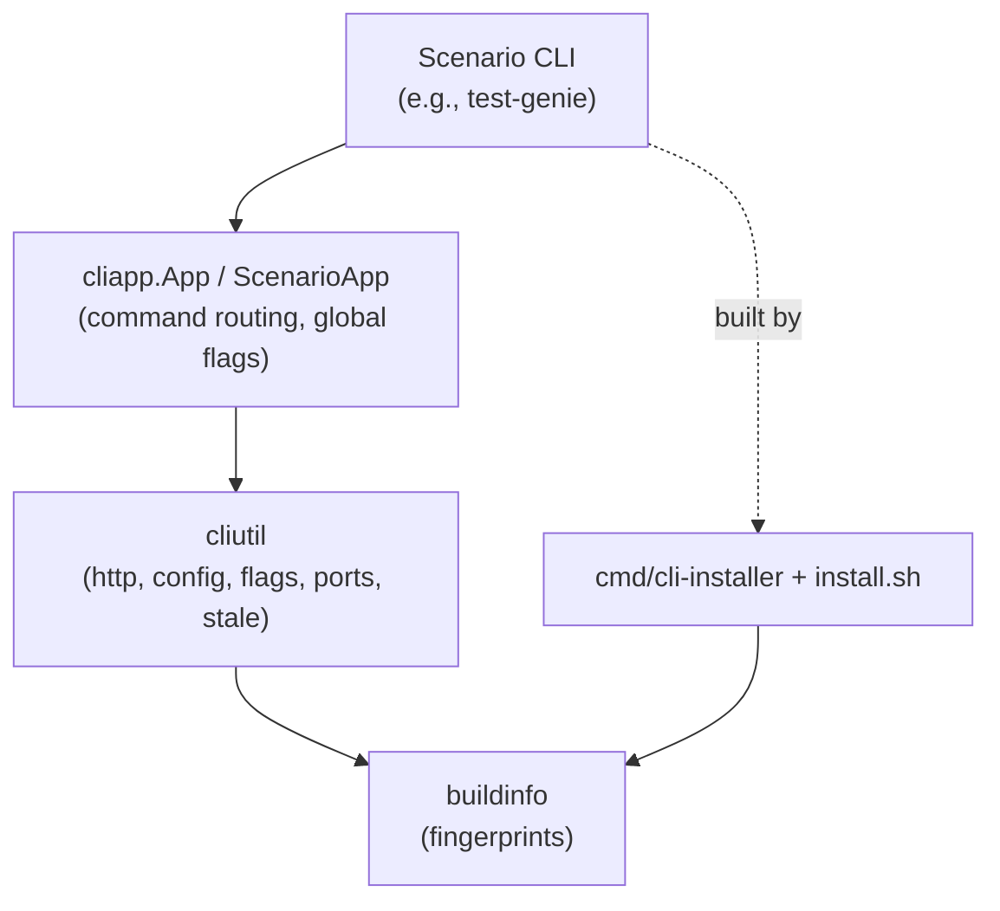

# CLI Core

Shared helpers that keep scenario CLIs small, cross-platform, and consistent: installer, stale-checker, HTTP client, app/command scaffolding, standard env/flag utilities, and fingerprints.



## What lives here
- `cliapp`: CLI scaffolding (`App`, `ScenarioApp`), meta commands, color hook, standard env derivation via `StandardScenarioEnv`.
- `cliutil`: HTTP/API wrapper, config file IO, stale-checker, port detection, JSON pretty-printers, and flag/file helpers (`StringList`, `ParseCSV`, `MergeArgs`, `JSONFlag`, `ReadFileString`).
- `buildinfo`: deterministic fingerprints for install-time and stale-check comparisons.
- `cmd/cli-installer`: builds a scenario CLI and embeds `buildFingerprint`, `buildTimestamp`, `buildSourceRoot`.
- `cmd/fingerprint`: standalone fingerprint helper.
- `install.sh`: friendly wrapper around `cli-installer`.

## Quickstart (install a scenario CLI)
```bash
# From repo root (macOS/Linux)
./packages/cli-core/install.sh scenarios/scenario-completeness-scoring/cli --name scenario-completeness-scoring

# Install somewhere else
./packages/cli-core/install.sh scenarios/test-genie/cli --name test-genie --install-dir ~/.local/bin

# Pin a published cli-core instead of local sources
CLI_CORE_VERSION=v0.0.1 ./packages/cli-core/install.sh scenarios/test-genie/cli --name test-genie

# Windows/PowerShell
powershell -ExecutionPolicy Bypass -File packages/cli-core/install.ps1 -ModulePath scenarios/test-genie/cli -Name test-genie
```

Notes:
- Default install dir: `~/.vrooli/bin` (override with `--install-dir`).
- `APP_ROOT` can override repo root detection when running from a different working dir.

## Scenario wiring checklist
- Use `cliapp.StandardScenarioEnv("<scenario-name>", ...)` to derive API/config/source-root/timeout env vars (keeps names consistent across CLIs). Scenario-specific API port envs are checked before global `API_PORT`.
- Build the core with `cliapp.NewScenarioApp`, pass your command groups, and use `ConfigureCommand` for a consistent config UX.
- Make API calls through `cliutil.APIClient` (wraps `HTTPClient`, handles base URL resolution and token injection).
- For flags/inputs, use `cliutil.JSONFlag`, `StringList`, `ParseCSV`, and `MergeArgs` instead of hand-rolled parsers; read files with `ReadFileString`.
- Pretty-print JSON responses with `cliutil.PrintJSON` / `PrintJSONMap`.
- Keep `NeedsAPI` set on commands so the stale-checker can trigger auto-rebuilds before API calls.

## Stale checking
- `cliutil.StaleChecker` compares the embedded fingerprint against current sources. When Go is available it runs `cmd/cli-installer` to rebuild in place and re-exec the command.
- Fingerprints come from `buildinfo.ComputeFingerprint`, which skips common build/output dirs to avoid noise.
- `ResolveSourceRoot` honors `VROOLI_CLI_SOURCE_ROOT` and scenario-specific overrides so local dev works even when the binary lives outside the repo.

## Helpers reference
- Flags/IO: `StringList`, `ParseCSV`, `MergeArgs`, `JSONFlag`, `ReadFileString`.
- HTTP/API: `HTTPClient` (`Do`, base URL + token, timeout override via env), `APIClient` (base resolver + token source), `ValidateAPIBase`, `DetermineAPIBase`.
- Config: `ResolveConfigDir`, `LoadAPIConfig`, `ConfigFile` (JSON load/save).
- Output: `PrintJSON`, `PrintJSONMap`.
- Ports: `DetectPortFromVrooli("<scenario>", "API_PORT")`.
- Apps: `App` (command router with global flags and meta commands), `ScenarioApp` (scenario wiring + token preflight), `ConfigureCommand` (standard config UX).

## Testing locally
```bash
cd packages/cli-core && go test ./...
```

If you change fingerprinting or stale-check behavior, add/adjust tests. Scenario CLIs have smoke tests under each `cli/` folder—keep them green when refactoring shared helpers.
