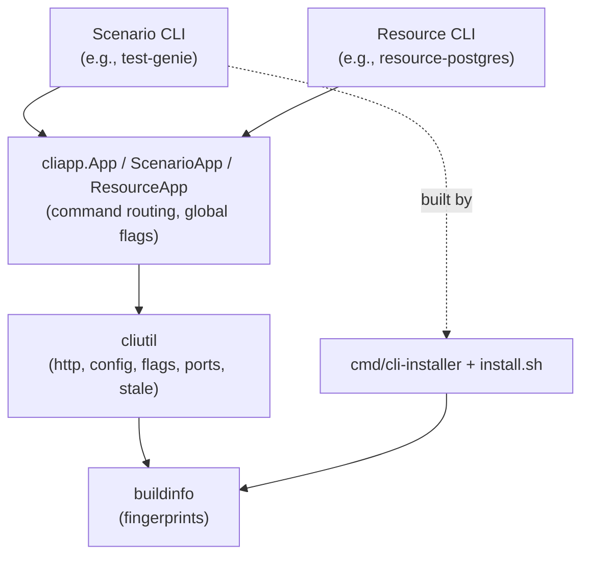

# CLI Core

Shared helpers that keep scenario and resource CLIs small, cross-platform, and consistent: installer, stale-checker, HTTP client, app/command scaffolding, standard env/flag utilities, and fingerprints.


```mermaid
flowchart TD
    ScenarioCLI["Scenario CLI\n(e.g., test-genie)"]
    ResourceCLI["Resource CLI\n(e.g., resource-postgres)"]
    App["cliapp.App / ScenarioApp / ResourceApp\n(command routing, global flags)"]
    Util["cliutil\n(http, config, flags, ports, stale)"]
    Buildinfo["buildinfo\n(fingerprints)"]
    Installer["cmd/cli-installer + install.sh"]

    ScenarioCLI --> App
    ResourceCLI --> App
    App --> Util
    Util --> Buildinfo
    ScenarioCLI -. built by .-> Installer
    Installer --> Buildinfo
```

## What lives here
- `cliapp`: CLI scaffolding (`App`, `ScenarioApp`, `ResourceApp`), meta commands, color hook, and standard env derivation via `StandardScenarioEnv` / `StandardResourceEnv`.
- `cliutil`: HTTP/API wrapper, config file IO, stale-checker, port detection, JSON pretty-printers, and flag/file helpers (`StringList`, `ParseCSV`, `MergeArgs`, `JSONFlag`, `ReadFileString`).
- `buildinfo`: deterministic fingerprints for install-time and stale-check comparisons.
- `cmd/cli-installer`: builds a Go CLI and installs the full artifact set: binary, sibling manifest, and sibling build metadata.
- `cmd/fingerprint`: standalone fingerprint helper.
- `install.sh`: friendly wrapper around `cli-installer`.

## Quickstart (install a scenario CLI)
```bash
# From repo root (macOS/Linux)
./packages/cli-core/install.sh scenarios/scenario-completeness-scoring/cli --name scenario-completeness-scoring --manifest scenarios/scenario-completeness-scoring/.vrooli/service.json

# Install somewhere else
./packages/cli-core/install.sh scenarios/test-genie/cli --name test-genie --manifest scenarios/test-genie/.vrooli/service.json --install-dir ~/.local/bin

# Pin a published cli-core instead of local sources
CLI_CORE_VERSION=v0.0.1 ./packages/cli-core/install.sh scenarios/test-genie/cli --name test-genie --manifest scenarios/test-genie/.vrooli/service.json

# Windows/PowerShell
powershell -ExecutionPolicy Bypass -File packages/cli-core/install.ps1 -ModulePath scenarios/test-genie/cli -Name test-genie -Manifest scenarios/test-genie/.vrooli/service.json
```

Notes:
- Default install dir: `~/.vrooli/bin` (override with `--install-dir`).
- Installed artifact layout is `<command>`, `<command>.manifest.json`, and `<command>.build.meta`.
- Canonical repo-root variables are `VROOLI_ROOT` and `VROOLI_SOURCE_ROOT`. Historical fallbacks are compatibility behavior, not part of the repo contract.

## Quickstart (install a resource CLI)
```bash
# From a source checkout, use the Go-native resource control plane. It reads
# cli.source_build from resource.json and invokes cli-installer without a
# resource-local shell wrapper.
vrooli resource install postgres
```

Desktop and release deployments do not use this source-build path; they consume
the signed prebuilt artifact declared by `cli.distribution`.

## Package Governance

`cli-core` is a governed shared package.

- Scenario-adoptable: yes
- Allowed consumer classes: `scenario_api`, `scenario_cli`, `template_api`, `template_cli`, `resource_runtime`
- Supported adoption mode: `go_module_replace`
- Refresh strategy: rebuild affected CLI-style consumers rather than JS-style scenario setup propagation

Use the native package-governance surface:

```bash
vrooli package info cli-core
vrooli package dependents cli-core
vrooli package refresh cli-core all --no-restart
```

Consumers must keep local `replace` wiring explicit so scenario and resource modules remain workspace-independent. See [docs/package-governance.md](../../docs/package-governance.md) for the canonical policy.

### Consumer Module Contract

Every Go module that requires `github.com/vrooli/cli-core` must build with
`GOWORK=off`. Do not rely on a repo-level workspace to supply dependencies or
local replacements.

Required local wiring for in-repo consumers:

```go
require github.com/vrooli/cli-core v0.0.0

replace github.com/vrooli/cli-core => <relative path to packages/cli-core>
replace github.com/vrooli/repo-contract-go => <relative path to packages/repo-contract-go>
replace github.com/vrooli/vrooli => <relative path to repo root>
```

Consumers that import `github.com/vrooli/cli-core/cliapp` also need the
Connect/Protobuf requirements and checksums that `go mod tidy` records:

```go
require (
	connectrpc.com/connect v1.19.2 // indirect
	google.golang.org/protobuf v1.36.11 // indirect
)
```

If the consumer also imports packages from its scenario API module, keep the API
module explicitly wired too:

```go
require <scenario-api-module> v0.0.0
replace <scenario-api-module> => ../api
```

Go `replace` directives and `go.sum` entries are not transitive. A consumer's
own `go.mod` and `go.sum` must be refreshed after `cli-core/go.mod` changes.
Run `GOWORK=off go mod tidy` in the consumer module, then verify with
`GOWORK=off go build ./...`. Scenario Dependency Analyzer's dependency-health
provider enforces this contract for scenario Go surfaces.

`cli-core` is also governed as a leaf shared Go package. It must not introduce
new local governed package dependencies that would force downstream CLIs to add
extra local `replace` directives just to consume `cli-core`. If `cli-core`
needs to decode a shared wire payload, prefer a local minimal decode struct over
importing another governed package only for DTO reuse.

## Test Companions

Shared-package consumer test helpers live in top-level `<pkg>test` sibling
packages, documented in [Shared Package Testing](../../docs/agent-system/SHARED_PACKAGE_TESTING.md).

- `cliapptest` provides the convention-compliant import path for test
  `RunContext` constructors. The existing `cliapp.NewTestRunContext` exports
  remain available for current consumers.
- `cliutil` does not currently have a companion package because its test seams
  are concrete injection points, such as `HTTPClientOptions.Client`, rather
  than exported fake-worthy interfaces.

## Scenario wiring checklist
- Prefer `cliapp.NewStandardScenarioApp(...)` for new scenario CLIs. It derives standard env vars, wires `vrooli scenario port` detection, and includes the standard `status` + `configure` command groups by default.
- Drop to `cliapp.NewScenarioApp(...)` only when you need lower-level control over env derivation or command assembly.
- Treat the standard scaffold as the only greenfield default. Do not start new scenario CLIs with hand-rolled bootstrap, per-scenario health plumbing, or flat `cmd_<domain>.go` as the planned long-term architecture.
- `cliapp.StandardScenarioEnv("<scenario-name>", ...)` is still available when a CLI needs to customize env wiring directly. API base resolution is `--api-base`, scenario-specific API env, saved config, scenario-specific API port env, `vrooli scenario port <scenario> API_PORT`, then default. Generic `API_PORT` is not part of the scenario CLI contract.
- Generic `API_BASE_URL` and `VITE_API_BASE_URL` are legacy convenience env vars only. Agent-controlled contexts ignore them so one scenario's ambient API base cannot redirect another scenario's CLI. Use `--api-base`, saved config, or scenario-specific env for intentional overrides.
- Make API calls through `cliutil.APIClient` (wraps `HTTPClient`, handles base URL resolution and token injection).
- Prefer `ScenarioApp.Get(...)` / `Request(...)` for versioned API routes and `GetRoot(...)` / `RequestRoot(...)` for root paths such as `/health`.
- Use `ScenarioApp.StandardBaseCommandGroups(...)` when you need to selectively disable or reconfigure built-in `status` / `configure` without reimplementing them.
- Use `ScenarioApp.StandardStatusCommand(...)` as the default status surface; keep custom status only when the scenario has materially richer diagnostics than generic `/health`.
- Prefer domain packages (`cli/domains/<domain>/`) plus `SubcommandGroup` once a CLI has more than a couple commands.
- Use `RenderOperationalReport`, `RenderListReport`, and `RenderMutationReport` for default human output contracts; keep `--json` as the machine-readable companion mode.
- Use `PrintReportJSON(...)` when a command needs machine-readable parity with the same structured report it renders for humans.
- For flags/inputs, use `cliutil.JSONFlag`, `StringList`, `ParseCSV`, and `MergeArgs` instead of hand-rolled parsers; read files with `ReadFileString`.
- Pretty-print JSON responses with `cliutil.PrintJSON` / `PrintJSONMap`.
- Keep `NeedsAPI` set on commands so the stale-checker can trigger auto-rebuilds before API calls and `--auto-start` can recover a stopped scenario automatically. In agent-controlled contexts, `--auto-start` refuses lifecycle startup and reports the operator command to run outside the agent session.

## Command architecture primitives

A high-maturity command is **renderer-separated**: it runs one operation and
only *then* chooses a renderer, so `--json` is an output contract, never an
operation selector. cli-core provides typed primitives that own the
parse → call → render lifecycle. The operation callbacks receive a narrow
`cliapp.OperationContext` — parsed flags/positionals, flag bindings, and `Core()`,
but **no** `JSON()`, no `Render*`, and no writers — so a handler *physically
cannot* observe the output format. Renderer separation is enforced by the callback
signature at compile time, not by convention:

```go
// register.go — bind a manifest command to a renderer-separated primitive and
// register through LoadFromManifestPrimitives so the observed primitive class is
// stamped onto the command's evidence by construction (the evidence is held in an
// unexported field only a cli-core builder can set — scenario code cannot forge it).
bindings := map[string]cliapp.PrimitiveHandler{
    "SearchService.Search": cliapp.ProtoList(
        func(ctx cliapp.OperationContext) (*searchv1.SearchResponse, error) {
            return callSearch(ctx) // build request + call the Connect client
        },
        func(ctx cliapp.OperationContext, resp *searchv1.SearchResponse) cliapp.ListReport {
            return cliapp.ListReport{Summary: ..., Results: ...} // human report only
        },
    ),
}
group, err := cliapp.LoadFromManifestPrimitives(manifestBytes, "search", bindings)
```

- `ProtoList` / `ProtoMutation` / `ProtoOperational` — one read / write / diagnostic
  RPC; `--json` emits the proto wire shape, human mode emits the matching
  report contract. `ProtoListOutcome` is a read whose exit code is derived from
  the response payload (renders, then returns a payload-derived error identically
  in both modes). These are the normal command classes.
- `durable_run` — a server-owned start → follow/wait → reattach run. Build it with
  `cliapp.RunDurable` (a mode-blind `Start` plus per-mode renderers), so human,
  `--json`, and `--jsonl` share one run path and the mode selects only the
  renderer. A legacy (non-`RunCtx`) durable command carries evidence via
  `cliapp.DurableRunLegacy` + `Command.WithLegacyPrimitive` (see
  `test-genie execute`).
- Declare the matching class in the command's manifest `architecture.primitive`
  (`proto_list`, `proto_mutation`, `operational`, `action`) so cli-health can
  classify the command's maturity structurally.
- Special-case classes (streaming, upload, passthrough, external delegation,
  durable runs) are **only** declared as an `architecture.exception`
  (`{ class, reason }`), never as `architecture.primitive` — `architecture.primitive`
  accepts only the normal classes. The vocabulary lives in `cliapp`
  (`DeclarablePrimitiveClasses` for the normal declarable set, `ValidExceptionClasses`
  for exceptions) and is the single source of truth shared with the manifest schema
  and the cli-health classifier.
- **Verified maturity comes from a committed static artifact, never from running
  the command.** Export your command tree's observed primitives with
  `cliapp.BuildPrimitiveEvidence` and commit the result at the canonical generated
  path `cliapp.EvidenceArtifactPath(scenarioRoot)`
  (`.vrooli/generated/cli-primitive-evidence.json`, schema `cli-primitive-evidence/v1`).
  The artifact is generated, not handwritten: it carries a `do_not_edit` banner and
  a `source_manifest` provenance field. Keep it fresh with a golden test using
  `cliapptest.RequirePrimitiveEvidence` (`UPDATE_CLI_EVIDENCE=1` regenerates). CLI
  Health reads this file statically to award verified L4 — it must never execute
  the scenario's commands to collect evidence.
- The full maturity ladder, exception taxonomy, and rollout policy live in
  `scenarios/cli-health/docs/reference/cli-architecture-maturity.md`.
- Test renderer separation with `cliapptest.RunPrimitiveModes`, which drives a
  handler under both human and `--json` modes and returns both renderings.

## Resource wiring checklist
- Use `cliapp.StandardResourceEnv("<resource-name>", ...)` to derive source-root and `vrooli` control-plane env vars consistently.
- Build the core with `cliapp.NewResourceApp`, then use `StandardLifecycleCommands()` for thin delegation through `vrooli resource ...`.
- Keep resource CLIs thin: standard lifecycle commands should delegate to the Go control plane rather than reimplementing install/start/stop/logs locally.

## Stale checking
- `cliutil.StaleChecker` compares the embedded fingerprint against current sources. When Go is available it runs `cmd/cli-installer` to rebuild in place, reinstall the sibling manifest, and re-exec the command.
- Fingerprints come from `buildinfo.ComputeFingerprint`, which skips common build/output dirs to avoid noise.
- `ResolveSourceRoot` honors `VROOLI_CLI_SOURCE_ROOT` and scenario-specific overrides so local dev works even when the binary lives outside the repo.

## Helpers reference
- Flags/IO: `StringList`, `ParseCSV`, `MergeArgs`, `JSONFlag`, `ReadFileString`.
- HTTP/API: `HTTPClient` (`Do`, base URL + token, timeout override via env), `APIClient` (base resolver + token source), `ValidateAPIBase`, `DetermineAPIBase`.
- Config: `ResolveConfigDir`, `LoadAPIConfig`, `ConfigFile` (JSON load/save).
- Output: `PrintJSON`, `PrintJSONMap`.
- Output contracts: `RenderOperationalReport`, `RenderListReport`, `RenderMutationReport`, `PrintReportJSON`.
- Renderer-separated primitives: `ProtoList`, `ProtoMutation`, `ProtoOperational`, `ProtoListOutcome`, `Upload`, `Action` (own parse→call→render; operation callbacks take the narrow `OperationContext`; pair with `RenderProtoList`/`RenderProtoMutation`/`RenderProtoOperational`/`RenderAction`). Durable runs and passthrough commands: `RunDurable` + `DurableRunSpec`/`DurableRunMode`, `DurableRunLegacy`, `Passthrough`, `PassthroughLegacy`, `Command.WithLegacyPrimitive`. Static evidence: `BuildPrimitiveEvidence`, `WritePrimitiveEvidence`, `ParsePrimitiveEvidence`, `EvidenceArtifactPath` (canonical generated path; `EvidenceArtifactFilename` is the deprecated fallback basename), `cliapptest.RequirePrimitiveEvidence`. Architecture vocabulary: `PrimitiveClass`, `ExceptionClass`, `CommandArchitecture`, `DeclarablePrimitiveClasses`, `ValidPrimitiveClasses`, `ValidExceptionClasses`.
- Ports: `DetectPortFromVrooli("<scenario>", "API_PORT")`.
- Apps: `App` (command router with global flags and meta commands), `ScenarioApp` (scenario wiring + token preflight), `ConfigureCommand` (standard config UX).

## Testing locally
```bash
cd packages/cli-core && go test ./...
cd ../../ && make validate-go-cli-consumers
```

If you change fingerprinting or stale-check behavior, add/adjust tests. Scenario CLIs have smoke tests under each `cli/` folder—keep them green when refactoring shared helpers.
