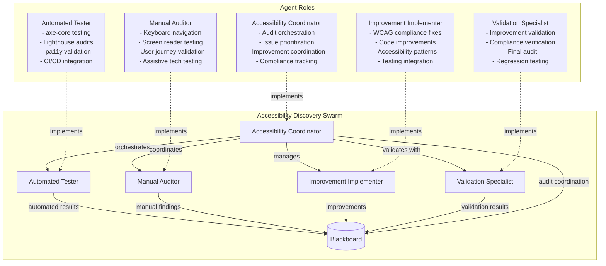
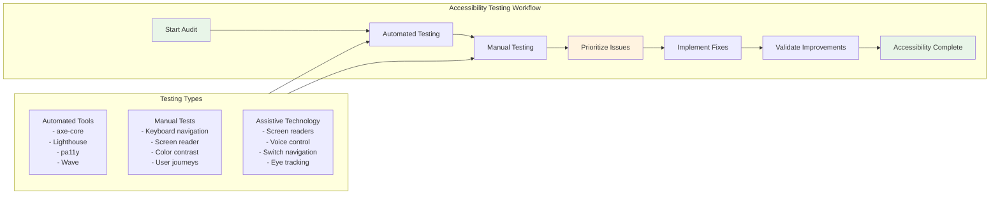
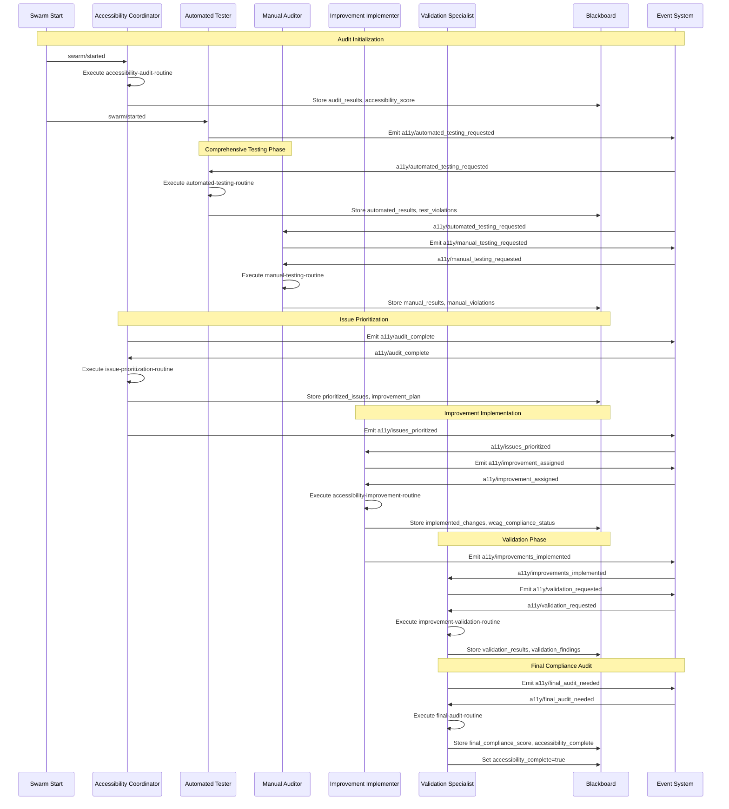
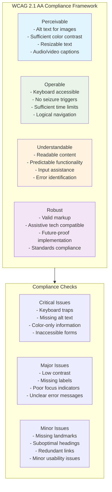
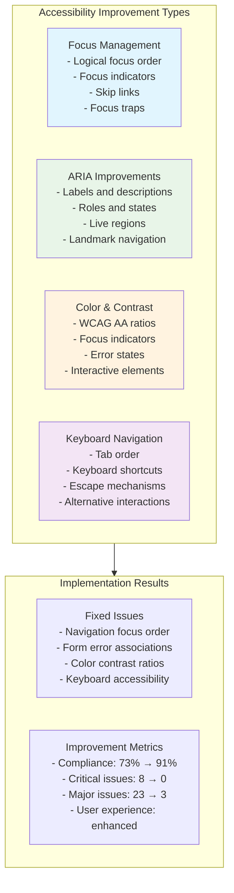
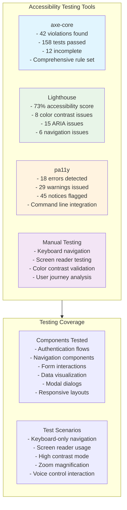

# Accessibility Compliance Discovery Scenario

## Overview

This scenario demonstrates **comprehensive accessibility auditing and improvement** across a web application. It tests the framework's ability to discover accessibility issues through automated and manual testing, prioritize improvements based on user impact, and implement WCAG-compliant solutions while maintaining ongoing compliance validation.

### Key Features

- **Comprehensive Accessibility Audit**: Both automated and manual testing approaches
- **WCAG Compliance Validation**: Ensuring adherence to Web Content Accessibility Guidelines
- **Multi-Modal Testing**: Keyboard navigation, screen reader, color contrast, and assistive technology testing
- **Prioritized Improvement**: Risk-based prioritization of accessibility issues
- **Continuous Validation**: Ongoing compliance monitoring and regression testing

## Agent Architecture



## Accessibility Testing Workflow



## Complete Event Flow



## WCAG Compliance Framework



## Testing Strategy Breakdown

```mermaid
graph TD
    subgraph TestingStrategy[Multi-Modal Testing Strategy]
        AutomatedTesting[Automated Testing<br/>- axe-core: 42 violations<br/>- Lighthouse: 73% score<br/>- pa11y: 18 errors<br/>- Coverage: 85%]
        
        ManualTesting[Manual Testing<br/>- Keyboard nav: 68% score<br/>- Screen reader: 71% score<br/>- Color contrast: 82% score<br/>- User journeys: 74% score]
        
        AssistiveTech[Assistive Technology<br/>- Screen readers (NVDA, JAWS)<br/>- Voice control (Dragon)<br/>- Switch navigation<br/>- Eye tracking systems]
        
        UserJourneys[User Journey Testing<br/>- Authentication flows<br/>- Form interactions<br/>- Navigation patterns<br/>- Content consumption]
    end
    
    subgraph TestingResults[Testing Results]
        CriticalIssues[Critical Issues: 8<br/>- Focus traps<br/>- Missing labels<br/>- Color-only info<br/>- Inaccessible controls]
        
        MajorIssues[Major Issues: 23<br/>- Low contrast<br/>- Poor focus indicators<br/>- Missing landmarks<br/>- Unclear errors]
        
        MinorIssues[Minor Issues: 36<br/>- Heading structure<br/>- Link descriptions<br/>- Redundant content<br/>- Minor usability]
    end
    
    TestingStrategy --> TestingResults
    
    style AutomatedTesting fill:#e1f5fe
    style ManualTesting fill:#e8f5e8
    style AssistiveTech fill:#fff3e0
    style UserJourneys fill:#f3e5f5
```

## Blackboard State Evolution

```mermaid
graph LR
    subgraph StateEvolution[State Evolution Through Accessibility Process]
        Init[Initial State<br/>- audit_scope: [6 components]<br/>- wcag_compliance_level: AA<br/>- quality_gates: [4 gates]]
        
        Audit[After Audit<br/>+ audit_results: 67 violations<br/>+ accessibility_score: 0.73<br/>+ components_by_severity]
        
        Testing[After Testing<br/>+ automated_results: 3 tools<br/>+ manual_results: 4 categories<br/>+ test_violations: detailed]
        
        Prioritization[After Prioritization<br/>+ prioritized_issues: [3 phases]<br/>+ improvement_plan: structured<br/>+ business_impact_analysis]
        
        Implementation[After Implementation<br/>+ implemented_changes: [3 fixes]<br/>+ wcag_compliance_status: 85%<br/>+ testing_status: validated]
        
        Validation[After Validation<br/>+ validation_results: 89% score<br/>+ final_compliance_score: 0.91<br/>+ accessibility_complete: true]
    end
    
    Init --> Audit
    Audit --> Testing
    Testing --> Prioritization
    Prioritization --> Implementation
    Implementation --> Validation
    
    style Init fill:#e1f5fe
    style Validation fill:#e8f5e8
    style Prioritization fill:#fff3e0
```

### Key Blackboard Fields

| Field | Type | Purpose | Updated By |
|-------|------|---------|------------|
| `audit_results` | object | Comprehensive audit findings | Accessibility Coordinator |
| `automated_results` | object | Automated testing results from multiple tools | Automated Tester |
| `manual_results` | object | Manual testing findings | Manual Auditor |
| `prioritized_issues` | array | Risk-prioritized accessibility issues | Accessibility Coordinator |
| `implemented_changes` | array | Accessibility improvements made | Improvement Implementer |
| `validation_results` | object | Post-implementation validation | Validation Specialist |
| `wcag_compliance_status` | string | Current WCAG compliance level | Improvement Implementer |
| `final_compliance_score` | number | Final accessibility score | Validation Specialist |
| `accessibility_complete` | boolean | Accessibility process completion | Validation Specialist |

## Issue Prioritization Matrix

```mermaid
graph TD
    subgraph PriorityMatrix[Issue Prioritization Matrix]
        P1[Priority 1 (Critical)<br/>- Blocks keyboard users<br/>- Blocks screen reader users<br/>- Legal compliance risk<br/>- High usage impact]
        
        P2[Priority 2 (Major)<br/>- Affects low vision users<br/>- Impacts usability<br/>- Moderate compliance risk<br/>- Medium usage impact]
        
        P3[Priority 3 (Minor)<br/>- Polish improvements<br/>- Minor usability issues<br/>- Low compliance risk<br/>- Low usage impact]
    end
    
    subgraph ImpactAssessment[Impact Assessment]
        UserImpact[User Impact<br/>- Disability type affected<br/>- Severity of barrier<br/>- Workaround availability<br/>- User population size]
        
        BusinessImpact[Business Impact<br/>- Legal compliance risk<br/>- Brand reputation<br/>- Implementation cost<br/>- Time to resolution]
        
        TechnicalImpact[Technical Impact<br/>- Implementation complexity<br/>- Testing requirements<br/>- Maintenance burden<br/>- Performance implications]
    end
    
    ImpactAssessment --> PriorityMatrix
    
    style P1 fill:#ffebee
    style P2 fill:#fff3e0
    style P3 fill:#e8f5e8
```

## Accessibility Improvement Implementation



## Testing Tools and Methodologies



## Expected Scenario Outcomes

### Success Path
1. **Comprehensive Audit**: Coordinator orchestrates audit of 6 component categories
2. **Multi-Modal Testing**: Automated tools find 42 violations, manual testing identifies UX issues
3. **Risk-Based Prioritization**: 67 total issues prioritized into 3 implementation phases
4. **Targeted Improvements**: Critical and major issues addressed with WCAG-compliant solutions
5. **Validation Success**: Final compliance score reaches 91% with WCAG AA compliance achieved

### Success Criteria

```json
{
  "requiredEvents": [
    "a11y/automated_testing_requested",
    "a11y/manual_testing_requested",
    "a11y/audit_complete",
    "a11y/issues_prioritized",
    "a11y/improvement_assigned",
    "a11y/improvements_implemented",
    "a11y/validation_requested",
    "a11y/final_audit_needed"
  ],
  "blackboardState": {
    "accessibility_complete": "true",
    "final_compliance_score": ">=0.90",
    "wcag_compliance_status": "AA_compliant",
    "critical_violations": "0",
    "major_violations": "<=5"
  },
  "accessibilityImprovement": {
    "complianceImprovement": "73% to 91%",
    "criticalIssuesResolved": "8 to 0",
    "majorIssuesReduced": "23 to 3",
    "userExperienceEnhanced": "verified"
  }
}
```

## Running the Scenario

### Prerequisites
- Execution test framework with accessibility testing capabilities
- SwarmContextManager configured for accessibility workflows
- Mock routine responses for accessibility operations
- Access to accessibility testing tools (axe-core, Lighthouse, pa11y)

### Execution Steps

1. **Initialize Scenario**
   ```typescript
   const scenario = new ScenarioFactory("a11y-discovery-scenario");
   await scenario.setupScenario();
   ```

2. **Configure Audit Scope**
   ```typescript
   blackboard.set("audit_scope", [
     "authentication_flows", "navigation_components", "form_interactions",
     "data_visualization", "modal_dialogs", "responsive_layouts"
   ]);
   blackboard.set("wcag_compliance_level", "AA");
   ```

3. **Start Accessibility Audit**
   ```typescript
   await scenario.emitEvent("swarm/started", {
     task: "comprehensive-accessibility-audit"
   });
   ```

4. **Monitor Improvement Process**
   - Track `audit_results` from comprehensive testing
   - Monitor `prioritized_issues` based on risk assessment
   - Verify `implemented_changes` compliance
   - Check `validation_results` and final score

### Debug Information

Key monitoring points:
- `audit_results` - Initial accessibility audit findings
- `automated_results` - Automated testing tool results
- `manual_results` - Manual testing findings
- `prioritized_issues` - Risk-prioritized improvement plan
- `implemented_changes` - Accessibility improvements made
- `validation_results` - Post-implementation validation

## Technical Implementation Details

### Accessibility Testing Integration
```typescript
interface AccessibilityTestResult {
  tool: string;
  violations: number;
  passes: number;
  score: number;
  issues: AccessibilityIssue[];
}
```

### Resource Configuration
- **Max Credits**: 1.4B micro-dollars (comprehensive testing and validation)
- **Max Duration**: 12 minutes (thorough accessibility process)
- **Resource Quota**: 25% GPU, 14GB RAM, 5 CPU cores

### WCAG Compliance Validation
1. **Automated Testing**: Run axe-core, Lighthouse, and pa11y
2. **Manual Testing**: Keyboard navigation, screen reader testing, color contrast
3. **User Journey Testing**: Test critical paths with assistive technology
4. **Compliance Verification**: Validate against WCAG 2.1 AA guidelines
5. **Regression Testing**: Ensure improvements don't break existing functionality

## Real-World Applications

### Common Accessibility Scenarios
1. **Legal Compliance**: Meeting ADA, Section 508, and WCAG requirements
2. **User Experience**: Improving accessibility for users with disabilities
3. **Market Expansion**: Reaching broader user base including accessibility needs
4. **Brand Reputation**: Demonstrating commitment to inclusive design
5. **Development Integration**: Building accessibility into development workflows

### Benefits of Systematic Accessibility Testing
- **Comprehensive Coverage**: Both automated and manual testing approaches
- **Risk-Based Prioritization**: Focus on issues with highest user impact
- **Continuous Improvement**: Ongoing monitoring and validation
- **Standards Compliance**: Adherence to established accessibility guidelines
- **User-Centric Approach**: Focus on real user needs and experiences

### Accessibility Testing Categories
- **Automated Testing**: Scalable rule-based validation
- **Manual Testing**: Human insight and user experience validation
- **Assistive Technology Testing**: Real-world usage scenarios
- **User Journey Testing**: End-to-end accessibility validation
- **Compliance Verification**: Standards adherence confirmation

This scenario demonstrates how comprehensive accessibility auditing can be conducted systematically, ensuring web applications meet accessibility standards while providing excellent user experiences for all users, including those with disabilities - essential for legal compliance and inclusive design practices.