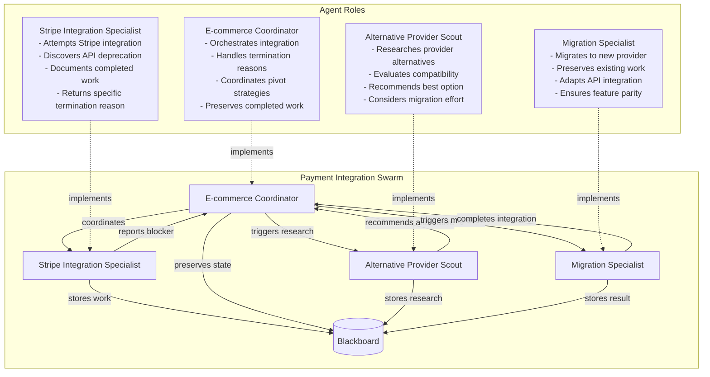

# API Integration Blocker Scenario

## Overview

This scenario demonstrates **intelligent recovery from third-party API blockers** in software engineering workflows. It tests the framework's ability to handle subswarm termination with specific reasons and coordinate intelligent pivots to alternative strategies while preserving completed work.

### Key Features

- **Specific Termination Reasons**: Subswarm returns detailed blocker information
- **Intelligent Pivot Strategy**: Parent coordinator adapts based on termination reason
- **Work Preservation**: Completed components are identified and reused
- **Alternative Provider Research**: Systematic evaluation of replacement options
- **Seamless Migration**: Smooth transition to alternative solution

## Agent Architecture



## Termination Handling Pattern


## Complete Event Flow


## Work Preservation Strategy


## Blackboard State Evolution

```mermaid
graph LR
    subgraph StateEvolution[State Evolution Through Recovery]
        Initial[Initial State<br/>- payment_requirements<br/>- current_checkout_state<br/>- target_provider: stripe]
        
        Blocked[After Stripe Blocked<br/>+ stripe_api_status: deprecated<br/>+ completed_work: [cart, ui]<br/>+ blocked_provider: stripe]
        
        Research[After Provider Research<br/>+ provider_alternatives: [paypal, square]<br/>+ best_alternative: paypal<br/>+ recovery_strategy: research_alternatives]
        
        Migration[After Migration<br/>+ migration_outcome: success<br/>+ preserved_components: 2<br/>+ final_provider: paypal]
        
        Complete[Final State<br/>+ integration_complete: true<br/>+ integration_successful<br/>+ total_duration: 45min]
    end
    
    Initial --> Blocked
    Blocked --> Research
    Research --> Migration
    Migration --> Complete
    
    style Initial fill:#e1f5fe
    style Blocked fill:#ffebee
    style Research fill:#fff3e0
    style Migration fill:#e8f5e8
    style Complete fill:#c8e6c9
```

### Key Blackboard Fields

| Field | Type | Purpose | Updated By |
|-------|------|---------|------------|
| `payment_requirements` | object | Integration feature requirements | Initial config |
| `target_payment_provider` | string | Originally selected provider | E-commerce Coordinator |
| `stripe_api_status` | object | API deprecation information | Stripe Integration Specialist |
| `completed_work` | array | Reusable components from failed integration | Stripe Integration Specialist |
| `blocked_provider` | string | Provider that caused termination | Stripe Integration Specialist |
| `recovery_strategy` | object | Pivot strategy decision | E-commerce Coordinator |
| `preserved_components` | array | Work preserved during pivot | E-commerce Coordinator |
| `provider_alternatives` | array | Researched alternative providers | Alternative Provider Scout |
| `best_alternative` | object | Recommended replacement provider | Alternative Provider Scout |
| `migration_outcome` | object | Results of provider migration | Migration Specialist |
| `integration_complete` | boolean | Final success flag | E-commerce Coordinator |

## Termination Reason Decision Tree


## Alternative Provider Evaluation

```mermaid
graph TD
    subgraph EvaluationCriteria[Provider Evaluation Matrix]
        Compatibility[API Compatibility<br/>Weight: 40%]
        Migration[Migration Effort<br/>Weight: 25%]
        Features[Feature Parity<br/>Weight: 20%]
        Stability[API Stability<br/>Weight: 15%]
    end
    
    subgraph ProviderScores[Provider Scores]
        PayPal[PayPal<br/>Compatibility: 0.9<br/>Migration: Low<br/>Features: High<br/>Stability: High<br/>🏆 Winner]
        Square[Square<br/>Compatibility: 0.8<br/>Migration: Medium<br/>Features: Medium<br/>Stability: Medium]
        Braintree[Braintree<br/>Compatibility: 0.85<br/>Migration: Medium<br/>Features: High<br/>Stability: High]
    end
    
    EvaluationCriteria --> ProviderScores
    
    style PayPal fill:#e8f5e8
```



## Expected Scenario Outcomes

### Success Path (Primary Flow)
1. **Initialization**: E-commerce coordinator analyzes checkout requirements
2. **Stripe Attempt**: Stripe specialist discovers API v2 deprecation
3. **Intelligent Termination**: Specialist documents work and terminates with specific reason
4. **Pivot Response**: Coordinator recognizes termination reason and triggers research
5. **Alternative Research**: Scout evaluates providers and recommends PayPal
6. **Successful Migration**: Migration specialist preserves work and completes PayPal integration

### Alternative Paths
- **Different Termination Reasons**: Feature incompatibility, authentication failure
- **Multiple Migration Attempts**: First alternative also fails, try second choice
- **Partial Work Preservation**: Some components can't be reused, require reimplementation

### Success Criteria

```json
{
  "requiredEvents": [
    "payment/integration_requested",
    "payment/integration_blocked",
    "payment/alternative_research_requested",
    "payment/alternative_selected",
    "payment/migration_requested",
    "payment/migration_complete",
    "payment/integration_successful"
  ],
  "blackboardState": {
    "integration_complete": "true",
    "blocked_provider": "stripe",
    "best_alternative": "exists",
    "preserved_components": "length>0"
  },
  "terminationHandling": {
    "reasonPropagation": "Specific termination reason provided",
    "workPreservation": "Completed work identified and preserved",
    "intelligentPivot": "Response matched termination reason"
  }
}
```

## Running the Scenario

### Prerequisites
- Execution test framework operational
- SwarmContextManager configured for agent coordination
- Mock routine response system active

### Execution Steps

1. **Initialize Scenario**
   ```typescript
   const scenario = new ScenarioFactory("api-integration-blocker-scenario");
   await scenario.setupScenario();
   ```

2. **Configure Initial State**
   ```typescript
   blackboard.set("payment_requirements", {
     currencies: ["USD", "EUR"],
     methods: ["card", "paypal", "apple_pay"],
     features: ["recurring", "refunds", "webhooks"]
   });
   ```

3. **Start Integration**
   ```typescript
   await scenario.emitEvent("swarm/started", {
     task: "integrate-payment-processing"
   });
   ```

4. **Monitor Recovery Process**
   - Watch for `payment/integration_blocked` with specific reason
   - Verify `preserved_components` are identified
   - Track `best_alternative` selection
   - Confirm `migration_outcome` success

### Debug Information

Key monitoring points:
- `stripe_api_status` - API deprecation detection
- `completed_work` - Work preservation before termination
- `recovery_strategy` - Pivot decision rationale
- `provider_alternatives` - Alternative provider research results
- `migration_outcome` - Final migration results

## Technical Implementation Details

### Termination Reason Schema
```json
{
  "reason": "third-party-api-deprecated",
  "details": "Stripe API v2 deprecated as of 2024-01-01",
  "completed_work": [
    {"component": "cart-component", "reusable": true},
    {"component": "ui-elements", "reusable": true}
  ],
  "migration_required": true
}
```

### Resource Configuration
- **Max Credits**: 750M micro-dollars (moderate complexity)
- **Max Duration**: 5 minutes (allows for pivot and migration)
- **Resource Quota**: 20% GPU, 12GB RAM, 3 CPU cores

### Event Quality of Service
- **QoS 1**: Standard coordination events
- **QoS 2**: Critical termination events (ensures delivery)

## Real-World Applications

### Common Integration Blockers
1. **API Deprecation**: Third-party service sunsets API version
2. **Rate Limiting**: Unexpected usage restrictions discovered
3. **Feature Gaps**: Required functionality not available
4. **Authentication Changes**: Provider updates security requirements
5. **Regional Restrictions**: Service not available in target markets

### Recovery Strategies
- **Provider Substitution**: Switch to alternative service
- **Feature Reduction**: Implement subset of requirements
- **Custom Implementation**: Build internal solution
- **Hybrid Approach**: Combine multiple providers

This scenario demonstrates how sophisticated software engineering workflows can handle unexpected blockers gracefully, preserve valuable work, and pivot to alternative solutions intelligently - essential capabilities for production AI systems handling complex integrations.