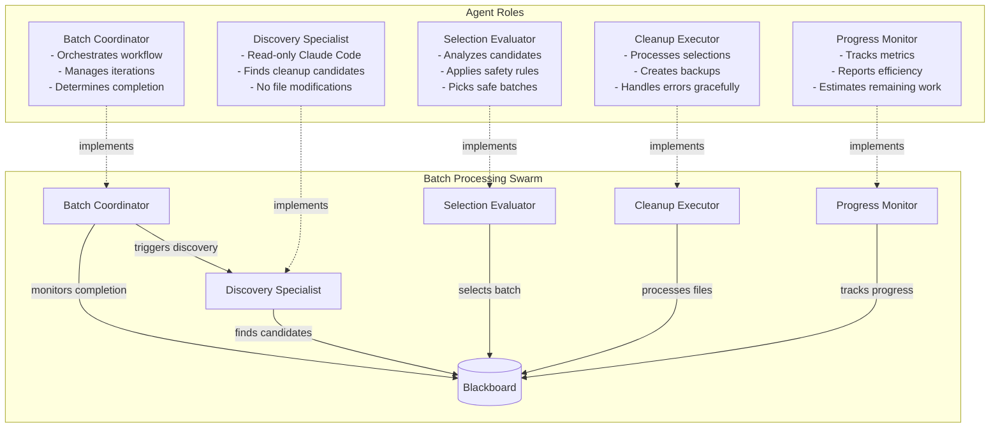
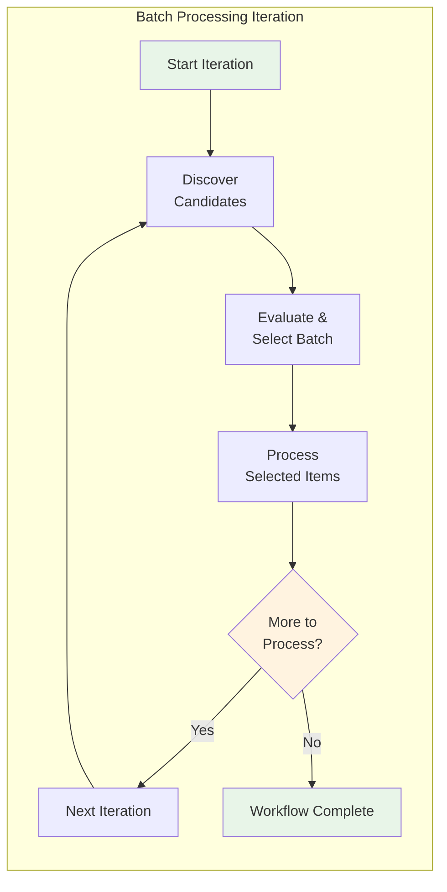
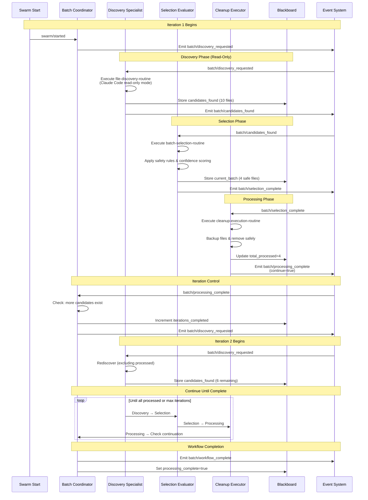
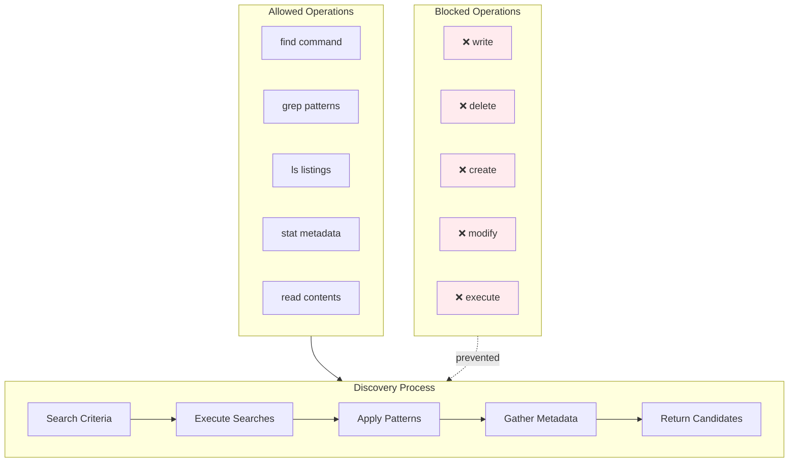
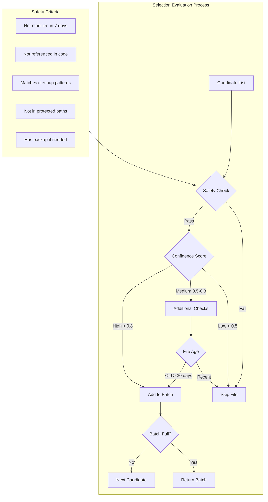
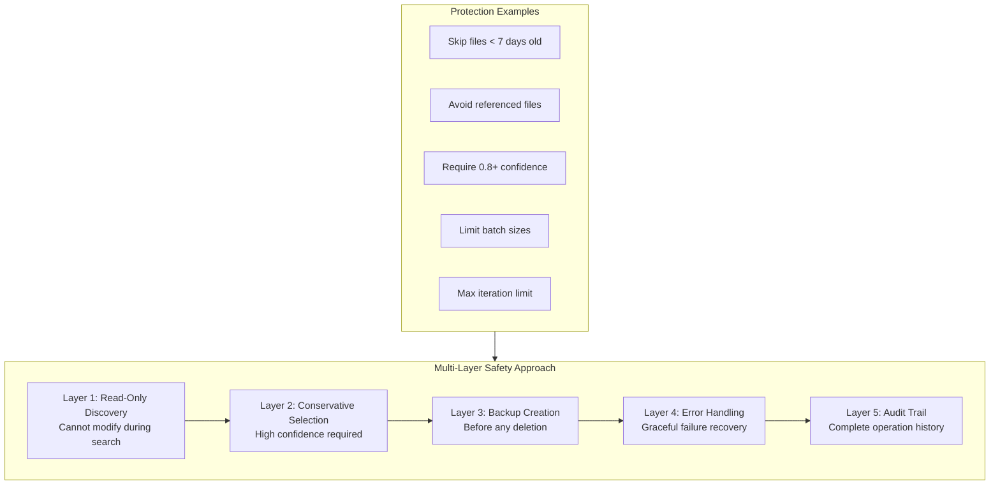

# Autonomous Batch Processing Scenario

## Overview

This scenario demonstrates an **autonomous batch processing workflow** that replicates the common human-in-the-loop pattern of discovering candidates, selecting appropriate items, and processing them iteratively. It showcases how AI agents can automate the typically manual process of reviewing lists and making intelligent selections for batch operations.

### Key Features

- **Read-Only Discovery**: Uses Claude Code with strict read-only restrictions for finding candidates
- **Intelligent Selection**: Agent evaluates and filters candidates using domain knowledge
- **Iterative Processing**: Continues processing batches until completion or limit reached
- **Safety-First Approach**: Conservative selection criteria to prevent accidental data loss
- **Comprehensive Tracking**: Full audit trail of discoveries, selections, and actions

## Agent Architecture



## Iterative Workflow Pattern



## Complete Event Flow



## Read-Only Discovery Pattern

The Discovery Specialist uses a special Claude Code integration with strict read-only restrictions:



## Selection Intelligence



## Blackboard State Evolution

```mermaid
graph LR
    subgraph StateProgression[Blackboard State Through Iterations]
        Init[Initial State<br/>- criteria defined<br/>- max_iterations=5<br/>- batch_size=10]
        
        Iter1[After Iteration 1<br/>+ candidates_found[10]<br/>+ current_batch[4]<br/>+ total_processed=4<br/>+ iterations=1]
        
        Iter2[After Iteration 2<br/>+ candidates_found[6]<br/>+ current_batch[3]<br/>+ total_processed=7<br/>+ iterations=2]
        
        IterN[After Iteration N<br/>+ candidates_found[2]<br/>+ current_batch[2]<br/>+ total_processed=9<br/>+ iterations=3]
        
        Final[Final State<br/>+ processing_complete=true<br/>+ total_processed=10<br/>+ cleanup_history[...]<br/>+ selection_history[...]]
    end
    
    Init --> Iter1
    Iter1 --> Iter2
    Iter2 --> IterN
    IterN --> Final
    
    style Init fill:#e1f5fe
    style Final fill:#e8f5e8
```

### Key Blackboard Fields

| Field | Type | Purpose | Updated By |
|-------|------|---------|------------|
| `discovery_criteria` | object | Search patterns and rules | Initial config |
| `candidates_found` | array | Current list of discovered files | Discovery Specialist |
| `current_batch` | array | Selected files for processing | Selection Evaluator |
| `total_processed` | number | Running count of processed files | Cleanup Executor |
| `iterations_completed` | number | Number of cycles completed | Batch Coordinator |
| `selection_history[]` | array | All selection decisions with rationale | Selection Evaluator |
| `cleanup_history[]` | array | Complete audit trail of operations | Cleanup Executor |
| `processing_complete` | boolean | Workflow completion flag | Batch Coordinator |

## Safety Mechanisms



## Example Execution Trace

### Iteration 1
1. **Discovery**: Finds 10 cleanup candidates (.tmp, .backup, .old files)
2. **Selection**: Evaluates all 10, selects 4 safest files (highest confidence, oldest)
3. **Processing**: Backs up and removes 4 files successfully
4. **Decision**: 6 files remain, continue to iteration 2

### Iteration 2
1. **Discovery**: Re-scans, finds 6 remaining candidates
2. **Selection**: Evaluates 6, selects 3 files (medium confidence, verified safe)
3. **Processing**: Backs up and removes 3 files
4. **Decision**: 3 files remain, continue to iteration 3

### Iteration 3
1. **Discovery**: Finds 3 remaining candidates
2. **Selection**: Only 2 meet safety criteria (1 too recent)
3. **Processing**: Processes final 2 files
4. **Decision**: 1 file remains but doesn't meet criteria, workflow complete

## Success Criteria

```json
{
  "requiredEvents": [
    "batch/discovery_requested",
    "batch/candidates_found",
    "batch/selection_complete",
    "batch/processing_complete",
    "batch/workflow_complete"
  ],
  "blackboardState": {
    "total_processed": ">0",
    "iterations_completed": ">=1",
    "processing_complete": "true"
  },
  "expectations": {
    "safetyMaintained": "No critical files deleted",
    "backupsCreated": "All deletions backed up",
    "intelligentSelection": "Risky files skipped"
  }
}
```

## Running the Scenario

### Prerequisites
- Execution test framework operational
- Claude Code integration with read-only mode support
- Mock file system with test cleanup candidates

### Execution Steps

1. **Initialize Scenario**
   ```typescript
   const scenario = new ScenarioFactory("batch-processing-scenario");
   await scenario.setupScenario();
   ```

2. **Configure Discovery Criteria**
   ```typescript
   blackboard.set("discovery_criteria", {
     patterns: [".tmp", ".backup", ".old", "~"],
     olderThan: "30 days",
     excludePaths: ["/node_modules", "/.git"]
   });
   ```

3. **Start Workflow**
   ```typescript
   await scenario.emitEvent("swarm/started", {
     taskId: "cleanup-legacy-files"
   });
   ```

4. **Monitor Progress**
   - Track `iterations_completed` for cycle count
   - Monitor `total_processed` for progress
   - Check `selection_history` for decision rationale
   - Review `cleanup_history` for audit trail

### Debug Information

Key blackboard fields to monitor:
- `candidates_found` - Current discovery results
- `current_batch` - Active selection for processing
- `last_selection_reasoning` - Why files were selected/skipped
- `processing_metrics` - Efficiency and progress data

## Technical Implementation Details

### Claude Code Read-Only Integration
```json
{
  "type": "tool",
  "name": "claude-code-readonly",
  "config": {
    "restrictions": "read-only",
    "allowedOperations": ["read", "grep", "find", "ls", "stat"],
    "blockedOperations": ["write", "delete", "create", "modify", "execute"]
  }
}
```

### Resource Configuration
- **Max Credits**: 1B micro-dollars (supports large discoveries)
- **Max Duration**: 10 minutes (allows multiple iterations)
- **CPU/Memory**: Minimal requirements (read-heavy operations)

### Iteration Control
- **Max Iterations**: 5 (prevents infinite loops)
- **Batch Size**: 10 files (manageable chunks)
- **Safety Threshold**: 0.8 confidence (conservative approach)

This scenario demonstrates how the framework can automate complex human-in-the-loop workflows while maintaining safety, providing audit trails, and making intelligent decisions. It's a perfect example of augmenting human judgment with AI efficiency.